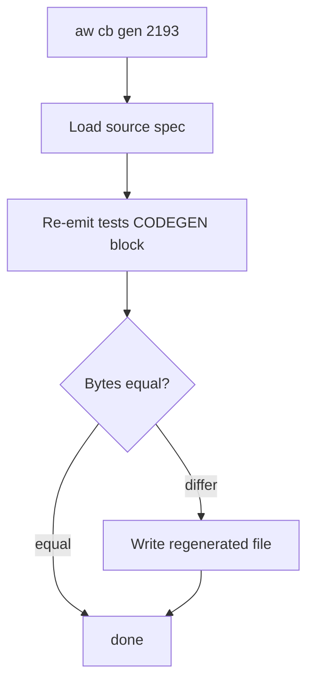
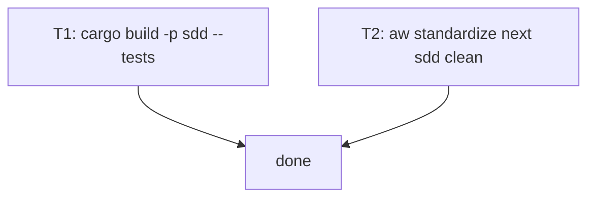

## Schema
<!-- type: schema lang: yaml -->

```yaml
section_type: schema
records: []
note: |
  No new IR. This TD reuses the existing `tests` section schema from
  `projects/agentic-workflow/tech-design/core/validate/issues_remote_round_trip.md`.
```

## Logic
<!-- type: logic lang: mermaid -->



## Test Plan
<!-- type: test-plan lang: mermaid -->



## Changes
<!-- type: changes lang: yaml -->

```yaml
changes:
  - path: projects/agentic-workflow/tests/issues_remote_round_trip.rs
    action: modify
    section: tests
    impl_mode: codegen
    source_spec: projects/agentic-workflow/tech-design/core/validate/issues_remote_round_trip.md
    source_section: tests
    description: |
      Regenerate the CODEGEN block (lines 2–186) from the source spec's
      `## Tests` section. The current on-disk content drifted (visual
      inspection suggests an extra blank line between the `fixture_issue`
      helper and the first `#[tokio::test]`). The regenerator's output —
      whatever it is — replaces the block byte-for-byte.
  - action: annotate
    section: logic
    impl_mode: hand-written
    description: "Traceability metadata edge for the logic section."

  - action: annotate
    section: schema
    impl_mode: hand-written
    description: "Traceability metadata edge for the schema section."

```


---

# Reviews

- **2026-05-16 · score-td-reviewer** — approved

**Verdict:** approved

This is a deliberately minimal regen-only TD. Schema declares no new IR (records: []) because the fix reuses the existing `tests` schema from `validate/issues_remote_round_trip.md`. Logic diagram captures the four-step regen pipeline (load → emit → byte-compare → write). Test Plan covers the only two acceptance signals: the regenerated file compiles (T1) and `aw standardize next` no longer flags this drift (T2). Changes section's single entry routes `aw cb gen` to the source spec via `source_spec` + `source_section` keys, which is exactly the contract needed for the codegen pipeline to re-emit the CODEGEN block. No risk surface beyond the targeted file. Ready to merge and proceed to `aw cb gen`.

- **2026-05-16 · score-td-reviewer (review #2 after Mermaid Plus fix)** — approved

**Verdict:** approved

Revision added flowchart bodies to the Logic and Test Plan mermaid blocks so they satisfy the Mermaid Plus codegen-readiness check. No semantic change to the schema, logic flow, test acceptance criteria, or Changes mapping. Still ready to merge and proceed to `aw cb gen`.
