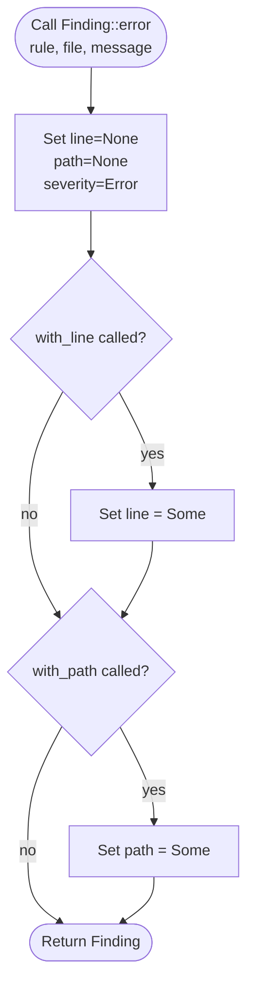

# Validate Rule

## Overview
<!-- type: overview lang: markdown -->

Core validation primitives for the `sdd` crate's rule-engine:

- `RuleId` — 16-variant unit enum identifying each validation rule (R3a-R3h, R6a-R6b, R7a-R7f); each variant maps to a short human-readable code used in CLI output and JSON.
- `Severity` — 2-variant enum (`Error` / `Warning`); an `Error` finding blocks `aw td validate`.
- `Finding` — single rule-violation record (6 fields: rule, file, line, path, message, severity) with a builder-chain constructor (`::error` + `with_line` + `with_path`). `Finding::format` produces a single-line human string — marked hand-written because the exact string layout is not derivable from the schema.
- `RuleReport` — aggregate collector (`Vec<Finding>`) with `new`, `push`, `extend`, `has_errors`, `is_empty` accessors.
- `Rule` — pure-function trait: each implementation receives `(spec_path, content, &mut RuleReport)` and appends findings; no I/O, no mutable state outside the report.

This spec is the reference dogfood example for a mixed-mode file: `schema` + `logic` sections cover the codegen units; `Finding::format` and the `Rule` trait body remain hand-written.

## Schema
<!-- type: schema lang: yaml -->

```yaml
definitions:
  RuleId:
    type: string
    enum:
      - DoubleOption
      - NullableRequired
      - OrphanBinding
      - LowercaseEnum
      - ImplModeMisuse
      - CodegenReady
      - RustTypeConsistency
      - SectionFormat
      - LooseRootFile
      - UnexpectedSubdir
      - MissingSectionAnnotation
      - FormatPriorityViolation
      - DuplicateSection
      - OrphanRequirement
      - SchemaConflict
      - FieldNearMatch
    description: |
      Rule identifier. Mirrors the R-ids used in issue Requirements tables
      so a failing rule points authors at the exact requirement it enforces.
    x-rust-enum:
      derive: [Debug, Clone, Copy, PartialEq, Eq, Hash, Serialize, Deserialize]
      variants:
        - name: DoubleOption
          doc: "R3a — reject Option<Option<T>> in any rust_type."
        - name: NullableRequired
          doc: "R3b — reject required: true with nullable rust_type, or vice versa."
        - name: OrphanBinding
          doc: "R3c — reject x-mamba-binding pointing at an absent schema/section."
        - name: LowercaseEnum
          doc: "R3d — reject lowercase enum rust_type (must be PascalCase)."
        - name: ImplModeMisuse
          doc: "R3e — reject impl_mode on sections where it has no meaning, or values outside {codegen, hand-written}."
        - name: CodegenReady
          doc: "R3f — codegen-ready gate. Mermaid Plus frontmatter required on codegen sections."
        - name: RustTypeConsistency
          doc: "R3g — cross-section consistency. rust_type in changes must match rust_type in schemas."
        - name: SectionFormat
          doc: "R3h — enforce section annotation/fence format and Mermaid Plus frontmatter."
        - name: LooseRootFile
          doc: "R6a — reject loose .md files at crate spec roots and directly under interfaces/."
        - name: UnexpectedSubdir
          doc: "R6b — reject spec files inside unexpected top-level subdirectories."
        - name: MissingSectionAnnotation
          doc: "R7a — reject H2 sections missing a type/lang annotation."
        - name: FormatPriorityViolation
          doc: "R7b — reject sections whose annotated type lacks the required fenced format."
        - name: DuplicateSection
          doc: "R7c — reject duplicate section headings within the same spec file."
        - name: OrphanRequirement
          doc: "R7d — reject requirements not referenced by scenarios or test-plan coverage."
        - name: SchemaConflict
          doc: "R7e — reject conflicting schema definitions for the same named entity."
        - name: FieldNearMatch
          doc: "R7f — reject near-match field names that likely indicate schema typos."
    x-methods:
      - name: short
        returns: "&'static str"
        impl_mode: codegen
        doc: "Short human name used in CLI output and JSON."
        dispatch:
          - variant: DoubleOption
            value: "R3a:double-Option"
          - variant: NullableRequired
            value: "R3b:nullable-required"
          - variant: OrphanBinding
            value: "R3c:orphan-binding"
          - variant: LowercaseEnum
            value: "R3d:lowercase-enum"
          - variant: ImplModeMisuse
            value: "R3e:impl_mode-misuse"
          - variant: CodegenReady
            value: "R3f:codegen-ready"
          - variant: RustTypeConsistency
            value: "R3g:rust_type-consistency"
          - variant: SectionFormat
            value: "R3h:section-format"
          - variant: LooseRootFile
            value: "R6a:loose-root-file"
          - variant: UnexpectedSubdir
            value: "R6b:unexpected-subdir"
          - variant: MissingSectionAnnotation
            value: "R7a:missing-section-annotation"
          - variant: FormatPriorityViolation
            value: "R7b:format-priority-violation"
          - variant: DuplicateSection
            value: "R7c:duplicate-section"
          - variant: OrphanRequirement
            value: "R7d:orphan-requirement"
          - variant: SchemaConflict
            value: "R7e:schema-conflict"
          - variant: FieldNearMatch
            value: "R7f:field-near-match"

  Severity:
    type: string
    enum: [Error, Warning]
    description: |
      Severity level. Error blocks aw td validate; Warning is advisory.
    x-rust-enum:
      derive: [Debug, Clone, Copy, PartialEq, Eq, Serialize, Deserialize]

  Finding:
    type: object
    required: [rule, file, message, severity]
    description: Single rule-violation finding.
    properties:
      rule:
        $ref: "#/definitions/RuleId"
        description: "Which rule fired."
      file:
        type: string
        description: "Spec file where the violation lives (PathBuf in Rust)."
        x-rust-type: PathBuf
      line:
        type: [integer, "null"]
        minimum: 1
        description: "Optional 1-indexed line number if the rule can pinpoint it."
      path:
        type: [string, "null"]
        description: "Optional YAML path hint (e.g. schemas[0].properties.status_code)."
      message:
        type: string
        description: "Human-readable violation message."
      severity:
        $ref: "#/definitions/Severity"
        description: "Severity — blocks validate if Error."
    x-rust-struct:
      derive: [Debug, Clone, Serialize, Deserialize]
    x-constructor:
      name: error
      doc: "Construct an error-severity finding."
      impl_mode: codegen
      args:
        - { name: rule,    rust_type: RuleId }
        - { name: file,    rust_type: "impl Into<PathBuf>", into: PathBuf }
        - { name: message, rust_type: "impl Into<String>",  into: String }
      init:
        line: "None"
        path: "None"
        severity: "Severity::Error"
    x-builders:
      - name: with_line
        doc: "Attach a line number."
        impl_mode: codegen
        field: line
        arg: { name: line, rust_type: usize }
        wrap: Some
      - name: with_path
        doc: "Attach a YAML path hint."
        impl_mode: codegen
        field: path
        arg: { name: path, rust_type: "impl Into<String>", into: String }
        wrap: Some
    x-methods:
      - name: format
        returns: String
        impl_mode: hand-written
        doc: |
          Format for single-line human output. Layout:
          [<rule.short()>] <file>[:<line>][ (<path>)] — <message>
          All four combinations of (line present, path present) are handled.

  RuleReport:
    type: object
    required: [findings]
    description: Aggregate of findings across a single spec file or a path-prefix walk.
    properties:
      findings:
        type: array
        items:
          $ref: "#/definitions/Finding"
        description: "Accumulated rule-violation findings."
    x-rust-struct:
      derive: [Debug, Clone, Default, Serialize, Deserialize]
    x-methods:
      # All RuleReport methods are impl_mode: hand-written because their
      # bodies are one-liner delegations to `self.findings.<op>` that the
      # schema cannot capture (and `aw td gen-code` would stub with
      # `Default::default()`, which silently compiles but is incorrect).
      # Live implementation is in `projects/agentic-workflow/src/validate/rule.rs`
      # outside the CODEGEN-BEGIN/END block.
      - name: new
        returns: Self
        impl_mode: hand-written
        doc: "Create an empty report (delegates to Default)."
      - name: push
        impl_mode: hand-written
        doc: "Append one finding."
        args:
          - { name: f, rust_type: Finding }
      - name: extend
        impl_mode: hand-written
        doc: "Merge another report's findings into self."
        args:
          - { name: other, rust_type: RuleReport }
      - name: has_errors
        returns: bool
        impl_mode: hand-written
        doc: "True iff at least one finding has Severity::Error."
      - name: is_empty
        returns: bool
        impl_mode: hand-written
        doc: "True iff findings is empty."

  Rule:
    type: object
    description: |
      Pure-function rule trait. Each implementation receives (spec_path, raw content, &mut RuleReport)
      and appends findings. Rules must not mutate state outside the report; no I/O beyond reading the provided text.
    x-rust-trait:
      impl_mode: hand-written
      methods:
        - name: id
          returns: RuleId
          doc: "Return the identifier for this rule."
        - name: check
          args:
            - { name: spec_path, rust_type: "&std::path::Path" }
            - { name: content,   rust_type: "&str" }
            - { name: report,    rust_type: "&mut RuleReport" }
          doc: "Check the spec content and push any findings into report."
```

## Logic
<!-- type: logic lang: mermaid -->



## Changes
<!-- type: changes lang: yaml -->

```yaml
changes:
  - path: projects/agentic-workflow/src/validate/rule.rs
    action: modify
    section: schema
    impl_mode: codegen
    description: |
      Codegen replaces: RuleId enum declaration + short() match dispatch,
      Severity enum declaration, Finding struct declaration + ::error constructor
      + with_line builder + with_path builder, RuleReport struct declaration
      + new/push/extend/has_errors/is_empty methods.
      All generated items are wrapped in CODEGEN-BEGIN/CODEGEN-END blocks and
      carry @spec markers referencing this file's #schema anchor.
      Impl-block topology: Finding's codegen methods (error, with_line, with_path)
      are emitted as a standalone `impl Finding { ... }` block INSIDE
      CODEGEN-BEGIN/END; the hand-written `format` method lives in a SEPARATE
      `impl Finding { ... }` block outside any CODEGEN delimiters.
  - path: projects/agentic-workflow/src/validate/rule.rs
    action: modify
    section: schema
    impl_mode: hand-written
    description: |
      Hand-written items outside CODEGEN blocks: Finding::format (complex
      multi-branch string layout not derivable from schema), and the Rule
      trait declaration (pure-function interface — body is implementation
      concern of each concrete rule, not specifiable in schema).
      These items live outside any CODEGEN-BEGIN/CODEGEN-END block and
      carry no @spec marker (healthy hand-written region per audit policy).
      The `#[cfg(test)] mod tests { ... }` block (3 tests required by R5) is
      also preserved outside CODEGEN-BEGIN/END delimiters; `aw td gen-code`
      must not touch it on an action: modify file.
  - action: annotate
    section: logic
    impl_mode: hand-written
    description: "Traceability metadata edge for the logic section."

```

# Reviews

## Review 3
<!-- type: review lang: markdown -->
**Verdict:** approved

- [overview] All five types (RuleId, Severity, Finding, RuleReport, Rule) are described correctly and match the source file.
- [schema] RuleId 16-variant enum, short() dispatch table, Finding constructor/builders, RuleReport methods, and Rule trait signature are all accurate and complete.
- [logic] Mermaid builder-chain diagram correctly models the optional with_line/with_path steps.
- [changes] Impl-block topology (codegen inside CODEGEN-BEGIN/END, hand-written format outside) and test module preservation are explicitly stated. Both prior findings from Review 1 are resolved.

## Review 2
<!-- type: review lang: markdown -->
**Verdict:** approved

- [changes] Mixed impl-block split is now explicitly stated in the codegen entry (standalone `impl Finding` block INSIDE CODEGEN-BEGIN/END, separate block outside). Finding 1 resolved.
- [changes] Test module preservation is now explicitly stated in the hand-written entry (`#[cfg(test)] mod tests` preserved outside CODEGEN delimiters; gen-code must not touch it). Finding 2 resolved.

## Review 1
<!-- type: review lang: markdown -->
**Verdict:** needs-revision

- [changes] **Mixed impl block split is underspecified — blocking.** `rule.rs` has a single `impl Finding { error, with_line, with_path, format }` block. After gen-code, the three codegen methods must land inside a CODEGEN-BEGIN/END block (as a separate `impl Finding { ... }`) and `format` must remain in its own `impl Finding { ... }` block outside. The current `changes` description says hand-written items "live outside any CODEGEN-BEGIN/CODEGEN-END block" but never states that two separate `impl Finding` blocks result. A generator reading this spec must guess the impl-block topology. Add an explicit sentence to the codegen entry: "Finding's codegen methods (`error`, `with_line`, `with_path`) are emitted as a standalone `impl Finding` block inside CODEGEN-BEGIN/END; the hand-written `format` method lives in a separate `impl Finding` block outside any CODEGEN delimiters."

- [changes] **Test module preservation is unaddressed — blocking.** `projects/agentic-workflow/src/validate/rule.rs` contains a `#[cfg(test)] mod tests { ... }` block (3 tests). Issue requirement R5 mandates these tests pass after codegen replacement. The changes section has no entry for the test module — neither as a hand-written entry nor as a note that it is preserved. AUTHORING.md's "healthy hand-written region" rule is implicit (items outside CODEGEN blocks in a claimed file are not flagged), but for a DOGFOOD reference spec this is insufficient: the implementor has no clear signal whether `aw td gen-code` on an `action: modify` file will leave the test block untouched. Add an explicit `impl_mode: hand-written` changes entry (or a note in the existing hand-written entry) declaring that the `#[cfg(test)] mod tests` block is preserved outside CODEGEN delimiters and gen-code must not touch it.
