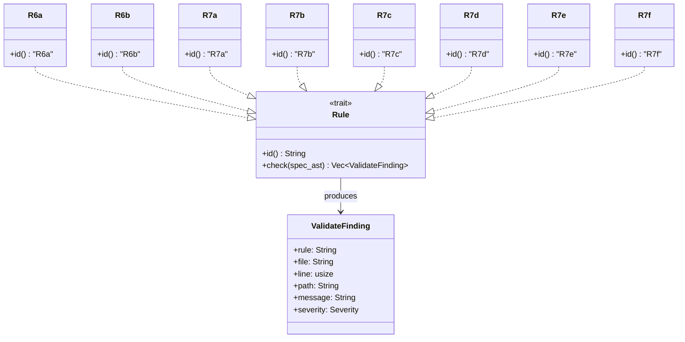
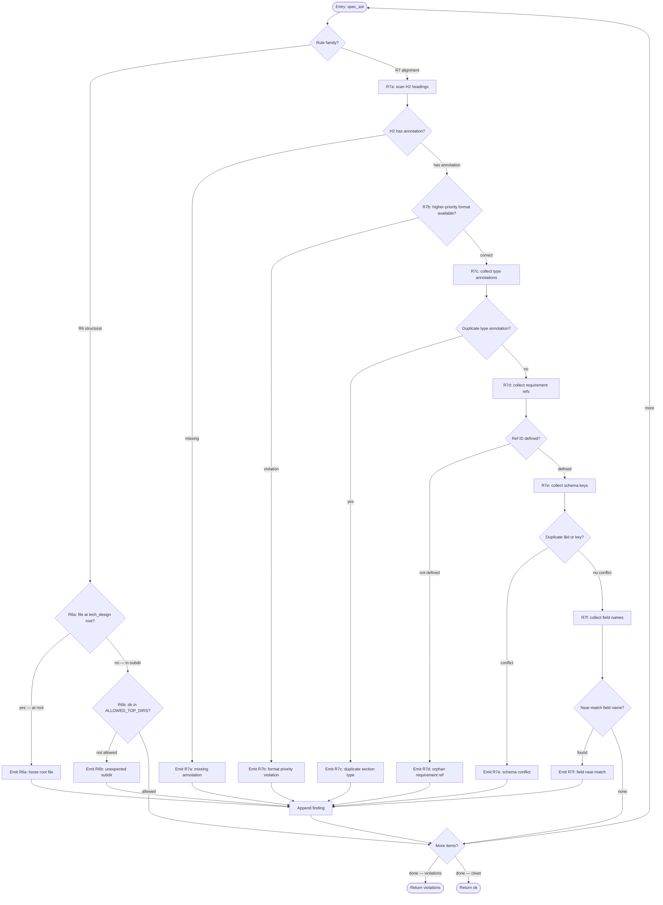

## Rule Family Dependency
<!-- type: dependency lang: mermaid -->


## Rule Check Logic
<!-- type: logic lang: mermaid -->


## Schema
<!-- type: schema lang: yaml -->

```yaml
"$schema": "https://json-schema.org/draft/2020-12/schema"
$id: r6-r7-validate-rules-schema
title: R6/R7 validate rule schemas

definitions:
  Severity:
    type: string
    enum: [error, warning, info]
    description: Severity level for a ValidateFinding

  ValidateFinding:
    type: object
    description: |
      One finding emitted by any Rule implementation in the R6a–R7f families.
      This type reuses the stable schema defined in validate-audit-split.md.
      No rule-specific output shapes are permitted — all 8 rules emit this type.
    properties:
      rule:
        type: string
        enum: [R6a, R6b, R7a, R7b, R7c, R7d, R7e, R7f]
        description: Rule identifier — one of the 8 absorbed rules
      file:
        type: string
        description: Spec file path relative to worktree root
      line:
        type: integer
        minimum: 1
        description: 1-based line number where the violation was detected
      path:
        type: string
        description: |
          Human-readable location path within the spec, e.g. the section heading
          or definition key where the violation was found
      message:
        type: string
        description: Human-readable description of the violation
      severity:
        $ref: "#/definitions/Severity"
        description: Severity level; all R6/R7 rules default to error
    required: [rule, file, line, path, message, severity]

  LintRuleEntry:
    type: object
    description: Registry entry for one R6/R7 rule in all_rules()
    properties:
      id:
        type: string
        enum: [R6a, R6b, R7a, R7b, R7c, R7d, R7e, R7f]
      name:
        type: string
        enum:
          - loose_root_file
          - unexpected_subdir
          - missing_section_annotation
          - format_priority_violation
          - duplicate_section
          - orphan_requirement
          - schema_conflict
          - field_near_match
      impl_module:
        type: string
        description: Rust file path under projects/agentic-workflow/src/validate/rules/
        examples:
          - r6a_loose_root_file.rs
          - r6b_unexpected_subdir.rs
          - r7a_missing_section_annotation.rs
          - r7b_format_priority_violation.rs
          - r7c_duplicate_section.rs
          - r7d_orphan_requirement.rs
          - r7e_schema_conflict.rs
          - r7f_field_near_match.rs
      impl_mode:
        type: string
        enum: [hand-written]
        description: |
          All R6/R7 rule implementations are hand-written. Rule registry impls
          require AST-pattern matching against spec content that cannot be
          expressed in a code-generator template — the same constraint that
          applies to R3a–R3h.
      trigger:
        type: string
        description: One-line description of when the rule fires
      fix_guidance:
        type: string
        description: One-line guidance for how to resolve the violation
    required: [id, name, impl_module, impl_mode, trigger, fix_guidance]

  AllowedTopDirs:
    type: array
    description: |
      Allowlist for top-level directories under .aw/tech-design/ checked by R6b.
      Directories not in this list trigger an R6b finding.
    items:
      type: string
    default:
      - crates
      - projects
      - tools
      - packages
    examples:
      - [crates, projects, tools, packages]
```
## Test Plan

```mermaid
---
id: r6-r7-rule-test-plan
requirements:
  req_R6a:
    id: R6a
    text: "R6a loose_root_file — spec file at tech_design root triggers R6a finding; spec in crate subdir does not"
    kind: functional
    risk: high
    verify: test
  req_R6b:
    id: R6b
    text: "R6b unexpected_subdir — directory not in ALLOWED_TOP_DIRS triggers R6b finding; allowed dir does not"
    kind: functional
    risk: high
    verify: test
  req_R7a:
    id: R7a
    text: "R7a missing_section_annotation — H2 heading without type annotation triggers R7a; annotated heading does not"
    kind: functional
    risk: high
    verify: test
  req_R7b:
    id: R7b
    text: "R7b format_priority_violation — prose used where JSON Schema is available triggers R7b; correct format does not"
    kind: functional
    risk: high
    verify: test
  req_R7c:
    id: R7c
    text: "R7c duplicate_section — two sections with the same type annotation in one file triggers R7c; unique types do not"
    kind: functional
    risk: high
    verify: test
  req_R7d:
    id: R7d
    text: "R7d orphan_requirement — requirement ID referenced in body but not defined in requirements section triggers R7d; defined ID does not"
    kind: functional
    risk: high
    verify: test
  req_R7e:
    id: R7e
    text: "R7e schema_conflict — two definitions with same $id or key in one spec triggers R7e; unique keys do not"
    kind: functional
    risk: high
    verify: test
  req_R7f:
    id: R7f
    text: "R7f field_near_match — field name within edit-distance 1 of a canonical name triggers R7f; exact match does not"
    kind: functional
    risk: high
    verify: test
  req_parity:
    id: RP1
    text: "round-trip parity — aw td validate + aw td audit on projects/agentic-workflow/ produces finding set that is superset of all 5 old verbs combined"
    kind: functional
    risk: high
    verify: test
  req_stable_finding:
    id: RS1
    text: "stable finding schema — every R6/R7 rule emits ValidateFinding with all required fields; no rule-specific output shapes"
    kind: interface
    risk: high
    verify: test
elements:
  fixture_r6a_loose_root:
    kind: test
    type: "rs/#[test]"
  fixture_r6b_unexpected_subdir:
    kind: test
    type: "rs/#[test]"
  fixture_r7a_missing_annotation:
    kind: test
    type: "rs/#[test]"
  fixture_r7b_format_priority:
    kind: test
    type: "rs/#[test]"
  fixture_r7c_duplicate_section:
    kind: test
    type: "rs/#[test]"
  fixture_r7d_orphan_requirement:
    kind: test
    type: "rs/#[test]"
  fixture_r7e_schema_conflict:
    kind: test
    type: "rs/#[test]"
  fixture_r7f_field_near_match:
    kind: test
    type: "rs/#[test]"
  parity_integration_test:
    kind: test
    type: "rs/integration"
  finding_schema_contract_test:
    kind: test
    type: "rs/integration"
relations:
  - from: fixture_r6a_loose_root
    verifies: req_R6a
  - from: fixture_r6b_unexpected_subdir
    verifies: req_R6b
  - from: fixture_r7a_missing_annotation
    verifies: req_R7a
  - from: fixture_r7b_format_priority
    verifies: req_R7b
  - from: fixture_r7c_duplicate_section
    verifies: req_R7c
  - from: fixture_r7d_orphan_requirement
    verifies: req_R7d
  - from: fixture_r7e_schema_conflict
    verifies: req_R7e
  - from: fixture_r7f_field_near_match
    verifies: req_R7f
  - from: parity_integration_test
    verifies: req_parity
  - from: finding_schema_contract_test
    verifies: req_stable_finding
---
requirementDiagram
    requirement R6a {
      id: R6a
      text: "R6a loose_root_file"
      risk: high
      verifymethod: test
    }
    requirement R6b {
      id: R6b
      text: "R6b unexpected_subdir"
      risk: high
      verifymethod: test
    }
    requirement R7a {
      id: R7a
      text: "R7a missing_section_annotation"
      risk: high
      verifymethod: test
    }
    requirement R7b {
      id: R7b
      text: "R7b format_priority_violation"
      risk: high
      verifymethod: test
    }
    requirement R7c {
      id: R7c
      text: "R7c duplicate_section"
      risk: high
      verifymethod: test
    }
    requirement R7d {
      id: R7d
      text: "R7d orphan_requirement"
      risk: high
      verifymethod: test
    }
    requirement R7e {
      id: R7e
      text: "R7e schema_conflict"
      risk: high
      verifymethod: test
    }
    requirement R7f {
      id: R7f
      text: "R7f field_near_match"
      risk: high
      verifymethod: test
    }
    requirement RP1 {
      id: RP1
      text: "round-trip parity test"
      risk: high
      verifymethod: test
    }
    requirement RS1 {
      id: RS1
      text: "stable ValidateFinding schema"
      risk: high
      verifymethod: test
    }
    element fixture_r6a_loose_root {
      type: "rs/#[test]"
    }
    element fixture_r6b_unexpected_subdir {
      type: "rs/#[test]"
    }
    element fixture_r7a_missing_annotation {
      type: "rs/#[test]"
    }
    element fixture_r7b_format_priority {
      type: "rs/#[test]"
    }
    element fixture_r7c_duplicate_section {
      type: "rs/#[test]"
    }
    element fixture_r7d_orphan_requirement {
      type: "rs/#[test]"
    }
    element fixture_r7e_schema_conflict {
      type: "rs/#[test]"
    }
    element fixture_r7f_field_near_match {
      type: "rs/#[test]"
    }
    element parity_integration_test {
      type: "rs/integration"
    }
    element finding_schema_contract_test {
      type: "rs/integration"
    }
    fixture_r6a_loose_root - verifies -> R6a
    fixture_r6b_unexpected_subdir - verifies -> R6b
    fixture_r7a_missing_annotation - verifies -> R7a
    fixture_r7b_format_priority - verifies -> R7b
    fixture_r7c_duplicate_section - verifies -> R7c
    fixture_r7d_orphan_requirement - verifies -> R7d
    fixture_r7e_schema_conflict - verifies -> R7e
    fixture_r7f_field_near_match - verifies -> R7f
    parity_integration_test - verifies -> RP1
    finding_schema_contract_test - verifies -> RS1
```

<!-- type: test-plan lang: mermaid -->


## Changes
<!-- type: changes lang: yaml -->

```yaml
changes:
  - path: projects/agentic-workflow/src/validate/rules/r6a_loose_root_file.rs
    action: create
    section: logic
    impl_mode: hand-written
    description: |
      R6a: detect spec files placed directly at the .aw/tech-design/ root
      level rather than under a crate or project subdirectory. Implements
      the Rule trait: id() returns "R6a"; check(spec_ast) inspects the file
      path from spec_ast metadata and emits a ValidateFinding with
      severity: error when the parent directory of the spec file is
      tech_design itself (no crate-level subdirectory). Skips files at
      exactly one path component deep (e.g. tech_design/AUTHORING.md) since
      those are not spec files.

  - path: projects/agentic-workflow/src/validate/rules/r6b_unexpected_subdir.rs
    action: create
    section: schema
    impl_mode: hand-written
    description: |
      R6b: detect spec files under a top-level directory beneath
      .aw/tech-design/ that is not in the ALLOWED_TOP_DIRS list
      (crates, projects, tools, packages). Implements the Rule trait:
      id() returns "R6b"; check(spec_ast) extracts the first path component
      below tech_design/, compares against the allowlist, and emits a
      ValidateFinding with severity: error when the directory is unexpected.
      The allowlist is a const slice in this module; adding a new allowed
      top-level dir requires updating this file.

  - path: projects/agentic-workflow/src/validate/rules/r7a_missing_section_annotation.rs
    action: create
    section: logic
    impl_mode: hand-written
    description: |
      R7a: detect H2 headings in a spec that lack the required
      <!-- type: X lang: Y --> annotation comment. Implements the Rule trait:
      id() returns "R7a"; check(spec_ast) walks the parsed AST for all H2
      nodes, checks whether the immediately-following node is the annotation
      comment, and emits a ValidateFinding with severity: error for each H2
      that is missing the annotation. Skips the frontmatter heading and
      the implicit Changes heading.

  - path: projects/agentic-workflow/src/validate/rules/r7b_format_priority_violation.rs
    action: create
    section: logic
    impl_mode: hand-written
    description: |
      R7b: enforce the format-priority hierarchy (OpenRPC > JSON Schema >
      Mermaid > YAML > Markdown table > Prose). For each section, determines
      the declared format from the annotation's lang field and checks whether
      a higher-priority format could express the same content type. Implements
      the Rule trait: id() returns "R7b"; check(spec_ast) consults the
      section_type → eligible_formats mapping and emits a ValidateFinding with
      severity: warning when a lower-priority format is used where a higher one
      is available. Each format tier is ranked: openrpc=5, json-schema=4,
      mermaid-plus=3, yaml=2, markdown=1.

  - path: projects/agentic-workflow/src/validate/rules/r7c_duplicate_section.rs
    action: create
    section: logic
    impl_mode: hand-written
    description: |
      R7c: detect two or more sections in the same spec file that share the
      same type: annotation value. Implements the Rule trait: id() returns
      "R7c"; check(spec_ast) collects all annotation type values into a
      multimap, identifies keys with count > 1 (excluding the changes section
      which may appear once as the final section), and emits a ValidateFinding
      with severity: error for each duplicate pair, citing the line numbers of
      both occurrences in the message.

  - path: projects/agentic-workflow/src/validate/rules/r7d_orphan_requirement.rs
    action: create
    section: schema
    impl_mode: hand-written
    description: |
      R7d: detect requirement ID references in the spec body that are not
      defined in any requirements section frontmatter. Implements the Rule
      trait: id() returns "R7d"; check(spec_ast) first builds the set of
      defined requirement IDs from all requirements section YAML frontmatter
      blocks, then scans all body text for patterns matching the requirement
      reference syntax (R\d+[a-z]? or Req-\w+), and emits a ValidateFinding
      with severity: error for each reference ID that is not in the defined
      set. Case-sensitive match.

  - path: projects/agentic-workflow/src/validate/rules/r7e_schema_conflict.rs
    action: create
    section: schema
    impl_mode: hand-written
    description: |
      R7e: detect two or more definitions within the same spec that share
      the same $id value or definitions map key. Implements the Rule trait:
      id() returns "R7e"; check(spec_ast) collects $id values and definitions
      key names across all schema, rest-api, rpc-api, async-api, and cli
      sections, identifies duplicates, and emits a ValidateFinding with
      severity: error for each duplicate key pair. Also checks for conflicting
      $ref targets that resolve to different schemas in different sections.

  - path: projects/agentic-workflow/src/validate/rules/r7f_field_near_match.rs
    action: create
    section: logic
    impl_mode: hand-written
    description: |
      R7f: detect field names in schema definitions that are within edit
      distance 1 (single insertion, deletion, or substitution) of a canonical
      field name. Implements the Rule trait: id() returns "R7f"; check(spec_ast)
      collects all property key names across schema sections, computes the
      Levenshtein distance between each field name and each canonical name in
      the built-in canonical field registry (message, severity, rule, path,
      file, line, status, item, id, name, type, kind), and emits a
      ValidateFinding with severity: warning for each field name that matches
      within distance 1 but is not an exact match. Distance 0 (exact match)
      is not flagged.

  - path: projects/agentic-workflow/src/validate/rules/mod.rs
    action: modify
    section: logic
    impl_mode: hand-written
    description: |
      Extend all_rules() to append the 8 new rule constructors after the
      existing SectionFormatRule::default() entry (R3h):
        R6aLooseRootFile::default(),
        R6bUnexpectedSubdir::default(),
        R7aMissingSectionAnnotation::default(),
        R7bFormatPriorityViolation::default(),
        R7cDuplicateSection::default(),
        R7dOrphanRequirement::default(),
        R7eSchemaConflict::default(),
        R7fFieldNearMatch::default(),
      Add mod declarations for all 8 new rule modules. The registration
      order preserves the existing R3a–R3h sequence; R6a/R6b and R7a–R7f
      are appended after R3h.

      R3h reconciliation (issue R10 — Option (a) chosen): R3h is preserved
      as a distinct rule. R3h fires when a fenced code block is absent within
      5 lines of a valid <!-- type: X lang: Y --> annotation (annotation
      present, block missing). R7a fires when the annotation comment itself
      is absent from an H2 heading. The two rules are complementary, not
      overlapping: R3h catches incomplete spec sections; R7a catches unannotated
      sections. Option (b) — retiring R3h by merging it into R7a — was rejected
      because collapsing them would lose the distinction between "no annotation"
      (authoring oversight caught by R7a) and "annotation present but no matching
      fenced block" (incomplete spec body caught by R3h). The companion spec
      validate-audit-split.md enumerates R3h alongside R3a–R3g in the rule
      registry (see entry below).

  - path: projects/agentic-workflow/tests/validate_rules/r6_r7_fixtures/mod.rs
    action: create
    section: test-plan
    impl_mode: hand-written
    description: |
      Integration test module for R6a–R7f rules. One test per rule, each
      loading a fixture spec file from the fixtures/ subdirectory. Each test
      asserts: (a) the target rule fires exactly once on the fixture, and
      (b) no other R6/R7 rules fire on the same fixture. Fixture files are
      minimal .md specs containing exactly one violation of the target rule.

  - path: projects/agentic-workflow/tests/validate_rules/r6_r7_fixtures/r6a_fixture.md
    action: create
    section: test-plan
    impl_mode: hand-written
    description: |
      Fixture spec placed at the root of a mock tech_design/ directory
      (not under any crate subdir) to trigger exactly one R6a finding.

  - path: projects/agentic-workflow/tests/validate_rules/r6_r7_fixtures/r6b_fixture.md
    action: create
    section: test-plan
    impl_mode: hand-written
    description: |
      Fixture spec under a mock tech_design/widgets/ directory where
      "widgets" is not in ALLOWED_TOP_DIRS, to trigger exactly one R6b finding.

  - path: projects/agentic-workflow/tests/validate_rules/r6_r7_fixtures/r7a_fixture.md
    action: create
    section: test-plan
    impl_mode: hand-written
    description: |
      Fixture spec with one H2 heading that has no type annotation comment,
      to trigger exactly one R7a finding.

  - path: projects/agentic-workflow/tests/validate_rules/r6_r7_fixtures/r7b_fixture.md
    action: create
    section: test-plan
    impl_mode: hand-written
    description: |
      Fixture spec with a section that uses Markdown prose where JSON Schema
      could express the same content, to trigger exactly one R7b finding.

  - path: projects/agentic-workflow/tests/validate_rules/r6_r7_fixtures/r7c_fixture.md
    action: create
    section: test-plan
    impl_mode: hand-written
    description: |
      Fixture spec with two sections sharing the same type: schema annotation,
      to trigger exactly one R7c finding.

  - path: projects/agentic-workflow/tests/validate_rules/r6_r7_fixtures/r7d_fixture.md
    action: create
    section: test-plan
    impl_mode: hand-written
    description: |
      Fixture spec with a body reference to requirement R99 that is not
      defined in any requirements section, to trigger exactly one R7d finding.

  - path: projects/agentic-workflow/tests/validate_rules/r6_r7_fixtures/r7e_fixture.md
    action: create
    section: test-plan
    impl_mode: hand-written
    description: |
      Fixture spec with two schema definitions sharing the same $id value,
      to trigger exactly one R7e finding.

  - path: projects/agentic-workflow/tests/validate_rules/r6_r7_fixtures/r7f_fixture.md
    action: create
    section: test-plan
    impl_mode: hand-written
    description: |
      Fixture spec with a schema definition containing a field named "mesage"
      (one character transposition from "message") to trigger exactly one
      R7f finding.

  - path: projects/agentic-workflow/tests/parity/verb_parity_test.rs
    action: create
    section: test-plan
    impl_mode: hand-written
    description: |
      Round-trip parity integration test. Runs aw td validate on
      projects/agentic-workflow/tech-design/core/ and aw td audit on projects/agentic-workflow/,
      collects the union of all findings, then runs each of the 5 old verbs
      (validate-spec-structure, check-alignment, sdd-coverage and their
      sub-modes) on the same paths. Asserts that every finding from the old
      verbs appears in the new verb union (superset check). Uses the --json
      flag on all commands and deserializes into a common finding struct for
      comparison.

  # Companion spec deliverables — see validate-audit-split.md for full context.
  # The entries below are scoped to the audit extension, deprecation wrappers,
  # help-text updates, and documentation changes mandated by issue R3/R4/R6/R7/R9.
  # They are listed here so an implementer reading this spec is not left with an
  # incomplete picture of the total changeset.

  - path: projects/agentic-workflow/src/generate/audit.rs
    action: modify
    section: logic
    impl_mode: hand-written
    description: |
      Extend audit_file_unified to call
      crate::generate::handwrite::parse_handwrite_markers on each
      MarkerGap/Uncovered region and surface optional gap and tracker fields
      in the JSON record. Add a --group-by gap|file|status post-processing
      pass on the result vector. Covers issue R3 (group-by mode) and R4
      (gap/tracker fields in audit output). Full rule registry for this
      function, including the R3h entry alongside R3a–R3g, is enumerated in
      the companion spec validate-audit-split.md.

  - path: projects/agentic-workflow/src/cli/td.rs
    action: modify
    section: logic
    impl_mode: hand-written
    description: |
      Add AuditArgs.group_by field of type Option<GroupBy> with variants
      gap | file | status, threading through to audit_file_unified. Also
      update --help strings for aw td validate and aw td audit to
      enumerate every active rule family and mode: R3a–R3h + R6a/R6b +
      R7a–R7f for validate; Clean/Drift/MarkerGap/Uncovered/Aggregate/
      Unresolvable + group-by modes for audit. Covers issue R3 (group-by
      arg) and R7 (help text completeness).

  - path: projects/agentic-workflow/src/cli/commands.rs
    action: modify
    section: logic
    impl_mode: hand-written
    description: |
      In the dispatcher branches at ValidateSpecStructure (~line 220-234,
      1061-1066), CheckAlignment (~line 237-243, 1068-1070), and
      Sdd::Coverage (~line 858-860): print one stderr line
      "deprecated: use 'aw td <new>' instead" and delegate transparently
      to the equivalent aw td validate <path> or
      aw td audit <path> --group-by gap invocation. Phase 1 only —
      phase 2 removal is a follow-up issue. Covers issue R6 (deprecation
      wrappers for the 3 absorbed verbs).

  - path: .aw/tech-design/AUTHORING.md
    action: modify
    section: changes
    impl_mode: hand-written
    description: |
      Add the 2-verb final contract section: validate (spec-side, 16 rules
      across R3/R6/R7 families, slug + path modes) and audit (code-side,
      6 statuses, --group-by). Mark the 3 absorbed verbs
      (validate-spec-structure, check-alignment, sdd coverage) deprecated
      with phase 1/2 timeline. Covers issue R9 (AUTHORING.md doc update).

  - path: CLAUDE.md
    action: modify
    section: logic
    impl_mode: hand-written
    description: |
      Update the spec-quality checking guidance to reflect the 2-verb final
      state: one line for aw td validate (spec-side rules) and one line
      for aw td audit (code-side audit). Remove or annotate references to
      the deprecated 5-verb surface. Covers issue R9 (CLAUDE.md doc update).

  - path: projects/agentic-workflow/tech-design/core/generate/validate/validate-audit-split.md
    action: modify
    section: logic
    impl_mode: hand-written
    description: |
      Extend the rule registry section to enumerate R3h:section-format with
      the same shape as R3a–R3g (rule id, name, impl module). Add an R6
      family (R6a loose_root_file, R6b unexpected_subdir) and R7 family
      (R7a missing_section_annotation, R7b format_priority_violation,
      R7c duplicate_section, R7d orphan_requirement, R7e schema_conflict,
      R7f field_near_match) to the LintRule enum. Document the R3h vs R7a
      distinction in prose: R3h fires when a fenced block is missing within
      5 lines of a valid annotation; R7a fires when the annotation itself is
      absent — they are complementary, not redundant. Issue R10 acceptance:
      TD explicitly chose Option (a), preserving R3h as a distinct rule.
      This is the companion spec referenced by the mod.rs entry above.
  - action: annotate
    section: dependency
    impl_mode: hand-written
    description: "Traceability metadata edge for the dependency section."

```

# Reviews

## Review 2
<!-- type: review lang: markdown -->
**Verdict:** approved

- [changes] (item 6) Both Round 1 findings are fully addressed. The mod.rs entry now carries an explicit R3h reconciliation paragraph naming Option (a), explaining the R3h-vs-R7a trigger distinction, and stating why Option (b) was rejected. The 7 new companion-spec entries (audit.rs, td.rs, commands.rs, AUTHORING.md, CLAUDE.md, validate-audit-split.md, plus a comment header naming the companion spec) give an implementer a complete picture of the total changeset. All 8 rule source files, mod.rs registration, fixture files, integration test module, and parity test are present. No implementation gap remains.

## Review 1
<!-- type: review lang: markdown -->
**Verdict:** needs-revision

- [changes] (item 6) The R3h reconciliation required by issue R10 is unresolved. R10 acceptance states "the tech design explicitly chooses one path and documents rationale; the unified validate rule list has no orphan ids." The mod.rs changes entry implies Option (a) — preserve R3h — by saying "appended after R3h", but no explicit rationale is provided and `validate-audit-split.md` is not updated in this spec's changes to enumerate R3h alongside R3a–R3g. Since the Spec Plan assigns `validate-audit-split` extension to a separate spec, the rationale documentation must appear here in the dependency section or as a note in the mod.rs changes entry. Add a prose note in the dependency section (or a dedicated changes entry for `validate-audit-split.md`) stating: "R3h is preserved as a distinct rule per Option (a); R3h fires when a fenced block is missing within 5 lines of an annotation, while R7a fires when the annotation itself is missing — they are complementary and do not overlap."

- [changes] (item 6) The `validate-audit-split.md` spec extension is not listed in this spec's changes, yet the Spec Plan assigns it to this spec family. If the `validate-audit-split` extension is deferred entirely to a companion spec (`validate-audit-split` extend), that companion spec must exist and be referenced. As written, the changes section covers only 19 entries (8 rule files, mod.rs, 9 test fixtures, 1 parity test) with no pointer to the audit extension, deprecation wrapper, or doc-update work called for by issue R3/R4/R6/R7/R9. An implementer reading only this spec has no indication that those deliverables exist elsewhere. Either (a) add a `see_also` note in changes naming the companion spec that covers audit/deprecation/docs, or (b) add stub changes entries referencing those files with `action: deferred` and a reason. Without this, an implementer could mark the issue done after these 19 files and miss the audit extension entirely.
