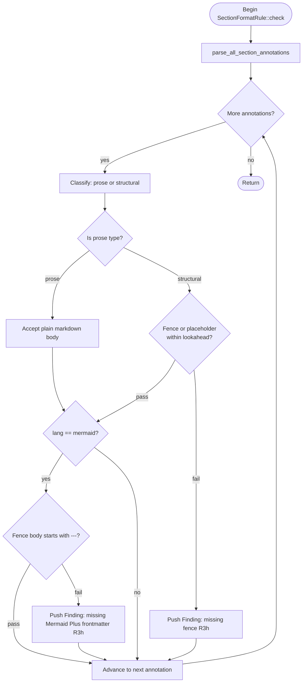

# Section Format Rule

## Overview
<!-- type: overview lang: markdown -->

Strict format-conformance rule for the `sdd` crate's validator engine.

This spec defines a new `SectionFormatRule` that enforces three invariants on every spec section in both `aw td validate` and `aw wi validate`:

1. **Annotation-to-body binding** — every `<!-- type: X lang: Y -->` annotation must be immediately followed (within a configurable lookahead window) by either a matching-lang fenced block or the canonical placeholder annotation marker. Sections lacking both are hard-rejected.

2. **Prose vs structural class** — prose section types (`overview`, `doc`, `requirements`, `test-plan`, `scenarios`) may have a plain markdown body extending to the next heading; structural section types (`schema`, `changes`, `logic`, `state-machine`, `interaction`, `dependency`, `db-model`, `rest-api`, `rpc-api`, `async-api`, `cli`, `config`, `wireframe`, `component`, `design-token`, `tests`, `manifest`, `mindmap`) must carry a fenced block or placeholder.

3. **Mermaid Plus frontmatter gate** — any section annotated `lang: mermaid` must have a fence body whose first non-blank line is `---` (the Mermaid Plus frontmatter delimiter). Legacy mermaid fences without frontmatter are hard-rejected.

The rule implements the existing `Rule` trait from `sdd-validate-rule` and registers a new `RuleId` variant `SectionFormat` (R3h). It is wired into:

- `aw td validate` via `projects/agentic-workflow/src/cli/validate_spec_structure.rs`.
- `aw wi validate` via `projects/agentic-workflow/src/services/issue_parser.rs` (fires at `--apply` time for `aw wi fill-section`).
- A new `--all` batch mode that scans every spec under `.aw/tech-design/` and prints violations to stdout in a machine-parseable `{file}:{line}: [{rule}] {message}` format.

This rule is a prerequisite for Issue B (TD AST typed bodies) and gates Issue C (retrofit of legacy mermaid blocks).
## Requirements

```mermaid
---
id: section-format-rule-requirements
title: Section Format Rule Requirements
---
requirementDiagram

requirement R1 {
  id: R1
  text: "aw td validate MUST reject any spec section whose annotation is followed by neither a matching-lang fenced block nor the canonical placeholder annotation marker within a configurable lookahead window (default 5 lines)."
  risk: High
  verifymethod: Test
}

requirement R2 {
  id: R2
  text: "aw wi validate MUST apply the same annotation-to-block rule as R1 to issue draft bodies."
  risk: High
  verifymethod: Test
}

requirement R3 {
  id: R3
  text: "For prose section types (overview, doc, requirements, test-plan, scenarios), the validator MUST accept a plain markdown body extending to the next heading; no fenced block is required."
  risk: High
  verifymethod: Test
}

requirement R4 {
  id: R4
  text: "For structural section types (schema, changes, logic, state-machine, interaction, dependency, db-model, rest-api, rpc-api, async-api, cli, config, wireframe, component, design-token, tests, manifest, mindmap), the validator MUST require either a matching-lang fenced block or the canonical placeholder annotation marker; a bare markdown body MUST be rejected."
  risk: High
  verifymethod: Test
}

requirement R5 {
  id: R5
  text: "For any section annotated with lang: mermaid, the validator MUST additionally require that the fence body begins with a --- line (Mermaid Plus frontmatter delimiter); a legacy mermaid fence without that frontmatter opener MUST be rejected."
  risk: High
  verifymethod: Test
}

requirement R6 {
  id: R6
  text: "The annotation-to-block rule MUST be enforced at --apply time for aw wi fill-section and aw td create --fill --section X, so authoring agents cannot write malformed payloads into the worktree."
  risk: Medium
  verifymethod: Test
}

requirement R7 {
  id: R7
  text: "A read-only batch mode aw td validate --all (and an equivalent for issues) MUST scan every spec under .aw/tech-design/ and print each violation to stdout in a machine-parseable format suitable for grep-driven backlog generation."
  risk: Medium
  verifymethod: Test
}

requirement R8 {
  id: R8
  text: "Validator failure MUST be a hard reject (non-zero exit code, no warning-only fallback); soft warnings are explicitly disallowed per SDD principle that warnings are ignored."
  risk: High
  verifymethod: Test
}
```

<!-- type: requirements lang: mermaid -->


## Logic
<!-- type: logic lang: mermaid -->


## Test Plan

```mermaid
---
id: section-format-rule-test-plan
title: Section Format Rule Test Plan
---
requirementDiagram

requirement T1 {
  id: T1
  text: "prose_pass: overview section with plain markdown body is accepted without a fenced block."
  risk: High
  verifymethod: Test
}

requirement T2 {
  id: T2
  text: "prose_no_fence_ok: overview section annotation followed immediately by another heading (empty body) is accepted; prose types require no fence."
  risk: High
  verifymethod: Test
}

requirement T3 {
  id: T3
  text: "structural_pass: schema section with matching yaml fenced block is accepted."
  risk: High
  verifymethod: Test
}

requirement T4 {
  id: T4
  text: "structural_fail: schema section with plain markdown body (no fence, no placeholder) is hard-rejected with Finding severity Error."
  risk: High
  verifymethod: Test
}

requirement T5 {
  id: T5
  text: "mermaid_plus_pass: logic section with mermaid fence whose body starts with --- is accepted."
  risk: High
  verifymethod: Test
}

requirement T6 {
  id: T6
  text: "mermaid_plus_fail: logic section with mermaid fence whose body does not start with --- is hard-rejected with Finding severity Error."
  risk: High
  verifymethod: Test
}

requirement T7 {
  id: T7
  text: "placeholder_accepted: any structural section whose annotation is followed by the canonical placeholder annotation marker is accepted regardless of type or lang."
  risk: High
  verifymethod: Test
}

requirement T8 {
  id: T8
  text: "all_mode_snapshot: aw td validate --all over a curated mini-fixture set produces machine-parseable output matching the expected violation list snapshot."
  risk: Medium
  verifymethod: Test
}

element SectionFormatRule {
  type: implementation
}

SectionFormatRule - verifies -> T1
SectionFormatRule - verifies -> T2
SectionFormatRule - verifies -> T3
SectionFormatRule - verifies -> T4
SectionFormatRule - verifies -> T5
SectionFormatRule - verifies -> T6
SectionFormatRule - verifies -> T7
SectionFormatRule - verifies -> T8
```

<!-- type: test-plan lang: mermaid -->


## Changes
<!-- type: changes lang: yaml -->

```yaml
changes:
  - path: projects/agentic-workflow/src/validate/rule.rs
    action: modify
    section: schema
    impl_mode: codegen
    description: |
      Add SectionFormat variant to RuleId enum (R3h) and extend the short()
      dispatch table with value "R3h:section-format". Emitted inside the
      existing CODEGEN-BEGIN/CODEGEN-END block that wraps RuleId.
  - path: projects/agentic-workflow/src/validate/rules/section_format.rs
    action: create
    section: logic
    impl_mode: hand-written
    description: |
      New file: SectionFormatRule struct implementing the Rule trait.
      Reads section annotations via parse_all_section_annotations from
      projects/agentic-workflow/src/models/section.rs, classifies each SectionType as
      prose or structural, checks for fenced block or placeholder marker
      within the lookahead window (default 5 lines), and for mermaid-lang
      sections additionally verifies that the fence body begins with ---.
      Prose types: Overview, Doc, Requirements, TestPlan, Scenarios.
      Structural types: all remaining SectionType variants.
      Placeholder marker: <!-- score-td-placeholder --> on any line within
      the lookahead window accepts the section.
      Violation format: Finding::error(RuleId::SectionFormat, file, message)
        .with_line(line) where line is the 1-indexed annotation line.
      HANDWRITE marker: gap="missing-generator:logic",
      tracker="epic-standardization-completeness-4-work-streams-to-100".
      The logic flowchart covers the rule, but no codegen generator for Rule
      trait implementations exists yet.
  - path: projects/agentic-workflow/src/validate/rules/section_format.rs
    action: modify
    section: requirements
    impl_mode: hand-written
    description: |
      Re-export `is_prose_section` from the canonical primitive registry so
      SectionFormatRule uses the shared prose/structural taxonomy. This stays
      under a HANDWRITE marker because requirements-section codegen cannot yet
      emit Rust classifier adapters from requirementDiagram taxonomy. Tracker:
      epic-standardization-completeness-4-work-streams-to-100.
  - path: projects/agentic-workflow/src/validate/rules/mod.rs
    action: modify
    section: logic
    impl_mode: hand-written
    description: |
      Add pub use section_format::SectionFormatRule; re-export in the rules
      sub-module so callers can import from projects/agentic-workflow/src/validate/rules.
  - path: projects/agentic-workflow/src/validate/runner.rs
    action: modify
    section: logic
    impl_mode: hand-written
    description: |
      Register SectionFormatRule in all_rules() in projects/agentic-workflow/src/validate/rules/mod.rs
      so it fires under both the issue and TD validate routers.
  - path: projects/agentic-workflow/src/cli/validate_spec_structure.rs
    action: modify
    section: logic
    impl_mode: hand-written
    description: |
      Add --all flag to aw td validate. When --all is set, walk every
      .md file under .aw/tech-design/ using resolve_spec_files with
      PathShape::Prefix, run each file through the rule runner including
      SectionFormatRule, and print findings to stdout in the format:
        {file}:{line}: [{rule_short}] {message}
      Exit code 0 when findings exist (read-only batch mode per R7);
      exit non-zero only on runner internal error (R8).
  - path: projects/agentic-workflow/src/services/issue_parser.rs
    action: modify
    section: logic
    impl_mode: hand-written
    description: |
      Fire SectionFormatRule from the issue parser --apply gate so that
      aw wi fill-section rejects malformed section bodies before
      writing them to the worktree. Hard-reject (non-zero exit) on any
      Error-severity finding (R6, R8).
  - path: projects/agentic-workflow/src/cli/td.rs
    action: modify
    section: logic
    impl_mode: hand-written
    description: |
      Wire SectionFormatRule into the TD --apply gate (run_create_apply) so
      that aw td create --fill --section X rejects malformed section
      payloads before merging them into the worktree spec. Run
      SectionFormatRule against the merged section content and hard-reject
      (non-zero exit) on any Error-severity finding (R6, R8).
  - path: projects/agentic-workflow/src/validate/rules/section_format.rs
    action: modify
    section: logic
    impl_mode: hand-written
    description: |
      Unit tests inside #[cfg(test)] mod tests block: T1 prose_pass,
      T2 prose_no_fence_ok, T3 structural_pass, T4 structural_fail,
      T5 mermaid_plus_pass, T6 mermaid_plus_fail, T7 placeholder_accepted.
      Each test constructs a minimal spec string and asserts RuleReport
      findings count and severity.
  - path: projects/agentic-workflow/tests/validate_all_snapshot.rs
    action: create
    section: logic
    impl_mode: hand-written
    description: |
      Integration snapshot test T8: invokes aw td validate --all against
      tests/fixtures/validate_all/ which contains a curated set of valid and
      invalid spec fragments, and asserts stdout matches the expected
      violation list snapshot stored in tests/fixtures/validate_all_expected.txt.
  - action: annotate
    section: unit-test
    impl_mode: hand-written
    description: "Traceability metadata edge for the unit-test section."

```

# Reviews

## Review 1
<!-- type: review lang: markdown -->
**Verdict:** needs-revision

- [changes] The `runner.rs` change entry says to register `SectionFormatRule` in `default_rules()`, but the actual file (`projects/agentic-workflow/src/validate/runner.rs`) defines and calls `all_rules()` — there is no `default_rules()` function. Update the description to reference `all_rules()` so the implementer modifies the correct function.
- [changes] R6 requires the annotation-to-block rule to fire at `--apply` time for both `aw wi fill-section` AND `aw td create --fill --section X`. The changes list wires only `projects/agentic-workflow/src/services/issue_parser.rs` (the issues path). There is no change entry covering the TD create `--fill` apply path. Add a change entry for the TD create apply gate so the R6 requirement is fully satisfied.

## Review 2
<!-- type: review lang: markdown -->
**Verdict:** approved

- [changes] Both prior findings are resolved: the `runner.rs` entry now correctly references `all_rules()` in `projects/agentic-workflow/src/validate/rules/mod.rs`, and the new `projects/agentic-workflow/src/cli/td.rs` entry explicitly wires `SectionFormatRule` into `run_create_apply` to satisfy the TD `--apply` gate for R6.
