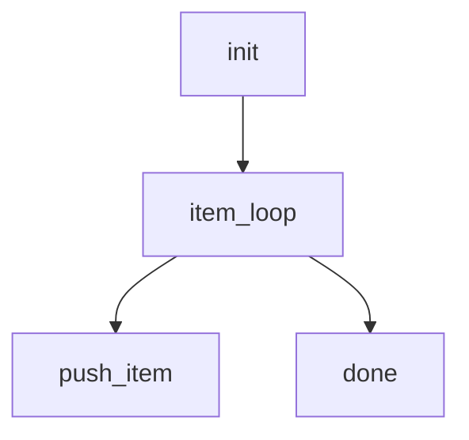

# Standardized projects/agentic-workflow/src/validate/rules/r3f_codegen_ready.rs

## Overview
<!-- type: overview lang: markdown -->

Public API manifest for `projects/agentic-workflow/src/validate/rules/r3f_codegen_ready.rs` generated from AST during Score force-regeneration standardization.

### Symbols

| Name | Target | Kind | Visibility | Line | Signature |
|------|--------|------|------------|------|-----------|
| `CodegenReadyRule` | projects/agentic-workflow/src/validate/rules/r3f_codegen_ready.rs | struct | pub | 294 |  |
## Source
<!-- type: source lang: rust -->

````rust
//! R3f — codegen-ready gate.
//!
//! Sections whose annotation is `<!-- type: logic|state-machine|interaction -->`
//! MUST have a matching Mermaid Plus block whose YAML frontmatter
//! deserialises to the corresponding content model (`LogicContent` or
//! signature-keyed `LogicSpec`, `StateMachineContent`, `InteractionContent`).
//!
//! Rule 2-2 escape hatch: if EVERY `changes[]` entry carries
//! `impl_mode: hand-written`, the spec is 100% hand-written — codegen is a
//! no-op — and this rule is skipped.
//!
//! This is the migration target for `check_codegen_ready()` currently
//! living in `projects/agentic-workflow/cli/src/td.rs`; keeping the semantics
//! identical so callers of that function can swap in this rule without
//! behaviour change. The score CLI still keeps its own copy until the
//! router lands; the two will be reconciled then.

use crate::generate::apply::is_all_hand_written;
use crate::generate::diagrams::content::{InteractionContent, LogicContent, StateMachineContent};
use crate::generate::frontmatter::extract_mermaid_plus_blocks;
use crate::generate::gen::rust::logic_emitter::LogicSpec;
use crate::validate::{Finding, Rule, RuleId, RuleReport};
use std::path::Path;

impl Rule for CodegenReadyRule {
    fn id(&self) -> RuleId {
        RuleId::CodegenReady
    }

    fn check(&self, spec_path: &Path, content: &str, report: &mut RuleReport) {
        if is_all_hand_written(content) {
            return;
        }

        let Some((_fm, body)) = split_frontmatter(content) else {
            return;
        };

        let blocks = extract_mermaid_plus_blocks(content);
        let sections = extract_sections(body);

        for (heading, section_type) in sections {
            let mut expected_type = match section_type.as_str() {
                "state-machine" => "StateMachineContent",
                "logic" => "LogicContent",
                "interaction" => "InteractionContent",
                _ => continue,
            };

            let block = blocks
                .iter()
                .find(|b| b.section_type.as_deref() == Some(section_type.as_str()));
            match block {
                None => {
                    report.push(
                        Finding::error(
                            RuleId::CodegenReady,
                            spec_path,
                            format!(
                                "section '{}' (type: {}) requires a Mermaid Plus block \
                                 with YAML frontmatter for codegen (expected {})",
                                heading, section_type, expected_type
                            ),
                        )
                        .with_path(format!("section:{}", heading)),
                    );
                }
                Some(b) => {
                    let deser = match section_type.as_str() {
                        "state-machine" => {
                            serde_yaml::from_value::<StateMachineContent>(b.frontmatter.clone())
                                .map(|_| ())
                        }
                        "logic" if has_signature(&b.frontmatter) => {
                            expected_type = "LogicSpec";
                            serde_yaml::from_value::<LogicSpec>(b.frontmatter.clone()).map(|_| ())
                        }
                        "logic" => serde_yaml::from_value::<LogicContent>(b.frontmatter.clone())
                            .map(|_| ()),
                        "interaction" => {
                            serde_yaml::from_value::<InteractionContent>(b.frontmatter.clone())
                                .map(|_| ())
                        }
                        _ => Ok(()),
                    };
                    if let Err(e) = deser {
                        report.push(
                            Finding::error(
                                RuleId::CodegenReady,
                                spec_path,
                                format!(
                                    "section '{}' (type: {}) frontmatter invalid for {}: {}",
                                    heading, section_type, expected_type, e
                                ),
                            )
                            .with_path(format!("section:{}", heading)),
                        );
                    }
                }
            }
        }
    }
}

fn has_signature(value: &serde_yaml::Value) -> bool {
    value
        .as_mapping()
        .map(|m| m.keys().any(|k| k.as_str() == Some("signature")))
        .unwrap_or(false)
}

fn split_frontmatter(content: &str) -> Option<(&str, &str)> {
    let trimmed = content.trim_start();
    if !trimmed.starts_with("---") {
        return None;
    }
    let after_open = &trimmed[3..];
    let close = after_open.find("\n---")?;
    let fm = &after_open[..close];
    let body = &after_open[close + 4..];
    Some((fm.trim(), body))
}

/// Returns `(heading, section_type)` per `## Foo\n<!-- type: X ... -->` pair.
fn extract_sections(body: &str) -> Vec<(String, String)> {
    let mut out = Vec::new();
    let lines: Vec<&str> = body.lines().collect();
    let mut i = 0;
    while i < lines.len() {
        if let Some(rest) = lines[i].strip_prefix("## ") {
            let heading = rest.trim().to_string();
            if i + 1 < lines.len() {
                if let Some(st) = parse_section_type(lines[i + 1]) {
                    out.push((heading, st));
                }
            }
        }
        i += 1;
    }
    out
}

fn parse_section_type(line: &str) -> Option<String> {
    let trimmed = line.trim();
    let inner = trimmed.strip_prefix("<!--")?.strip_suffix("-->")?.trim();
    let tok = inner.split("type:").nth(1)?.trim();
    // Take first whitespace-delimited token after `type:`.
    let val = tok.split_whitespace().next()?.to_string();
    Some(val)
}

#[cfg(test)]
mod tests {
    use super::*;
    use std::path::PathBuf;

    fn run(content: &str) -> RuleReport {
        let mut r = RuleReport::new();
        CodegenReadyRule {}.check(&PathBuf::from("test.md"), content, &mut r);
        r
    }

    #[test]
    fn rule_2_2_spec_is_skipped() {
        let spec = r#"---
id: foo
---

## Logic
<!-- type: logic lang: mermaid -->

(no Mermaid Plus block — would normally trigger an error, but Rule 2-2 skips.)

## Changes
<!-- type: changes lang: yaml -->

```yaml
changes:
  - path: foo.rs
    action: create
    impl_mode: hand-written
  - path: bar.rs
    action: create
    impl_mode: hand-written
```
"#;
        assert!(run(spec).is_empty());
    }

    #[test]
    fn missing_mermaid_plus_block_flagged() {
        let spec = r#"---
id: foo
---

## Logic
<!-- type: logic lang: mermaid -->

No Mermaid Plus block here.

## Changes
<!-- type: changes lang: yaml -->

```yaml
changes:
  - path: foo.rs
    impl_mode: codegen
```
"#;
        let r = run(spec);
        assert!(!r.is_empty());
        assert!(r.findings[0]
            .message
            .contains("requires a Mermaid Plus block"));
    }

    #[test]
    fn spec_without_frontmatter_is_clean() {
        let spec = "## Logic\n<!-- type: logic lang: mermaid -->\n";
        // No --- frontmatter → rule bails out (caught elsewhere by validate_spec).
        assert!(run(spec).is_empty());
    }

    #[test]
    fn section_without_codegen_type_ignored() {
        let spec = r#"---
id: foo
---

## Overview
<!-- type: overview lang: markdown -->

Some prose.
"#;
        assert!(run(spec).is_empty());
    }

    #[test]
    fn signature_logic_spec_uses_logic_emitter_shape() {
        let spec = r#"---
id: foo
---

## Logic
<!-- type: logic lang: mermaid -->



## Changes
<!-- type: changes lang: yaml -->

```yaml
changes:
  - path: foo.rs
    impl_mode: codegen
```
"#;
        assert!(run(spec).is_empty());
    }
}
/// CodegenReadyRule validation rule (unit struct).
/// @spec projects/agentic-workflow/tech-design/core/validate/rules/r3f_codegen_ready.md#schema
pub struct CodegenReadyRule {}
````
## Changes
<!-- type: changes lang: yaml -->

```yaml
changes:
  - path: projects/agentic-workflow/src/validate/rules/r3f_codegen_ready.rs
    action: modify
    section: source
    impl_mode: codegen
    description: |
      Regenerate the remaining validation module source directly from the
      source section. Existing schema CODEGEN blocks, when present, remain
      owned by their semantic specs.
```
