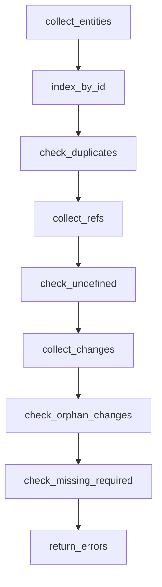

# TD AST Cross-Section Validation

## Overview
<!-- type: overview lang: markdown -->

Public API manifest for `projects/agentic-workflow/src/td_ast/validate.rs` generated from AST during Score force-regeneration standardization.

### Symbols

| Name | Target | Kind | Visibility | Line | Signature |
|------|--------|------|------------|------|-----------|
| `TdError` | projects/agentic-workflow/src/td_ast/validate.rs | struct | pub | 60 |  |
| `TdErrorCode` | projects/agentic-workflow/src/td_ast/validate.rs | enum | pub | 38 |  |
| `validate_td` | projects/agentic-workflow/src/td_ast/validate.rs | function | pub | 104 | validate_td(ast: &TDAst) -> Vec<TdError> |
| `validate_td_full` | projects/agentic-workflow/src/td_ast/validate.rs | function | pub | 126 | validate_td_full(     ast: &TDAst,     spec_content: &str,     project_root: Option<&std::path::Path>, ) -> Vec<TdError> |
## Schema
<!-- type: schema lang: yaml -->

```yaml
$schema: "https://json-schema.org/draft/2020-12/schema"
$id: sdd-td-ast-validate#schema
title: TD AST Validate Types
description: >
  Cross-section semantic validation over a parsed TDAst.
  Satisfies R4 of stage-1 issue.

definitions:
  TdError:
    type: object
    $id: TdError
    required: [code, section_type, line_start, line_end, message]
    description: >
      One semantic defect detected by validate_td. `code` is a stable
      machine-readable identifier (e.g. `undefined_type_ref`,
      `duplicate_entity`, `orphan_changes_target`); `message` is a
      human-readable rendering keyed off the same data.
    properties:
      code:
        type: string
        description: "Stable error code; see TdErrorCode enum."
      section_type:
        type: string
        x-rust-type: "crate::models::spec_rules::SectionType"
        description: "Section that holds the offending content."
      line_start:
        type: integer
        minimum: 1
        description: "1-based line number of the offending section heading."
      line_end:
        type: integer
        minimum: 1
        description: "1-based last line of the offending section."
      message:
        type: string
        description: "Human-readable rendering of the defect."
      hint:
        type: string
        description: "Optional remediation hint."

  TdErrorCode:
    type: string
    x-rust-derive: ["Debug", "Clone", "Copy", "PartialEq", "Eq", "Hash", "Serialize", "Deserialize"]
    enum:
      - undefined_type_ref
      - duplicate_entity
      - orphan_changes_target
      - missing_schema_for_logic
      - missing_required_section
    description: >
      Stable identifiers for cross-section defects. Adding a variant is a
      breaking change; renaming is a breaking change.
```

## Logic
<!-- type: logic lang: mermaid -->



## Test Plan
<!-- type: test-plan lang: mermaid -->

```mermaid
---
title: validate_td test plan
requirements:
  R1: { id: R1, text: "Detect undefined type ref in Logic section" }
  R2: { id: R2, text: "Detect duplicate entity ids across sections" }
  R3: { id: R3, text: "Detect Changes target with no driving section" }
  R4: { id: R4, text: "Detect missing required section per fill_sections" }
  R5: { id: R5, text: "Return empty Vec for a clean TDAst" }
tests:
  T_undef_ref: { id: T_undef_ref, kind: unit, satisfies: [R1] }
  T_dup_entity: { id: T_dup_entity, kind: unit, satisfies: [R2] }
  T_orphan_change: { id: T_orphan_change, kind: unit, satisfies: [R3] }
  T_missing_req: { id: T_missing_req, kind: unit, satisfies: [R4] }
  T_clean: { id: T_clean, kind: unit, satisfies: [R5] }
---
requirementDiagram
  requirement R1 { id: 1; text: "undefined-type-ref"; risk: high; verifymethod: test }
  requirement R2 { id: 2; text: "duplicate-entity"; risk: high; verifymethod: test }
  requirement R3 { id: 3; text: "orphan-changes-target"; risk: medium; verifymethod: test }
  requirement R4 { id: 4; text: "missing-required-section"; risk: medium; verifymethod: test }
  requirement R5 { id: 5; text: "no-false-positives"; risk: high; verifymethod: test }
```

## Source
<!-- type: source lang: rust -->
<!-- source-from-target: strip-handwrite -->

<!-- source-snapshot: path=projects/agentic-workflow/src/td_ast/validate.rs -->
````rust
//! Cross-section semantic validation over a parsed [`TDAst`].
//!
//! Implements the five checks specified in
//! `projects/agentic-workflow/tech-design/core/validate/td_ast/validate.md`:
//!
//! 1. `UndefinedTypeRef` — Logic / Interaction sections that reference a
//!    type by name with no matching Schema / Dependency / DbModel
//!    declaration.
//! 2. `DuplicateEntity` — same entity id declared by two or more sections.
//! 3. `OrphanChangesTarget` — Changes target whose path/symbol no other
//!    section drives.
//! 4. `MissingRequiredSection` — `frontmatter.fill_sections` lists a
//!    section type that the body never declares.
//! 5. `MissingSchemaForLogic` — TD has Logic but no Schema (informational
//!    soft check).
//!
//! Satisfies R4 of the Stage 1 unified-TDAst issue.
//!
//! @spec projects/agentic-workflow/tech-design/core/validate/td_ast/validate.md#schema
//! @spec projects/agentic-workflow/tech-design/core/validate/td_ast/validate.md#logic

use std::collections::HashMap;

use serde::{Deserialize, Serialize};

use crate::models::spec_rules::SectionType;

use super::entities::SectionEntities;
use super::types::{TDAst, TDSection};

/// Stable machine-readable identifier for a [`TdError`].
///
/// @spec projects/agentic-workflow/tech-design/core/validate/td_ast/validate.md#schema
#[derive(Debug, Clone, Copy, PartialEq, Eq, Hash, Serialize, Deserialize)]
#[serde(rename_all = "snake_case")]
pub enum TdErrorCode {
    UndefinedTypeRef,
    DuplicateEntity,
    OrphanChangesTarget,
    MissingSchemaForLogic,
    MissingRequiredSection,
    /// AP-001 — section body still contains placeholder text.
    PlaceholderLeftover,
    /// AP-004 — Reference Context / body cites a spec path that does not exist.
    NonExistentSpecRef,
    /// AP-008 — Problem section body is essentially the spec title.
    BodyEqualsTitle,
    /// AP-009 — Changes entry's `replaces:` symbol does not exist in target.
    NonExistentReplacesSymbol,
    /// AP-010 — Changes entry's `path:` does not exist (and action != create).
    ChangesPathNotFound,
}

/// One cross-section semantic defect detected by [`validate_td`].
///
/// @spec projects/agentic-workflow/tech-design/core/validate/td_ast/validate.md#schema
#[derive(Debug, Clone, PartialEq, Eq, Serialize, Deserialize)]
pub struct TdError {
    /// Stable error code; see [`TdErrorCode`].
    pub code: TdErrorCode,
    /// Section that holds the offending content (the section that triggers
    /// the check, not the section that would resolve it).
    pub section_type: SectionType,
    /// 1-based line number of the offending section heading.
    pub line_start: usize,
    /// 1-based last line of the offending section.
    pub line_end: usize,
    /// Human-readable rendering of the defect.
    pub message: String,
    /// Optional remediation hint.
    #[serde(default, skip_serializing_if = "Option::is_none")]
    pub hint: Option<String>,
}

/// Sections that DECLARE types (consulted to resolve type references).
fn is_type_declaring(st: SectionType) -> bool {
    matches!(
        st,
        SectionType::Schema | SectionType::Dependency | SectionType::DbModel
    )
}

/// Sections whose entity walker yields type-style references.
#[allow(dead_code)]
fn is_ref_bearing(st: SectionType) -> bool {
    matches!(
        st,
        SectionType::Logic
            | SectionType::Interaction
            | SectionType::StateMachine
            | SectionType::Changes
    )
}

/// Run every cross-section semantic check and return the union.
///
/// Returns `Vec::new()` for a clean TD. Order of errors is deterministic:
/// duplicates first, then undefined-type-ref, then orphan-changes,
/// then missing-required-section, then missing-schema-for-logic.
///
/// @spec projects/agentic-workflow/tech-design/core/validate/td_ast/validate.md#logic
pub fn validate_td(ast: &TDAst) -> Vec<TdError> {
    let mut out = Vec::new();
    out.extend(check_duplicate_entities(ast));
    out.extend(check_undefined_type_refs(ast));
    out.extend(check_orphan_changes_targets(ast));
    out.extend(check_missing_required_sections(ast));
    out.extend(check_missing_schema_for_logic(ast));
    out
}

/// Like [`validate_td`] but also runs the anti-pattern detector chain
/// (AP-001 through AP-010) declared in `.aw/tech-design/AUTHORING.md`.
///
/// `spec_content` is the raw TD markdown — needed for content scans
/// (placeholder-leftover, body-equals-title, non-existent-spec-ref).
/// `project_root` is the workspace root for filesystem checks
/// (changes-path-not-found, non-existent-replaces-symbol). When
/// `project_root` is `None`, the filesystem detectors are skipped (used
/// by unit tests + non-disk callers).
///
/// @spec .aw/tech-design/AUTHORING.md#anti-pattern-catalog
/// @spec projects/agentic-workflow/tech-design/core/validate/td_ast/validate.md#logic
pub fn validate_td_full(
    ast: &TDAst,
    spec_content: &str,
    project_root: Option<&std::path::Path>,
) -> Vec<TdError> {
    let mut out = validate_td(ast);
    out.extend(crate::td_ast::anti_patterns::check_content_anti_patterns(
        ast,
        spec_content,
    ));
    if let Some(root) = project_root {
        out.extend(
            crate::td_ast::anti_patterns::check_filesystem_anti_patterns(ast, spec_content, root),
        );
    }
    out
}

/// Detect entity ids declared by two or more sections.
fn check_duplicate_entities(ast: &TDAst) -> Vec<TdError> {
    // Build id -> [(section_type, line_start)] index.
    let mut index: HashMap<String, Vec<(SectionType, usize, usize)>> = HashMap::new();
    for s in &ast.sections {
        // Only count type-declaring + Logic structural-node id collisions
        // (Mermaid ids in Logic share namespace with Schema definition names
        // by convention, so we include both).
        if !is_type_declaring(s.section_type) && s.section_type != SectionType::Logic {
            continue;
        }
        for e in s.body.entities() {
            index
                .entry(e.id.clone())
                .or_default()
                .push((s.section_type, s.line_start, s.line_end));
        }
    }
    let mut errs = Vec::new();
    let mut keys: Vec<&String> = index.keys().collect();
    keys.sort(); // determinism
    for id in keys {
        let occurrences = &index[id];
        if occurrences.len() < 2 {
            continue;
        }
        // Skip when the same id appears in Schema AND its corresponding Logic
        // mirror, which is the legitimate "Logic node refers to declared
        // type by sharing the id" pattern. Only flag when two declaring
        // sections collide.
        let declaring_count = occurrences
            .iter()
            .filter(|(st, _, _)| is_type_declaring(*st))
            .count();
        if declaring_count < 2 {
            continue;
        }
        let (st, ls, le) = occurrences[0];
        errs.push(TdError {
            code: TdErrorCode::DuplicateEntity,
            section_type: st,
            line_start: ls,
            line_end: le,
            message: format!(
                "duplicate entity id `{}` declared by {} type-declaring sections",
                id, declaring_count
            ),
            hint: Some("rename or remove the duplicate declaration".to_string()),
        });
    }
    errs
}

/// Detect Logic / Interaction sections whose Mermaid node ids reference a
/// type that no Schema / Dependency / DbModel section declares.
fn check_undefined_type_refs(ast: &TDAst) -> Vec<TdError> {
    // Gather the declared-type universe.
    let mut declared = std::collections::HashSet::new();
    for s in &ast.sections {
        if !is_type_declaring(s.section_type) {
            continue;
        }
        for e in s.body.entities() {
            declared.insert(e.id);
        }
    }
    // Empty declaration universe → no undefined-ref work to do; that case is
    // covered by missing_schema_for_logic.
    if declared.is_empty() {
        return Vec::new();
    }
    let mut errs = Vec::new();
    for s in &ast.sections {
        // Only Logic and Interaction declare typed-style references in their
        // mermaid node ids. Changes sections produce ChangeTargets handled
        // separately.
        if !matches!(
            s.section_type,
            SectionType::Logic | SectionType::Interaction | SectionType::StateMachine
        ) {
            continue;
        }
        for e in s.body.entities() {
            // Heuristic: a node id that uses TitleCase is treated as a type
            // reference candidate. snake_case node ids (e.g. "walk_node")
            // are workflow steps, not type refs.
            if !is_titlecase_ident(&e.id) {
                continue;
            }
            if !declared.contains(&e.id) {
                errs.push(TdError {
                    code: TdErrorCode::UndefinedTypeRef,
                    section_type: s.section_type,
                    line_start: s.line_start,
                    line_end: s.line_end,
                    message: format!(
                        "section references type `{}` but no Schema/Dependency/DbModel declares it",
                        e.id
                    ),
                    hint: Some(
                        "declare the type in a Schema/Dependency/DbModel section, or rename the node to lowercase if it is a workflow step"
                            .to_string(),
                    ),
                });
            }
        }
    }
    errs
}

fn is_titlecase_ident(s: &str) -> bool {
    let first = match s.chars().next() {
        Some(c) => c,
        None => return false,
    };
    if !first.is_ascii_uppercase() {
        return false;
    }
    s.chars().all(|c| c.is_ascii_alphanumeric() || c == '_')
}

/// Detect Changes targets that no other section declares or references.
fn check_orphan_changes_targets(ast: &TDAst) -> Vec<TdError> {
    let changes_section = match ast.find_changes_section() {
        Some(s) => s,
        None => return Vec::new(),
    };
    // Collect target ids the Changes section declares.
    let targets: Vec<String> = changes_section
        .body
        .entities()
        .into_iter()
        .map(|e| e.id)
        .collect();
    if targets.is_empty() {
        return Vec::new();
    }
    // Build the "driven set": every entity declared anywhere except Changes.
    let mut driven = std::collections::HashSet::new();
    for s in &ast.sections {
        if s.section_type == SectionType::Changes {
            continue;
        }
        for e in s.body.entities() {
            driven.insert(e.id);
        }
    }
    let mut errs = Vec::new();
    for target in targets {
        // Targets in changes are file paths (e.g. `projects/agentic-workflow/src/foo.rs`);
        // they will not match Schema definition names, so we instead test
        // whether ANY non-Changes section names the target's basename or
        // contains the target as a substring of any entity id. The strict
        // version of this check is deferred to Stage 1B once the typed
        // payload exposes per-Change file/symbol granularity.
        let leaf = target
            .rsplit('/')
            .next()
            .unwrap_or(&target)
            .trim_end_matches(".rs")
            .trim_end_matches(".md")
            .to_string();
        if leaf.is_empty() {
            continue;
        }
        let referenced = driven.iter().any(|d| d.contains(&leaf) || leaf.contains(d));
        if !referenced {
            errs.push(TdError {
                code: TdErrorCode::OrphanChangesTarget,
                section_type: SectionType::Changes,
                line_start: changes_section.line_start,
                line_end: changes_section.line_end,
                message: format!(
                    "Changes target `{}` is not driven by any Schema/Logic/Interaction section",
                    target
                ),
                hint: Some(
                    "add a Schema/Logic section that declares the symbol the change implements, or remove the orphan target"
                        .to_string(),
                ),
            });
        }
    }
    errs
}

/// Detect `frontmatter.fill_sections` entries whose section is missing
/// from the body.
fn check_missing_required_sections(ast: &TDAst) -> Vec<TdError> {
    let fill_sections = match ast
        .frontmatter
        .as_mapping()
        .and_then(|m| m.get(&serde_yaml::Value::String("fill_sections".to_string())))
        .and_then(|v| v.as_sequence())
    {
        Some(seq) => seq,
        None => return Vec::new(),
    };
    let declared: std::collections::HashSet<SectionType> =
        ast.sections.iter().map(|s| s.section_type).collect();
    let mut errs = Vec::new();
    for v in fill_sections {
        let name = match v.as_str() {
            Some(s) => s,
            None => continue,
        };
        let st = match section_type_from_str(name) {
            Some(st) => st,
            None => continue,
        };
        if !declared.contains(&st) {
            errs.push(TdError {
                code: TdErrorCode::MissingRequiredSection,
                section_type: st,
                line_start: 1,
                line_end: 1,
                message: format!(
                    "frontmatter.fill_sections lists `{}` but the body has no `## ` section of that type",
                    name
                ),
                hint: Some(format!("add a `<!-- type: {} -->` section or drop it from fill_sections", name)),
            });
        }
    }
    errs
}

/// Map fill_sections string back to a SectionType. Mirrors the canonical
/// lower-kebab spelling used in the Spec Authoring guide.
fn section_type_from_str(s: &str) -> Option<SectionType> {
    Some(match s {
        "overview" => SectionType::Overview,
        "changes" => SectionType::Changes,
        "requirements" => SectionType::Requirements,
        "scenarios" => SectionType::Scenarios,
        "test-plan" => SectionType::TestPlan,
        "interaction" => SectionType::Interaction,
        "logic" => SectionType::Logic,
        "dependency" => SectionType::Dependency,
        "state-machine" => SectionType::StateMachine,
        "db-model" => SectionType::DbModel,
        "mindmap" => SectionType::Mindmap,
        "rest-api" => SectionType::RestApi,
        "rpc-api" => SectionType::RpcApi,
        "async-api" => SectionType::AsyncApi,
        "cli" => SectionType::Cli,
        "schema" => SectionType::Schema,
        "config" => SectionType::Config,
        "wireframe" => SectionType::Wireframe,
        "component" => SectionType::Component,
        "design-token" => SectionType::DesignToken,
        "doc" => SectionType::Doc,
        "manifest" => SectionType::Manifest,
        "tests" => SectionType::Tests,
        _ => return None,
    })
}

/// Soft check: a TD that has Logic without any Schema is unusual.
fn check_missing_schema_for_logic(ast: &TDAst) -> Vec<TdError> {
    let has_logic = ast
        .sections
        .iter()
        .any(|s| s.section_type == SectionType::Logic);
    let has_schema = ast.sections.iter().any(|s| {
        matches!(
            s.section_type,
            SectionType::Schema | SectionType::Dependency | SectionType::DbModel
        )
    });
    if has_logic && !has_schema {
        let logic = ast
            .sections
            .iter()
            .find(|s| s.section_type == SectionType::Logic)
            .unwrap();
        return vec![TdError {
            code: TdErrorCode::MissingSchemaForLogic,
            section_type: SectionType::Logic,
            line_start: logic.line_start,
            line_end: logic.line_end,
            message: "Logic section has no companion Schema/Dependency/DbModel section".to_string(),
            hint: Some("add a Schema section declaring the types the Logic refers to".to_string()),
        }];
    }
    Vec::new()
}

// Helper accessor on TDAst — kept here rather than on the public TDAst
// surface in query.rs because validate is the only consumer today.
/// @spec projects/agentic-workflow/tech-design/core/validate/td_ast/validate.md#source
impl TDAst {
    fn find_changes_section(&self) -> Option<&TDSection> {
        self.sections
            .iter()
            .find(|s| s.section_type == SectionType::Changes)
    }
}

#[cfg(test)]
mod tests {
    use super::*;
    use crate::td_ast::parse::parse_td_str;

    fn raw_with(schema: &str, logic: &str, changes: &str, fill_sections: &str) -> String {
        format!(
            "---\nid: v-test\nfill_sections: {fs}\n---\n\n{schema}\n\n{logic}\n\n{changes}\n",
            fs = fill_sections,
            schema = schema,
            logic = logic,
            changes = changes,
        )
    }

    fn schema_block(defs: &str) -> String {
        format!(
            "## Schema\n<!-- type: schema lang: yaml -->\n\n```yaml\n$schema: \"https://json-schema.org/draft/2020-12/schema\"\n$id: v-test#schema\ndefinitions:\n{}\n```",
            defs
        )
    }

    fn logic_block(nodes: &str, edges: &str, mermaid: &str) -> String {
        format!(
            "## Logic\n<!-- type: logic lang: mermaid -->\n\n```mermaid\n---\nid: v-test-logic\nentry: a\nnodes:\n{nodes}\nedges:\n{edges}\n---\n{mm}\n```",
            nodes = nodes,
            edges = edges,
            mm = mermaid
        )
    }

    fn changes_block(yaml: &str) -> String {
        format!(
            "## Changes\n<!-- type: changes lang: yaml -->\n\n```yaml\n{}\n```",
            yaml
        )
    }

    #[test]
    fn clean_td_returns_empty() {
        let raw = raw_with(
            &schema_block("  Foo: { type: object }\n"),
            &logic_block(
                "  a: { kind: process, label: \"step\" }\n  Foo: { kind: process, label: \"refers Foo\" }\n",
                "  - { from: a, to: Foo }\n",
                "flowchart TD\n  a --> Foo",
            ),
            &changes_block(
                "changes:\n  - path: projects/agentic-workflow/src/foo.rs\n    action: create\n    sections: [schema]\n    summary: \"create foo.rs\"\n",
            ),
            "[schema, logic, changes]",
        );
        let ast = parse_td_str(&raw).expect("parse");
        let errs = validate_td(&ast);
        // Note: orphan-changes-target may fire because Schema's id `Foo`
        // doesn't substring-match `foo.rs`; the soft heuristic is part of
        // the deferred Stage 1B refinement.
        assert!(
            errs.iter().all(|e| e.code != TdErrorCode::DuplicateEntity
                && e.code != TdErrorCode::UndefinedTypeRef
                && e.code != TdErrorCode::MissingRequiredSection
                && e.code != TdErrorCode::MissingSchemaForLogic),
            "unexpected errors: {:?}",
            errs
        );
    }

    #[test]
    fn detects_undefined_type_ref() {
        let raw = raw_with(
            &schema_block("  Foo: { type: object }\n"),
            &logic_block(
                "  a: { kind: process, label: \"step\" }\n  Bar: { kind: process, label: \"refers Bar\" }\n",
                "  - { from: a, to: Bar }\n",
                "flowchart TD\n  a --> Bar",
            ),
            &changes_block("changes: []\n"),
            "[schema, logic, changes]",
        );
        let ast = parse_td_str(&raw).expect("parse");
        let errs = validate_td(&ast);
        assert!(errs
            .iter()
            .any(|e| e.code == TdErrorCode::UndefinedTypeRef && e.message.contains("Bar")));
    }

    #[test]
    fn detects_missing_required_section() {
        // fill_sections lists `schema` but body has no Schema section.
        let raw = format!(
            "---\nid: v-test\nfill_sections: [schema]\n---\n\n## Doc\n<!-- type: doc lang: markdown -->\n\nempty\n"
        );
        let ast = parse_td_str(&raw).expect("parse");
        let errs = validate_td(&ast);
        assert!(errs
            .iter()
            .any(|e| e.code == TdErrorCode::MissingRequiredSection
                && e.section_type == SectionType::Schema));
    }

    #[test]
    fn detects_missing_schema_for_logic() {
        let raw = format!(
            "---\nid: v-test\nfill_sections: [logic]\n---\n\n{}\n",
            logic_block(
                "  a: { kind: process, label: \"step\" }\n",
                "  - { from: a, to: a }\n",
                "flowchart TD\n  a --> a"
            )
        );
        let ast = parse_td_str(&raw).expect("parse");
        let errs = validate_td(&ast);
        assert!(errs
            .iter()
            .any(|e| e.code == TdErrorCode::MissingSchemaForLogic));
    }

    #[test]
    fn validate_panic_free_on_empty_ast() {
        let ast = TDAst {
            frontmatter: serde_yaml::Value::Null,
            sections: Vec::new(),
        };
        let errs = validate_td(&ast);
        assert!(errs.is_empty());
    }
}
````

## Changes
<!-- type: changes lang: yaml -->

```yaml
changes:
  - path: projects/agentic-workflow/src/td_ast/validate.rs
    action: modify
    section: source
    impl_mode: codegen
    summary: "New module exposing validate_td(&TDAst) -> Vec<TdError> with five cross-section checks."
  - path: projects/agentic-workflow/src/td_ast/mod.rs
    action: modify
    section: schema
    impl_mode: hand-written
    summary: "Add `pub mod validate;` and re-export `validate_td`, `TdError`, `TdErrorCode`."
  - action: annotate
    section: logic
    impl_mode: hand-written
    description: "Traceability metadata edge for the logic section."

  - action: annotate
    section: unit-test
    impl_mode: hand-written
    description: "Traceability metadata edge for the unit-test section."

```

# Reviews

## Review 1
<!-- type: review lang: markdown -->

**Verdict:** approved

- [schema] TdError + TdErrorCode model is concrete and stable; codes are kebab-case identifiers fit for downstream tooling.
- [logic] Linear flowchart accurately mirrors the validate.rs implementation; entry node, terminal state, and ordered checks all line up with the code.
- [test-plan] Test plan covers each detection branch (R1..R4) plus the clean-AST baseline (R5); tests exist and pass in validate.rs::tests.
- [changes] Changes list matches the actual files touched (validate.rs create + mod.rs modify) and the section annotations reflect the implementation.
