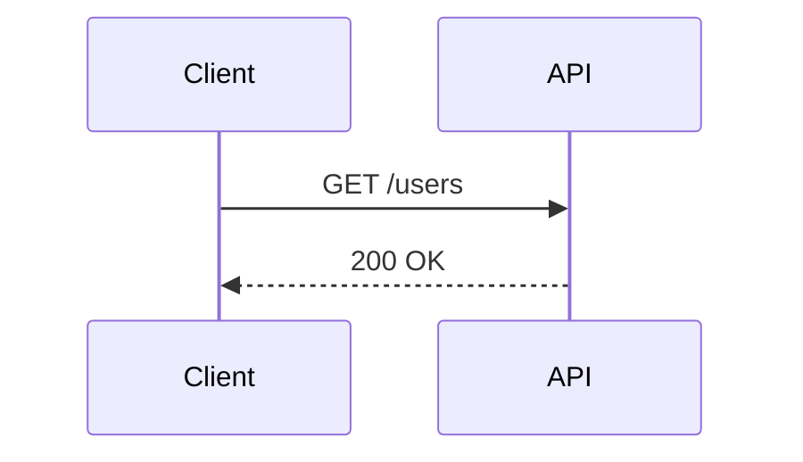
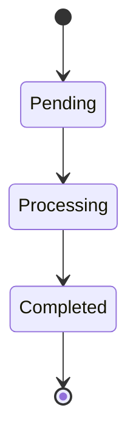
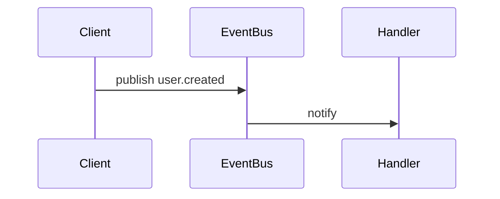
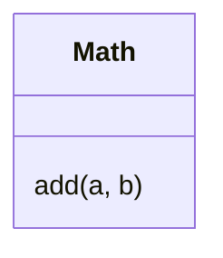
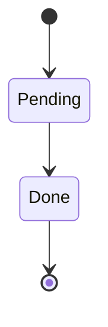

# SemanticValidator Type

## Overview
<!-- type: overview lang: markdown -->

Public API manifest for `projects/agentic-workflow/src/validator/semantic.rs` generated from AST during Score force-regeneration standardization.

### Symbols

| Name | Target | Kind | Visibility | Line | Signature |
|------|--------|------|------------|------|-----------|
| `SemanticValidator` | projects/agentic-workflow/src/validator/semantic.rs | struct | pub | 13 |  |
| `new` | projects/agentic-workflow/src/validator/semantic.rs | function | pub | 21 | new(rules: ValidationRules) -> Self |
| `validate` | projects/agentic-workflow/src/validator/semantic.rs | function | pub | 26 | validate(&self, file_path: &Path) -> ValidationResult |
| `validate_batch` | projects/agentic-workflow/src/validator/semantic.rs | function | pub | 370 | validate_batch(&self, file_paths: &[PathBuf]) -> ValidationResult |
## Schema
<!-- type: schema lang: yaml -->

```yaml
definitions:
  SemanticValidator:
    type: object
    required: [rules]
    description: Semantic validator for spec files.
    properties:
      rules:
        type: object
        x-rust-type: "ValidationRules"
        x-rust-visibility: private
        description: "Validation rules from config."
    x-rust-struct:
      derive: []
```

## Source
<!-- type: source lang: rust -->
<!-- source-from-target: strip-managed-markers -->

<!-- source-snapshot: path=projects/agentic-workflow/src/validator/semantic.rs -->
~~~rust
// SPEC-MANAGED: projects/agentic-workflow/tech-design/core/validate/validator/semantic.md#source
// CODEGEN-BEGIN
#![allow(deprecated)]
use crate::models::spec_rules::SpecType;
use crate::models::{ErrorCategory, Severity, ValidationError, ValidationResult, ValidationRules};
use regex::Regex;
use std::collections::HashMap;
use std::path::{Path, PathBuf};
use std::str::FromStr;

/// Semantic validator for spec files.
/// @spec projects/agentic-workflow/tech-design/core/validate/validator/semantic.md#schema
pub struct SemanticValidator {
    /// Validation rules from config.
    rules: ValidationRules,
}

/// @spec projects/agentic-workflow/tech-design/core/validate/validator/semantic.md#changes
impl SemanticValidator {
    /// Create a new semantic validator with rules
    pub fn new(rules: ValidationRules) -> Self {
        Self { rules }
    }

    /// Validate semantic correctness of a spec file
    pub fn validate(&self, file_path: &Path) -> ValidationResult {
        let mut errors = Vec::new();

        // Read file content
        let content = match std::fs::read_to_string(file_path) {
            Ok(c) => c,
            Err(e) => {
                errors.push(ValidationError::new(
                    format!("Failed to read file: {}", e),
                    file_path,
                    None,
                    Severity::High,
                    ErrorCategory::InvalidStructure,
                ));
                return ValidationResult::new(errors);
            }
        };

        // Check spec_type completeness (diagrams and API specs)
        errors.extend(self.check_spec_type_completeness(&content, file_path));

        // Extract requirements from the file
        let requirements = self.extract_requirements(&content, file_path);

        // Check for duplicate requirement IDs
        errors.extend(self.check_duplicate_requirements(&requirements, file_path));

        // Check for cross-reference validity
        errors.extend(self.check_cross_references(&content, file_path));

        // Check for empty or incomplete requirements
        errors.extend(self.check_requirement_completeness(&requirements, file_path));

        ValidationResult::new(errors)
    }

    /// Check if spec has required diagrams and API specs based on spec_type
    fn check_spec_type_completeness(
        &self,
        content: &str,
        file_path: &Path,
    ) -> Vec<ValidationError> {
        let mut errors = Vec::new();

        // Extract spec_type from frontmatter
        if let Some(spec_type_str) = self.extract_frontmatter_field(content, "spec_type") {
            match SpecType::from_str(&spec_type_str) {
                Ok(spec_type) => {
                    // Check for required diagrams with OR logic
                    let required_diagrams = spec_type.required_diagrams_as_strings();
                    if !required_diagrams.is_empty() {
                        let has_any_diagram = required_diagrams.iter().any(|diagram_type| {
                            self.contains_diagram_of_type(content, diagram_type)
                        });

                        if !has_any_diagram {
                            errors.push(ValidationError::new(
                                format!(
                                    "spec_type '{}' requires one of these diagrams: {}, but none found",
                                    spec_type_str,
                                    required_diagrams.join(", ")
                                ),
                                file_path,
                                None,
                                Severity::High,
                                ErrorCategory::InvalidStructure,
                            ));
                        }
                    }

                    // Check for required API spec
                    if let Some(required_api_spec) = spec_type.required_api_spec() {
                        if !self.contains_api_spec(content, required_api_spec.as_str()) {
                            errors.push(ValidationError::new(
                                format!(
                                    "spec_type '{}' requires an '{}' API spec, but none found",
                                    spec_type_str,
                                    required_api_spec.as_str()
                                ),
                                file_path,
                                None,
                                Severity::High,
                                ErrorCategory::InvalidStructure,
                            ));
                        }
                    }
                }
                Err(e) => {
                    // Report invalid spec_type as error
                    errors.push(ValidationError::new(
                        format!("Invalid spec_type: {}", e),
                        file_path,
                        None,
                        Severity::High,
                        ErrorCategory::InvalidStructure,
                    ));
                }
            }
        }

        errors
    }

    /// Extract a field value from frontmatter (YAML front matter between ---)
    fn extract_frontmatter_field(&self, content: &str, field_name: &str) -> Option<String> {
        // Find frontmatter boundaries
        let lines: Vec<&str> = content.lines().collect();
        if lines.is_empty() || lines[0] != "---" {
            return None;
        }

        // Find closing ---
        let mut end_idx = 1;
        for i in 1..lines.len() {
            if lines[i] == "---" {
                end_idx = i;
                break;
            }
        }

        // Extract field from frontmatter
        let escaped_field = regex::escape(field_name);
        let pattern = format!(r"^{}:\s*(.+)$", escaped_field);
        if let Ok(regex) = Regex::new(&pattern) {
            for i in 1..end_idx {
                if let Some(captures) = regex.captures(lines[i]) {
                    if let Some(value) = captures.get(1) {
                        return Some(value.as_str().trim().to_string());
                    }
                }
            }
        }

        None
    }

    /// Check if content contains a diagram of specific type (not just any mermaid block)
    fn contains_diagram_of_type(&self, content: &str, diagram_type: &str) -> bool {
        // Match the actual diagram type keyword in mermaid blocks
        // Normalize diagram_type names for matching
        let diagram_keyword = match diagram_type {
            "sequence" => "sequenceDiagram",
            "flowchart" => "flowchart",
            "state" => "stateDiagram",
            "erd" => "erDiagram",
            "class" => "classDiagram",
            "mindmap" => "mindmap",
            "requirement" => "requirementDiagram",
            "journey" => "journey",
            _ => diagram_type, // fallback to original if not in map
        };

        // Pattern for Mermaid code blocks with specific diagram type
        // Match: ```mermaid\n followed by the diagram keyword
        let escaped = regex::escape(diagram_keyword);
        let pattern = format!(r"```mermaid\s*\n\s*{}\b", escaped);

        if let Ok(regex) = Regex::new(&pattern) {
            if regex.is_match(content) {
                return true;
            }
        }

        // Also check in structured diagrams field (JSON format)
        let json_pattern = format!(r#""type":\s*"{}""#, regex::escape(diagram_type));
        if let Ok(regex) = Regex::new(&json_pattern) {
            return regex.is_match(content);
        }

        false
    }

    /// Check if content contains an API spec of given type
    fn contains_api_spec(&self, content: &str, api_spec_type: &str) -> bool {
        // Look for API spec type in spec field
        let escaped = regex::escape(api_spec_type);
        let patterns = vec![
            format!(r#""type":\s*"{}""#, escaped),
            format!(r#"api_spec_type:\s*{}"#, escaped),
            format!(r#"api_spec.*?type.*?{}"#, escaped),
        ];

        for pattern in patterns {
            if let Ok(regex) = Regex::new(&pattern) {
                if regex.is_match(content) {
                    return true;
                }
            }
        }

        false
    }

    /// Extract requirement IDs from markdown content
    fn extract_requirements(&self, content: &str, file_path: &Path) -> Vec<RequirementInfo> {
        let mut requirements = Vec::new();

        let req_regex = match Regex::new(r"^### (R\d+):(.*)$") {
            Ok(r) => r,
            Err(_) => return requirements,
        };

        let lines: Vec<&str> = content.lines().collect();

        for (line_num, line) in lines.iter().enumerate() {
            if let Some(captures) = req_regex.captures(line) {
                let req_id = captures.get(1).map(|m| m.as_str().to_string());
                let req_title = captures.get(2).map(|m| m.as_str().trim().to_string());

                if let (Some(id), Some(title)) = (req_id, req_title) {
                    requirements.push(RequirementInfo {
                        id,
                        title,
                        line_number: line_num + 1, // 1-indexed
                        file_path: file_path.to_path_buf(),
                    });
                }
            }
        }

        requirements
    }

    /// Check for duplicate requirement IDs
    fn check_duplicate_requirements(
        &self,
        requirements: &[RequirementInfo],
        file_path: &Path,
    ) -> Vec<ValidationError> {
        let mut errors = Vec::new();
        let mut seen: HashMap<String, &RequirementInfo> = HashMap::new();

        for req in requirements {
            if let Some(first_occurrence) = seen.get(&req.id) {
                let severity = self.rules.severity_map.duplicate_requirement;
                errors.push(ValidationError::new(
                    format!(
                        "Duplicate requirement ID '{}' (first seen at line {})",
                        req.id, first_occurrence.line_number
                    ),
                    file_path,
                    Some(req.line_number),
                    severity,
                    ErrorCategory::DuplicateRequirement,
                ));
            } else {
                seen.insert(req.id.clone(), req);
            }
        }

        errors
    }

    /// Check cross-references to other spec files
    fn check_cross_references(&self, content: &str, file_path: &Path) -> Vec<ValidationError> {
        let mut errors = Vec::new();

        // Find all markdown links in the content
        let link_regex = match Regex::new(r"\[([^\]]+)\]\(([^)]+)\)") {
            Ok(r) => r,
            Err(_) => return errors,
        };

        let lines: Vec<&str> = content.lines().collect();

        for (line_num, line) in lines.iter().enumerate() {
            for captures in link_regex.captures_iter(line) {
                if let Some(link_target) = captures.get(2) {
                    let target = link_target.as_str();

                    // Only check local file references (not URLs)
                    if !target.starts_with("http://")
                        && !target.starts_with("https://")
                        && !target.starts_with('#')
                    {
                        // Resolve relative path
                        let target_path = if let Some(parent) = file_path.parent() {
                            parent.join(target)
                        } else {
                            PathBuf::from(target)
                        };

                        // Check if file exists
                        if !target_path.exists() {
                            let severity = self.rules.severity_map.broken_reference;
                            errors.push(ValidationError::new(
                                format!("Broken reference to file: {}", target),
                                file_path,
                                Some(line_num + 1),
                                severity,
                                ErrorCategory::BrokenReference,
                            ));
                        }
                    }
                }
            }
        }

        errors
    }

    /// Check for incomplete or empty requirements
    fn check_requirement_completeness(
        &self,
        requirements: &[RequirementInfo],
        file_path: &Path,
    ) -> Vec<ValidationError> {
        let mut errors = Vec::new();

        for req in requirements {
            // Check for empty titles
            if req.title.is_empty() {
                errors.push(ValidationError::new(
                    format!("Requirement '{}' has empty title", req.id),
                    file_path,
                    Some(req.line_number),
                    Severity::High,
                    ErrorCategory::EmptyContent,
                ));
            }

            // Check for placeholder titles (common pattern)
            let placeholder_patterns = ["TODO", "TBD", "FIXME", "XXX"];
            for pattern in &placeholder_patterns {
                if req.title.to_uppercase().contains(pattern) {
                    errors.push(ValidationError::new(
                        format!(
                            "Requirement '{}' contains placeholder text: '{}'",
                            req.id, req.title
                        ),
                        file_path,
                        Some(req.line_number),
                        Severity::Medium,
                        ErrorCategory::EmptyContent,
                    ));
                    break;
                }
            }
        }

        errors
    }

    /// Validate across multiple spec files (for batch validation)
    pub fn validate_batch(&self, file_paths: &[PathBuf]) -> ValidationResult {
        let mut all_errors = Vec::new();

        // First pass: validate each file individually
        for file_path in file_paths {
            let result = self.validate(file_path);
            all_errors.extend(result.errors);
        }

        // Second pass: cross-file validation
        let cross_file_errors = self.check_cross_file_duplicates(file_paths);
        all_errors.extend(cross_file_errors);

        ValidationResult::new(all_errors)
    }

    /// Check for duplicate requirement IDs across multiple files
    fn check_cross_file_duplicates(&self, file_paths: &[PathBuf]) -> Vec<ValidationError> {
        let mut errors = Vec::new();
        let mut global_requirements: HashMap<String, RequirementInfo> = HashMap::new();

        // Collect all requirements from all files
        for file_path in file_paths {
            if let Ok(content) = std::fs::read_to_string(file_path) {
                let requirements = self.extract_requirements(&content, file_path);

                for req in requirements {
                    if let Some(first_occurrence) = global_requirements.get(&req.id) {
                        let severity = self.rules.severity_map.duplicate_requirement;
                        errors.push(ValidationError::new(
                            format!(
                                "Duplicate requirement ID '{}' across files (first seen in {} at line {})",
                                req.id,
                                first_occurrence.file_path.display(),
                                first_occurrence.line_number
                            ),
                            &req.file_path,
                            Some(req.line_number),
                            severity,
                            ErrorCategory::DuplicateRequirement,
                        ));
                    } else {
                        global_requirements.insert(req.id.clone(), req);
                    }
                }
            }
        }

        errors
    }
}

/// Information about a requirement found in a spec file
#[derive(Debug, Clone)]
struct RequirementInfo {
    id: String,
    title: String,
    line_number: usize,
    file_path: PathBuf,
}

#[cfg(test)]
mod tests {
    use super::*;
    use std::io::Write;
    use tempfile::NamedTempFile;

    #[test]
    fn test_no_duplicate_requirements() {
        let content = r#"# Specification: Test Feature

## Requirements

### R1: First Requirement
This is the first requirement.

### R2: Second Requirement
This is the second requirement.
"#;

        let mut file = NamedTempFile::new().unwrap();
        file.write_all(content.as_bytes()).unwrap();
        file.flush().unwrap();

        let validator = SemanticValidator::new(ValidationRules::default());
        let result = validator.validate(file.path());

        assert!(result.is_valid());
    }

    #[test]
    fn test_duplicate_requirements() {
        let content = r#"# Specification: Test Feature

## Requirements

### R1: First Requirement
This is the first requirement.

### R1: Duplicate Requirement
This is a duplicate.
"#;

        let mut file = NamedTempFile::new().unwrap();
        file.write_all(content.as_bytes()).unwrap();
        file.flush().unwrap();

        let validator = SemanticValidator::new(ValidationRules::default());
        let result = validator.validate(file.path());

        assert!(!result.is_valid());
        assert!(result
            .errors
            .iter()
            .any(|e| matches!(e.category, ErrorCategory::DuplicateRequirement)));
    }

    #[test]
    fn test_empty_requirement_title() {
        let content = r#"# Specification: Test Feature

## Requirements

### R1:
Empty title requirement.
"#;

        let mut file = NamedTempFile::new().unwrap();
        file.write_all(content.as_bytes()).unwrap();
        file.flush().unwrap();

        let validator = SemanticValidator::new(ValidationRules::default());
        let result = validator.validate(file.path());

        assert!(!result.is_valid());
        assert!(result
            .errors
            .iter()
            .any(|e| matches!(e.category, ErrorCategory::EmptyContent)));
    }

    #[test]
    fn test_placeholder_in_title() {
        let content = r#"# Specification: Test Feature

## Requirements

### R1: TODO: Implement this feature
Placeholder in title.
"#;

        let mut file = NamedTempFile::new().unwrap();
        file.write_all(content.as_bytes()).unwrap();
        file.flush().unwrap();

        let validator = SemanticValidator::new(ValidationRules::default());
        let result = validator.validate(file.path());

        // Should have medium severity error
        assert!(result
            .errors
            .iter()
            .any(|e| e.severity == Severity::Medium
                && matches!(e.category, ErrorCategory::EmptyContent)));
    }

    #[test]
    fn test_broken_reference() {
        let content = r#"# Specification: Test Feature

## Requirements

### R1: First Requirement
See [non-existent file](./non-existent.md) for details.
"#;

        let mut file = NamedTempFile::new().unwrap();
        file.write_all(content.as_bytes()).unwrap();
        file.flush().unwrap();

        let validator = SemanticValidator::new(ValidationRules::default());
        let result = validator.validate(file.path());

        assert!(result
            .errors
            .iter()
            .any(|e| matches!(e.category, ErrorCategory::BrokenReference)));
    }

    // Spec Type Enforcement Tests
    #[test]
    fn test_http_api_requires_sequence_diagram() {
        let content = r#"---
spec_type: http-api
---

# HTTP API Specification

## Requirements

### R1: List Users
List all users from the system.

## Acceptance Criteria

### Scenario: Get users successfully
**WHEN** GET /users is called
**THEN** user list is returned

## API Specification

```yaml
openapi: 3.1.0
info:
  title: User API
  version: 1.0.0
paths:
  /users:
    get:
      summary: List users
```
"#;

        let mut file = NamedTempFile::new().unwrap();
        file.write_all(content.as_bytes()).unwrap();
        file.flush().unwrap();

        let validator = SemanticValidator::new(ValidationRules::default());
        let result = validator.validate(file.path());

        assert!(!result.is_valid());
        assert!(result
            .errors
            .iter()
            .any(|e| e.message.contains("sequence") && e.message.contains("http-api")));
    }

    #[test]
    fn test_valid_http_api_spec() {
        let content = r#"---
spec_type: http-api
---

# HTTP API Specification

## Requirements

### R1: List Users
List all users from the system.

## Acceptance Criteria

### Scenario: Get users successfully
**WHEN** GET /users is called
**THEN** user list is returned

## Sequence Diagram



## API Specification

```yaml
openapi: 3.1.0
info:
  title: User API
  version: 1.0.0
paths:
  /users:
    get:
      summary: List users
```
"#;

        let mut file = NamedTempFile::new().unwrap();
        file.write_all(content.as_bytes()).unwrap();
        file.flush().unwrap();

        let validator = SemanticValidator::new(ValidationRules::default());
        let result = validator.validate(file.path());

        // Should pass spec_type checks for diagrams
        assert!(!result
            .errors
            .iter()
            .any(|e| e.message.contains("sequence") && e.message.contains("http-api")));
    }

    #[test]
    fn test_data_model_requires_erd_or_class() {
        let content = r#"---
spec_type: data-model
---

# Data Model Specification

## Requirements

### R1: User Entity
Define the User entity with fields.

## Acceptance Criteria

### Scenario: User has id field
**WHEN** user is created
**THEN** it has a unique id
"#;

        let mut file = NamedTempFile::new().unwrap();
        file.write_all(content.as_bytes()).unwrap();
        file.flush().unwrap();

        let validator = SemanticValidator::new(ValidationRules::default());
        let result = validator.validate(file.path());

        assert!(!result.is_valid());
        assert!(result.errors.iter().any(|e| (e.message.contains("ERD")
            || e.message.contains("class"))
            && e.message.contains("data-model")));
    }

    #[test]
    fn test_algorithm_requires_flowchart_or_state() {
        let content = r#"---
spec_type: algorithm
---

# Algorithm Specification

## Requirements

### R1: Sort Algorithm
Implement sorting logic.

## Acceptance Criteria

### Scenario: Sort array
**WHEN** array is provided
**THEN** sorted array is returned
"#;

        let mut file = NamedTempFile::new().unwrap();
        file.write_all(content.as_bytes()).unwrap();
        file.flush().unwrap();

        let validator = SemanticValidator::new(ValidationRules::default());
        let result = validator.validate(file.path());

        assert!(!result.is_valid());
        assert!(result
            .errors
            .iter()
            .any(
                |e| (e.message.contains("flowchart") || e.message.contains("state"))
                    && e.message.contains("algorithm")
            ));
    }

    #[test]
    fn test_workflow_spec_validation() {
        let content = r#"---
spec_type: workflow
---

# Workflow Specification

## Requirements

### R1: Process Order
Define order processing workflow.

## Acceptance Criteria

### Scenario: Order workflow
**WHEN** order is submitted
**THEN** workflow is executed

## State Diagram



## Workflow Definition

```json
{
  "specVersion": "0.8",
  "id": "order-workflow",
  "version": "1.0.0"
}
```
"#;

        let mut file = NamedTempFile::new().unwrap();
        file.write_all(content.as_bytes()).unwrap();
        file.flush().unwrap();

        let validator = SemanticValidator::new(ValidationRules::default());
        let result = validator.validate(file.path());

        // Should not have errors about missing state diagram
        assert!(!result
            .errors
            .iter()
            .any(|e| e.message.contains("state") && e.message.contains("workflow")));
    }

    #[test]
    fn test_utility_spec_has_no_requirements() {
        let content = r#"---
spec_type: utility
---

# Utility Specification

## Requirements

### R1: Helper Function
A simple helper function.

## Acceptance Criteria

### Scenario: Helper works
**WHEN** called
**THEN** returns value
"#;

        let mut file = NamedTempFile::new().unwrap();
        file.write_all(content.as_bytes()).unwrap();
        file.flush().unwrap();

        let validator = SemanticValidator::new(ValidationRules::default());
        let result = validator.validate(file.path());

        // Utility specs don't require diagrams or API specs
        assert!(!result
            .errors
            .iter()
            .any(|e| e.message.contains("requires") && e.message.contains("utility")));
    }

    #[test]
    fn test_invalid_spec_type() {
        let content = r#"---
spec_type: invalid-type
---

# Invalid Specification

## Requirements

### R1: Something
Do something.

## Acceptance Criteria

### Scenario: Test
**WHEN** condition
**THEN** result
"#;

        let mut file = NamedTempFile::new().unwrap();
        file.write_all(content.as_bytes()).unwrap();
        file.flush().unwrap();

        let validator = SemanticValidator::new(ValidationRules::default());
        let result = validator.validate(file.path());

        // Invalid spec_type won't match any validation rules
        // So there shouldn't be diagram/api spec errors
        assert!(!result
            .errors
            .iter()
            .any(|e| e.message.contains("requires a") && e.message.contains("diagram")));
    }

    #[test]
    fn test_event_driven_spec_validation() {
        let content = r#"---
spec_type: event-driven
---

# Event-Driven Specification

## Requirements

### R1: User Created Event
Handle user creation events.

## Acceptance Criteria

### Scenario: Event published
**WHEN** user is created
**THEN** event is published

## Sequence Diagram



## AsyncAPI Specification

```yaml
asyncapi: 2.6.0
info:
  title: Event API
  version: 1.0.0
channels:
  user.created:
    publish:
      message:
        payload:
          type: object
```
"#;

        let mut file = NamedTempFile::new().unwrap();
        file.write_all(content.as_bytes()).unwrap();
        file.flush().unwrap();

        let validator = SemanticValidator::new(ValidationRules::default());
        let result = validator.validate(file.path());

        // Should not have errors about missing sequence diagram
        assert!(!result
            .errors
            .iter()
            .any(|e| e.message.contains("sequence") && e.message.contains("event-driven")));
    }

    #[test]
    fn test_rpc_api_spec_validation() {
        let content = r#"---
spec_type: rpc-api
---

# RPC API Specification

## Requirements

### R1: Add Numbers
Add two numbers via RPC.

## Acceptance Criteria

### Scenario: Call add
**WHEN** add method is called
**THEN** result is returned

## Class Diagram



## OpenRPC Specification

```json
{
  "openrpc": "1.3.0",
  "info": {
    "title": "Math API",
    "version": "1.0.0"
  },
  "methods": []
}
```
"#;

        let mut file = NamedTempFile::new().unwrap();
        file.write_all(content.as_bytes()).unwrap();
        file.flush().unwrap();

        let validator = SemanticValidator::new(ValidationRules::default());
        let result = validator.validate(file.path());

        // Should not have errors about missing class diagram
        assert!(!result
            .errors
            .iter()
            .any(|e| e.message.contains("class") && e.message.contains("rpc-api")));
    }

    // Validator Enhancement Tests (R5-R7)

    #[test]
    fn test_validator_enhancement_http_api_valid() {
        let content = r#"---
spec_type: http-api
---

# HTTP API Specification

## Requirements

### R1: List Users
List all users.

## Acceptance Criteria

### Scenario: Get users
**WHEN** GET /users is called
**THEN** user list is returned

## Sequence Diagram


## API Specification

```json
{
  "type": "openapi-3.1",
  "spec": {
    "openapi": "3.1.0",
    "info": {"title": "User API", "version": "1.0.0"}
  }
}
```
"#;

        let mut file = NamedTempFile::new().unwrap();
        file.write_all(content.as_bytes()).unwrap();
        file.flush().unwrap();

        let validator = SemanticValidator::new(ValidationRules::default());
        let result = validator.validate(file.path());

        assert!(
            result.is_valid(),
            "http-api with sequence + openapi should be valid"
        );
    }

    #[test]
    fn test_validator_enhancement_missing_sequence_diagram() {
        let content = r#"---
spec_type: http-api
---

# HTTP API Specification

## Requirements

### R1: List Users
List all users.

## Acceptance Criteria

### Scenario: Get users
**WHEN** GET /users is called
**THEN** user list is returned

## API Specification

```json
{
  "type": "openapi-3.1",
  "spec": {
    "openapi": "3.1.0",
    "info": {"title": "User API", "version": "1.0.0"}
  }
}
```
"#;

        let mut file = NamedTempFile::new().unwrap();
        file.write_all(content.as_bytes()).unwrap();
        file.flush().unwrap();

        let validator = SemanticValidator::new(ValidationRules::default());
        let result = validator.validate(file.path());

        assert!(
            !result.is_valid(),
            "http-api without sequence diagram should be invalid"
        );
        assert!(
            result
                .errors
                .iter()
                .any(|e| e.message.contains("sequence") && e.message.contains("http-api")),
            "Should have error about missing sequence diagram"
        );
    }

    #[test]
    fn test_validator_enhancement_missing_serverless_workflow() {
        let content = r#"---
spec_type: workflow
---

# Workflow Specification

## Requirements

### R1: Process Order
Process orders.

## Acceptance Criteria

### Scenario: Order processing
**WHEN** order is submitted
**THEN** workflow executes

## State Diagram


"#;

        let mut file = NamedTempFile::new().unwrap();
        file.write_all(content.as_bytes()).unwrap();
        file.flush().unwrap();

        let validator = SemanticValidator::new(ValidationRules::default());
        let result = validator.validate(file.path());

        assert!(
            !result.is_valid(),
            "workflow without serverless workflow spec should be invalid"
        );
        assert!(
            result
                .errors
                .iter()
                .any(|e| e.message.contains("Serverless Workflow")
                    || (e.message.contains("workflow") && e.message.contains("API"))),
            "Should have error about missing Serverless Workflow spec"
        );
    }

    #[test]
    fn test_validator_enhancement_utility_no_requirements() {
        let content = r#"---
spec_type: utility
---

# Utility Specification

## Requirements

### R1: Helper Function
A helper function.

## Acceptance Criteria

### Scenario: Call helper
**WHEN** helper is called
**THEN** result is returned
"#;

        let mut file = NamedTempFile::new().unwrap();
        file.write_all(content.as_bytes()).unwrap();
        file.flush().unwrap();

        let validator = SemanticValidator::new(ValidationRules::default());
        let result = validator.validate(file.path());

        // Utility specs have no requirements for diagrams/API specs
        assert!(
            result.is_valid(),
            "utility spec should be valid with no diagrams/api specs"
        );
    }

    #[test]
    fn test_validator_enhancement_data_model_requires_erd_or_class() {
        let content = r#"---
spec_type: data-model
---

# Data Model Specification

## Requirements

### R1: User Entity
User entity definition.

## Acceptance Criteria

### Scenario: User has fields
**WHEN** User is created
**THEN** it has required fields
"#;

        let mut file = NamedTempFile::new().unwrap();
        file.write_all(content.as_bytes()).unwrap();
        file.flush().unwrap();

        let validator = SemanticValidator::new(ValidationRules::default());
        let result = validator.validate(file.path());

        assert!(
            !result.is_valid(),
            "data-model without erd/class diagram should be invalid"
        );
        assert!(
            result.errors.iter().any(|e| (e.message.contains("ERD")
                || e.message.contains("class"))
                && e.message.contains("data-model")),
            "Should have error about missing ERD or class diagram"
        );
    }

    #[test]
    fn test_validator_enhancement_algorithm_requires_flowchart_or_state() {
        let content = r#"---
spec_type: algorithm
---

# Algorithm Specification

## Requirements

### R1: Sorting Algorithm
Sort implementation.

## Acceptance Criteria

### Scenario: Sort
**WHEN** array is sorted
**THEN** result is sorted
"#;

        let mut file = NamedTempFile::new().unwrap();
        file.write_all(content.as_bytes()).unwrap();
        file.flush().unwrap();

        let validator = SemanticValidator::new(ValidationRules::default());
        let result = validator.validate(file.path());

        assert!(
            !result.is_valid(),
            "algorithm without flowchart/state should be invalid"
        );
        assert!(
            result
                .errors
                .iter()
                .any(
                    |e| (e.message.contains("flowchart") || e.message.contains("state"))
                        && e.message.contains("algorithm")
                ),
            "Should have error about missing flowchart or state diagram"
        );
    }
}

// CODEGEN-END
~~~

## Changes
<!-- type: changes lang: yaml -->

```yaml
changes:
  - path: projects/agentic-workflow/src/validator/semantic.rs
    action: modify
    section: source
    impl_mode: codegen
    description: |
      Codegen owns the complete source file through a source template.
  - action: annotate
    section: schema
    impl_mode: hand-written
    description: "Traceability metadata edge for the schema section."

```

# Reviews

## Review 1
<!-- type: review lang: markdown -->

**Verdict:** approved

- [overview] Single struct with private foreign-type field.
- [schema] Standard pattern.
- [changes] Standard split.
