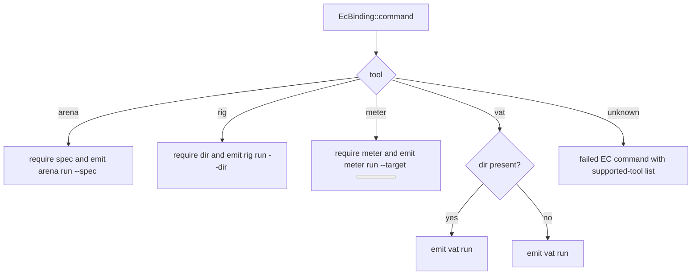

# TD: aw EC vat binding command support

## Logic
<!-- type: logic lang: mermaid -->

```mermaid
flowchart TD
  A[EcBinding::command] --> B{tool}
  B -->|arena| C[require spec and emit arena run --spec <spec>]
  B -->|rig| D[require dir and emit rig run --dir <dir>]
  B -->|meter| E[require meter and emit meter run --target <meter>]
  B -->|vat| F{dir present?}
  F -->|yes| G[emit vat run <dir>]
  F -->|no| H[emit vat run]
  B -->|unknown| I[failed EC command with supported-tool list]
```
