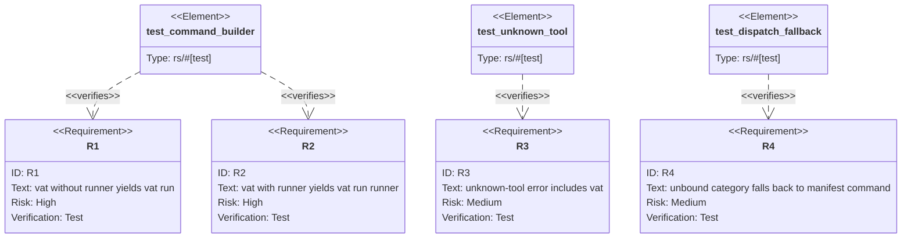

# TD: aw EC vat binding command support

## Logic
<!-- type: logic lang: mermaid -->

```mermaid
---
id: aw-ec-vat-binding-command
entry: start
nodes:
  start: { kind: start, label: "EcBinding::command()" }
  branch: { kind: decision, label: "binding.tool" }
  arena: { kind: process, label: "arena: require spec, emit arena run --spec <spec>" }
  rig: { kind: process, label: "rig: require dir, emit rig run --dir <dir>" }
  meter: { kind: process, label: "meter: require meter, emit meter run --target <meter>" }
  vat_runner: { kind: decision, label: "vat binding has dir runner id?" }
  vat_named: { kind: terminal, label: "emit vat run <dir>" }
  vat_default: { kind: terminal, label: "emit vat run" }
  unknown: { kind: terminal, label: "error: expected arena|rig|meter|vat" }
edges:
  - { from: start, to: branch }
  - { from: branch, to: arena, label: "arena" }
  - { from: branch, to: rig, label: "rig" }
  - { from: branch, to: meter, label: "meter" }
  - { from: branch, to: vat_runner, label: "vat" }
  - { from: vat_runner, to: vat_named, label: "yes" }
  - { from: vat_runner, to: vat_default, label: "no" }
  - { from: branch, to: unknown, label: "other" }
---
flowchart TD
  start([EcBinding::command]) --> branch{binding.tool}
  branch -->|arena| arena[require spec; arena run --spec]
  branch -->|rig| rig[require dir; rig run --dir]
  branch -->|meter| meter[require meter; meter run --target]
  branch -->|vat| vat_runner{dir runner id present?}
  vat_runner -->|yes| vat_named([vat run runner])
  vat_runner -->|no| vat_default([vat run])
  branch -->|other| unknown([error: expected arena|rig|meter|vat])
```

## Unit Test
<!-- type: unit-test lang: mermaid -->



# Reviews

### Review 1
**Verdict:** approved

- [logic] applicable: the change is a small extension of the existing EC command builder; the vat branch is deterministic, preserves the existing arena/rig/meter branches, and keeps unknown tools as a failed EC command.
- [unit-test] applicable: R1-R4 cover the new default vat command, named vat runner command, unknown-tool error text, and unchanged manifest fallback behavior.
