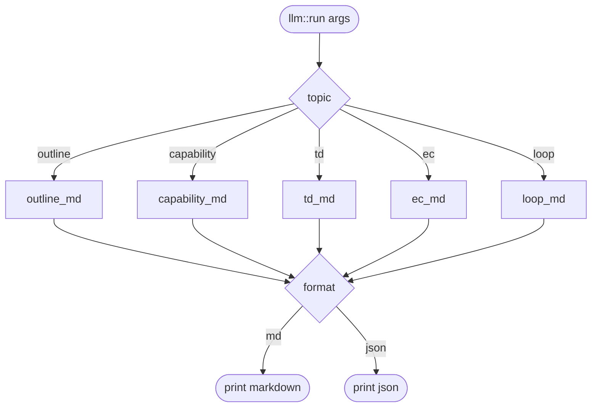

# TD: aw llm offline agent-orientation command

## Logic
<!-- type: logic lang: mermaid -->

## Unit Test

```mermaid
---
id: aw-llm-unit-tests
requirements:
  outline_lists_verbs:
    id: R1
    text: "outline topic lists the registered top-level verbs sourced from the Commands enum, so it cannot drift from the actual CLI."
    kind: functional
    risk: high
    verify: test
  every_topic_emits:
    id: R2
    text: "each topic (outline, capability, td, ec, loop) emits non-empty orientation markdown."
    kind: functional
    risk: high
    verify: test
  json_wraps_markdown:
    id: R3
    text: "format json emits a {topic, markdown} object; md is the default."
    kind: functional
    risk: medium
    verify: test
  offline_deterministic:
    id: R4
    text: "topic emitters are pure: same input yields identical output with no network, server, or model call."
    kind: functional
    risk: medium
    verify: test
elements:
  llm_outline_lists_registered_verbs:
    kind: test
    type: "rs/#[test]"
  llm_every_topic_emits_markdown:
    kind: test
    type: "rs/#[test]"
  llm_format_json_wraps_markdown:
    kind: test
    type: "rs/#[test]"
  llm_topics_are_deterministic:
    kind: test
    type: "rs/#[test]"
relations:
  - { from: llm_outline_lists_registered_verbs, verifies: outline_lists_verbs }
  - { from: llm_every_topic_emits_markdown, verifies: every_topic_emits }
  - { from: llm_format_json_wraps_markdown, verifies: json_wraps_markdown }
  - { from: llm_topics_are_deterministic, verifies: offline_deterministic }
---
requirementDiagram
    requirement R1 {
      id: R1
      text: "outline lists registered verbs, no drift"
      risk: high
      verifymethod: test
    }
    requirement R2 {
      id: R2
      text: "every topic emits markdown"
      risk: high
      verifymethod: test
    }
    requirement R3 {
      id: R3
      text: "json wraps markdown, md default"
      risk: medium
      verifymethod: test
    }
    requirement R4 {
      id: R4
      text: "topic emitters are pure and offline"
      risk: medium
      verifymethod: test
    }
    element llm_outline_lists_registered_verbs {
      type: "rs/#[test]"
    }
    element llm_every_topic_emits_markdown {
      type: "rs/#[test]"
    }
    element llm_format_json_wraps_markdown {
      type: "rs/#[test]"
    }
    element llm_topics_are_deterministic {
      type: "rs/#[test]"
    }
```

<!-- type: unit-test lang: mermaid -->

# Reviews

### Review 1
**Verdict:** approved

- [logic] Contract logic is stable: topic -> emitter -> format with the outline's verb list sourced from the Commands enum (no drift). Pure and offline; no model/network call.
- [unit-test] R1-R4 map one-to-one to tests covering verb-list sourcing, every-topic emission, json {topic, markdown} wrapping with md default, and emitter determinism. Contract is implementable as written.
