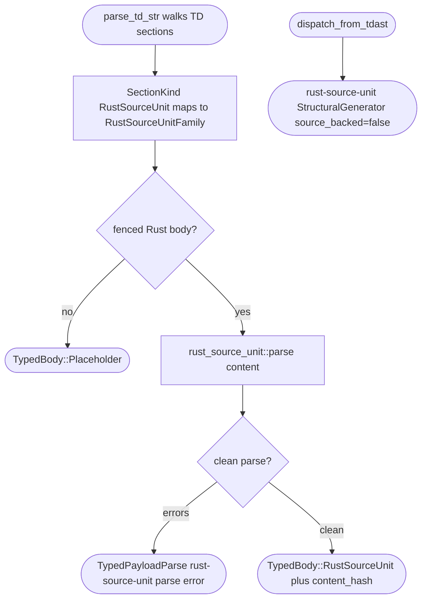

# TD: aw td_ast parse rust-source-unit sections as typed TD bodies

## Logic
<!-- type: logic lang: mermaid -->

```mermaid
---
id: aw-td-ast-rust-source-unit-typed-body
entry: parse_section
nodes:
  parse_section: { kind: start, label: "parse_td_str walks TD sections" }
  registry: { kind: process, label: "SectionKind::for_section_type(RustSourceUnit) => RustSourceUnitFamily" }
  fence: { kind: decision, label: "section has fenced Rust body?" }
  placeholder: { kind: terminal, label: "empty or missing fence => TypedBody::Placeholder" }
  parse_rust: { kind: process, label: "rust_source_unit::parse(content)" }
  parse_ok: { kind: decision, label: "ra_ap_syntax parse clean?" }
  typed_error: { kind: terminal, label: "return TypedPayloadParse with rust-source-unit parse error" }
  typed_body: { kind: terminal, label: "TypedBody::RustSourceUnit(unit) + content_hash(unit)" }
  dispatch: { kind: start, label: "dispatch_from_tdast sees TypedBody::RustSourceUnit" }
  structural: { kind: terminal, label: "DispatchOutcome emitted by rust-source-unit; StructuralGenerator; source_backed=false" }
edges:
  - { from: parse_section, to: registry }
  - { from: registry, to: fence }
  - { from: fence, to: placeholder, label: "no" }
  - { from: fence, to: parse_rust, label: "yes" }
  - { from: parse_rust, to: parse_ok }
  - { from: parse_ok, to: typed_error, label: "errors" }
  - { from: parse_ok, to: typed_body, label: "clean" }
  - { from: dispatch, to: structural }
---
flowchart TD
  parse_section([parse_td_str walks TD sections]) --> registry[SectionKind RustSourceUnit maps to RustSourceUnitFamily]
  registry --> fence{fenced Rust body?}
  fence -->|no| placeholder([TypedBody::Placeholder])
  fence -->|yes| parse_rust[rust_source_unit::parse content]
  parse_rust --> parse_ok{clean parse?}
  parse_ok -->|errors| typed_error([TypedPayloadParse rust-source-unit parse error])
  parse_ok -->|clean| typed_body([TypedBody::RustSourceUnit plus content_hash])
  dispatch([dispatch_from_tdast]) --> structural([rust-source-unit StructuralGenerator source_backed=false])
```
