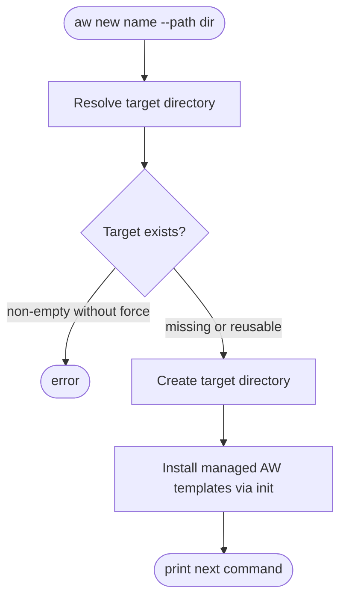
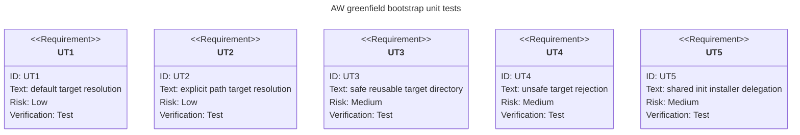

# AW Greenfield Project Bootstrap

## Logic
<!-- type: logic lang: mermaid -->



## CLI
<!-- type: cli lang: yaml -->

```yaml
commands:
  - name: aw new
    summary: Create a greenfield project directory and bootstrap Agentic Workflow.
    usage: "aw new <name> [--path <path>] [--force] [--no-init]"
    args:
      - name: name
        required: true
        description: Project directory name when --path is not supplied.
    flags:
      - name: --path
        value: path
        required: false
        description: Explicit target directory. When omitted, target is ./<name>.
      - name: --force
        required: false
        description: Allow reusing an existing empty directory and pass force refresh to init.
      - name: --no-init
        required: false
        description: Create the directory without running aw init.
    behavior:
      - Reject existing non-empty target directories unless --force is supplied.
      - Create the target directory before running init.
      - Run the same template installer used by aw init so greenfield and refresh paths share managed assets.
      - Print the resolved project path and next command.
  - name: aw init
    summary: Initialize or refresh Agentic Workflow in the current directory.
    usage: "aw init [--force]"
    relationship_to_new: "aw new is a greenfield wrapper; aw init remains the in-place bootstrap/refresh command."
```

## Config
<!-- type: config lang: yaml -->

```yaml
greenfield_bootstrap:
  command: aw new
  target_resolution:
    default_parent: "."
    path_flag: "--path"
    path_flag_semantics: "When supplied, use the exact path as the target directory."
  init_behavior:
    default: run_aw_init_after_directory_creation
    skip_flag: "--no-init"
    template_source: "projects/agentic-workflow/templates/cli/mainthread"
    issue_platform_selection: "non_interactive_defaults"
  safety:
    existing_non_empty_directory: reject
    existing_empty_directory: allow
    force_flag: "--force"
  generated_files:
    - ".aw/config.toml"
    - ".aw/tech-design/"
    - "CLAUDE.md"
    - ".claude/skills/"
    - ".claude/settings.json"
```

## Unit Test
<!-- type: unit-test lang: mermaid -->


