# Promote generated manuals to first-class AW evidence artifacts

## Logic
<!-- type: logic lang: mermaid -->

## Unit Test

```mermaid
---
id: generated-manual-evidence-artifact-tests
requirements:
  generated_manual_schema:
    id: UT1
    text: "EC evidence docs entries accept kind generated-manual with a project-local path, label, markdown/html format, and non-empty runner command."
    kind: functional
    risk: high
    verify: test
  runner_required:
    id: UT2
    text: "generated-manual evidence without a runner command fails validation with an actionable diagnostic."
    kind: functional
    risk: high
    verify: test
  path_safety:
    id: UT3
    text: "generated-manual output paths must remain under docs/ or a configured project-local evidence root."
    kind: safety
    risk: high
    verify: test
  optional_media:
    id: UT4
    text: "screenshots, highlights, and step metadata are parsed when present but are not required for a valid manual artifact."
    kind: functional
    risk: medium
    verify: test
  evidence_surface:
    id: UT5
    text: "capability, health, and EC documentation output expose generated manuals as typed evidence artifacts."
    kind: integration
    risk: medium
    verify: test
elements:
  ec_generated_manual_docs_entry_accepts_runner_contract:
    kind: test
    type: "rs/#[test]"
  ec_generated_manual_docs_entry_rejects_missing_runner:
    kind: test
    type: "rs/#[test]"
  ec_generated_manual_docs_entry_rejects_path_escape:
    kind: test
    type: "rs/#[test]"
  ec_generated_manual_docs_entry_accepts_optional_media_absent:
    kind: test
    type: "rs/#[test]"
  ec_generated_manual_docs_entry_surfaces_in_reports:
    kind: test
    type: "rs/#[test]"
relations:
  - { from: ec_generated_manual_docs_entry_accepts_runner_contract, verifies: generated_manual_schema }
  - { from: ec_generated_manual_docs_entry_rejects_missing_runner, verifies: runner_required }
  - { from: ec_generated_manual_docs_entry_rejects_path_escape, verifies: path_safety }
  - { from: ec_generated_manual_docs_entry_accepts_optional_media_absent, verifies: optional_media }
  - { from: ec_generated_manual_docs_entry_surfaces_in_reports, verifies: evidence_surface }
---
requirementDiagram
  requirement UT1 {
    id: UT1
    text: "generated-manual docs evidence schema"
    risk: high
    verifymethod: test
  }
  requirement UT2 {
    id: UT2
    text: "runner command required"
    risk: high
    verifymethod: test
  }
  requirement UT3 {
    id: UT3
    text: "project-local output path"
    risk: high
    verifymethod: test
  }
  requirement UT4 {
    id: UT4
    text: "optional media metadata"
    risk: medium
    verifymethod: test
  }
  requirement UT5 {
    id: UT5
    text: "manual artifact report surface"
    risk: medium
    verifymethod: test
  }
  element ec_generated_manual_docs_entry_accepts_runner_contract {
    type: "rs/#[test]"
  }
  element ec_generated_manual_docs_entry_rejects_missing_runner {
    type: "rs/#[test]"
  }
  element ec_generated_manual_docs_entry_rejects_path_escape {
    type: "rs/#[test]"
  }
  element ec_generated_manual_docs_entry_accepts_optional_media_absent {
    type: "rs/#[test]"
  }
  element ec_generated_manual_docs_entry_surfaces_in_reports {
    type: "rs/#[test]"
  }
  ec_generated_manual_docs_entry_accepts_runner_contract - verifies -> UT1
  ec_generated_manual_docs_entry_rejects_missing_runner - verifies -> UT2
  ec_generated_manual_docs_entry_rejects_path_escape - verifies -> UT3
  ec_generated_manual_docs_entry_accepts_optional_media_absent - verifies -> UT4
  ec_generated_manual_docs_entry_surfaces_in_reports - verifies -> UT5
```

<!-- type: unit-test lang: mermaid -->

# Reviews

### Review 1
**Verdict:** approved

- [logic] contract-complete: The flow covers generated-manual docs evidence detection, required runner command, project-local output path validation, markdown/html format validation, optional screenshots/highlights/step metadata, and typed exposure to capability/report/health/docs surfaces.
- [unit-test] contract-complete: The test plan names Rust test elements for the accepted runner contract, missing-runner rejection, path-escape rejection, optional-media tolerance, and reporting surface.
