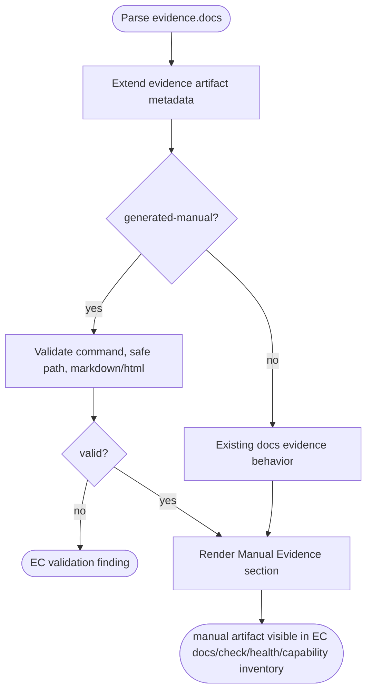

# Promote generated manuals to first-class AW evidence artifacts

## Logic
<!-- type: logic lang: mermaid -->

## Unit Test

```mermaid
---
id: generated-manual-evidence-contract-tests
requirements:
  schema_fields:
    id: CT1
    text: "EcEvidenceArtifact preserves generated-manual metadata fields from e2e evidence docs YAML: path, label, format, command, screenshots, highlights, and steps."
    kind: functional
    risk: high
    verify: test
  validation_success:
    id: CT2
    text: "A markdown generated-manual under docs/ with a non-empty runner command validates cleanly."
    kind: functional
    risk: high
    verify: test
  validation_failures:
    id: CT3
    text: "Missing command, unsupported format, and path escape each produce deterministic EC validation findings."
    kind: safety
    risk: high
    verify: test
  optional_media:
    id: CT4
    text: "Manual screenshots, highlights, and steps are optional and round-trip when present."
    kind: functional
    risk: medium
    verify: test
  documentation_surface:
    id: CT5
    text: "render_ec_doc() includes generated manual path, command, format, and optional media in the generated EC manual."
    kind: integration
    risk: medium
    verify: test
elements:
  ec_generated_manual_artifact_preserves_metadata:
    kind: test
    type: "rs/#[test]"
  ec_generated_manual_artifact_validates_markdown_docs_runner:
    kind: test
    type: "rs/#[test]"
  ec_generated_manual_artifact_reports_invalid_contracts:
    kind: test
    type: "rs/#[test]"
  ec_generated_manual_artifact_round_trips_optional_media:
    kind: test
    type: "rs/#[test]"
  ec_doc_gen_renders_generated_manual_artifact_details:
    kind: test
    type: "rs/#[test]"
relations:
  - { from: ec_generated_manual_artifact_preserves_metadata, verifies: schema_fields }
  - { from: ec_generated_manual_artifact_validates_markdown_docs_runner, verifies: validation_success }
  - { from: ec_generated_manual_artifact_reports_invalid_contracts, verifies: validation_failures }
  - { from: ec_generated_manual_artifact_round_trips_optional_media, verifies: optional_media }
  - { from: ec_doc_gen_renders_generated_manual_artifact_details, verifies: documentation_surface }
---
requirementDiagram
  requirement CT1 {
    id: CT1
    text: "manual metadata schema"
    risk: high
    verifymethod: test
  }
  requirement CT2 {
    id: CT2
    text: "valid docs runner contract"
    risk: high
    verifymethod: test
  }
  requirement CT3 {
    id: CT3
    text: "invalid contract diagnostics"
    risk: high
    verifymethod: test
  }
  requirement CT4 {
    id: CT4
    text: "optional media round trip"
    risk: medium
    verifymethod: test
  }
  requirement CT5 {
    id: CT5
    text: "EC manual rendering"
    risk: medium
    verifymethod: test
  }
  element ec_generated_manual_artifact_preserves_metadata {
    type: "rs/#[test]"
  }
  element ec_generated_manual_artifact_validates_markdown_docs_runner {
    type: "rs/#[test]"
  }
  element ec_generated_manual_artifact_reports_invalid_contracts {
    type: "rs/#[test]"
  }
  element ec_generated_manual_artifact_round_trips_optional_media {
    type: "rs/#[test]"
  }
  element ec_doc_gen_renders_generated_manual_artifact_details {
    type: "rs/#[test]"
  }
  ec_generated_manual_artifact_preserves_metadata - verifies -> CT1
  ec_generated_manual_artifact_validates_markdown_docs_runner - verifies -> CT2
  ec_generated_manual_artifact_reports_invalid_contracts - verifies -> CT3
  ec_generated_manual_artifact_round_trips_optional_media - verifies -> CT4
  ec_doc_gen_renders_generated_manual_artifact_details - verifies -> CT5
```

<!-- type: unit-test lang: mermaid -->

# Reviews

### Review 1
**Verdict:** approved

- [logic] contract-complete: The contract identifies the concrete EC parsing/rendering path and preserves legacy docs behavior while adding generated-manual validation for command, safe path, supported format, optional media, and report visibility.
- [unit-test] contract-complete: The tests map schema preservation, valid manual contracts, invalid diagnostics, optional media round-trip, and EC manual rendering to named Rust test targets.
