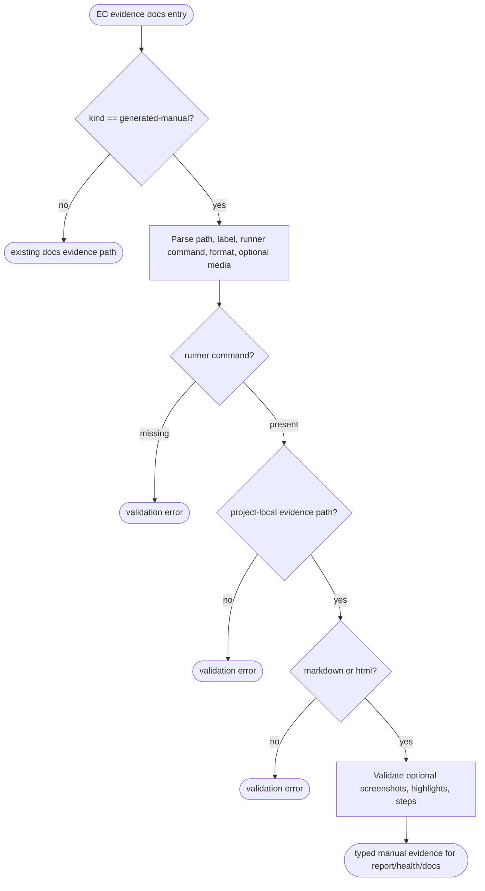

# Promote generated manuals to first-class AW evidence artifacts

## Logic
<!-- type: logic lang: mermaid -->

```mermaid
---
id: generated-manual-evidence-artifact-flow
entry: start
nodes:
  start:
    kind: start
    label: "EC evidence parser reads an evidence.docs[] entry"
  kind_check:
    kind: decision
    label: "docs.kind == generated-manual?"
  passthrough:
    kind: terminal
    label: "Use existing docs evidence handling for non-manual kinds"
  parse_contract:
    kind: process
    label: "Parse generated-manual contract: path, label, runner command, format, optional media metadata"
  runner_present:
    kind: decision
    label: "Runner command present and non-empty?"
  reject_missing_runner:
    kind: terminal
    label: "Validation error: generated-manual evidence requires producer command"
  path_allowed:
    kind: decision
    label: "Output path is project-local docs/ or configured evidence directory?"
  reject_path:
    kind: terminal
    label: "Validation error: manual output path escapes approved evidence roots"
  format_supported:
    kind: decision
    label: "Format is markdown or html?"
  reject_format:
    kind: terminal
    label: "Validation error: unsupported manual document format"
  media_validate:
    kind: process
    label: "Validate optional screenshots, highlights, and step metadata without requiring them"
  expose_artifact:
    kind: terminal
    label: "Expose generated manual as typed EC evidence for capability report, health, and docs output"
edges:
  - from: start
    to: kind_check
    label: "read docs entry"
  - from: kind_check
    to: passthrough
    label: "other kind"
  - from: kind_check
    to: parse_contract
    label: "generated-manual"
  - from: parse_contract
    to: runner_present
  - from: runner_present
    to: reject_missing_runner
    label: "missing"
  - from: runner_present
    to: path_allowed
    label: "present"
  - from: path_allowed
    to: reject_path
    label: "outside evidence root"
  - from: path_allowed
    to: format_supported
    label: "project-local"
  - from: format_supported
    to: reject_format
    label: "unsupported"
  - from: format_supported
    to: media_validate
    label: "markdown/html"
  - from: media_validate
    to: expose_artifact
    label: "valid"
---
flowchart TD
  start([EC evidence docs entry]) --> kind_check{kind == generated-manual?}
  kind_check -->|no| passthrough([existing docs evidence path])
  kind_check -->|yes| parse_contract[Parse path, label, runner command, format, optional media]
  parse_contract --> runner_present{runner command?}
  runner_present -->|missing| reject_missing_runner([validation error])
  runner_present -->|present| path_allowed{project-local evidence path?}
  path_allowed -->|no| reject_path([validation error])
  path_allowed -->|yes| format_supported{markdown or html?}
  format_supported -->|no| reject_format([validation error])
  format_supported -->|yes| media_validate[Validate optional screenshots, highlights, steps]
  media_validate --> expose_artifact([typed manual evidence for report/health/docs])
```
