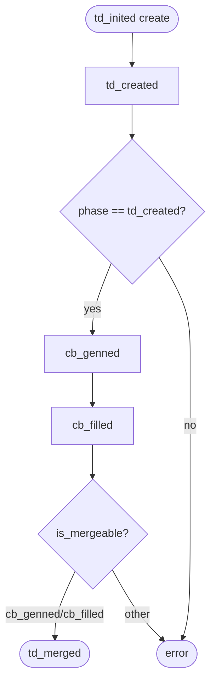

# TD: remove TD/CB CRRR, collapse to linear lifecycle

## Logic
<!-- type: logic lang: mermaid -->

## Unit Test

```mermaid
---
id: crrr-removal-unit-tests
requirements:
  create_to_gen:
    id: R1
    text: "After create, the linear lifecycle routes td_created straight to `aw td gen` (no review step)."
    kind: functional
    risk: high
    verify: test
  mergeable_linear:
    id: R2
    text: "is_mergeable accepts only cb_genned and cb_filled; non-code phases (td_inited/td_created) are not mergeable."
    kind: functional
    risk: high
    verify: test
  linear_chain:
    id: R3
    text: "next_phase_command encodes the linear chain: cb_genned -> aw cb fill, cb_filled -> aw td merge."
    kind: functional
    risk: medium
    verify: test
elements:
  td_created_dispatches_to_gen:
    kind: test
    type: "rs/#[test]"
  is_mergeable_linear_only_genned_filled:
    kind: test
    type: "rs/#[test]"
  next_phase_command_is_linear:
    kind: test
    type: "rs/#[test]"
relations:
  - { from: td_created_dispatches_to_gen, verifies: create_to_gen }
  - { from: is_mergeable_linear_only_genned_filled, verifies: mergeable_linear }
  - { from: next_phase_command_is_linear, verifies: linear_chain }
---
requirementDiagram
    requirement R1 {
      id: R1
      text: "td_created routes to aw td gen"
      risk: high
      verifymethod: test
    }
    requirement R2 {
      id: R2
      text: "is_mergeable accepts only cb_genned|cb_filled"
      risk: high
      verifymethod: test
    }
    requirement R3 {
      id: R3
      text: "next_phase_command is linear"
      risk: medium
      verifymethod: test
    }
    element td_created_dispatches_to_gen {
      type: "rs/#[test]"
    }
    element is_mergeable_linear_only_genned_filled {
      type: "rs/#[test]"
    }
    element next_phase_command_is_linear {
      type: "rs/#[test]"
    }
```

<!-- type: unit-test lang: mermaid -->

# Reviews

### Review 1
**Verdict:** approved

- [logic] Contract is stable: a pure next_phase_command(phase) encodes td_created->gen, cb_genned->fill, cb_filled->merge; is_mergeable trimmed to cb_genned|cb_filled; review/revise/arbitrate removed. Implementable as the surgical change-list.
- [unit-test] R1-R3 map to pure-function tests (td_created_dispatches_to_gen, is_mergeable_linear_only_genned_filled, next_phase_command_is_linear); bulk deletion guarded by build + full suite.
