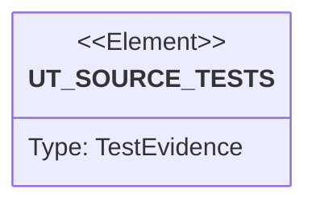

# Semantic TD: agentic-workflow/cli

## Schema
<!-- type: schema lang: yaml -->

```yaml
semantic_domain:
  key: "agentic-workflow/cli"
  source_group: "projects/agentic-workflow/src/cli"
  coverage_kind: semantic
  evidence:
    source_units:
      - path: "projects/agentic-workflow/src/cli/hook.rs"
        language: "rust"
        ownership_state: "codegen"
        generator_primitives: ["data_model", "enum_model", "service_method"]
        symbols:
          - name: "HookArgs"
            kind: "struct"
            public: true
          - name: "HookEvent"
            kind: "enum"
            public: true
          - name: "PretooluseKind"
            kind: "enum"
            public: true
          - name: "PosttooluseKind"
            kind: "enum"
            public: true
          - name: "Decision"
            kind: "enum"
            public: false
          - name: "run"
            kind: "function"
            public: true
          - name: "run_workflow_guard"
            kind: "function"
            public: false
          - name: "run_workflow_apply"
            kind: "function"
            public: false
          - name: "read_json_payload"
            kind: "function"
            public: false
          - name: "workflow_hook_decision"
            kind: "function"
            public: false
          - name: "run_write_scope_guarded"
            kind: "function"
            public: false
          - name: "panic_message"
            kind: "function"
            public: false
          - name: "emit_and_exit"
            kind: "function"
            public: false
          - name: "write_scope"
            kind: "module"
            public: false
          - name: "tests"
            kind: "module"
            public: false
        source_evidence_node:
          layer: "backend"
          ecosystem: "rust"
          role: "source"
          section_type: "schema"
          domain: "projects/agentic-workflow/src/cli"
      - path: "projects/agentic-workflow/src/cli/proposal.rs"
        language: "rust"
        ownership_state: "codegen"
        generator_primitives: ["enum_model", "service_method"]
        symbols:
          - name: "ProposalCommands"
            kind: "enum"
            public: true
          - name: "run"
            kind: "function"
            public: true
        source_evidence_node:
          layer: "backend"
          ecosystem: "rust"
          role: "source"
          section_type: "schema"
          domain: "projects/agentic-workflow/src/cli"
      - path: "projects/agentic-workflow/src/cli/sdd.rs"
        language: "rust"
        ownership_state: "codegen"
        generator_primitives: ["source_unit"]
        source_evidence_node:
          layer: "backend"
          ecosystem: "rust"
          role: "source"
          section_type: "schema"
          domain: "projects/agentic-workflow/src/cli"
      - path: "projects/agentic-workflow/src/cli/fillback.rs"
        language: "rust"
        ownership_state: "codegen"
        generator_primitives: ["service_method"]
        symbols:
          - name: "run"
            kind: "function"
            public: true
          - name: "tests"
            kind: "module"
            public: false
        source_evidence_node:
          layer: "backend"
          ecosystem: "rust"
          role: "source"
          section_type: "schema"
          domain: "projects/agentic-workflow/src/cli"
      - path: "projects/agentic-workflow/src/cli/cb_fill.rs"
        language: "rust"
        ownership_state: "codegen"
        generator_primitives: ["config_surface", "data_model", "service_method"]
        symbols:
          - name: "HandwriteMarkerEntry"
            kind: "struct"
            public: true
          - name: "enumerate_worktree_markers"
            kind: "function"
            public: true
          - name: "count_worktree_handwrite_markers"
            kind: "function"
            public: true
          - name: "cb_marker_payload_rel"
            kind: "function"
            public: false
          - name: "cb_fill_apply_command"
            kind: "function"
            public: false
          - name: "td_merge_command"
            kind: "function"
            public: false
          - name: "marker_payload_template"
            kind: "function"
            public: false
          - name: "initialize_marker_payload"
            kind: "function"
            public: false
          - name: "next_for_marker"
            kind: "function"
            public: false
          - name: "next_for_td_merge"
            kind: "function"
            public: false
          - name: "print_compact_json"
            kind: "function"
            public: false
          - name: "BeginEndMarker"
            kind: "struct"
            public: false
          - name: "HANDWRITE_BEGIN_TOKEN"
            kind: "constant"
            public: false
          - name: "HANDWRITE_END_TOKEN"
            kind: "constant"
            public: false
          - name: "parse_handwrite_begin_end"
            kind: "function"
            public: false
          - name: "strip_lead"
            kind: "function"
            public: false
          - name: "extract_xml_attr"
            kind: "function"
            public: false
          - name: "slugify_short"
            kind: "function"
            public: false
          - name: "run"
            kind: "function"
            public: true
          - name: "run_brief"
            kind: "function"
            public: false
          - name: "resolve_active_spec_path"
            kind: "function"
            public: false
          - name: "derive_spec_path_from_implements"
            kind: "function"
            public: false
          - name: "extract_change_paths_from_spec"
            kind: "function"
            public: true
          - name: "append_change_paths_from_yaml"
            kind: "function"
            public: false
          - name: "filter_markers_to_change_paths"
            kind: "function"
            public: true
          - name: "scope_markers_for_change_paths"
            kind: "function"
            public: true
          - name: "path_matches"
            kind: "function"
            public: false
          - name: "normalize_rel_path"
            kind: "function"
            public: false
          - name: "run_apply"
            kind: "function"
            public: false
          - name: "replace_block_body"
            kind: "function"
            public: false
          - name: "resolve_base_branch"
            kind: "function"
            public: false
          - name: "branch_changed_files"
            kind: "function"
            public: true
          - name: "run_cb_check_gate"
            kind: "function"
            public: false
          - name: "should_stage_lifecycle_path"
            kind: "function"
            public: false
          - name: "stage_and_commit_cb_fill"
            kind: "function"
            public: false
          - name: "stage_and_commit_cb_marker"
            kind: "function"
            public: false
          - name: "stage_and_commit_cb_queue_start"
            kind: "function"
            public: false
          - name: "emit_error"
            kind: "function"
            public: false
          - name: "tests"
            kind: "module"
            public: false
        source_evidence_node:
          layer: "backend"
          ecosystem: "rust"
          role: "source"
          section_type: "schema"
          domain: "projects/agentic-workflow/src/cli"
      - path: "projects/agentic-workflow/src/cli/ec.rs"
        language: "rust"
        ownership_state: "handwrite"
        generator_primitives: ["config_surface", "data_model", "enum_model", "service_method"]
        symbols:
          - name: "EC_MANIFEST_VERSION"
            kind: "constant"
            public: false
          - name: "EC_MANIFEST_REL"
            kind: "constant"
            public: false
          - name: "EC_BEGIN_MARKER"
            kind: "constant"
            public: false
          - name: "EC_END_MARKER"
            kind: "constant"
            public: false
          - name: "EC_TOOL_BEGIN_MARKER"
            kind: "constant"
            public: false
          - name: "EC_TOOL_END_MARKER"
            kind: "constant"
            public: false
          - name: "EcArgs"
            kind: "struct"
            public: true
          - name: "EcCommand"
            kind: "enum"
            public: true
          - name: "EcDraftArgs"
            kind: "struct"
            public: true
          - name: "EcFillArgs"
            kind: "struct"
            public: true
          - name: "EcGenArgs"
            kind: "struct"
            public: true
          - name: "EcCheckArgs"
            kind: "struct"
            public: true
          - name: "EcVerifyArgs"
            kind: "struct"
            public: true
          - name: "EcManifest"
            kind: "struct"
            public: true
          - name: "EcManifestCase"
            kind: "struct"
            public: true
          - name: "EcCheckSummary"
            kind: "struct"
            public: true
          - name: "EcVerifySummary"
            kind: "struct"
            public: true
          - name: "EcVerifyCommandResult"
            kind: "struct"
            public: true
          - name: "EcProjectContext"
            kind: "struct"
            public: true
          - name: "E2eYaml"
            kind: "struct"
            public: false
          - name: "E2eYamlCase"
            kind: "struct"
            public: false
          - name: "StringOrList"
            kind: "enum"
            public: false
          - name: "into_vec"
            kind: "function"
            public: false
          - name: "run"
            kind: "function"
            public: true
          - name: "project_ec_check_summary"
            kind: "function"
            public: true
          - name: "load_project_ec_manifest"
            kind: "function"
            public: true
          - name: "run_draft"
            kind: "function"
            public: false
          - name: "run_fill"
            kind: "function"
            public: false
          - name: "render_ec_draft"
            kind: "function"
            public: false
          - name: "merge_ec_section"
            kind: "function"
            public: false
          - name: "run_gen"
            kind: "function"
            public: false
          - name: "run_check"
            kind: "function"
            public: false
          - name: "print_ec_findings"
            kind: "function"
            public: false
          - name: "resolve_ec_project_context"
            kind: "function"
            public: false
          - name: "package_name_for"
            kind: "function"
            public: false
          - name: "build_expected_manifest"
            kind: "function"
            public: false
          - name: "extract_ec_markdown_contracts"
            kind: "function"
            public: false
          - name: "extract_td_e2e_cases"
            kind: "function"
            public: false
          - name: "extract_e2e_cases_from_markdown"
            kind: "function"
            public: false
          - name: "markdown_heading_title"
            kind: "function"
            public: false
          - name: "fenced_yaml_after"
            kind: "function"
            public: false
          - name: "ec_test_path"
            kind: "function"
            public: false
          - name: "default_ec_command"
            kind: "function"
            public: false
          - name: "digest_manifest_inputs"
            kind: "function"
            public: false
          - name: "hash_field"
            kind: "function"
            public: false
          - name: "load_ec_manifest"
            kind: "function"
            public: false
          - name: "check_ec_context"
            kind: "function"
            public: false
          - name: "check_manifest_against_expected"
            kind: "function"
            public: false
          - name: "compare_case_field"
            kind: "function"
            public: false
        source_evidence_node:
          layer: "backend"
          ecosystem: "rust"
          role: "source"
          section_type: "schema"
          domain: "projects/agentic-workflow/src/cli"
      - path: "projects/agentic-workflow/src/cli/tasks.rs"
        language: "rust"
        ownership_state: "codegen"
        generator_primitives: ["enum_model", "service_method"]
        symbols:
          - name: "TasksCommands"
            kind: "enum"
            public: true
          - name: "run"
            kind: "function"
            public: true
        source_evidence_node:
          layer: "backend"
          ecosystem: "rust"
          role: "source"
          section_type: "schema"
          domain: "projects/agentic-workflow/src/cli"
      - path: "projects/agentic-workflow/src/cli/merge_target.rs"
        language: "rust"
        ownership_state: "codegen"
        generator_primitives: ["service_method"]
        symbols:
          - name: "resolve_merge_target"
            kind: "function"
            public: true
          - name: "tests"
            kind: "module"
            public: false
        source_evidence_node:
          layer: "backend"
          ecosystem: "rust"
          role: "source"
          section_type: "schema"
          domain: "projects/agentic-workflow/src/cli"
      - path: "projects/agentic-workflow/src/cli/cb.rs"
        language: "rust"
        ownership_state: "codegen"
        generator_primitives: ["config_surface", "data_model", "enum_model", "service_method"]
        symbols:
          - name: "AW_EC_BEGIN_MARKER"
            kind: "constant"
            public: false
          - name: "CbArgs"
            kind: "struct"
            public: true
          - name: "CbCommand"
            kind: "enum"
            public: true
          - name: "CbFillArgs"
            kind: "struct"
            public: true
          - name: "CbClaimArgs"
            kind: "struct"
            public: true
          - name: "CbGenArgs"
            kind: "struct"
            public: true
          - name: "CbCheckArgs"
            kind: "struct"
            public: true
          - name: "run"
            kind: "function"
            public: true
          - name: "run_gen"
            kind: "function"
            public: true
          - name: "run_force_regen"
            kind: "function"
            public: false
          - name: "run_force_regen_verify"
            kind: "function"
            public: false
          - name: "run_force_regen_verify_cold"
            kind: "function"
            public: false
          - name: "force_regen_verify_cold_summary_at"
            kind: "function"
            public: false
          - name: "CbVerifySummary"
            kind: "struct"
            public: true
          - name: "CbCodegenOriginSummary"
            kind: "struct"
            public: true
          - name: "CbColdVerifySummary"
            kind: "struct"
            public: true
          - name: "percent_of"
            kind: "function"
            public: false
          - name: "project_force_regen_verify_summary"
            kind: "function"
            public: true
          - name: "cb_verify_summary_from_report"
            kind: "function"
            public: false
          - name: "project_force_regen_cold_verify_summary"
            kind: "function"
            public: true
          - name: "project_force_regen_cold_verify_workspaces"
            kind: "function"
            public: true
          - name: "run_force_regen_specs"
            kind: "function"
            public: false
          - name: "format_rust_files"
            kind: "function"
            public: false
          - name: "commit_force_regen"
            kind: "function"
            public: false
          - name: "ForceRegenScope"
            kind: "struct"
            public: false
          - name: "resolve_project_force_regen_scope"
            kind: "function"
            public: false
          - name: "CbGenConfig"
            kind: "struct"
            public: false
          - name: "CbGenProject"
            kind: "struct"
            public: false
          - name: "matches"
            kind: "function"
            public: false
          - name: "CbGenWorkspace"
            kind: "struct"
            public: false
          - name: "project_source_roots"
            kind: "function"
            public: false
          - name: "workspace_source_roots"
            kind: "function"
            public: false
          - name: "project_cold_verify_workspaces"
            kind: "function"
            public: false
          - name: "scope_root_from_pattern"
            kind: "function"
            public: false
          - name: "collect_force_regen_specs"
            kind: "function"
            public: false
          - name: "collect_spec_managed_refs"
            kind: "function"
            public: false
          - name: "collect_spec_managed_refs_from_file"
            kind: "function"
            public: false
          - name: "collect_force_regen_specs_from_td_changes"
            kind: "function"
            public: false
          - name: "collect_force_regen_specs_from_td_changes_inner"
            kind: "function"
            public: false
          - name: "force_regen_cold_expected_targets"
            kind: "function"
            public: false
        source_evidence_node:
          layer: "backend"
          ecosystem: "rust"
          role: "source"
          section_type: "schema"
          domain: "projects/agentic-workflow/src/cli"
      - path: "projects/agentic-workflow/src/cli/chat_members.rs"
        language: "rust"
        ownership_state: "codegen"
        generator_primitives: ["data_model", "service_method"]
        symbols:
          - name: "ChannelMessage"
            kind: "struct"
            public: true
          - name: "MessageFrontmatter"
            kind: "struct"
            public: true
          - name: "Member"
            kind: "struct"
            public: true
          - name: "MembersFile"
            kind: "struct"
            public: true
          - name: "default"
            kind: "function"
            public: false
          - name: "resolve_identity"
            kind: "function"
            public: true
          - name: "git_toplevel_from"
            kind: "function"
            public: false
          - name: "git_branch_from"
            kind: "function"
            public: false
          - name: "detect_team_identity"
            kind: "function"
            public: true
          - name: "detect_git_branch"
            kind: "function"
            public: true
          - name: "detect_git_toplevel"
            kind: "function"
            public: true
          - name: "lookup_member_name_by_branch"
            kind: "function"
            public: true
          - name: "read_config_team_name"
            kind: "function"
            public: true
          - name: "is_old_pipe_format"
            kind: "function"
            public: true
          - name: "parse_pipe_line"
            kind: "function"
            public: true
          - name: "parse_pipe_format"
            kind: "function"
            public: true
          - name: "serialize_message_block"
            kind: "function"
            public: true
          - name: "rewrite_channel_as_frontmatter"
            kind: "function"
            public: true
          - name: "parse_channel_markdown"
            kind: "function"
            public: true
          - name: "looks_like_jsonl"
            kind: "function"
            public: false
          - name: "parse_channel_jsonl"
            kind: "function"
            public: true
          - name: "serialize_message_jsonl"
            kind: "function"
            public: true
          - name: "parse_frontmatter_blocks"
            kind: "function"
            public: true
          - name: "read_members_file"
            kind: "function"
            public: true
          - name: "write_members_file"
            kind: "function"
            public: true
          - name: "run_members_register"
            kind: "function"
            public: true
          - name: "tests"
            kind: "module"
            public: false
        source_evidence_node:
          layer: "backend"
          ecosystem: "rust"
          role: "source"
          section_type: "schema"
          domain: "projects/agentic-workflow/src/cli"
      - path: "projects/agentic-workflow/src/cli/issues.rs"
        language: "rust"
        ownership_state: "codegen"
        generator_primitives: ["config_surface", "data_model", "enum_model", "service_method"]
        symbols:
          - name: "IssuesArgs"
            kind: "struct"
            public: true
          - name: "IssuesCommand"
            kind: "enum"
            public: true
          - name: "DraftArgs"
            kind: "struct"
            public: true
          - name: "DraftCommand"
            kind: "enum"
            public: true
          - name: "DraftInitArgs"
            kind: "struct"
            public: true
          - name: "DraftFillArgs"
            kind: "struct"
            public: true
          - name: "DraftValidateArgs"
            kind: "struct"
            public: true
          - name: "DraftReviewArgs"
            kind: "struct"
            public: true
          - name: "ListArgs"
            kind: "struct"
            public: true
          - name: "ShowArgs"
            kind: "struct"
            public: true
          - name: "CreateArgs"
            kind: "struct"
            public: true
          - name: "PriorityFilter"
            kind: "enum"
            public: true
          - name: "as_label_suffix"
            kind: "function"
            public: true
          - name: "UpdateArgs"
            kind: "struct"
            public: true
          - name: "CloseArgs"
            kind: "struct"
            public: true
          - name: "FindArgs"
            kind: "struct"
            public: true
          - name: "PlanArgs"
            kind: "struct"
            public: true
          - name: "EpicizeArgs"
            kind: "struct"
            public: true
          - name: "AtomizeArgs"
            kind: "struct"
            public: true
          - name: "PrioritizeArgs"
            kind: "struct"
            public: true
          - name: "EnrichArgs"
            kind: "struct"
            public: true
          - name: "ValidateArgs"
            kind: "struct"
            public: true
          - name: "FillSectionArgs"
            kind: "struct"
            public: true
          - name: "ArbitrateArgs"
            kind: "struct"
            public: true
          - name: "ReviewArgs"
            kind: "struct"
            public: true
          - name: "BackendKind"
            kind: "enum"
            public: true
          - name: "StateFilter"
            kind: "enum"
            public: true
          - name: "from"
            kind: "function"
            public: false
          - name: "TypeFilter"
            kind: "enum"
            public: true
          - name: "from"
            kind: "function"
            public: false
          - name: "emit_create_envelope_error"
            kind: "function"
            public: false
          - name: "emit_json_error"
            kind: "function"
            public: false
          - name: "emit_validation_error"
            kind: "function"
            public: false
          - name: "read_body_file"
            kind: "function"
            public: false
          - name: "default_structured_issue_body"
            kind: "function"
            public: false
          - name: "body_from_inputs"
            kind: "function"
            public: false
          - name: "draft_body_from_inputs"
            kind: "function"
            public: false
          - name: "normalize_initial_draft_body"
            kind: "function"
            public: false
          - name: "replace_h2_content"
            kind: "function"
            public: false
          - name: "normalize_known_draft_sections"
            kind: "function"
            public: false
        source_evidence_node:
          layer: "backend"
          ecosystem: "rust"
          role: "source"
          section_type: "schema"
          domain: "projects/agentic-workflow/src/cli"
      - path: "projects/agentic-workflow/src/cli/update.rs"
        language: "rust"
        ownership_state: "codegen"
        generator_primitives: ["config_surface", "service_method"]
        symbols:
          - name: "CURRENT_VERSION"
            kind: "constant"
            public: false
          - name: "REPO"
            kind: "constant"
            public: false
          - name: "run"
            kind: "function"
            public: true
          - name: "get_latest_version"
            kind: "function"
            public: false
          - name: "is_newer"
            kind: "function"
            public: true
          - name: "update_binary"
            kind: "function"
            public: false
          - name: "detect_platform"
            kind: "function"
            public: false
          - name: "tests"
            kind: "module"
            public: false
        source_evidence_node:
          layer: "backend"
          ecosystem: "rust"
          role: "source"
          section_type: "schema"
          domain: "projects/agentic-workflow/src/cli"
      - path: "projects/agentic-workflow/src/cli/remote_push.rs"
        language: "rust"
        ownership_state: "codegen"
        generator_primitives: ["service_method"]
        symbols:
          - name: "maybe_push_remote"
            kind: "function"
            public: true
        source_evidence_node:
          layer: "backend"
          ecosystem: "rust"
          role: "source"
          section_type: "schema"
          domain: "projects/agentic-workflow/src/cli"
      - path: "projects/agentic-workflow/src/cli/standardize_audit.rs"
        language: "rust"
        ownership_state: "codegen"
        generator_primitives: ["config_surface", "data_model", "enum_model", "service_method"]
        symbols:
          - name: "AUDIT_DIR"
            kind: "constant"
            public: false
          - name: "PreservationSurfaceKind"
            kind: "enum"
            public: true
          - name: "PreservationSurface"
            kind: "struct"
            public: true
          - name: "ModernizationRisk"
            kind: "enum"
            public: true
          - name: "SafeModernizationLever"
            kind: "struct"
            public: true
          - name: "PreservationAudit"
            kind: "struct"
            public: true
          - name: "StandardizeAuditDecision"
            kind: "struct"
            public: true
          - name: "audit_path"
            kind: "function"
            public: true
          - name: "evaluate_audit_decision"
            kind: "function"
            public: true
          - name: "fixture_audit"
            kind: "function"
            public: true
          - name: "is_quality_changing_action"
            kind: "function"
            public: false
          - name: "preservation_surface_names"
            kind: "function"
            public: false
          - name: "sanitize_project_key"
            kind: "function"
            public: false
          - name: "tests"
            kind: "module"
            public: false
        source_evidence_node:
          layer: "backend"
          ecosystem: "rust"
          role: "source"
          section_type: "schema"
          domain: "projects/agentic-workflow/src/cli"
      - path: "projects/agentic-workflow/src/cli/check_alignment.rs"
        language: "rust"
        ownership_state: "codegen"
        generator_primitives: ["service_method"]
        symbols:
          - name: "run"
            kind: "function"
            public: true
        source_evidence_node:
          layer: "backend"
          ecosystem: "rust"
          role: "source"
          section_type: "schema"
          domain: "projects/agentic-workflow/src/cli"
      - path: "projects/agentic-workflow/src/cli/run.rs"
        language: "rust"
        ownership_state: "codegen"
        generator_primitives: ["config_surface", "data_model", "enum_model", "service_method"]
        symbols:
          - name: "GOAL_INLINE_LIMIT_BYTES"
            kind: "constant"
            public: false
          - name: "RunArgs"
            kind: "struct"
            public: true
          - name: "ResolvedRunRoot"
            kind: "enum"
            public: false
          - name: "command"
            kind: "function"
            public: false
          - name: "WorkflowNode"
            kind: "struct"
            public: false
          - name: "WorkflowNext"
            kind: "struct"
            public: false
          - name: "WorkflowInvoke"
            kind: "struct"
            public: false
          - name: "WorkflowCompletion"
            kind: "struct"
            public: false
          - name: "WorkflowPersistence"
            kind: "struct"
            public: false
          - name: "WorkflowEnvelope"
            kind: "struct"
            public: false
          - name: "serialize"
            kind: "function"
            public: false
          - name: "SerializableWorkflowCompletion"
            kind: "struct"
            public: false
          - name: "SerializableWorkflowNext"
            kind: "struct"
            public: false
          - name: "CanonicalWorkflowCompletion"
            kind: "struct"
            public: false
          - name: "CanonicalWorkflowNext"
            kind: "struct"
            public: false
          - name: "workflow_status"
            kind: "function"
            public: false
          - name: "serializable_next"
            kind: "function"
            public: false
          - name: "canonical_completion"
            kind: "function"
            public: false
          - name: "canonical_next_owned"
            kind: "function"
            public: false
          - name: "canonical_next_kind"
            kind: "function"
            public: false
          - name: "WorkflowGoalEnvelope"
            kind: "struct"
            public: false
          - name: "run"
            kind: "function"
            public: true
          - name: "resolve_run_root"
            kind: "function"
            public: false
          - name: "resolve_explicit_root"
            kind: "function"
            public: false
          - name: "resolve_capability_root_parts"
            kind: "function"
            public: false
          - name: "capability_root_command"
            kind: "function"
            public: false
          - name: "infer_current_project"
            kind: "function"
            public: false
          - name: "canonical_project_name_or_self"
            kind: "function"
            public: false
          - name: "RunProgressSink"
            kind: "struct"
            public: false
          - name: "new"
            kind: "function"
            public: false
          - name: "emit"
            kind: "function"
            public: false
          - name: "heartbeat"
            kind: "function"
            public: false
          - name: "RunProgressHeartbeat"
            kind: "struct"
            public: false
          - name: "drop"
            kind: "function"
            public: false
          - name: "emit_run_progress_event"
            kind: "function"
            public: false
          - name: "await_with_progress"
            kind: "function"
            public: false
          - name: "workflow_goal_envelope"
            kind: "function"
            public: false
          - name: "workflow_goal_prompt"
            kind: "function"
            public: false
          - name: "workflow_goal_payload_path"
            kind: "function"
            public: false
          - name: "write_goal_payload"
            kind: "function"
            public: false
        source_evidence_node:
          layer: "backend"
          ecosystem: "rust"
          role: "source"
          section_type: "schema"
          domain: "projects/agentic-workflow/src/cli"
      - path: "projects/agentic-workflow/src/cli/production.rs"
        language: "rust"
        ownership_state: "codegen"
        generator_primitives: ["data_model", "enum_model", "service_method"]
        symbols:
          - name: "ProductionStatus"
            kind: "enum"
            public: true
          - name: "ProductionCapabilityReadiness"
            kind: "struct"
            public: true
          - name: "ProductionReadinessReport"
            kind: "struct"
            public: true
          - name: "ProductionCapabilityInput"
            kind: "struct"
            public: true
          - name: "inputs_from_sections"
            kind: "function"
            public: true
          - name: "inputs_from_report_items"
            kind: "function"
            public: true
          - name: "evaluate_release_scope"
            kind: "function"
            public: true
          - name: "evaluate_capability_scope"
            kind: "function"
            public: true
          - name: "evaluate_release_scope_with_regenerability"
            kind: "function"
            public: true
          - name: "evaluate_capability_scope_with_regenerability"
            kind: "function"
            public: true
          - name: "evaluate_scope"
            kind: "function"
            public: false
          - name: "visit_scope"
            kind: "function"
            public: false
          - name: "dependency_closure_for"
            kind: "function"
            public: false
          - name: "capability_ready"
            kind: "function"
            public: false
          - name: "tests"
            kind: "module"
            public: false
        source_evidence_node:
          layer: "backend"
          ecosystem: "rust"
          role: "source"
          section_type: "schema"
          domain: "projects/agentic-workflow/src/cli"
      - path: "projects/agentic-workflow/src/cli/workflow_guard.rs"
        language: "rust"
        ownership_state: "codegen"
        generator_primitives: ["config_surface", "data_model", "enum_model", "service_method"]
        symbols:
          - name: "LOCK_LABEL"
            kind: "constant"
            public: true
          - name: "TD_LOCK_LABEL"
            kind: "constant"
            public: true
          - name: "CB_LOCK_LABEL"
            kind: "constant"
            public: true
          - name: "STATE_START"
            kind: "constant"
            public: false
          - name: "STATE_END"
            kind: "constant"
            public: false
          - name: "TransitionLock"
            kind: "struct"
            public: true
          - name: "new"
            kind: "function"
            public: true
          - name: "with_expected_payload"
            kind: "function"
            public: true
          - name: "with_phase_from"
            kind: "function"
            public: true
          - name: "with_active_phase"
            kind: "function"
            public: true
          - name: "with_active_branch"
            kind: "function"
            public: true
          - name: "with_current_section"
            kind: "function"
            public: true
          - name: "with_remaining_sections"
            kind: "function"
            public: true
          - name: "with_dirty_paths"
            kind: "function"
            public: true
          - name: "WorkflowProjection"
            kind: "struct"
            public: true
          - name: "from_lock"
            kind: "function"
            public: false
          - name: "IssueLockView"
            kind: "struct"
            public: true
          - name: "from_issue"
            kind: "function"
            public: false
          - name: "parse_projection"
            kind: "function"
            public: true
          - name: "upsert_projection"
            kind: "function"
            public: true
          - name: "unlock_projection_for_closed_issue"
            kind: "function"
            public: true
          - name: "create_issue_lock"
            kind: "function"
            public: true
          - name: "complete_issue_lock"
            kind: "function"
            public: true
          - name: "record_issue_blocker"
            kind: "function"
            public: true
          - name: "guard_issue_mutation"
            kind: "function"
            public: true
          - name: "issue_locks"
            kind: "function"
            public: true
          - name: "hook_pretooluse_workflow_guard"
            kind: "function"
            public: true
          - name: "hook_posttooluse_workflow_apply"
            kind: "function"
            public: true
          - name: "HookDecision"
            kind: "enum"
            public: true
          - name: "lock_owner_from_labels"
            kind: "function"
            public: false
          - name: "owner_label"
            kind: "function"
            public: false
          - name: "owner_labels"
            kind: "function"
            public: false
          - name: "maybe_push_issue"
            kind: "function"
            public: false
          - name: "payload_file_path"
            kind: "function"
            public: false
          - name: "path_to_rel"
            kind: "function"
            public: false
          - name: "path_allowed_by_lock"
            kind: "function"
            public: false
          - name: "is_score_workflow_mutation"
            kind: "function"
            public: false
          - name: "command_matches"
            kind: "function"
            public: false
          - name: "normalize_command"
            kind: "function"
            public: false
          - name: "normalize_rel"
            kind: "function"
            public: false
        source_evidence_node:
          layer: "backend"
          ecosystem: "rust"
          role: "source"
          section_type: "schema"
          domain: "projects/agentic-workflow/src/cli"
      - path: "projects/agentic-workflow/src/cli/commands.rs"
        language: "rust"
        ownership_state: "codegen"
        generator_primitives: ["enum_model", "service_method"]
        symbols:
          - name: "Commands"
            kind: "enum"
            public: true
          - name: "run_command"
            kind: "function"
            public: true
        source_evidence_node:
          layer: "backend"
          ecosystem: "rust"
          role: "source"
          section_type: "schema"
          domain: "projects/agentic-workflow/src/cli"
      - path: "projects/agentic-workflow/src/cli/migrate.rs"
        language: "rust"
        ownership_state: "codegen"
        generator_primitives: ["service_method"]
        symbols:
          - name: "migrate_config"
            kind: "function"
            public: true
          - name: "version_lt"
            kind: "function"
            public: false
          - name: "migrate_envfile_support"
            kind: "function"
            public: false
          - name: "insert_before"
            kind: "function"
            public: false
          - name: "insert_provider_envfile"
            kind: "function"
            public: false
          - name: "migrate_project_section"
            kind: "function"
            public: false
          - name: "tests"
            kind: "module"
            public: false
        source_evidence_node:
          layer: "backend"
          ecosystem: "rust"
          role: "source"
          section_type: "schema"
          domain: "projects/agentic-workflow/src/cli"
      - path: "projects/agentic-workflow/src/cli/slug_workspace.rs"
        language: "rust"
        ownership_state: "codegen"
        generator_primitives: ["data_model", "service_method"]
        symbols:
          - name: "ActiveWorkspace"
            kind: "struct"
            public: true
          - name: "enter_workspace_for_verb"
            kind: "function"
            public: true
          - name: "tests"
            kind: "module"
            public: false
        source_evidence_node:
          layer: "backend"
          ecosystem: "rust"
          role: "source"
          section_type: "schema"
          domain: "projects/agentic-workflow/src/cli"
      - path: "projects/agentic-workflow/src/cli/mod.rs"
        language: "rust"
        ownership_state: "codegen"
        generator_primitives: ["config_surface", "service_method"]
        symbols:
          - name: "capability"
            kind: "module"
            public: true
          - name: "cb"
            kind: "module"
            public: true
          - name: "cb_arbitrate"
            kind: "module"
            public: true
          - name: "cb_fill"
            kind: "module"
            public: true
          - name: "cb_review"
            kind: "module"
            public: true
          - name: "cb_revise"
            kind: "module"
            public: true
          - name: "chat"
            kind: "module"
            public: true
          - name: "check_alignment"
            kind: "module"
            public: true
          - name: "commands"
            kind: "module"
            public: true
          - name: "ec"
            kind: "module"
            public: true
          - name: "fillback"
            kind: "module"
            public: true
          - name: "generator"
            kind: "module"
            public: true
          - name: "hook"
            kind: "module"
            public: true
          - name: "init"
            kind: "module"
            public: true
          - name: "issues"
            kind: "module"
            public: true
          - name: "production"
            kind: "module"
            public: true
          - name: "project"
            kind: "module"
            public: true
          - name: "regenerability_policy"
            kind: "module"
            public: true
          - name: "remote_push"
            kind: "module"
            public: true
          - name: "run"
            kind: "module"
            public: true
          - name: "slug_workspace"
            kind: "module"
            public: true
          - name: "standardize"
            kind: "module"
            public: true
          - name: "td"
            kind: "module"
            public: true
          - name: "td_check_section_type"
            kind: "module"
            public: true
          - name: "td_lock"
            kind: "module"
            public: true
          - name: "td_migrate"
            kind: "module"
            public: true
          - name: "update"
            kind: "module"
            public: true
          - name: "validate_spec_structure"
            kind: "module"
            public: true
          - name: "workflow_guard"
            kind: "module"
            public: true
          - name: "migrate"
            kind: "module"
            public: true
          - name: "merge_target"
            kind: "module"
            public: true
          - name: "LEGACY_SCORE_WORKSPACE_DIR"
            kind: "constant"
            public: false
          - name: "legacy_score_workspace_error"
            kind: "function"
            public: false
          - name: "find_project_root"
            kind: "function"
            public: true
          - name: "tests"
            kind: "module"
            public: false
        source_evidence_node:
          layer: "backend"
          ecosystem: "rust"
          role: "source"
          section_type: "schema"
          domain: "projects/agentic-workflow/src/cli"
      - path: "projects/agentic-workflow/src/cli/td.rs"
        language: "rust"
        ownership_state: "codegen"
        generator_primitives: ["data_model", "enum_model", "service_method"]
        symbols:
          - name: "TdArgs"
            kind: "struct"
            public: true
          - name: "TdCommand"
            kind: "enum"
            public: true
          - name: "TdClaimArgs"
            kind: "struct"
            public: true
          - name: "AstArgs"
            kind: "struct"
            public: true
          - name: "CreateArgs"
            kind: "struct"
            public: true
          - name: "ValidateArgs"
            kind: "struct"
            public: true
          - name: "ReviewArgs"
            kind: "struct"
            public: true
          - name: "ReviseArgs"
            kind: "struct"
            public: true
          - name: "GenCodeArgs"
            kind: "struct"
            public: true
          - name: "CheckArgs"
            kind: "struct"
            public: true
          - name: "MergeArgs"
            kind: "struct"
            public: true
          - name: "ArbitrateArgs"
            kind: "struct"
            public: true
          - name: "AuditGroupBy"
            kind: "enum"
            public: true
          - name: "AuditArgs"
            kind: "struct"
            public: true
          - name: "TdEnvelope"
            kind: "enum"
            public: false
          - name: "Invoke"
            kind: "struct"
            public: false
          - name: "print_envelope"
            kind: "function"
            public: false
          - name: "print_json_value"
            kind: "function"
            public: false
          - name: "next_dispatch"
            kind: "function"
            public: false
          - name: "next_none"
            kind: "function"
            public: false
          - name: "td_error"
            kind: "function"
            public: false
          - name: "td_workspace_path"
            kind: "function"
            public: true
          - name: "workflow_slug_for_issue"
            kind: "function"
            public: false
          - name: "should_use_td_branch"
            kind: "function"
            public: false
          - name: "td_branch_name"
            kind: "function"
            public: false
          - name: "activate_td_workspace_for_lifecycle"
            kind: "function"
            public: false
          - name: "td_activate_inplace_if_present"
            kind: "function"
            public: true
          - name: "td_activate_inplace_allowing_dirty_spec_path"
            kind: "function"
            public: true
          - name: "canonical_issue_path_for_slug"
            kind: "function"
            public: false
          - name: "issue_path_arg"
            kind: "function"
            public: false
          - name: "ensure_clean_or_only_dirty_paths"
            kind: "function"
            public: false
          - name: "porcelain_path"
            kind: "function"
            public: false
          - name: "normalize_checkout_rel_path"
            kind: "function"
            public: false
          - name: "provision_td_workspace"
            kind: "function"
            public: false
          - name: "bootstrap_td_issue"
            kind: "function"
            public: false
          - name: "discover_worktree_spec"
            kind: "function"
            public: true
          - name: "commit_lifecycle"
            kind: "function"
            public: false
          - name: "stage_lifecycle_paths"
            kind: "function"
            public: false
          - name: "should_stage_lifecycle_path"
            kind: "function"
            public: false
          - name: "has_staged_changes"
            kind: "function"
            public: false
        source_evidence_node:
          layer: "backend"
          ecosystem: "rust"
          role: "source"
          section_type: "schema"
          domain: "projects/agentic-workflow/src/cli"
      - path: "projects/agentic-workflow/src/cli/project.rs"
        language: "rust"
        ownership_state: "codegen"
        generator_primitives: ["data_model", "enum_model", "service_method"]
        symbols:
          - name: "ProjectHealthArgs"
            kind: "struct"
            public: true
          - name: "ProjectHealthReport"
            kind: "struct"
            public: true
          - name: "CapabilityHealthReport"
            kind: "struct"
            public: true
          - name: "ready_fixture"
            kind: "function"
            public: false
          - name: "blocked"
            kind: "function"
            public: false
          - name: "RegenerabilityAuthorityReport"
            kind: "struct"
            public: true
          - name: "ProjectHealthStatus"
            kind: "enum"
            public: true
          - name: "ProjectTestGateReport"
            kind: "struct"
            public: true
          - name: "ProjectTestGateStatus"
            kind: "enum"
            public: true
          - name: "ProjectTestCommandReport"
            kind: "struct"
            public: true
          - name: "ProjectTestCommandStatus"
            kind: "enum"
            public: true
          - name: "ProjectEcGateReport"
            kind: "struct"
            public: true
          - name: "ProjectEcGateStatus"
            kind: "enum"
            public: true
          - name: "ProjectEcCommandReport"
            kind: "struct"
            public: true
          - name: "not_evaluated"
            kind: "function"
            public: true
          - name: "from_check"
            kind: "function"
            public: false
          - name: "build_health_report"
            kind: "function"
            public: true
          - name: "build_health_report_with_options"
            kind: "function"
            public: true
          - name: "build_health_report_with_options_internal"
            kind: "function"
            public: false
          - name: "build_health_report_with_test_gates"
            kind: "function"
            public: true
          - name: "build_health_report_with_test_gates_and_capability_verified"
            kind: "function"
            public: true
          - name: "build_health_report_with_test_gates_and_capability_verified_internal"
            kind: "function"
            public: false
          - name: "resolve_health_project_name"
            kind: "function"
            public: false
          - name: "HealthProjectConfig"
            kind: "struct"
            public: false
          - name: "HealthProjectRow"
            kind: "struct"
            public: false
          - name: "matches"
            kind: "function"
            public: false
          - name: "cb_verify_not_evaluated"
            kind: "function"
            public: false
          - name: "apply_scoped_production_readiness"
            kind: "function"
            public: false
          - name: "from_components"
            kind: "function"
            public: true
          - name: "from_components_with_traceability"
            kind: "function"
            public: true
          - name: "apply_preflight_gate_report"
            kind: "function"
            public: true
          - name: "refresh_takeover_readiness"
            kind: "function"
            public: false
          - name: "regenerability_authority_report"
            kind: "function"
            public: false
          - name: "regenerability_gap_count"
            kind: "function"
            public: false
          - name: "HealthProgressSink"
            kind: "struct"
            public: false
          - name: "new"
            kind: "function"
            public: false
          - name: "disabled"
            kind: "function"
            public: false
          - name: "emit"
            kind: "function"
            public: false
          - name: "not_evaluated"
            kind: "function"
            public: true
          - name: "passed_fixture"
            kind: "function"
            public: true
        source_evidence_node:
          layer: "backend"
          ecosystem: "rust"
          role: "source"
          section_type: "schema"
          domain: "projects/agentic-workflow/src/cli"
      - path: "projects/agentic-workflow/src/cli/td_lock.rs"
        language: "rust"
        ownership_state: "handwrite"
        generator_primitives: ["data_model", "enum_model", "service_method"]
        symbols:
          - name: "TdLockArgs"
            kind: "struct"
            public: true
          - name: "TdLockStatus"
            kind: "struct"
            public: true
          - name: "ready_fixture"
            kind: "function"
            public: true
          - name: "TdLockState"
            kind: "enum"
            public: true
          - name: "TdLockFile"
            kind: "struct"
            public: false
          - name: "TdLockEntry"
            kind: "struct"
            public: false
          - name: "TdLockTarget"
            kind: "struct"
            public: false
          - name: "TdLockConfig"
            kind: "struct"
            public: false
          - name: "TdLockProject"
            kind: "struct"
            public: false
          - name: "matches"
            kind: "function"
            public: false
          - name: "run"
            kind: "function"
            public: true
          - name: "check_project_td_lock"
            kind: "function"
            public: true
          - name: "write_project_td_lock"
            kind: "function"
            public: false
          - name: "check_project_td_lock_at_root"
            kind: "function"
            public: false
          - name: "status_from_parts"
            kind: "function"
            public: false
          - name: "stale_message"
            kind: "function"
            public: false
          - name: "print_status"
            kind: "function"
            public: false
          - name: "resolve_td_lock_target"
            kind: "function"
            public: false
          - name: "repo_relative_display"
            kind: "function"
            public: false
          - name: "TdSnapshot"
            kind: "struct"
            public: false
          - name: "snapshot_td_root"
            kind: "function"
            public: false
          - name: "collect_td_files"
            kind: "function"
            public: false
          - name: "digest_bytes"
            kind: "function"
            public: false
          - name: "root_digest"
            kind: "function"
            public: false
          - name: "diff_entries"
            kind: "function"
            public: false
          - name: "tests"
            kind: "module"
            public: false
        source_evidence_node:
          layer: "backend"
          ecosystem: "rust"
          role: "source"
          section_type: "schema"
          domain: "projects/agentic-workflow/src/cli"
      - path: "projects/agentic-workflow/src/cli/validate_proposal.rs"
        language: "rust"
        ownership_state: "codegen"
        generator_primitives: ["data_model", "service_method"]
        symbols:
          - name: "ValidationSummary"
            kind: "struct"
            public: true
          - name: "is_valid"
            kind: "function"
            public: true
          - name: "is_valid_strict"
            kind: "function"
            public: true
          - name: "has_warnings"
            kind: "function"
            public: true
          - name: "to_json_output"
            kind: "function"
            public: true
          - name: "ErrorAccumulator"
            kind: "struct"
            public: false
          - name: "new"
            kind: "function"
            public: false
          - name: "process_result"
            kind: "function"
            public: false
          - name: "process_error"
            kind: "function"
            public: false
          - name: "process_errors_slice"
            kind: "function"
            public: false
          - name: "run"
            kind: "function"
            public: true
          - name: "validate_proposal"
            kind: "function"
            public: true
          - name: "print_error"
            kind: "function"
            public: false
        source_evidence_node:
          layer: "backend"
          ecosystem: "rust"
          role: "source"
          section_type: "schema"
          domain: "projects/agentic-workflow/src/cli"
      - path: "projects/agentic-workflow/src/cli/cb_revise.rs"
        language: "rust"
        ownership_state: "codegen"
        generator_primitives: ["data_model", "service_method"]
        symbols:
          - name: "CbReviseArgs"
            kind: "struct"
            public: true
          - name: "run_revise"
            kind: "function"
            public: true
          - name: "worktree_path"
            kind: "function"
            public: false
          - name: "cb_revise_payload_rel"
            kind: "function"
            public: false
          - name: "cb_revise_apply_command"
            kind: "function"
            public: false
          - name: "cb_review_command"
            kind: "function"
            public: false
          - name: "next_for_revise_apply"
            kind: "function"
            public: false
          - name: "next_for_cb_review"
            kind: "function"
            public: false
          - name: "print_json"
            kind: "function"
            public: false
          - name: "emit_error"
            kind: "function"
            public: false
          - name: "cb_revise_payload_template"
            kind: "function"
            public: false
          - name: "initialize_cb_revise_payload"
            kind: "function"
            public: false
          - name: "read_flagged_markers"
            kind: "function"
            public: false
          - name: "run_revise_brief"
            kind: "function"
            public: false
          - name: "extract_revised_markers"
            kind: "function"
            public: false
          - name: "run_revise_apply"
            kind: "function"
            public: false
          - name: "tests"
            kind: "module"
            public: false
        source_evidence_node:
          layer: "backend"
          ecosystem: "rust"
          role: "source"
          section_type: "schema"
          domain: "projects/agentic-workflow/src/cli"
      - path: "projects/agentic-workflow/src/cli/init.rs"
        language: "rust"
        ownership_state: "codegen"
        generator_primitives: ["config_surface", "enum_model", "service_method"]
        symbols:
          - name: "SDD_VERSION"
            kind: "constant"
            public: false
          - name: "SKILL_CODEX_REVIEW"
            kind: "constant"
            public: false
          - name: "SKILL_GEMINI_EXPLORE_SPECS"
            kind: "constant"
            public: false
          - name: "SKILL_GEMINI_EXPLORE_CODEBASE"
            kind: "constant"
            public: false
          - name: "SKILL_MERGE"
            kind: "constant"
            public: false
          - name: "SKILL_CAPABILITY"
            kind: "constant"
            public: false
          - name: "SKILL_WI"
            kind: "constant"
            public: false
          - name: "SKILL_BUILD_DEBUG"
            kind: "constant"
            public: false
          - name: "SKILL_RELEASE_PATCH"
            kind: "constant"
            public: false
          - name: "SKILL_MAMBA_TEST_COVERAGE"
            kind: "constant"
            public: false
          - name: "SKILL_TD_CREATE"
            kind: "constant"
            public: false
          - name: "SKILL_CB_FILL"
            kind: "constant"
            public: false
          - name: "SKILL_CB_CLAIM"
            kind: "constant"
            public: false
          - name: "SKILL_STANDARDIZE"
            kind: "constant"
            public: false
          - name: "SKILL_BUILD_RELEASE"
            kind: "constant"
            public: false
          - name: "SKILL_CHAT_LISTEN"
            kind: "constant"
            public: false
          - name: "SCRIPT_BUILD_RELEASE"
            kind: "constant"
            public: false
          - name: "SCRIPT_BUILD_DEBUG"
            kind: "constant"
            public: false
          - name: "SCRIPT_RELEASE_PATCH"
            kind: "constant"
            public: false
          - name: "SCRIPT_MAMBA_TEST_COVERAGE"
            kind: "constant"
            public: false
          - name: "SETTINGS_JSON_TEMPLATE"
            kind: "constant"
            public: false
          - name: "CLAUDE_TEMPLATE"
            kind: "constant"
            public: false
          - name: "run"
            kind: "function"
            public: true
          - name: "Platform"
            kind: "enum"
            public: false
          - name: "AuthMethod"
            kind: "enum"
            public: false
          - name: "PlatformTomlUpdate"
            kind: "enum"
            public: false
          - name: "determine_platform_update"
            kind: "function"
            public: false
          - name: "determine_platform"
            kind: "function"
            public: false
          - name: "replace_toml_section"
            kind: "function"
            public: false
          - name: "apply_platform_update"
            kind: "function"
            public: false
          - name: "refresh_existing_config_content"
            kind: "function"
            public: false
          - name: "detect_repo_from_git"
            kind: "function"
            public: false
          - name: "ensure_gitignore_entry"
            kind: "function"
            public: false
          - name: "WorkspaceType"
            kind: "enum"
            public: true
          - name: "detect_workspace_type"
            kind: "function"
            public: true
          - name: "populate_rust_scopes"
            kind: "function"
            public: false
          - name: "build_scopes_comment_hint"
            kind: "function"
            public: false
          - name: "run_fresh_install"
            kind: "function"
            public: false
          - name: "run_update"
            kind: "function"
            public: false
          - name: "install_system_files"
            kind: "function"
            public: false
        source_evidence_node:
          layer: "backend"
          ecosystem: "rust"
          role: "source"
          section_type: "schema"
          domain: "projects/agentic-workflow/src/cli"
      - path: "projects/agentic-workflow/src/cli/regenerability_policy.rs"
        language: "rust"
        ownership_state: "codegen"
        generator_primitives: ["data_model", "enum_model", "service_method"]
        symbols:
          - name: "RegenerabilityAuthority"
            kind: "enum"
            public: true
          - name: "RegenerabilityPolicy"
            kind: "struct"
            public: true
          - name: "required_for_production"
            kind: "function"
            public: true
          - name: "ConfigFile"
            kind: "struct"
            public: false
          - name: "ProjectRow"
            kind: "struct"
            public: false
          - name: "ProjectRegenerabilityConfig"
            kind: "struct"
            public: false
          - name: "resolve_regenerability_policy"
            kind: "function"
            public: true
          - name: "resolve_regenerability_policy_at"
            kind: "function"
            public: true
          - name: "default_regenerability_policy"
            kind: "function"
            public: false
        source_evidence_node:
          layer: "backend"
          ecosystem: "rust"
          role: "source"
          section_type: "schema"
          domain: "projects/agentic-workflow/src/cli"
      - path: "projects/agentic-workflow/src/cli/td_migrate.rs"
        language: "rust"
        ownership_state: "codegen"
        generator_primitives: ["data_model", "service_method"]
        symbols:
          - name: "MigrateMermaidArgs"
            kind: "struct"
            public: true
          - name: "run"
            kind: "function"
            public: true
          - name: "commit_mermaid_migration"
            kind: "function"
            public: false
          - name: "tests"
            kind: "module"
            public: false
        source_evidence_node:
          layer: "backend"
          ecosystem: "rust"
          role: "source"
          section_type: "schema"
          domain: "projects/agentic-workflow/src/cli"
      - path: "projects/agentic-workflow/src/cli/td_check_section_type.rs"
        language: "rust"
        ownership_state: "codegen"
        generator_primitives: ["config_surface", "data_model", "enum_model", "service_method"]
        symbols:
          - name: "REGISTRY_PROJECT"
            kind: "constant"
            public: false
          - name: "REGISTRY_PROJECT_REL_PATH"
            kind: "constant"
            public: false
          - name: "SEED_DEPRECATED"
            kind: "constant"
            public: false
          - name: "CheckArgs"
            kind: "struct"
            public: true
          - name: "FindingKind"
            kind: "enum"
            public: true
          - name: "Finding"
            kind: "struct"
            public: true
          - name: "Report"
            kind: "struct"
            public: true
          - name: "Registry"
            kind: "struct"
            public: false
          - name: "run"
            kind: "function"
            public: true
          - name: "print_human"
            kind: "function"
            public: false
          - name: "kind_label"
            kind: "function"
            public: false
          - name: "load_registry"
            kind: "function"
            public: false
          - name: "extract_yaml_block"
            kind: "function"
            public: false
          - name: "H2Section"
            kind: "struct"
            public: false
          - name: "scan_spec"
            kind: "function"
            public: false
          - name: "parse_annotation"
            kind: "function"
            public: false
          - name: "classify_section"
            kind: "function"
            public: false
          - name: "collect_specs"
            kind: "function"
            public: false
          - name: "walk"
            kind: "function"
            public: false
          - name: "tests"
            kind: "module"
            public: false
        source_evidence_node:
          layer: "backend"
          ecosystem: "rust"
          role: "source"
          section_type: "schema"
          domain: "projects/agentic-workflow/src/cli"
      - path: "projects/agentic-workflow/src/cli/validate_spec_structure.rs"
        language: "rust"
        ownership_state: "codegen"
        generator_primitives: ["config_surface", "data_model", "service_method"]
        symbols:
          - name: "ALLOWED_ROOT_FILES"
            kind: "constant"
            public: false
          - name: "ALLOWED_TOP_DIRS"
            kind: "constant"
            public: false
          - name: "Violation"
            kind: "struct"
            public: false
          - name: "run"
            kind: "function"
            public: true
          - name: "run_all"
            kind: "function"
            public: true
          - name: "discover_spec_roots"
            kind: "function"
            public: false
          - name: "validate_root"
            kind: "function"
            public: false
          - name: "tests"
            kind: "module"
            public: false
        source_evidence_node:
          layer: "backend"
          ecosystem: "rust"
          role: "source"
          section_type: "schema"
          domain: "projects/agentic-workflow/src/cli"
      - path: "projects/agentic-workflow/src/cli/cb_arbitrate.rs"
        language: "rust"
        ownership_state: "codegen"
        generator_primitives: ["data_model", "service_method"]
        symbols:
          - name: "CbArbitrateArgs"
            kind: "struct"
            public: true
          - name: "worktree_path"
            kind: "function"
            public: false
          - name: "emit_error"
            kind: "function"
            public: false
          - name: "run_arbitrate"
            kind: "function"
            public: true
          - name: "stage_and_commit"
            kind: "function"
            public: false
        source_evidence_node:
          layer: "backend"
          ecosystem: "rust"
          role: "source"
          section_type: "schema"
          domain: "projects/agentic-workflow/src/cli"
      - path: "projects/agentic-workflow/src/cli/standardize.rs"
        language: "rust"
        ownership_state: "codegen"
        generator_primitives: ["config_surface", "data_model", "enum_model", "service_method"]
        symbols:
          - name: "standardize_audit"
            kind: "module"
            public: false
          - name: "SOURCE_EXTS"
            kind: "constant"
            public: false
          - name: "EXCLUDED_DIRS"
            kind: "constant"
            public: false
          - name: "DELETED_COMMAND_PATHS"
            kind: "constant"
            public: false
          - name: "AW_EC_BEGIN_MARKER"
            kind: "constant"
            public: false
          - name: "TraceabilityCli"
            kind: "struct"
            public: false
          - name: "StandardizeArgs"
            kind: "struct"
            public: true
          - name: "StandardizeCommand"
            kind: "enum"
            public: true
          - name: "StandardizeAuditArgs"
            kind: "struct"
            public: true
          - name: "StandardizeAuditCommand"
            kind: "enum"
            public: true
          - name: "StandardizeAuditCheckArgs"
            kind: "struct"
            public: true
          - name: "StandardizeAuditRecordArgs"
            kind: "struct"
            public: true
          - name: "StandardizeStageArgs"
            kind: "struct"
            public: true
          - name: "StandardizeStageCommand"
            kind: "enum"
            public: true
          - name: "StandardizeReportArgs"
            kind: "struct"
            public: true
          - name: "StandardizeNextArgs"
            kind: "struct"
            public: true
          - name: "StandardizeRunArgs"
            kind: "struct"
            public: true
          - name: "StandardizeTraceabilityArgs"
            kind: "struct"
            public: true
          - name: "StandardizeTraceabilityCommand"
            kind: "enum"
            public: true
          - name: "StandardizeTraceabilityReportArgs"
            kind: "struct"
            public: true
          - name: "StandardizeTraceabilityRunArgs"
            kind: "struct"
            public: true
          - name: "StandardizationCoverage"
            kind: "struct"
            public: true
          - name: "MarkerCounts"
            kind: "struct"
            public: true
          - name: "CodegenCoverage"
            kind: "struct"
            public: true
          - name: "RegenerabilityCoverage"
            kind: "struct"
            public: true
          - name: "SemanticCoverage"
            kind: "struct"
            public: true
          - name: "TraceabilityCoverage"
            kind: "struct"
            public: true
          - name: "ready_fixture"
            kind: "function"
            public: true
          - name: "CommandTraceabilityCoverage"
            kind: "struct"
            public: true
          - name: "ready_fixture"
            kind: "function"
            public: true
          - name: "TraceabilityBlocker"
            kind: "struct"
            public: true
          - name: "TraceabilityBlockerKind"
            kind: "enum"
            public: true
          - name: "as_str"
            kind: "function"
            public: true
          - name: "StackMigrationCoverage"
            kind: "struct"
            public: true
          - name: "ProjectHealthStandardizeCoverage"
            kind: "struct"
            public: true
          - name: "WorkspaceStackMigration"
            kind: "struct"
            public: true
          - name: "DependencyPolicyFinding"
            kind: "struct"
            public: true
          - name: "DeploymentFacetFinding"
            kind: "struct"
            public: true
          - name: "SourceUnit"
            kind: "struct"
            public: true
          - name: "SourceEvidenceGraph"
            kind: "struct"
            public: true
        source_evidence_node:
          layer: "backend"
          ecosystem: "rust"
          role: "source"
          section_type: "schema"
          domain: "projects/agentic-workflow/src/cli"
      - path: "projects/agentic-workflow/src/cli/chat.rs"
        language: "rust"
        ownership_state: "codegen"
        generator_primitives: ["config_surface", "data_model", "enum_model", "service_method", "ts_type_surface"]
        symbols:
          - name: "chat_members"
            kind: "module"
            public: true
          - name: "CHANNEL_PATH"
            kind: "constant"
            public: false
          - name: "MEMBERS_PATH"
            kind: "constant"
            public: false
          - name: "ChatArgs"
            kind: "struct"
            public: true
          - name: "ChatCommand"
            kind: "enum"
            public: true
          - name: "PostArgs"
            kind: "struct"
            public: true
          - name: "ListArgs"
            kind: "struct"
            public: true
          - name: "ReadArgs"
            kind: "struct"
            public: true
          - name: "MembersArgs"
            kind: "struct"
            public: true
          - name: "ListenArgs"
            kind: "struct"
            public: true
          - name: "AgentLastSeen"
            kind: "struct"
            public: true
          - name: "ListenState"
            kind: "type"
            public: true
          - name: "OutputFormat"
            kind: "enum"
            public: false
          - name: "run_chat"
            kind: "function"
            public: true
          - name: "detect_output_format"
            kind: "function"
            public: false
          - name: "parse_channel"
            kind: "function"
            public: false
          - name: "format_terse"
            kind: "function"
            public: false
          - name: "format_listen"
            kind: "function"
            public: false
          - name: "format_human"
            kind: "function"
            public: false
          - name: "render"
            kind: "function"
            public: false
          - name: "run_post"
            kind: "function"
            public: false
          - name: "run_list"
            kind: "function"
            public: false
          - name: "run_read"
            kind: "function"
            public: false
          - name: "run_members"
            kind: "function"
            public: false
          - name: "run_members_list"
            kind: "function"
            public: false
          - name: "TailGuard"
            kind: "struct"
            public: false
          - name: "drop"
            kind: "function"
            public: false
          - name: "run_listen"
            kind: "function"
            public: false
          - name: "should_emit"
            kind: "function"
            public: false
          - name: "thread_root_of"
            kind: "function"
            public: false
          - name: "tests"
            kind: "module"
            public: false
        source_evidence_node:
          layer: "backend"
          ecosystem: "rust"
          role: "source"
          section_type: "schema"
          domain: "projects/agentic-workflow/src/cli"
      - path: "projects/agentic-workflow/src/cli/generator.rs"
        language: "rust"
        ownership_state: "codegen"
        generator_primitives: ["data_model", "enum_model", "service_method"]
        symbols:
          - name: "GeneratorArgs"
            kind: "struct"
            public: true
          - name: "GeneratorCommand"
            kind: "enum"
            public: true
          - name: "GeneratorCheckArgs"
            kind: "struct"
            public: true
          - name: "GeneratorRequestArgs"
            kind: "struct"
            public: true
          - name: "GeneratorGap"
            kind: "struct"
            public: true
          - name: "GeneratorHealthSummary"
            kind: "struct"
            public: true
          - name: "GeneratorNextAction"
            kind: "struct"
            public: true
          - name: "GeneratorCheckReport"
            kind: "struct"
            public: true
          - name: "GeneratorRequestReport"
            kind: "struct"
            public: true
          - name: "run"
            kind: "function"
            public: true
          - name: "run_check"
            kind: "function"
            public: false
          - name: "run_request"
            kind: "function"
            public: false
          - name: "generator_health_report"
            kind: "function"
            public: false
          - name: "build_check_report"
            kind: "function"
            public: false
          - name: "build_request_report"
            kind: "function"
            public: false
          - name: "generator_gaps"
            kind: "function"
            public: false
          - name: "takeover_blockers"
            kind: "function"
            public: false
          - name: "from"
            kind: "function"
            public: false
          - name: "generator_request_payload_path"
            kind: "function"
            public: false
          - name: "write_request_payload"
            kind: "function"
            public: false
          - name: "print_json"
            kind: "function"
            public: false
          - name: "slug_for_path"
            kind: "function"
            public: false
          - name: "shell_quote"
            kind: "function"
            public: false
          - name: "tests"
            kind: "module"
            public: false
        source_evidence_node:
          layer: "backend"
          ecosystem: "rust"
          role: "source"
          section_type: "schema"
          domain: "projects/agentic-workflow/src/cli"
      - path: "projects/agentic-workflow/src/cli/cb_review.rs"
        language: "rust"
        ownership_state: "codegen"
        generator_primitives: ["config_surface", "data_model", "enum_model", "service_method"]
        symbols:
          - name: "CbReviewArgs"
            kind: "struct"
            public: true
          - name: "run_review"
            kind: "function"
            public: true
          - name: "worktree_path"
            kind: "function"
            public: false
          - name: "cb_review_payload_rel"
            kind: "function"
            public: false
          - name: "cb_review_apply_command"
            kind: "function"
            public: false
          - name: "cb_revise_command"
            kind: "function"
            public: false
          - name: "cb_arbitrate_command"
            kind: "function"
            public: false
          - name: "td_merge_command"
            kind: "function"
            public: false
          - name: "next_for_review_apply"
            kind: "function"
            public: false
          - name: "next_for_td_merge"
            kind: "function"
            public: false
          - name: "next_for_cb_revise"
            kind: "function"
            public: false
          - name: "next_for_cb_arbitrate"
            kind: "function"
            public: false
          - name: "print_json"
            kind: "function"
            public: false
          - name: "emit_error"
            kind: "function"
            public: false
          - name: "cb_review_payload_template"
            kind: "function"
            public: false
          - name: "initialize_cb_review_payload"
            kind: "function"
            public: false
          - name: "run_review_brief"
            kind: "function"
            public: false
          - name: "Verdict"
            kind: "enum"
            public: false
          - name: "parse_verdict"
            kind: "function"
            public: false
          - name: "extract_flagged_markers_from"
            kind: "function"
            public: true
          - name: "extract_flagged_markers"
            kind: "function"
            public: false
          - name: "preflight_validation_findings"
            kind: "function"
            public: false
          - name: "artifact_quality_review_contract"
            kind: "function"
            public: false
          - name: "artifact_quality_review_instructions"
            kind: "function"
            public: false
          - name: "COMPLETENESS_PLACEHOLDER_PATTERNS"
            kind: "constant"
            public: false
          - name: "CompletenessFinding"
            kind: "struct"
            public: false
          - name: "completeness_placeholder_findings"
            kind: "function"
            public: false
          - name: "completeness_finding"
            kind: "function"
            public: false
          - name: "is_completeness_allowed_line"
            kind: "function"
            public: false
          - name: "completeness_allowed_markers"
            kind: "function"
            public: false
          - name: "completeness_review_instructions"
            kind: "function"
            public: false
          - name: "completeness_hard_patterns_json"
            kind: "function"
            public: false
          - name: "stage_and_commit_for_revise"
            kind: "function"
            public: true
          - name: "stage_and_commit"
            kind: "function"
            public: false
          - name: "run_review_apply"
            kind: "function"
            public: false
          - name: "tests"
            kind: "module"
            public: false
        source_evidence_node:
          layer: "backend"
          ecosystem: "rust"
          role: "source"
          section_type: "schema"
          domain: "projects/agentic-workflow/src/cli"
      - path: "projects/agentic-workflow/src/cli/capability.rs"
        language: "rust"
        ownership_state: "codegen"
        generator_primitives: ["data_model", "enum_model", "service_method"]
        symbols:
          - name: "CapabilityArgs"
            kind: "struct"
            public: true
          - name: "CapabilityCommand"
            kind: "enum"
            public: true
          - name: "CapabilityReportArgs"
            kind: "struct"
            public: true
          - name: "CapabilityNextArgs"
            kind: "struct"
            public: true
          - name: "CapabilityRunArgs"
            kind: "struct"
            public: true
          - name: "CapabilityCheckArgs"
            kind: "struct"
            public: true
          - name: "CapabilityInitArgs"
            kind: "struct"
            public: true
          - name: "CapabilitySweepArgs"
            kind: "struct"
            public: true
          - name: "CapabilitySweepReport"
            kind: "struct"
            public: true
          - name: "CapabilitySweepGroup"
            kind: "struct"
            public: true
          - name: "CapabilitySweepProject"
            kind: "struct"
            public: true
          - name: "CapabilityStatus"
            kind: "enum"
            public: true
          - name: "as_str"
            kind: "function"
            public: true
          - name: "CapabilityGapStatus"
            kind: "enum"
            public: true
          - name: "as_str"
            kind: "function"
            public: true
          - name: "CapabilityRefRole"
            kind: "enum"
            public: true
          - name: "CapabilityCoverage"
            kind: "enum"
            public: true
          - name: "CapabilityMaturity"
            kind: "enum"
            public: true
          - name: "as_str"
            kind: "function"
            public: true
          - name: "CapabilityGap"
            kind: "struct"
            public: true
          - name: "CapabilityVerification"
            kind: "struct"
            public: true
          - name: "CapabilityClaimGate"
            kind: "struct"
            public: true
          - name: "default_required_for_verified"
            kind: "function"
            public: false
          - name: "is_false"
            kind: "function"
            public: false
          - name: "CapabilityClaim"
            kind: "struct"
            public: true
          - name: "CapabilityVerificationContract"
            kind: "struct"
            public: true
          - name: "CapabilityEvidence"
            kind: "struct"
            public: true
          - name: "CapabilityYaml"
            kind: "struct"
            public: false
          - name: "CapabilitySection"
            kind: "struct"
            public: true
          - name: "from_yaml"
            kind: "function"
            public: false
          - name: "LegacyCapabilityRow"
            kind: "struct"
            public: true
          - name: "CapabilityDocument"
            kind: "struct"
            public: true
          - name: "CapabilityDocumentFormat"
            kind: "enum"
            public: true
          - name: "is_legacy_only"
            kind: "function"
            public: true
          - name: "requires_format_migration"
            kind: "function"
            public: true
          - name: "format_version"
            kind: "function"
            public: true
          - name: "capability_ids"
            kind: "function"
            public: true
          - name: "gap_ids_for"
            kind: "function"
            public: true
          - name: "claim_ids_for"
            kind: "function"
            public: true
          - name: "capability_has_contract"
            kind: "function"
            public: true
          - name: "as_str"
            kind: "function"
            public: true
          - name: "TdCapabilityRef"
            kind: "struct"
            public: true
          - name: "TdFrontmatter"
            kind: "struct"
            public: false
          - name: "TdCapabilityEvidence"
            kind: "struct"
            public: true
          - name: "CapabilityActionKind"
            kind: "enum"
            public: true
        source_evidence_node:
          layer: "backend"
          ecosystem: "rust"
          role: "source"
          section_type: "schema"
          domain: "projects/agentic-workflow/src/cli"
```

## Unit Test
<!-- type: unit-test lang: mermaid -->



## Changes
<!-- type: changes lang: yaml -->

```yaml
coverage_kind: semantic
changes:
  - path: "projects/agentic-workflow/src/cli/hook.rs"
    action: modify
    section: schema
    description: |
      Existing source behavior is covered by this feature/domain semantic TD.
    impl_mode: hand-written
  - path: "projects/agentic-workflow/src/cli/proposal.rs"
    action: modify
    section: schema
    description: |
      Existing source behavior is covered by this feature/domain semantic TD.
    impl_mode: hand-written
  - path: "projects/agentic-workflow/src/cli/sdd.rs"
    action: modify
    section: schema
    description: |
      Existing source behavior is covered by this feature/domain semantic TD.
    impl_mode: hand-written
  - path: "projects/agentic-workflow/src/cli/fillback.rs"
    action: modify
    section: schema
    description: |
      Existing source behavior is covered by this feature/domain semantic TD.
    impl_mode: hand-written
  - path: "projects/agentic-workflow/src/cli/cb_fill.rs"
    action: modify
    section: schema
    description: |
      Existing source behavior is covered by this feature/domain semantic TD.
    impl_mode: hand-written
  - path: "projects/agentic-workflow/src/cli/ec.rs"
    action: modify
    section: schema
    description: |
      Existing source behavior is covered by this feature/domain semantic TD.
      EC now treats `ec/{behavior,efficiency,security,stability}` markdown
      as the primary External Contracts source, exposes `aw ec draft/fill`,
      generates tests plus tool manifests for rig/meter/arena/guard/vat, and
      keeps generated EC state out of `aw.toml`.
    impl_mode: hand-written
  - path: "projects/agentic-workflow/src/cli/tasks.rs"
    action: modify
    section: schema
    description: |
      Existing source behavior is covered by this feature/domain semantic TD.
    impl_mode: hand-written
  - path: "projects/agentic-workflow/src/cli/merge_target.rs"
    action: modify
    section: schema
    description: |
      Existing source behavior is covered by this feature/domain semantic TD.
    impl_mode: hand-written
  - path: "projects/agentic-workflow/src/cli/cb.rs"
    action: modify
    section: schema
    description: |
      Existing source behavior is covered by this feature/domain semantic TD.
    impl_mode: hand-written
  - path: "projects/agentic-workflow/src/cli/chat_members.rs"
    action: modify
    section: schema
    description: |
      Existing source behavior is covered by this feature/domain semantic TD.
    impl_mode: hand-written
  - path: "projects/agentic-workflow/src/cli/issues.rs"
    action: modify
    section: schema
    description: |
      Existing source behavior is covered by this feature/domain semantic TD.
    impl_mode: hand-written
  - path: "projects/agentic-workflow/src/cli/update.rs"
    action: modify
    section: schema
    description: |
      Existing source behavior is covered by this feature/domain semantic TD.
    impl_mode: hand-written
  - path: "projects/agentic-workflow/src/cli/remote_push.rs"
    action: modify
    section: schema
    description: |
      Existing source behavior is covered by this feature/domain semantic TD.
    impl_mode: hand-written
  - path: "projects/agentic-workflow/src/cli/standardize_audit.rs"
    action: modify
    section: schema
    description: |
      Existing source behavior is covered by this feature/domain semantic TD.
    impl_mode: hand-written
  - path: "projects/agentic-workflow/src/cli/check_alignment.rs"
    action: modify
    section: schema
    description: |
      Existing source behavior is covered by this feature/domain semantic TD.
    impl_mode: hand-written
  - path: "projects/agentic-workflow/src/cli/run.rs"
    action: modify
    section: schema
    description: |
      Existing source behavior is covered by this feature/domain semantic TD.
    impl_mode: hand-written
  - path: "projects/agentic-workflow/src/cli/production.rs"
    action: modify
    section: schema
    description: |
      Existing source behavior is covered by this feature/domain semantic TD.
    impl_mode: hand-written
  - path: "projects/agentic-workflow/src/cli/workflow_guard.rs"
    action: modify
    section: schema
    description: |
      Existing source behavior is covered by this feature/domain semantic TD.
    impl_mode: hand-written
  - path: "projects/agentic-workflow/src/cli/commands.rs"
    action: modify
    section: schema
    description: |
      Existing source behavior is covered by this feature/domain semantic TD.
    impl_mode: hand-written
  - path: "projects/agentic-workflow/src/cli/migrate.rs"
    action: modify
    section: schema
    description: |
      Existing source behavior is covered by this feature/domain semantic TD.
    impl_mode: hand-written
  - path: "projects/agentic-workflow/src/cli/slug_workspace.rs"
    action: modify
    section: schema
    description: |
      Existing source behavior is covered by this feature/domain semantic TD.
    impl_mode: hand-written
  - path: "projects/agentic-workflow/src/cli/mod.rs"
    action: modify
    section: schema
    description: |
      Existing source behavior is covered by this feature/domain semantic TD.
    impl_mode: hand-written
  - path: "projects/agentic-workflow/src/cli/td.rs"
    action: modify
    section: schema
    description: |
      Existing source behavior is covered by this feature/domain semantic TD.
    impl_mode: hand-written
  - path: "projects/agentic-workflow/src/cli/project.rs"
    action: modify
    section: schema
    description: |
      Existing source behavior is covered by this feature/domain semantic TD.
    impl_mode: hand-written
  - path: "projects/agentic-workflow/src/cli/td_lock.rs"
    action: modify
    section: schema
    description: |
      Existing source behavior is covered by this feature/domain semantic TD.
    impl_mode: hand-written
    replaces:
      - "<handwrite-tracker:td-lock-snapshot>"
  - path: "projects/agentic-workflow/src/cli/validate_proposal.rs"
    action: modify
    section: schema
    description: |
      Existing source behavior is covered by this feature/domain semantic TD.
    impl_mode: hand-written
  - path: "projects/agentic-workflow/src/cli/cb_revise.rs"
    action: modify
    section: schema
    description: |
      Existing source behavior is covered by this feature/domain semantic TD.
    impl_mode: hand-written
  - path: "projects/agentic-workflow/src/cli/init.rs"
    action: modify
    section: schema
    description: |
      Existing source behavior is covered by this feature/domain semantic TD.
    impl_mode: hand-written
  - path: "projects/agentic-workflow/src/cli/regenerability_policy.rs"
    action: modify
    section: schema
    description: |
      Existing source behavior is covered by this feature/domain semantic TD.
    impl_mode: hand-written
  - path: "projects/agentic-workflow/src/cli/td_migrate.rs"
    action: modify
    section: schema
    description: |
      Existing source behavior is covered by this feature/domain semantic TD.
    impl_mode: hand-written
  - path: "projects/agentic-workflow/src/cli/td_check_section_type.rs"
    action: modify
    section: schema
    description: |
      Existing source behavior is covered by this feature/domain semantic TD.
    impl_mode: hand-written
  - path: "projects/agentic-workflow/src/cli/validate_spec_structure.rs"
    action: modify
    section: schema
    description: |
      Existing source behavior is covered by this feature/domain semantic TD.
    impl_mode: hand-written
  - path: "projects/agentic-workflow/src/cli/cb_arbitrate.rs"
    action: modify
    section: schema
    description: |
      Existing source behavior is covered by this feature/domain semantic TD.
    impl_mode: hand-written
  - path: "projects/agentic-workflow/src/cli/standardize.rs"
    action: modify
    section: schema
    description: |
      Existing source behavior is covered by this feature/domain semantic TD.
    impl_mode: hand-written
  - path: "projects/agentic-workflow/src/cli/chat.rs"
    action: modify
    section: schema
    description: |
      Existing source behavior is covered by this feature/domain semantic TD.
    impl_mode: hand-written
  - path: "projects/agentic-workflow/src/cli/generator.rs"
    action: modify
    section: schema
    description: |
      Existing source behavior is covered by this feature/domain semantic TD.
    impl_mode: hand-written
  - path: "projects/agentic-workflow/src/cli/cb_review.rs"
    action: modify
    section: schema
    description: |
      Existing source behavior is covered by this feature/domain semantic TD.
    impl_mode: hand-written
  - path: "projects/agentic-workflow/src/cli/capability.rs"
    action: modify
    section: schema
    description: |
      Existing source behavior is covered by this feature/domain semantic TD.
      Capability subcommands inherit the global `--project` selector and long-running
      verification emits stderr progress before each configured gate command.
    impl_mode: hand-written
  - action: annotate
    section: unit-test
    impl_mode: hand-written
    description: "Traceability metadata edge for the unit-test section."
```
