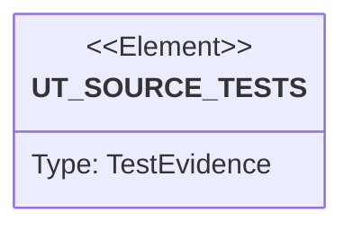

# Semantic TD: agentic-workflow/generate/gen/rust

## Schema
<!-- type: schema lang: yaml -->

```yaml
semantic_domain:
  key: "agentic-workflow/generate/gen/rust"
  source_group: "projects/agentic-workflow/src/generate/gen/rust"
  coverage_kind: semantic
  evidence:
    source_units:
      - path: "projects/agentic-workflow/src/generate/gen/rust/mamba_binding.rs"
        language: "rust"
        ownership_state: "codegen"
        generator_primitives: ["config_surface", "data_model", "service_method"]
        symbols:
          - name: "TPL_CONSTRUCTOR"
            kind: "constant"
            public: false
          - name: "TPL_EXTERN_SHIM"
            kind: "constant"
            public: false
          - name: "TPL_REGISTER"
            kind: "constant"
            public: false
          - name: "TPL_ATTRIBUTE_GETTER"
            kind: "constant"
            public: false
          - name: "MambaBindingGenOutput"
            kind: "struct"
            public: true
          - name: "generate_mamba_binding"
            kind: "function"
            public: true
          - name: "generate_mamba_binding_with_provenance"
            kind: "function"
            public: true
          - name: "trim_trailing"
            kind: "function"
            public: false
          - name: "template_engine"
            kind: "function"
            public: false
          - name: "BindingContext"
            kind: "struct"
            public: false
          - name: "AttributeContext"
            kind: "struct"
            public: false
          - name: "ArgContext"
            kind: "struct"
            public: false
          - name: "ValidationContext"
            kind: "struct"
            public: false
          - name: "build"
            kind: "function"
            public: false
          - name: "parse_attributes"
            kind: "function"
            public: false
          - name: "to_snake_case"
            kind: "function"
            public: false
          - name: "parse_field_nullability"
            kind: "function"
            public: false
          - name: "parse_args"
            kind: "function"
            public: false
          - name: "primitive_reader_expr"
            kind: "function"
            public: false
          - name: "has_primitive_from_mb_value"
            kind: "function"
            public: false
          - name: "parse_validations"
            kind: "function"
            public: false
          - name: "yaml_literal"
            kind: "function"
            public: false
          - name: "mb_to_rust_default"
            kind: "function"
            public: false
          - name: "strip_option"
            kind: "function"
            public: false
          - name: "tests"
            kind: "module"
            public: false
        source_evidence_node:
          layer: "backend"
          ecosystem: "rust"
          role: "source"
          section_type: "schema"
          domain: "projects/agentic-workflow/src/generate/gen/rust"
      - path: "projects/agentic-workflow/src/generate/gen/rust/logic.rs"
        language: "rust"
        ownership_state: "codegen"
        generator_primitives: ["data_model", "service_method"]
        symbols:
          - name: "LoopInfo"
            kind: "struct"
            public: false
          - name: "find_loop_heads"
            kind: "function"
            public: false
          - name: "reachable_forward"
            kind: "function"
            public: false
          - name: "reachable_backward"
            kind: "function"
            public: false
          - name: "scc_members"
            kind: "function"
            public: false
          - name: "detect_loops"
            kind: "function"
            public: false
          - name: "emit_loop_opening"
            kind: "function"
            public: false
          - name: "emit_primitive_for_node"
            kind: "function"
            public: false
          - name: "LogicGenOutput"
            kind: "struct"
            public: true
          - name: "generate_logic"
            kind: "function"
            public: true
          - name: "tests"
            kind: "module"
            public: false
          - name: "generate_body"
            kind: "function"
            public: false
          - name: "label_to_condition"
            kind: "function"
            public: false
          - name: "label_to_terminal"
            kind: "function"
            public: false
          - name: "label_to_process"
            kind: "function"
            public: false
          - name: "escape_todo_msg"
            kind: "function"
            public: false
          - name: "contains_rust_comparison"
            kind: "function"
            public: false
          - name: "snake_case"
            kind: "function"
            public: false
          - name: "emit_node"
            kind: "function"
            public: false
          - name: "emit_edge_target"
            kind: "function"
            public: false
        source_evidence_node:
          layer: "backend"
          ecosystem: "rust"
          role: "source"
          section_type: "schema"
          domain: "projects/agentic-workflow/src/generate/gen/rust"
      - path: "projects/agentic-workflow/src/generate/gen/rust/state_machine.rs"
        language: "rust"
        ownership_state: "codegen"
        generator_primitives: ["data_model", "service_method"]
        symbols:
          - name: "StateMachineGenOutput"
            kind: "struct"
            public: true
          - name: "generate_state_machine"
            kind: "function"
            public: true
          - name: "snake_to_pascal"
            kind: "function"
            public: true
          - name: "tests"
            kind: "module"
            public: false
        source_evidence_node:
          layer: "backend"
          ecosystem: "rust"
          role: "source"
          section_type: "schema"
          domain: "projects/agentic-workflow/src/generate/gen/rust"
      - path: "projects/agentic-workflow/src/generate/gen/rust/rpc_api.rs"
        language: "rust"
        ownership_state: "codegen"
        generator_primitives: ["data_model", "service_method"]
        symbols:
          - name: "RpcApiGenOutput"
            kind: "struct"
            public: true
          - name: "generate_rpc_api"
            kind: "function"
            public: true
          - name: "json_schema_to_rust_type"
            kind: "function"
            public: false
        source_evidence_node:
          layer: "backend"
          ecosystem: "rust"
          role: "source"
          section_type: "schema"
          domain: "projects/agentic-workflow/src/generate/gen/rust"
      - path: "projects/agentic-workflow/src/generate/gen/rust/readme.rs"
        language: "rust"
        ownership_state: "codegen"
        generator_primitives: ["config_surface", "data_model", "service_method"]
        symbols:
          - name: "TPL_SYMBOL_TABLE"
            kind: "constant"
            public: false
          - name: "SymbolEntry"
            kind: "struct"
            public: true
          - name: "ReadmeGenOutput"
            kind: "struct"
            public: true
          - name: "generate_readme_symbols"
            kind: "function"
            public: true
          - name: "collect_symbols"
            kind: "function"
            public: false
          - name: "extract_mamba_symbols"
            kind: "function"
            public: false
          - name: "tests"
            kind: "module"
            public: false
        source_evidence_node:
          layer: "backend"
          ecosystem: "rust"
          role: "source"
          section_type: "schema"
          domain: "projects/agentic-workflow/src/generate/gen/rust"
      - path: "projects/agentic-workflow/src/generate/gen/rust/config.rs"
        language: "rust"
        ownership_state: "codegen"
        generator_primitives: ["data_model", "service_method"]
        symbols:
          - name: "ConfigGenOutput"
            kind: "struct"
            public: true
          - name: "generate_config"
            kind: "function"
            public: true
          - name: "infer_config_type"
            kind: "function"
            public: false
          - name: "build_default_expr"
            kind: "function"
            public: false
          - name: "capitalize"
            kind: "function"
            public: false
          - name: "to_pascal_case"
            kind: "function"
            public: false
          - name: "to_snake_case"
            kind: "function"
            public: false
          - name: "tests"
            kind: "module"
            public: false
        source_evidence_node:
          layer: "backend"
          ecosystem: "rust"
          role: "source"
          section_type: "schema"
          domain: "projects/agentic-workflow/src/generate/gen/rust"
      - path: "projects/agentic-workflow/src/generate/gen/rust/test_plan.rs"
        language: "rust"
        ownership_state: "codegen"
        generator_primitives: ["data_model", "service_method", "test_case"]
        symbols:
          - name: "TestElement"
            kind: "struct"
            public: true
          - name: "ScenarioRef"
            kind: "struct"
            public: true
          - name: "TestPlanGenOutput"
            kind: "struct"
            public: true
          - name: "MarkdownTest"
            kind: "struct"
            public: true
          - name: "MarkdownTestPlanOutput"
            kind: "struct"
            public: true
          - name: "generate_test_plan"
            kind: "function"
            public: true
          - name: "parse_test_elements"
            kind: "function"
            public: false
          - name: "build_verifies_map"
            kind: "function"
            public: false
          - name: "to_test_fn_name"
            kind: "function"
            public: false
          - name: "generate_test_plan_from_markdown"
            kind: "function"
            public: true
          - name: "generate_unit_tests_from_mermaid"
            kind: "function"
            public: true
          - name: "parse_markdown_test_plan"
            kind: "function"
            public: false
          - name: "tests"
            kind: "module"
            public: false
        source_evidence_node:
          layer: "backend"
          ecosystem: "rust"
          role: "test"
          section_type: "unit-test"
          domain: "projects/agentic-workflow/src/generate/gen/rust"
      - path: "projects/agentic-workflow/src/generate/gen/rust/requirement.rs"
        language: "rust"
        ownership_state: "codegen"
        generator_primitives: ["data_model", "service_method"]
        symbols:
          - name: "ImplAtLocation"
            kind: "struct"
            public: true
          - name: "RequirementAnnotation"
            kind: "struct"
            public: true
          - name: "RequirementAnnotationOutput"
            kind: "struct"
            public: true
          - name: "parse_requirement_annotations"
            kind: "function"
            public: true
          - name: "generate_requirement_annotations"
            kind: "function"
            public: true
          - name: "tests"
            kind: "module"
            public: false
        source_evidence_node:
          layer: "backend"
          ecosystem: "rust"
          role: "source"
          section_type: "schema"
          domain: "projects/agentic-workflow/src/generate/gen/rust"
      - path: "projects/agentic-workflow/src/generate/gen/rust/manifest.rs"
        language: "rust"
        ownership_state: "codegen"
        generator_primitives: ["config_surface", "data_model", "service_method"]
        symbols:
          - name: "TPL_CARGO_DEPS"
            kind: "constant"
            public: false
          - name: "ManifestGenOutput"
            kind: "struct"
            public: true
          - name: "generate_manifest"
            kind: "function"
            public: true
          - name: "ManifestContext"
            kind: "struct"
            public: false
          - name: "DependencyContext"
            kind: "struct"
            public: false
          - name: "parse_dependencies"
            kind: "function"
            public: false
          - name: "tests"
            kind: "module"
            public: false
        source_evidence_node:
          layer: "backend"
          ecosystem: "rust"
          role: "source"
          section_type: "schema"
          domain: "projects/agentic-workflow/src/generate/gen/rust"
      - path: "projects/agentic-workflow/src/generate/gen/rust/interaction.rs"
        language: "rust"
        ownership_state: "codegen"
        generator_primitives: ["data_model", "service_method"]
        symbols:
          - name: "InteractionGenOutput"
            kind: "struct"
            public: true
          - name: "generate_interaction"
            kind: "function"
            public: true
          - name: "tests"
            kind: "module"
            public: false
        source_evidence_node:
          layer: "backend"
          ecosystem: "rust"
          role: "source"
          section_type: "schema"
          domain: "projects/agentic-workflow/src/generate/gen/rust"
      - path: "projects/agentic-workflow/src/generate/gen/rust/mod.rs"
        language: "rust"
        ownership_state: "codegen"
        generator_primitives: ["source_unit"]
        symbols:
          - name: "cli"
            kind: "module"
            public: true
          - name: "config"
            kind: "module"
            public: true
          - name: "db_model"
            kind: "module"
            public: true
          - name: "mamba_binding"
            kind: "module"
            public: true
          - name: "manifest"
            kind: "module"
            public: true
          - name: "readme"
            kind: "module"
            public: true
          - name: "rpc_api"
            kind: "module"
            public: true
          - name: "schema"
            kind: "module"
            public: true
          - name: "tests_gen"
            kind: "module"
            public: true
          - name: "interaction"
            kind: "module"
            public: true
          - name: "logic"
            kind: "module"
            public: true
          - name: "state_machine"
            kind: "module"
            public: true
          - name: "logic_emitter"
            kind: "module"
            public: true
          - name: "requirement"
            kind: "module"
            public: true
          - name: "scenario"
            kind: "module"
            public: true
          - name: "test_plan"
            kind: "module"
            public: true
        source_evidence_node:
          layer: "backend"
          ecosystem: "rust"
          role: "source"
          section_type: "schema"
          domain: "projects/agentic-workflow/src/generate/gen/rust"
      - path: "projects/agentic-workflow/src/generate/gen/rust/schema.rs"
        language: "rust"
        ownership_state: "codegen"
        generator_primitives: ["data_model", "service_method"]
        symbols:
          - name: "SchemaGenOutput"
            kind: "struct"
            public: true
          - name: "generate_schema"
            kind: "function"
            public: true
          - name: "generate_schema_with_provenance"
            kind: "function"
            public: true
          - name: "infer_rust_type_with_nullable"
            kind: "function"
            public: false
          - name: "infer_rust_type"
            kind: "function"
            public: false
          - name: "to_pascal_case"
            kind: "function"
            public: false
          - name: "to_snake_case"
            kind: "function"
            public: false
          - name: "to_rust_field_name"
            kind: "function"
            public: false
          - name: "is_rust_keyword"
            kind: "function"
            public: false
          - name: "struct_has_serde_derive"
            kind: "function"
            public: false
          - name: "is_serde_derive_name"
            kind: "function"
            public: false
          - name: "resolve_serde_rename_all"
            kind: "function"
            public: false
          - name: "resolve_explicit_derive"
            kind: "function"
            public: false
          - name: "x_methods_declares"
            kind: "function"
            public: false
          - name: "emit_x_impls"
            kind: "function"
            public: false
          - name: "emit_constructor"
            kind: "function"
            public: false
          - name: "emit_builder"
            kind: "function"
            public: false
          - name: "emit_method"
            kind: "function"
            public: false
          - name: "emit_trait_impls"
            kind: "function"
            public: false
          - name: "emit_display_trait_impl"
            kind: "function"
            public: false
          - name: "emit_fromstr_trait_impl"
            kind: "function"
            public: false
          - name: "emit_default_trait_impl"
            kind: "function"
            public: false
          - name: "body_uses_short_serde"
            kind: "function"
            public: false
          - name: "body_uses_short_token"
            kind: "function"
            public: false
          - name: "escape_string_literal"
            kind: "function"
            public: false
          - name: "is_string_enum_schema"
            kind: "function"
            public: false
          - name: "emit_enum_variants"
            kind: "function"
            public: false
          - name: "has_x_rust_enum_variants"
            kind: "function"
            public: false
          - name: "has_payload_variants"
            kind: "function"
            public: false
          - name: "generate_rust_enum"
            kind: "function"
            public: false
          - name: "tests"
            kind: "module"
            public: false
        source_evidence_node:
          layer: "backend"
          ecosystem: "rust"
          role: "source"
          section_type: "schema"
          domain: "projects/agentic-workflow/src/generate/gen/rust"
      - path: "projects/agentic-workflow/src/generate/gen/rust/db_model.rs"
        language: "rust"
        ownership_state: "codegen"
        generator_primitives: ["data_model", "service_method"]
        symbols:
          - name: "DbModelGenOutput"
            kind: "struct"
            public: true
          - name: "generate_db_model"
            kind: "function"
            public: true
          - name: "to_pascal_case"
            kind: "function"
            public: false
          - name: "to_snake_case"
            kind: "function"
            public: false
        source_evidence_node:
          layer: "backend"
          ecosystem: "rust"
          role: "source"
          section_type: "schema"
          domain: "projects/agentic-workflow/src/generate/gen/rust"
      - path: "projects/agentic-workflow/src/generate/gen/rust/logic_emitter.rs"
        language: "rust"
        ownership_state: "codegen"
        generator_primitives: ["data_model", "enum_model", "service_method"]
        symbols:
          - name: "LogicNodeKind"
            kind: "enum"
            public: true
          - name: "LogicNode"
            kind: "struct"
            public: true
          - name: "default"
            kind: "function"
            public: false
          - name: "LogicEdgeKind"
            kind: "enum"
            public: true
          - name: "default"
            kind: "function"
            public: false
          - name: "LogicEdge"
            kind: "struct"
            public: true
          - name: "LogicSpec"
            kind: "struct"
            public: true
          - name: "EmitError"
            kind: "enum"
            public: true
          - name: "fmt"
            kind: "function"
            public: false
          - name: "EmitOutput"
            kind: "struct"
            public: true
          - name: "emit"
            kind: "function"
            public: true
          - name: "resolve_entry"
            kind: "function"
            public: false
          - name: "walk"
            kind: "function"
            public: false
          - name: "sequential_successor"
            kind: "function"
            public: false
          - name: "body_target"
            kind: "function"
            public: false
          - name: "after_target"
            kind: "function"
            public: false
          - name: "parse_yaml"
            kind: "function"
            public: true
          - name: "tests"
            kind: "module"
            public: false
        source_evidence_node:
          layer: "backend"
          ecosystem: "rust"
          role: "source"
          section_type: "schema"
          domain: "projects/agentic-workflow/src/generate/gen/rust"
      - path: "projects/agentic-workflow/src/generate/gen/rust/tests.rs"
        language: "rust"
        ownership_state: "codegen"
        generator_primitives: ["config_surface", "data_model", "service_method"]
        symbols:
          - name: "TPL_TEST_FILE"
            kind: "constant"
            public: false
          - name: "TestsGenOutput"
            kind: "struct"
            public: true
          - name: "generate_tests"
            kind: "function"
            public: true
          - name: "generate_e2e_tests"
            kind: "function"
            public: true
          - name: "extract_unit_test_yaml"
            kind: "function"
            public: false
          - name: "extract_e2e_test_yaml"
            kind: "function"
            public: false
          - name: "TestsContext"
            kind: "struct"
            public: false
          - name: "TestCase"
            kind: "struct"
            public: false
          - name: "ModuleConfig"
            kind: "struct"
            public: false
          - name: "parse_file_preamble"
            kind: "function"
            public: false
          - name: "parse_preamble"
            kind: "function"
            public: false
          - name: "parse_postamble"
            kind: "function"
            public: false
          - name: "parse_module"
            kind: "function"
            public: false
          - name: "parse_imports"
            kind: "function"
            public: false
          - name: "parse_tests"
            kind: "function"
            public: false
          - name: "parse_e2e_tests"
            kind: "function"
            public: false
          - name: "ArtifactAssertion"
            kind: "struct"
            public: false
          - name: "to_rust_assertions"
            kind: "function"
            public: false
          - name: "parse_artifact_assertions"
            kind: "function"
            public: false
          - name: "string_seq"
            kind: "function"
            public: false
          - name: "rust_string_literal"
            kind: "function"
            public: false
          - name: "indent_rust_block_with"
            kind: "function"
            public: false
          - name: "tests"
            kind: "module"
            public: false
        source_evidence_node:
          layer: "backend"
          ecosystem: "rust"
          role: "source"
          section_type: "schema"
          domain: "projects/agentic-workflow/src/generate/gen/rust"
      - path: "projects/agentic-workflow/src/generate/gen/rust/scenario.rs"
        language: "rust"
        ownership_state: "codegen"
        generator_primitives: ["data_model", "service_method"]
        symbols:
          - name: "ScenarioDef"
            kind: "struct"
            public: true
          - name: "ScenarioGenOutput"
            kind: "struct"
            public: true
          - name: "generate_scenarios"
            kind: "function"
            public: true
          - name: "parse_scenarios"
            kind: "function"
            public: true
          - name: "parse_scenario_item"
            kind: "function"
            public: false
          - name: "parse_verifies"
            kind: "function"
            public: false
          - name: "to_scenario_fn_name"
            kind: "function"
            public: false
          - name: "tests"
            kind: "module"
            public: false
        source_evidence_node:
          layer: "backend"
          ecosystem: "rust"
          role: "source"
          section_type: "schema"
          domain: "projects/agentic-workflow/src/generate/gen/rust"
      - path: "projects/agentic-workflow/src/generate/gen/rust/cli.rs"
        language: "rust"
        ownership_state: "codegen"
        generator_primitives: ["data_model", "service_method"]
        symbols:
          - name: "CliGenOutput"
            kind: "struct"
            public: true
          - name: "CliArgDef"
            kind: "struct"
            public: true
          - name: "CliCommandDef"
            kind: "struct"
            public: true
          - name: "generate_cli"
            kind: "function"
            public: true
          - name: "generate_command_variant"
            kind: "function"
            public: false
          - name: "parse_commands"
            kind: "function"
            public: false
          - name: "parse_command"
            kind: "function"
            public: false
          - name: "parse_arg"
            kind: "function"
            public: false
          - name: "to_pascal_case"
            kind: "function"
            public: false
          - name: "to_snake_case"
            kind: "function"
            public: false
          - name: "tests"
            kind: "module"
            public: false
        source_evidence_node:
          layer: "backend"
          ecosystem: "rust"
          role: "source"
          section_type: "schema"
          domain: "projects/agentic-workflow/src/generate/gen/rust"
```

## Unit Test
<!-- type: unit-test lang: mermaid -->



## Changes
<!-- type: changes lang: yaml -->

```yaml
coverage_kind: semantic
changes:
  - path: "projects/agentic-workflow/src/generate/gen/rust/mamba_binding.rs"
    action: modify
    section: schema
    description: |
      Existing source behavior is covered by this feature/domain semantic TD.
    impl_mode: hand-written
  - path: "projects/agentic-workflow/src/generate/gen/rust/logic.rs"
    action: modify
    section: schema
    description: |
      Existing source behavior is covered by this feature/domain semantic TD.
    impl_mode: hand-written
  - path: "projects/agentic-workflow/src/generate/gen/rust/state_machine.rs"
    action: modify
    section: schema
    description: |
      Existing source behavior is covered by this feature/domain semantic TD.
    impl_mode: hand-written
  - path: "projects/agentic-workflow/src/generate/gen/rust/rpc_api.rs"
    action: modify
    section: schema
    description: |
      Existing source behavior is covered by this feature/domain semantic TD.
    impl_mode: hand-written
  - path: "projects/agentic-workflow/src/generate/gen/rust/readme.rs"
    action: modify
    section: schema
    description: |
      Existing source behavior is covered by this feature/domain semantic TD.
    impl_mode: hand-written
  - path: "projects/agentic-workflow/src/generate/gen/rust/config.rs"
    action: modify
    section: schema
    description: |
      Existing source behavior is covered by this feature/domain semantic TD.
    impl_mode: hand-written
  - path: "projects/agentic-workflow/src/generate/gen/rust/test_plan.rs"
    action: modify
    section: schema
    description: |
      Existing source behavior is covered by this feature/domain semantic TD.
    impl_mode: hand-written
  - path: "projects/agentic-workflow/src/generate/gen/rust/requirement.rs"
    action: modify
    section: schema
    description: |
      Existing source behavior is covered by this feature/domain semantic TD.
    impl_mode: hand-written
  - path: "projects/agentic-workflow/src/generate/gen/rust/manifest.rs"
    action: modify
    section: schema
    description: |
      Existing source behavior is covered by this feature/domain semantic TD.
    impl_mode: hand-written
  - path: "projects/agentic-workflow/src/generate/gen/rust/interaction.rs"
    action: modify
    section: schema
    description: |
      Existing source behavior is covered by this feature/domain semantic TD.
    impl_mode: hand-written
  - path: "projects/agentic-workflow/src/generate/gen/rust/mod.rs"
    action: modify
    section: schema
    description: |
      Existing source behavior is covered by this feature/domain semantic TD.
    impl_mode: hand-written
  - path: "projects/agentic-workflow/src/generate/gen/rust/schema.rs"
    action: modify
    section: schema
    description: |
      Existing source behavior is covered by this feature/domain semantic TD.
    impl_mode: hand-written
  - path: "projects/agentic-workflow/src/generate/gen/rust/db_model.rs"
    action: modify
    section: schema
    description: |
      Existing source behavior is covered by this feature/domain semantic TD.
    impl_mode: hand-written
  - path: "projects/agentic-workflow/src/generate/gen/rust/logic_emitter.rs"
    action: modify
    section: schema
    description: |
      Existing source behavior is covered by this feature/domain semantic TD.
    impl_mode: hand-written
  - path: "projects/agentic-workflow/src/generate/gen/rust/tests.rs"
    action: modify
    section: schema
    description: |
      Existing source behavior is covered by this feature/domain semantic TD.
    impl_mode: hand-written
  - path: "projects/agentic-workflow/src/generate/gen/rust/scenario.rs"
    action: modify
    section: schema
    description: |
      Existing source behavior is covered by this feature/domain semantic TD.
    impl_mode: hand-written
  - path: "projects/agentic-workflow/src/generate/gen/rust/cli.rs"
    action: modify
    section: schema
    description: |
      Existing source behavior is covered by this feature/domain semantic TD.
    impl_mode: hand-written
  - action: annotate
    section: unit-test
    impl_mode: hand-written
    description: "Traceability metadata edge for the unit-test section."

```
