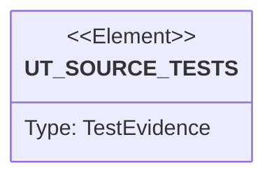

# Semantic TD: agentic-workflow/generate/generators

## Schema
<!-- type: schema lang: yaml -->

```yaml
semantic_domain:
  key: "agentic-workflow/generate/generators"
  source_group: "projects/agentic-workflow/src/generate/generators"
  coverage_kind: semantic
  evidence:
    source_units:
      - path: "projects/agentic-workflow/src/generate/generators/module_facade.rs"
        language: "rust"
        ownership_state: "codegen"
        generator_primitives: ["data_model", "service_method"]
        symbols:
          - name: "ExportEntry"
            kind: "struct"
            public: true
          - name: "ModuleFacadeOutput"
            kind: "struct"
            public: true
          - name: "ModuleFacadeSpec"
            kind: "struct"
            public: true
          - name: "tests"
            kind: "module"
            public: false
          - name: "run_module_facade"
            kind: "function"
            public: true
        source_evidence_node:
          layer: "backend"
          ecosystem: "rust"
          role: "source"
          section_type: "schema"
          domain: "projects/agentic-workflow/src/generate/generators"
      - path: "projects/agentic-workflow/src/generate/generators/fastapi.rs"
        language: "rust"
        ownership_state: "codegen"
        generator_primitives: ["data_model", "service_method"]
        symbols:
          - name: "FastAPIGenerator"
            kind: "struct"
            public: true
          - name: "new"
            kind: "function"
            public: true
          - name: "default"
            kind: "function"
            public: false
          - name: "FastAPIContext"
            kind: "struct"
            public: false
          - name: "ModelContext"
            kind: "struct"
            public: false
          - name: "FieldContext"
            kind: "struct"
            public: false
          - name: "RouteContext"
            kind: "struct"
            public: false
          - name: "template_dir"
            kind: "function"
            public: false
          - name: "generate"
            kind: "function"
            public: false
          - name: "build_context"
            kind: "function"
            public: false
          - name: "extract_model"
            kind: "function"
            public: false
          - name: "schema_to_python_type"
            kind: "function"
            public: false
          - name: "to_pascal_case"
            kind: "function"
            public: false
          - name: "to_snake_case"
            kind: "function"
            public: false
          - name: "generate_app_py"
            kind: "function"
            public: false
          - name: "generate_models_py"
            kind: "function"
            public: false
          - name: "generate_schemas_py"
            kind: "function"
            public: false
          - name: "generate_routes_py"
            kind: "function"
            public: false
          - name: "generate_requirements_txt"
            kind: "function"
            public: false
          - name: "tests"
            kind: "module"
            public: false
        source_evidence_node:
          layer: "backend"
          ecosystem: "rust"
          role: "source"
          section_type: "schema"
          domain: "projects/agentic-workflow/src/generate/generators"
      - path: "projects/agentic-workflow/src/generate/generators/trait_impl.rs"
        language: "rust"
        ownership_state: "codegen"
        generator_primitives: ["data_model", "service_method"]
        symbols:
          - name: "MatchArm"
            kind: "struct"
            public: true
          - name: "TraitImplOutput"
            kind: "struct"
            public: true
          - name: "TraitImplSpec"
            kind: "struct"
            public: true
          - name: "TraitMethod"
            kind: "struct"
            public: true
          - name: "run_trait_impl"
            kind: "function"
            public: true
          - name: "tests"
            kind: "module"
            public: false
        source_evidence_node:
          layer: "backend"
          ecosystem: "rust"
          role: "source"
          section_type: "schema"
          domain: "projects/agentic-workflow/src/generate/generators"
      - path: "projects/agentic-workflow/src/generate/generators/state_machine_gen.rs"
        language: "rust"
        ownership_state: "codegen"
        generator_primitives: ["data_model", "service_method"]
        symbols:
          - name: "StateMachineGenerator"
            kind: "struct"
            public: true
          - name: "new"
            kind: "function"
            public: true
          - name: "default"
            kind: "function"
            public: false
          - name: "can_generate"
            kind: "function"
            public: false
          - name: "template_dir"
            kind: "function"
            public: false
          - name: "generate_from_ir"
            kind: "function"
            public: false
          - name: "to_pascal_case"
            kind: "function"
            public: false
          - name: "to_upper_snake"
            kind: "function"
            public: false
          - name: "to_snake"
            kind: "function"
            public: false
          - name: "generate_state_machine_python"
            kind: "function"
            public: false
          - name: "tests"
            kind: "module"
            public: false
        source_evidence_node:
          layer: "backend"
          ecosystem: "rust"
          role: "source"
          section_type: "schema"
          domain: "projects/agentic-workflow/src/generate/generators"
      - path: "projects/agentic-workflow/src/generate/generators/deploy.rs"
        language: "rust"
        ownership_state: "codegen"
        generator_primitives: ["data_model", "service_method"]
        symbols:
          - name: "DeployGenerator"
            kind: "struct"
            public: true
          - name: "new"
            kind: "function"
            public: true
          - name: "default"
            kind: "function"
            public: false
          - name: "DeployContext"
            kind: "struct"
            public: false
          - name: "EnvVarContext"
            kind: "struct"
            public: false
          - name: "can_generate"
            kind: "function"
            public: false
          - name: "template_dir"
            kind: "function"
            public: false
          - name: "generate_from_ir"
            kind: "function"
            public: false
          - name: "build_context"
            kind: "function"
            public: false
          - name: "env_var_context"
            kind: "function"
            public: false
          - name: "generate_deployment_yaml"
            kind: "function"
            public: false
          - name: "build_resources_block"
            kind: "function"
            public: false
          - name: "generate_service_yaml"
            kind: "function"
            public: false
          - name: "tests"
            kind: "module"
            public: false
        source_evidence_node:
          layer: "backend"
          ecosystem: "rust"
          role: "source"
          section_type: "schema"
          domain: "projects/agentic-workflow/src/generate/generators"
      - path: "projects/agentic-workflow/src/generate/generators/test_generator.rs"
        language: "rust"
        ownership_state: "codegen"
        generator_primitives: ["data_model", "enum_model", "service_method", "test_case"]
        symbols:
          - name: "CoverageIssue"
            kind: "struct"
            public: true
          - name: "TestGenError"
            kind: "enum"
            public: true
          - name: "TestGenResult"
            kind: "struct"
            public: true
          - name: "TestGenerator"
            kind: "struct"
            public: true
          - name: "new"
            kind: "function"
            public: true
          - name: "generate"
            kind: "function"
            public: true
          - name: "build_verifies_map"
            kind: "function"
            public: false
          - name: "build_satisfies_map"
            kind: "function"
            public: false
          - name: "build_derives_map"
            kind: "function"
            public: false
          - name: "check_coverage"
            kind: "function"
            public: false
          - name: "make_file_path"
            kind: "function"
            public: false
          - name: "render"
            kind: "function"
            public: false
          - name: "render_test_class"
            kind: "function"
            public: false
          - name: "render_test_method"
            kind: "function"
            public: false
          - name: "make_class_name"
            kind: "function"
            public: false
          - name: "make_function_name"
            kind: "function"
            public: false
          - name: "docref_to_import"
            kind: "function"
            public: false
          - name: "risk_label"
            kind: "function"
            public: false
          - name: "verification_method_str"
            kind: "function"
            public: false
          - name: "tests"
            kind: "module"
            public: false
        source_evidence_node:
          layer: "backend"
          ecosystem: "rust"
          role: "test"
          section_type: "unit-test"
          domain: "projects/agentic-workflow/src/generate/generators"
      - path: "projects/agentic-workflow/src/generate/generators/sequence_plus_gen.rs"
        language: "rust"
        ownership_state: "codegen"
        generator_primitives: ["data_model", "enum_model", "service_method"]
        symbols:
          - name: "SequencePlusGenerator"
            kind: "struct"
            public: true
          - name: "new"
            kind: "function"
            public: true
          - name: "default"
            kind: "function"
            public: false
          - name: "can_generate"
            kind: "function"
            public: false
          - name: "template_dir"
            kind: "function"
            public: false
          - name: "generate_from_ir"
            kind: "function"
            public: false
          - name: "to_snake"
            kind: "function"
            public: false
          - name: "generate_sequence_python"
            kind: "function"
            public: false
          - name: "Handler"
            kind: "struct"
            public: false
          - name: "name_pascal"
            kind: "function"
            public: false
          - name: "HandlerStep"
            kind: "enum"
            public: false
          - name: "group_into_handlers"
            kind: "function"
            public: false
          - name: "tests"
            kind: "module"
            public: false
        source_evidence_node:
          layer: "backend"
          ecosystem: "rust"
          role: "source"
          section_type: "schema"
          domain: "projects/agentic-workflow/src/generate/generators"
      - path: "projects/agentic-workflow/src/generate/generators/axum.rs"
        language: "rust"
        ownership_state: "codegen"
        generator_primitives: ["data_model", "service_method"]
        symbols:
          - name: "AxumGenerator"
            kind: "struct"
            public: true
          - name: "new"
            kind: "function"
            public: true
          - name: "default"
            kind: "function"
            public: false
          - name: "AxumContext"
            kind: "struct"
            public: false
          - name: "ModelContext"
            kind: "struct"
            public: false
          - name: "FieldContext"
            kind: "struct"
            public: false
          - name: "RouteContext"
            kind: "struct"
            public: false
          - name: "template_dir"
            kind: "function"
            public: false
          - name: "generate"
            kind: "function"
            public: false
          - name: "build_context"
            kind: "function"
            public: false
          - name: "extract_model"
            kind: "function"
            public: false
          - name: "schema_to_rust_type"
            kind: "function"
            public: false
          - name: "schema_to_rust_type_inner"
            kind: "function"
            public: false
          - name: "to_snake_case"
            kind: "function"
            public: false
          - name: "to_pascal_case"
            kind: "function"
            public: false
          - name: "generate_inline"
            kind: "function"
            public: false
          - name: "generate_main_rs"
            kind: "function"
            public: false
          - name: "generate_lib_rs"
            kind: "function"
            public: false
          - name: "generate_models_rs"
            kind: "function"
            public: false
          - name: "generate_handlers_rs"
            kind: "function"
            public: false
          - name: "generate_cargo_toml"
            kind: "function"
            public: false
          - name: "tests"
            kind: "module"
            public: false
        source_evidence_node:
          layer: "backend"
          ecosystem: "rust"
          role: "source"
          section_type: "schema"
          domain: "projects/agentic-workflow/src/generate/generators"
      - path: "projects/agentic-workflow/src/generate/generators/react.rs"
        language: "rust"
        ownership_state: "codegen"
        generator_primitives: ["data_model", "service_method"]
        symbols:
          - name: "ReactGenerator"
            kind: "struct"
            public: true
          - name: "new"
            kind: "function"
            public: true
          - name: "default"
            kind: "function"
            public: false
          - name: "ReactContext"
            kind: "struct"
            public: false
          - name: "PropContext"
            kind: "struct"
            public: false
          - name: "can_generate"
            kind: "function"
            public: false
          - name: "template_dir"
            kind: "function"
            public: false
          - name: "generate_from_ir"
            kind: "function"
            public: false
          - name: "build_context"
            kind: "function"
            public: false
          - name: "prop_context"
            kind: "function"
            public: false
          - name: "render_jsx_body"
            kind: "function"
            public: false
          - name: "generate_component_tsx"
            kind: "function"
            public: false
          - name: "generate_types_ts"
            kind: "function"
            public: false
          - name: "generate_index_ts"
            kind: "function"
            public: false
          - name: "to_pascal_case"
            kind: "function"
            public: false
          - name: "tests"
            kind: "module"
            public: false
        source_evidence_node:
          layer: "backend"
          ecosystem: "rust"
          role: "source"
          section_type: "schema"
          domain: "projects/agentic-workflow/src/generate/generators"
      - path: "projects/agentic-workflow/src/generate/generators/mod.rs"
        language: "rust"
        ownership_state: "codegen"
        generator_primitives: ["source_unit"]
        symbols:
          - name: "axum"
            kind: "module"
            public: false
          - name: "cli_subcommand"
            kind: "module"
            public: true
          - name: "common"
            kind: "module"
            public: false
          - name: "deploy"
            kind: "module"
            public: false
          - name: "express"
            kind: "module"
            public: false
          - name: "fastapi"
            kind: "module"
            public: false
          - name: "flowchart_plus_gen"
            kind: "module"
            public: false
          - name: "logic_primitive_emitter"
            kind: "module"
            public: true
          - name: "module_facade"
            kind: "module"
            public: true
          - name: "primitive_registry"
            kind: "module"
            public: true
          - name: "quality_primitives"
            kind: "module"
            public: true
          - name: "react"
            kind: "module"
            public: false
          - name: "sequence_plus_gen"
            kind: "module"
            public: false
          - name: "state_machine_gen"
            kind: "module"
            public: false
          - name: "test_generator"
            kind: "module"
            public: false
          - name: "trait_impl"
            kind: "module"
            public: true
        source_evidence_node:
          layer: "backend"
          ecosystem: "rust"
          role: "source"
          section_type: "schema"
          domain: "projects/agentic-workflow/src/generate/generators"
      - path: "projects/agentic-workflow/src/generate/generators/quality_primitives.rs"
        language: "rust"
        ownership_state: "handwrite"
        generator_primitives: ["data_model", "enum_model", "service_method"]
        symbols:
          - name: "PrimitiveDialSupport"
            kind: "enum"
            public: true
          - name: "PrimitiveReviewSeverity"
            kind: "enum"
            public: true
          - name: "PrimitiveEvidenceKind"
            kind: "enum"
            public: true
          - name: "PrimitiveDialCompatibility"
            kind: "struct"
            public: true
          - name: "PrimitiveReviewCheck"
            kind: "struct"
            public: true
          - name: "PrimitiveEvidenceExample"
            kind: "struct"
            public: true
          - name: "QualityPrimitiveProfile"
            kind: "struct"
            public: true
          - name: "PrimitiveSelectionRequest"
            kind: "struct"
            public: true
          - name: "PrimitiveSelectionCitation"
            kind: "struct"
            public: true
          - name: "PrimitiveReviewFinding"
            kind: "struct"
            public: true
          - name: "default_quality_primitive_profiles"
            kind: "function"
            public: true
          - name: "find_quality_primitive_profile"
            kind: "function"
            public: true
          - name: "validate_quality_primitive_profiles"
            kind: "function"
            public: true
          - name: "explain_primitive_selection"
            kind: "function"
            public: true
          - name: "evaluate_primitive_review_checks"
            kind: "function"
            public: true
          - name: "dial"
            kind: "function"
            public: false
          - name: "review_check"
            kind: "function"
            public: false
          - name: "evidence"
            kind: "function"
            public: false
          - name: "strings"
            kind: "function"
            public: false
          - name: "require_text"
            kind: "function"
            public: false
          - name: "require_vec"
            kind: "function"
            public: false
          - name: "tests"
            kind: "module"
            public: false
        source_evidence_node:
          layer: "backend"
          ecosystem: "rust"
          role: "source"
          section_type: "schema"
          domain: "projects/agentic-workflow/src/generate/generators"
      - path: "projects/agentic-workflow/src/generate/generators/express.rs"
        language: "rust"
        ownership_state: "codegen"
        generator_primitives: ["data_model", "service_method"]
        symbols:
          - name: "ExpressGenerator"
            kind: "struct"
            public: true
          - name: "new"
            kind: "function"
            public: true
          - name: "default"
            kind: "function"
            public: false
          - name: "ExpressContext"
            kind: "struct"
            public: false
          - name: "ModelContext"
            kind: "struct"
            public: false
          - name: "FieldContext"
            kind: "struct"
            public: false
          - name: "RouteContext"
            kind: "struct"
            public: false
          - name: "template_dir"
            kind: "function"
            public: false
          - name: "generate"
            kind: "function"
            public: false
          - name: "build_context"
            kind: "function"
            public: false
          - name: "extract_model"
            kind: "function"
            public: false
          - name: "schema_to_ts_type"
            kind: "function"
            public: false
          - name: "generate_inline"
            kind: "function"
            public: false
          - name: "generate_index_ts"
            kind: "function"
            public: false
          - name: "generate_index_js"
            kind: "function"
            public: false
          - name: "generate_types_ts"
            kind: "function"
            public: false
          - name: "generate_package_json"
            kind: "function"
            public: false
          - name: "generate_tsconfig_json"
            kind: "function"
            public: false
          - name: "tests"
            kind: "module"
            public: false
        source_evidence_node:
          layer: "backend"
          ecosystem: "rust"
          role: "source"
          section_type: "schema"
          domain: "projects/agentic-workflow/src/generate/generators"
      - path: "projects/agentic-workflow/src/generate/generators/primitive_registry.rs"
        language: "rust"
        ownership_state: "codegen"
        generator_primitives: ["config_surface", "data_model", "service_method"]
        symbols:
          - name: "PrimitiveEntry"
            kind: "struct"
            public: true
          - name: "REGISTRY"
            kind: "constant"
            public: true
          - name: "lookup"
            kind: "function"
            public: true
          - name: "lookup_by_name"
            kind: "function"
            public: true
          - name: "substitute_template"
            kind: "function"
            public: true
          - name: "is_prose_section"
            kind: "function"
            public: true
          - name: "kind_to_name"
            kind: "function"
            public: true
          - name: "tests"
            kind: "module"
            public: false
        source_evidence_node:
          layer: "backend"
          ecosystem: "rust"
          role: "source"
          section_type: "schema"
          domain: "projects/agentic-workflow/src/generate/generators"
      - path: "projects/agentic-workflow/src/generate/generators/cli_subcommand.rs"
        language: "rust"
        ownership_state: "codegen"
        generator_primitives: ["data_model", "enum_model", "service_method"]
        symbols:
          - name: "CliArg"
            kind: "struct"
            public: true
          - name: "CliArgKind"
            kind: "enum"
            public: true
          - name: "CliCommand"
            kind: "struct"
            public: true
          - name: "CliEmitted"
            kind: "struct"
            public: true
          - name: "kebab_to_pascal"
            kind: "function"
            public: false
          - name: "kebab_to_snake"
            kind: "function"
            public: false
          - name: "resolve_field_type"
            kind: "function"
            public: false
          - name: "emit_cli_subcommand"
            kind: "function"
            public: true
          - name: "tests"
            kind: "module"
            public: false
        source_evidence_node:
          layer: "backend"
          ecosystem: "rust"
          role: "source"
          section_type: "schema"
          domain: "projects/agentic-workflow/src/generate/generators"
      - path: "projects/agentic-workflow/src/generate/generators/flowchart_plus_gen.rs"
        language: "rust"
        ownership_state: "codegen"
        generator_primitives: ["data_model", "service_method"]
        symbols:
          - name: "FlowchartPlusGenerator"
            kind: "struct"
            public: true
          - name: "new"
            kind: "function"
            public: true
          - name: "default"
            kind: "function"
            public: false
          - name: "can_generate"
            kind: "function"
            public: false
          - name: "template_dir"
            kind: "function"
            public: false
          - name: "generate_from_ir"
            kind: "function"
            public: false
          - name: "to_snake"
            kind: "function"
            public: false
          - name: "node_signature"
            kind: "function"
            public: false
          - name: "is_decision_node"
            kind: "function"
            public: false
          - name: "is_terminal_node"
            kind: "function"
            public: false
          - name: "generate_flowchart_python"
            kind: "function"
            public: false
          - name: "tests"
            kind: "module"
            public: false
        source_evidence_node:
          layer: "backend"
          ecosystem: "rust"
          role: "source"
          section_type: "schema"
          domain: "projects/agentic-workflow/src/generate/generators"
      - path: "projects/agentic-workflow/src/generate/generators/common.rs"
        language: "rust"
        ownership_state: "codegen"
        generator_primitives: ["data_model", "enum_model", "service_method"]
        symbols:
          - name: "FileStatus"
            kind: "enum"
            public: true
          - name: "GeneratedFile"
            kind: "struct"
            public: true
          - name: "GeneratorError"
            kind: "enum"
            public: true
          - name: "GeneratorSettings"
            kind: "struct"
            public: true
          - name: "default"
            kind: "function"
            public: false
          - name: "Manifest"
            kind: "struct"
            public: true
          - name: "OverwritePolicy"
            kind: "enum"
            public: true
          - name: "written"
            kind: "function"
            public: true
          - name: "skipped"
            kind: "function"
            public: true
          - name: "error"
            kind: "function"
            public: true
          - name: "new"
            kind: "function"
            public: true
          - name: "add"
            kind: "function"
            public: true
          - name: "written_count"
            kind: "function"
            public: true
          - name: "skipped_count"
            kind: "function"
            public: true
          - name: "error_count"
            kind: "function"
            public: true
        source_evidence_node:
          layer: "backend"
          ecosystem: "rust"
          role: "source"
          section_type: "schema"
          domain: "projects/agentic-workflow/src/generate/generators"
      - path: "projects/agentic-workflow/src/generate/generators/logic_primitive_emitter.rs"
        language: "rust"
        ownership_state: "codegen"
        generator_primitives: ["data_model", "service_method"]
        symbols:
          - name: "LogicPrimitiveEmitter"
            kind: "struct"
            public: true
          - name: "new"
            kind: "function"
            public: true
          - name: "default"
            kind: "function"
            public: false
          - name: "emit_flowchart"
            kind: "function"
            public: true
          - name: "topological_sort"
            kind: "function"
            public: false
          - name: "resolve_input_bindings"
            kind: "function"
            public: false
          - name: "emit_node"
            kind: "function"
            public: false
          - name: "wrap_function_body"
            kind: "function"
            public: false
          - name: "emit_decision_node"
            kind: "function"
            public: false
          - name: "emit_loop_node"
            kind: "function"
            public: false
          - name: "emit_primitive_node"
            kind: "function"
            public: false
          - name: "is_decision_node"
            kind: "function"
            public: false
          - name: "to_snake_case"
            kind: "function"
            public: false
          - name: "tests"
            kind: "module"
            public: false
        source_evidence_node:
          layer: "backend"
          ecosystem: "rust"
          role: "source"
          section_type: "schema"
          domain: "projects/agentic-workflow/src/generate/generators"
```

## Unit Test
<!-- type: unit-test lang: mermaid -->



## Changes
<!-- type: changes lang: yaml -->

```yaml
coverage_kind: semantic
changes:
  - path: "projects/agentic-workflow/src/generate/generators/module_facade.rs"
    action: modify
    section: schema
    description: |
      Existing source behavior is covered by this feature/domain semantic TD.
    impl_mode: hand-written
  - path: "projects/agentic-workflow/src/generate/generators/fastapi.rs"
    action: modify
    section: schema
    description: |
      Existing source behavior is covered by this feature/domain semantic TD.
    impl_mode: hand-written
  - path: "projects/agentic-workflow/src/generate/generators/trait_impl.rs"
    action: modify
    section: schema
    description: |
      Existing source behavior is covered by this feature/domain semantic TD.
    impl_mode: hand-written
  - path: "projects/agentic-workflow/src/generate/generators/state_machine_gen.rs"
    action: modify
    section: schema
    description: |
      Existing source behavior is covered by this feature/domain semantic TD.
    impl_mode: hand-written
  - path: "projects/agentic-workflow/src/generate/generators/deploy.rs"
    action: modify
    section: schema
    description: |
      Existing source behavior is covered by this feature/domain semantic TD.
    impl_mode: hand-written
  - path: "projects/agentic-workflow/src/generate/generators/test_generator.rs"
    action: modify
    section: schema
    description: |
      Existing source behavior is covered by this feature/domain semantic TD.
    impl_mode: hand-written
  - path: "projects/agentic-workflow/src/generate/generators/sequence_plus_gen.rs"
    action: modify
    section: schema
    description: |
      Existing source behavior is covered by this feature/domain semantic TD.
    impl_mode: hand-written
  - path: "projects/agentic-workflow/src/generate/generators/axum.rs"
    action: modify
    section: schema
    description: |
      Existing source behavior is covered by this feature/domain semantic TD.
    impl_mode: hand-written
  - path: "projects/agentic-workflow/src/generate/generators/react.rs"
    action: modify
    section: schema
    description: |
      Existing source behavior is covered by this feature/domain semantic TD.
    impl_mode: hand-written
  - path: "projects/agentic-workflow/src/generate/generators/mod.rs"
    action: modify
    section: schema
    description: |
      Existing source behavior is covered by this feature/domain semantic TD.
    impl_mode: hand-written
  - path: "projects/agentic-workflow/src/generate/generators/quality_primitives.rs"
    action: modify
    section: schema
    description: |
      Existing source behavior is covered by this feature/domain semantic TD.
    impl_mode: hand-written
  - path: "projects/agentic-workflow/src/generate/generators/express.rs"
    action: modify
    section: schema
    description: |
      Existing source behavior is covered by this feature/domain semantic TD.
    impl_mode: hand-written
  - path: "projects/agentic-workflow/src/generate/generators/primitive_registry.rs"
    action: modify
    section: schema
    description: |
      Existing source behavior is covered by this feature/domain semantic TD.
    impl_mode: hand-written
  - path: "projects/agentic-workflow/src/generate/generators/cli_subcommand.rs"
    action: modify
    section: schema
    description: |
      Existing source behavior is covered by this feature/domain semantic TD.
    impl_mode: hand-written
  - path: "projects/agentic-workflow/src/generate/generators/flowchart_plus_gen.rs"
    action: modify
    section: schema
    description: |
      Existing source behavior is covered by this feature/domain semantic TD.
    impl_mode: hand-written
  - path: "projects/agentic-workflow/src/generate/generators/common.rs"
    action: modify
    section: schema
    description: |
      Existing source behavior is covered by this feature/domain semantic TD.
    impl_mode: hand-written
  - path: "projects/agentic-workflow/src/generate/generators/logic_primitive_emitter.rs"
    action: modify
    section: schema
    description: |
      Existing source behavior is covered by this feature/domain semantic TD.
    impl_mode: hand-written
  - action: annotate
    section: unit-test
    impl_mode: hand-written
    description: "Traceability metadata edge for the unit-test section."

```
