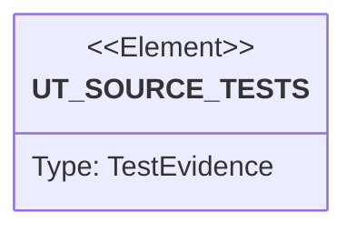

# Semantic TD: agentic-workflow/issues

## Schema
<!-- type: schema lang: yaml -->

```yaml
semantic_domain:
  key: "agentic-workflow/issues"
  source_group: "projects/agentic-workflow/src/issues"
  coverage_kind: semantic
  evidence:
    source_units:
      - path: "projects/agentic-workflow/src/issues/push_through.rs"
        language: "rust"
        ownership_state: "codegen"
        generator_primitives: ["service_method"]
        symbols:
          - name: "push_through"
            kind: "function"
            public: true
          - name: "parse_issue_file"
            kind: "function"
            public: false
          - name: "serialise_issue_file"
            kind: "function"
            public: false
          - name: "tests"
            kind: "module"
            public: false
        source_evidence_node:
          layer: "backend"
          ecosystem: "rust"
          role: "source"
          section_type: "schema"
          domain: "projects/agentic-workflow/src/issues"
      - path: "projects/agentic-workflow/src/issues/types.rs"
        language: "rust"
        ownership_state: "codegen"
        generator_primitives: ["data_model", "enum_model", "service_method"]
        symbols:
          - name: "Issue"
            kind: "struct"
            public: true
          - name: "IssueErrorCode"
            kind: "enum"
            public: true
          - name: "IssueFilter"
            kind: "struct"
            public: true
          - name: "IssuePatch"
            kind: "struct"
            public: true
          - name: "IssuePhase"
            kind: "enum"
            public: true
          - name: "IssueSection"
            kind: "enum"
            public: true
          - name: "IssueState"
            kind: "enum"
            public: true
          - name: "IssueType"
            kind: "enum"
            public: true
          - name: "ShipStatus"
            kind: "enum"
            public: true
          - name: "td_phase"
            kind: "module"
            public: true
          - name: "lifecycle_trailer"
            kind: "module"
            public: true
          - name: "as_str"
            kind: "function"
            public: true
          - name: "parse"
            kind: "function"
            public: true
          - name: "as_str"
            kind: "function"
            public: true
          - name: "heading"
            kind: "function"
            public: true
          - name: "tag_name"
            kind: "function"
            public: true
          - name: "parse"
            kind: "function"
            public: true
          - name: "as_str"
            kind: "function"
            public: true
          - name: "parse_loose"
            kind: "function"
            public: true
          - name: "as_str"
            kind: "function"
            public: true
          - name: "parse"
            kind: "function"
            public: true
          - name: "workflow_role"
            kind: "function"
            public: true
          - name: "from_labels"
            kind: "function"
            public: true
          - name: "matches"
            kind: "function"
            public: true
          - name: "apply"
            kind: "function"
            public: true
          - name: "as_str"
            kind: "function"
            public: true
          - name: "exit_code"
            kind: "function"
            public: true
          - name: "default_slug"
            kind: "function"
            public: true
          - name: "strip_title_prefix"
            kind: "function"
            public: false
          - name: "slugify"
            kind: "function"
            public: false
          - name: "tests"
            kind: "module"
            public: false
        source_evidence_node:
          layer: "backend"
          ecosystem: "rust"
          role: "source"
          section_type: "schema"
          domain: "projects/agentic-workflow/src/issues"
      - path: "projects/agentic-workflow/src/issues/next_id.rs"
        language: "rust"
        ownership_state: "codegen"
        generator_primitives: ["service_method"]
        symbols:
          - name: "allocate_next_id"
            kind: "function"
            public: true
          - name: "read_counter"
            kind: "function"
            public: true
          - name: "write_counter_atomic"
            kind: "function"
            public: false
          - name: "seed_counter"
            kind: "function"
            public: true
          - name: "tests"
            kind: "module"
            public: false
        source_evidence_node:
          layer: "backend"
          ecosystem: "rust"
          role: "source"
          section_type: "schema"
          domain: "projects/agentic-workflow/src/issues"
      - path: "projects/agentic-workflow/src/issues/backend.rs"
        language: "rust"
        ownership_state: "codegen"
        generator_primitives: ["data_model", "service_method"]
        symbols:
          - name: "sync"
            kind: "function"
            public: true
          - name: "SyncReport"
            kind: "struct"
            public: true
        source_evidence_node:
          layer: "backend"
          ecosystem: "rust"
          role: "source"
          section_type: "schema"
          domain: "projects/agentic-workflow/src/issues"
      - path: "projects/agentic-workflow/src/issues/labels.rs"
        language: "rust"
        ownership_state: "codegen"
        generator_primitives: ["config_surface", "data_model", "service_method"]
        symbols:
          - name: "PHASE_PREFIX"
            kind: "constant"
            public: true
          - name: "REVIEW_PREFIX"
            kind: "constant"
            public: true
          - name: "RETRY_PREFIX"
            kind: "constant"
            public: true
          - name: "SHIP_PREFIX"
            kind: "constant"
            public: true
          - name: "SHIP_COMMIT_PREFIX"
            kind: "constant"
            public: true
          - name: "FLAGGED_PREFIX"
            kind: "constant"
            public: true
          - name: "WORKFLOW_LOCK_LABEL"
            kind: "constant"
            public: true
          - name: "WORKFLOW_LOCK_OWNER_PREFIX"
            kind: "constant"
            public: true
          - name: "SLUG_PREFIX"
            kind: "constant"
            public: true
          - name: "MANAGED_PREFIXES"
            kind: "constant"
            public: true
          - name: "is_managed"
            kind: "function"
            public: true
          - name: "encode_labels"
            kind: "function"
            public: true
          - name: "DecodedCrrr"
            kind: "struct"
            public: true
          - name: "decode_labels"
            kind: "function"
            public: true
          - name: "diff_labels"
            kind: "function"
            public: true
          - name: "ship_status_str"
            kind: "function"
            public: false
          - name: "parse_ship_status"
            kind: "function"
            public: false
          - name: "tests"
            kind: "module"
            public: false
        source_evidence_node:
          layer: "backend"
          ecosystem: "rust"
          role: "source"
          section_type: "schema"
          domain: "projects/agentic-workflow/src/issues"
      - path: "projects/agentic-workflow/src/issues/slug.rs"
        language: "rust"
        ownership_state: "codegen"
        generator_primitives: ["data_model", "enum_model", "service_method"]
        symbols:
          - name: "BranchKind"
            kind: "enum"
            public: true
          - name: "as_prefix"
            kind: "function"
            public: true
          - name: "ResolvedId"
            kind: "enum"
            public: true
          - name: "id"
            kind: "function"
            public: true
          - name: "is_legacy"
            kind: "function"
            public: true
          - name: "SlugAliases"
            kind: "struct"
            public: true
          - name: "load"
            kind: "function"
            public: true
          - name: "save"
            kind: "function"
            public: true
          - name: "lookup"
            kind: "function"
            public: true
          - name: "insert"
            kind: "function"
            public: true
          - name: "build_canonical_slug"
            kind: "function"
            public: true
          - name: "parse_slug_input"
            kind: "function"
            public: true
          - name: "split_prefix_id"
            kind: "function"
            public: false
          - name: "parse_branch_name"
            kind: "function"
            public: true
          - name: "build_branch_name"
            kind: "function"
            public: true
          - name: "tests"
            kind: "module"
            public: false
        source_evidence_node:
          layer: "backend"
          ecosystem: "rust"
          role: "source"
          section_type: "schema"
          domain: "projects/agentic-workflow/src/issues"
      - path: "projects/agentic-workflow/src/issues/mod.rs"
        language: "rust"
        ownership_state: "codegen"
        generator_primitives: ["service_method"]
        symbols:
          - name: "backend"
            kind: "module"
            public: true
          - name: "backends"
            kind: "module"
            public: true
          - name: "labels"
            kind: "module"
            public: true
          - name: "next_id"
            kind: "module"
            public: true
          - name: "push_through"
            kind: "module"
            public: true
          - name: "slug"
            kind: "module"
            public: true
          - name: "types"
            kind: "module"
            public: true
          - name: "make_backend"
            kind: "function"
            public: true
          - name: "resolve_default_backend"
            kind: "function"
            public: true
          - name: "local_backend"
            kind: "function"
            public: true
          - name: "remote_read_cache_dir"
            kind: "function"
            public: true
          - name: "remote_read_cache_backend"
            kind: "function"
            public: true
          - name: "sanitize_cache_component"
            kind: "function"
            public: false
          - name: "github_backend"
            kind: "function"
            public: true
          - name: "_config_typecheck"
            kind: "function"
            public: false
          - name: "resolve_tests"
            kind: "module"
            public: false
        source_evidence_node:
          layer: "backend"
          ecosystem: "rust"
          role: "source"
          section_type: "schema"
          domain: "projects/agentic-workflow/src/issues"
```

## Unit Test
<!-- type: unit-test lang: mermaid -->



## Changes
<!-- type: changes lang: yaml -->

```yaml
coverage_kind: semantic
changes:
  - path: "projects/agentic-workflow/src/issues/push_through.rs"
    action: modify
    section: schema
    description: |
      Existing source behavior is covered by this feature/domain semantic TD.
    impl_mode: hand-written
  - path: "projects/agentic-workflow/src/issues/types.rs"
    action: modify
    section: schema
    description: |
      Existing source behavior is covered by this feature/domain semantic TD.
    impl_mode: hand-written
  - path: "projects/agentic-workflow/src/issues/next_id.rs"
    action: modify
    section: schema
    description: |
      Existing source behavior is covered by this feature/domain semantic TD.
    impl_mode: hand-written
  - path: "projects/agentic-workflow/src/issues/backend.rs"
    action: modify
    section: schema
    description: |
      Existing source behavior is covered by this feature/domain semantic TD.
    impl_mode: hand-written
  - path: "projects/agentic-workflow/src/issues/labels.rs"
    action: modify
    section: schema
    description: |
      Existing source behavior is covered by this feature/domain semantic TD.
    impl_mode: hand-written
  - path: "projects/agentic-workflow/src/issues/slug.rs"
    action: modify
    section: schema
    description: |
      Existing source behavior is covered by this feature/domain semantic TD.
    impl_mode: hand-written
  - path: "projects/agentic-workflow/src/issues/mod.rs"
    action: modify
    section: schema
    description: |
      Existing source behavior is covered by this feature/domain semantic TD.
    impl_mode: hand-written
  - action: annotate
    section: unit-test
    impl_mode: hand-written
    description: "Traceability metadata edge for the unit-test section."

```
