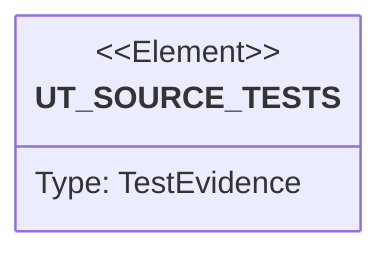

# Semantic TD: agentic-workflow/models

## Schema
<!-- type: schema lang: yaml -->

```yaml
semantic_domain:
  key: "agentic-workflow/models"
  source_group: "projects/agentic-workflow/src/models"
  coverage_kind: semantic
  evidence:
    source_units:
      - path: "projects/agentic-workflow/src/models/review.rs"
        language: "rust"
        ownership_state: "codegen"
        generator_primitives: ["data_model", "enum_model", "service_method"]
        symbols:
          - name: "IssueCategory"
            kind: "enum"
            public: true
          - name: "fmt"
            kind: "function"
            public: false
          - name: "ReviewIssue"
            kind: "struct"
            public: true
          - name: "ReviewVerdict"
            kind: "enum"
            public: true
          - name: "is_approved"
            kind: "function"
            public: true
          - name: "needs_refinement"
            kind: "function"
            public: true
          - name: "has_major_issues"
            kind: "function"
            public: true
          - name: "fmt"
            kind: "function"
            public: false
        source_evidence_node:
          layer: "backend"
          ecosystem: "rust"
          role: "source"
          section_type: "schema"
          domain: "projects/agentic-workflow/src/models"
      - path: "projects/agentic-workflow/src/models/task_graph.rs"
        language: "rust"
        ownership_state: "codegen"
        generator_primitives: ["data_model", "service_method"]
        symbols:
          - name: "TaskGraph"
            kind: "struct"
            public: true
          - name: "Layer"
            kind: "struct"
            public: true
          - name: "SpecGroup"
            kind: "struct"
            public: true
          - name: "TaskRef"
            kind: "struct"
            public: true
          - name: "from_tasks_file"
            kind: "function"
            public: true
          - name: "parse_frontmatter"
            kind: "function"
            public: false
          - name: "parse_tasks"
            kind: "function"
            public: false
          - name: "parse_markdown_tasks"
            kind: "function"
            public: false
          - name: "build_layers"
            kind: "function"
            public: false
          - name: "group_by_spec"
            kind: "function"
            public: false
          - name: "get_execution_order"
            kind: "function"
            public: true
          - name: "get_tasks_for_spec"
            kind: "function"
            public: true
          - name: "can_execute_spec"
            kind: "function"
            public: true
          - name: "validate_dependencies"
            kind: "function"
            public: true
          - name: "tests"
            kind: "module"
            public: false
        source_evidence_node:
          layer: "backend"
          ecosystem: "rust"
          role: "source"
          section_type: "schema"
          domain: "projects/agentic-workflow/src/models"
      - path: "projects/agentic-workflow/src/models/section.rs"
        language: "rust"
        ownership_state: "codegen"
        generator_primitives: ["data_model", "service_method"]
        symbols:
          - name: "SectionMeta"
            kind: "struct"
            public: true
          - name: "new"
            kind: "function"
            public: true
          - name: "with_attributes"
            kind: "function"
            public: true
          - name: "effective_lang"
            kind: "function"
            public: true
          - name: "RawSectionAnnotation"
            kind: "struct"
            public: true
          - name: "parse_section_annotation"
            kind: "function"
            public: true
          - name: "parse_section_annotation_parts"
            kind: "function"
            public: true
          - name: "parse_all_section_annotations"
            kind: "function"
            public: true
          - name: "is_markdown_heading"
            kind: "function"
            public: false
          - name: "is_markdown_fence"
            kind: "function"
            public: false
          - name: "parse_section_annotation_line"
            kind: "function"
            public: false
          - name: "parse_legacy_annotation"
            kind: "function"
            public: false
          - name: "parse_attr_style_annotation"
            kind: "function"
            public: false
          - name: "tests"
            kind: "module"
            public: false
        source_evidence_node:
          layer: "backend"
          ecosystem: "rust"
          role: "source"
          section_type: "schema"
          domain: "projects/agentic-workflow/src/models"
      - path: "projects/agentic-workflow/src/models/source_reference.rs"
        language: "rust"
        ownership_state: "handwrite"
        generator_primitives: ["data_model", "enum_model", "service_method"]
        symbols:
          - name: "SourceReferenceKind"
            kind: "enum"
            public: true
          - name: "SourceReferenceAvailability"
            kind: "enum"
            public: true
          - name: "SourceFailureMode"
            kind: "enum"
            public: true
          - name: "SourceReferenceRequirement"
            kind: "struct"
            public: true
          - name: "SourceReferencePolicy"
            kind: "struct"
            public: true
          - name: "SourceReference"
            kind: "struct"
            public: true
          - name: "SourceReviewSeverity"
            kind: "enum"
            public: true
          - name: "SourceReviewFinding"
            kind: "struct"
            public: true
          - name: "SourceReferenceReview"
            kind: "struct"
            public: true
          - name: "evaluate_source_references"
            kind: "function"
            public: true
          - name: "evaluate_reference"
            kind: "function"
            public: false
          - name: "push_missing_source"
            kind: "function"
            public: false
          - name: "severity_for"
            kind: "function"
            public: false
          - name: "finding"
            kind: "function"
            public: false
          - name: "reference_has_evidence"
            kind: "function"
            public: false
          - name: "implementation_cites"
            kind: "function"
            public: false
          - name: "tests"
            kind: "module"
            public: false
        source_evidence_node:
          layer: "backend"
          ecosystem: "rust"
          role: "source"
          section_type: "schema"
          domain: "projects/agentic-workflow/src/models"
      - path: "projects/agentic-workflow/src/models/tech_stack.rs"
        language: "rust"
        ownership_state: "codegen"
        generator_primitives: ["config_surface", "data_model", "enum_model"]
        symbols:
          - name: "DesignSystem"
            kind: "struct"
            public: true
          - name: "DesignSystemRegistryEntry"
            kind: "struct"
            public: true
          - name: "Language"
            kind: "enum"
            public: true
          - name: "TechStack"
            kind: "struct"
            public: true
          - name: "DESIGN_SYSTEM_REGISTRY"
            kind: "constant"
            public: true
        source_evidence_node:
          layer: "backend"
          ecosystem: "rust"
          role: "source"
          section_type: "schema"
          domain: "projects/agentic-workflow/src/models"
      - path: "projects/agentic-workflow/src/models/frontmatter.rs"
        language: "rust"
        ownership_state: "codegen"
        generator_primitives: ["data_model", "enum_model", "service_method"]
        symbols:
          - name: "MergeStrategy"
            kind: "enum"
            public: true
          - name: "TaskAction"
            kind: "enum"
            public: true
          - name: "TaskStatus"
            kind: "enum"
            public: true
          - name: "RequirementPriority"
            kind: "enum"
            public: true
          - name: "RequirementStatus"
            kind: "enum"
            public: true
          - name: "IssueSeverity"
            kind: "enum"
            public: true
          - name: "HistoryEntry"
            kind: "struct"
            public: true
          - name: "MainSpecFrontmatter"
            kind: "struct"
            public: true
          - name: "TasksSummary"
            kind: "struct"
            public: true
          - name: "LayerInfo"
            kind: "struct"
            public: true
          - name: "LayerBreakdown"
            kind: "struct"
            public: true
          - name: "TasksFrontmatter"
            kind: "struct"
            public: true
          - name: "SpecReference"
            kind: "struct"
            public: true
          - name: "RequirementsSummary"
            kind: "struct"
            public: true
          - name: "PriorityBreakdown"
            kind: "struct"
            public: true
          - name: "DiagramElementInfo"
            kind: "struct"
            public: true
          - name: "DesignElements"
            kind: "struct"
            public: true
          - name: "SpecFileChange"
            kind: "struct"
            public: true
          - name: "SpecFrontmatter"
            kind: "struct"
            public: true
          - name: "TaskBlock"
            kind: "struct"
            public: true
          - name: "RequirementBlock"
            kind: "struct"
            public: true
          - name: "IssueLocation"
            kind: "struct"
            public: true
          - name: "IssueBlock"
            kind: "struct"
            public: true
          - name: "new"
            kind: "function"
            public: true
          - name: "to_yaml"
            kind: "function"
            public: true
          - name: "default_version"
            kind: "function"
            public: false
          - name: "default"
            kind: "function"
            public: false
          - name: "default"
            kind: "function"
            public: false
          - name: "default"
            kind: "function"
            public: false
        source_evidence_node:
          layer: "backend"
          ecosystem: "rust"
          role: "source"
          section_type: "schema"
          domain: "projects/agentic-workflow/src/models"
      - path: "projects/agentic-workflow/src/models/requirement.rs"
        language: "rust"
        ownership_state: "codegen"
        generator_primitives: ["data_model", "enum_model", "service_method"]
        symbols:
          - name: "Requirement"
            kind: "struct"
            public: true
          - name: "new"
            kind: "function"
            public: true
          - name: "with_scenario"
            kind: "function"
            public: true
          - name: "RequirementDelta"
            kind: "enum"
            public: true
          - name: "added"
            kind: "function"
            public: true
          - name: "modified"
            kind: "function"
            public: true
          - name: "removed"
            kind: "function"
            public: true
          - name: "renamed"
            kind: "function"
            public: true
          - name: "validate"
            kind: "function"
            public: true
        source_evidence_node:
          layer: "backend"
          ecosystem: "rust"
          role: "source"
          section_type: "schema"
          domain: "projects/agentic-workflow/src/models"
      - path: "projects/agentic-workflow/src/models/verification.rs"
        language: "rust"
        ownership_state: "codegen"
        generator_primitives: ["data_model", "enum_model", "service_method"]
        symbols:
          - name: "TestStatus"
            kind: "enum"
            public: true
          - name: "emoji"
            kind: "function"
            public: true
          - name: "name"
            kind: "function"
            public: true
          - name: "TaskStatus"
            kind: "enum"
            public: true
          - name: "emoji"
            kind: "function"
            public: true
          - name: "TestResult"
            kind: "struct"
            public: true
          - name: "new"
            kind: "function"
            public: true
          - name: "Task"
            kind: "struct"
            public: true
          - name: "VerificationCoverage"
            kind: "struct"
            public: true
          - name: "Verification"
            kind: "struct"
            public: true
          - name: "new"
            kind: "function"
            public: true
          - name: "from_markdown"
            kind: "function"
            public: true
          - name: "pass_rate"
            kind: "function"
            public: true
          - name: "all_passed"
            kind: "function"
            public: true
          - name: "completion_percentage"
            kind: "function"
            public: true
        source_evidence_node:
          layer: "backend"
          ecosystem: "rust"
          role: "source"
          section_type: "schema"
          domain: "projects/agentic-workflow/src/models"
      - path: "projects/agentic-workflow/src/models/reference_context_sections.rs"
        language: "rust"
        ownership_state: "codegen"
        generator_primitives: ["config_surface", "service_method"]
        symbols:
          - name: "REFERENCE_CONTEXT_SECTIONS"
            kind: "constant"
            public: true
          - name: "section_to_heading"
            kind: "function"
            public: true
          - name: "title_case"
            kind: "function"
            public: false
          - name: "is_valid_section"
            kind: "function"
            public: true
          - name: "tests"
            kind: "module"
            public: false
        source_evidence_node:
          layer: "backend"
          ecosystem: "rust"
          role: "source"
          section_type: "schema"
          domain: "projects/agentic-workflow/src/models"
      - path: "projects/agentic-workflow/src/models/annotation.rs"
        language: "rust"
        ownership_state: "codegen"
        generator_primitives: ["data_model", "enum_model", "service_method", "ts_type_surface"]
        symbols:
          - name: "Annotation"
            kind: "struct"
            public: true
          - name: "AnnotationStore"
            kind: "struct"
            public: true
          - name: "new"
            kind: "function"
            public: true
          - name: "with_timestamp"
            kind: "function"
            public: true
          - name: "resolve"
            kind: "function"
            public: true
          - name: "AnnotationResult"
            kind: "type"
            public: true
          - name: "AnnotationError"
            kind: "enum"
            public: true
          - name: "new"
            kind: "function"
            public: true
          - name: "load"
            kind: "function"
            public: true
          - name: "save"
            kind: "function"
            public: true
          - name: "add"
            kind: "function"
            public: true
          - name: "find"
            kind: "function"
            public: true
          - name: "find_mut"
            kind: "function"
            public: true
          - name: "for_file"
            kind: "function"
            public: true
          - name: "for_section"
            kind: "function"
            public: true
          - name: "resolve"
            kind: "function"
            public: true
          - name: "remove"
            kind: "function"
            public: true
          - name: "len"
            kind: "function"
            public: true
          - name: "is_empty"
            kind: "function"
            public: true
          - name: "unresolved_count"
            kind: "function"
            public: true
          - name: "get_author_name"
            kind: "function"
            public: true
          - name: "tests"
            kind: "module"
            public: false
        source_evidence_node:
          layer: "backend"
          ecosystem: "rust"
          role: "source"
          section_type: "schema"
          domain: "projects/agentic-workflow/src/models"
      - path: "projects/agentic-workflow/src/models/change.rs"
        language: "rust"
        ownership_state: "codegen"
        generator_primitives: ["data_model", "enum_model", "service_method", "test_case"]
        symbols:
          - name: "ChangePhase"
            kind: "enum"
            public: true
          - name: "Change"
            kind: "struct"
            public: true
          - name: "WorkflowConfig"
            kind: "struct"
            public: true
          - name: "StageConfig"
            kind: "struct"
            public: true
          - name: "SddInterface"
            kind: "enum"
            public: true
          - name: "WorkflowArtifact"
            kind: "enum"
            public: true
          - name: "ConfigLanguage"
            kind: "enum"
            public: true
          - name: "ProjectModule"
            kind: "struct"
            public: true
          - name: "ProjectConfig"
            kind: "struct"
            public: true
          - name: "SpecsConfig"
            kind: "struct"
            public: true
          - name: "RepoPlatformConfig"
            kind: "struct"
            public: true
          - name: "DocsConfig"
            kind: "struct"
            public: true
          - name: "DocsTarget"
            kind: "struct"
            public: true
          - name: "TechDesignPlatformConfig"
            kind: "struct"
            public: true
          - name: "TestConfig"
            kind: "struct"
            public: true
          - name: "TestScope"
            kind: "struct"
            public: true
          - name: "SddConfig"
            kind: "struct"
            public: true
          - name: "name"
            kind: "function"
            public: true
          - name: "emoji"
            kind: "function"
            public: true
          - name: "new"
            kind: "function"
            public: true
          - name: "path"
            kind: "function"
            public: true
          - name: "proposal_path"
            kind: "function"
            public: true
          - name: "tasks_path"
            kind: "function"
            public: true
          - name: "specs_path"
            kind: "function"
            public: true
          - name: "implementation_path"
            kind: "function"
            public: true
          - name: "review_path"
            kind: "function"
            public: true
          - name: "verification_path"
            kind: "function"
            public: true
          - name: "update_phase"
            kind: "function"
            public: true
          - name: "validate_structure"
            kind: "function"
            public: true
          - name: "new"
            kind: "function"
            public: true
          - name: "name"
            kind: "function"
            public: true
          - name: "description"
            kind: "function"
            public: true
          - name: "from_str"
            kind: "function"
            public: true
          - name: "name"
            kind: "function"
            public: true
          - name: "extension"
            kind: "function"
            public: true
          - name: "test_dir"
            kind: "function"
            public: true
          - name: "language_for_path"
            kind: "function"
            public: true
          - name: "primary_language"
            kind: "function"
            public: true
          - name: "is_empty"
            kind: "function"
            public: true
          - name: "default_main_branch"
            kind: "function"
            public: false
        source_evidence_node:
          layer: "backend"
          ecosystem: "rust"
          role: "test"
          section_type: "unit-test"
          domain: "projects/agentic-workflow/src/models"
      - path: "projects/agentic-workflow/src/models/challenge.rs"
        language: "rust"
        ownership_state: "codegen"
        generator_primitives: ["data_model", "enum_model", "service_method"]
        symbols:
          - name: "ChallengeVerdict"
            kind: "enum"
            public: true
          - name: "is_approved"
            kind: "function"
            public: true
          - name: "needs_revision"
            kind: "function"
            public: true
          - name: "is_rejected"
            kind: "function"
            public: true
          - name: "IssueSeverity"
            kind: "enum"
            public: true
          - name: "emoji"
            kind: "function"
            public: true
          - name: "name"
            kind: "function"
            public: true
          - name: "ChallengeIssue"
            kind: "struct"
            public: true
          - name: "new"
            kind: "function"
            public: true
          - name: "ChallengeImpact"
            kind: "struct"
            public: true
          - name: "Challenge"
            kind: "struct"
            public: true
          - name: "new"
            kind: "function"
            public: true
          - name: "count_by_severity"
            kind: "function"
            public: true
          - name: "has_critical_issues"
            kind: "function"
            public: true
        source_evidence_node:
          layer: "backend"
          ecosystem: "rust"
          role: "source"
          section_type: "schema"
          domain: "projects/agentic-workflow/src/models"
      - path: "projects/agentic-workflow/src/models/mod.rs"
        language: "rust"
        ownership_state: "codegen"
        generator_primitives: ["source_unit"]
        symbols:
          - name: "annotation"
            kind: "module"
            public: true
          - name: "archive_review"
            kind: "module"
            public: true
          - name: "artifact_quality"
            kind: "module"
            public: true
          - name: "challenge"
            kind: "module"
            public: true
          - name: "change"
            kind: "module"
            public: true
          - name: "context"
            kind: "module"
            public: true
          - name: "frontmatter"
            kind: "module"
            public: true
          - name: "preflight"
            kind: "module"
            public: true
          - name: "project"
            kind: "module"
            public: true
          - name: "reference_context_sections"
            kind: "module"
            public: true
          - name: "requirement"
            kind: "module"
            public: true
          - name: "review"
            kind: "module"
            public: true
          - name: "scenario"
            kind: "module"
            public: true
          - name: "section"
            kind: "module"
            public: true
          - name: "source_reference"
            kind: "module"
            public: true
          - name: "spec_rules"
            kind: "module"
            public: true
          - name: "state"
            kind: "module"
            public: true
          - name: "task_graph"
            kind: "module"
            public: true
          - name: "tech_stack"
            kind: "module"
            public: true
          - name: "validation"
            kind: "module"
            public: true
          - name: "verification"
            kind: "module"
            public: true
        source_evidence_node:
          layer: "backend"
          ecosystem: "rust"
          role: "source"
          section_type: "schema"
          domain: "projects/agentic-workflow/src/models"
      - path: "projects/agentic-workflow/src/models/validation.rs"
        language: "rust"
        ownership_state: "codegen"
        generator_primitives: ["data_model", "enum_model", "service_method"]
        symbols:
          - name: "DocumentType"
            kind: "enum"
            public: true
          - name: "Severity"
            kind: "enum"
            public: true
          - name: "ErrorCategory"
            kind: "enum"
            public: true
          - name: "ValidationError"
            kind: "struct"
            public: true
          - name: "ValidationRules"
            kind: "struct"
            public: true
          - name: "SeverityMap"
            kind: "struct"
            public: true
          - name: "ValidationResult"
            kind: "struct"
            public: true
          - name: "ValidationOptions"
            kind: "struct"
            public: true
          - name: "ValidationJsonOutput"
            kind: "struct"
            public: true
          - name: "ValidationCounts"
            kind: "struct"
            public: true
          - name: "JsonValidationError"
            kind: "struct"
            public: true
          - name: "from_path"
            kind: "function"
            public: true
          - name: "symbol"
            kind: "function"
            public: true
          - name: "name"
            kind: "function"
            public: true
          - name: "new"
            kind: "function"
            public: true
          - name: "format"
            kind: "function"
            public: true
          - name: "is_fixable"
            kind: "function"
            public: true
          - name: "name"
            kind: "function"
            public: true
          - name: "default"
            kind: "function"
            public: false
          - name: "for_prd"
            kind: "function"
            public: true
          - name: "for_task"
            kind: "function"
            public: true
          - name: "for_spec"
            kind: "function"
            public: true
          - name: "for_document_type"
            kind: "function"
            public: true
          - name: "tests"
            kind: "module"
            public: false
          - name: "default"
            kind: "function"
            public: false
          - name: "get"
            kind: "function"
            public: true
          - name: "new"
            kind: "function"
            public: true
          - name: "is_valid"
            kind: "function"
            public: true
          - name: "has_errors"
            kind: "function"
            public: true
          - name: "count_by_severity"
            kind: "function"
            public: true
          - name: "high_severity_errors"
            kind: "function"
            public: true
          - name: "format_errors"
            kind: "function"
            public: true
          - name: "new"
            kind: "function"
            public: true
          - name: "with_strict"
            kind: "function"
            public: true
          - name: "with_verbose"
            kind: "function"
            public: true
          - name: "with_json"
            kind: "function"
            public: true
          - name: "with_fix"
            kind: "function"
            public: true
          - name: "from"
            kind: "function"
            public: false
        source_evidence_node:
          layer: "backend"
          ecosystem: "rust"
          role: "source"
          section_type: "schema"
          domain: "projects/agentic-workflow/src/models"
      - path: "projects/agentic-workflow/src/models/preflight.rs"
        language: "rust"
        ownership_state: "codegen"
        generator_primitives: ["data_model", "enum_model", "service_method"]
        symbols:
          - name: "PreFlightGateSeverity"
            kind: "enum"
            public: true
          - name: "PreFlightEvidenceKind"
            kind: "enum"
            public: true
          - name: "PreFlightEvidenceStatus"
            kind: "enum"
            public: true
          - name: "PreFlightGateStatus"
            kind: "enum"
            public: true
          - name: "PreFlightGate"
            kind: "struct"
            public: true
          - name: "PreFlightEvidence"
            kind: "struct"
            public: true
          - name: "PreFlightGateResult"
            kind: "struct"
            public: true
          - name: "PreFlightGateReport"
            kind: "struct"
            public: true
          - name: "evaluate"
            kind: "function"
            public: true
          - name: "blocks_production"
            kind: "function"
            public: true
          - name: "production_blockers"
            kind: "function"
            public: true
          - name: "quality_warnings"
            kind: "function"
            public: true
          - name: "default_preflight_gates"
            kind: "function"
            public: true
          - name: "preflight_gate"
            kind: "function"
            public: false
          - name: "evidence_kind_label"
            kind: "function"
            public: false
          - name: "tests"
            kind: "module"
            public: false
        source_evidence_node:
          layer: "backend"
          ecosystem: "rust"
          role: "source"
          section_type: "schema"
          domain: "projects/agentic-workflow/src/models"
      - path: "projects/agentic-workflow/src/models/project.rs"
        language: "rust"
        ownership_state: "codegen"
        generator_primitives: ["data_model"]
        symbols:
          - name: "CodegenProfile"
            kind: "struct"
            public: true
          - name: "Project"
            kind: "struct"
            public: true
          - name: "ProjectsDefaults"
            kind: "struct"
            public: true
          - name: "ProjectsToml"
            kind: "struct"
            public: true
          - name: "Workspace"
            kind: "struct"
            public: true
          - name: "WorkspaceDefaults"
            kind: "struct"
            public: true
        source_evidence_node:
          layer: "backend"
          ecosystem: "rust"
          role: "source"
          section_type: "schema"
          domain: "projects/agentic-workflow/src/models"
      - path: "projects/agentic-workflow/src/models/state.rs"
        language: "rust"
        ownership_state: "codegen"
        generator_primitives: ["data_model", "enum_model", "service_method"]
        symbols:
          - name: "StatePhase"
            kind: "enum"
            public: true
          - name: "ValidationMode"
            kind: "enum"
            public: true
          - name: "DelegationGuard"
            kind: "struct"
            public: true
          - name: "State"
            kind: "struct"
            public: true
          - name: "DagState"
            kind: "struct"
            public: true
          - name: "DagIssue"
            kind: "struct"
            public: true
          - name: "ChecksumEntry"
            kind: "struct"
            public: true
          - name: "ValidationEntry"
            kind: "struct"
            public: true
          - name: "ValidationResult"
            kind: "struct"
            public: true
          - name: "Telemetry"
            kind: "struct"
            public: true
          - name: "LlmCall"
            kind: "struct"
            public: true
          - name: "default_schema_version"
            kind: "function"
            public: false
          - name: "default_iteration"
            kind: "function"
            public: false
          - name: "default"
            kind: "function"
            public: false
          - name: "is_terminal"
            kind: "function"
            public: true
          - name: "default"
            kind: "function"
            public: false
          - name: "serialize"
            kind: "function"
            public: false
          - name: "deserialize"
            kind: "function"
            public: false
        source_evidence_node:
          layer: "backend"
          ecosystem: "rust"
          role: "source"
          section_type: "schema"
          domain: "projects/agentic-workflow/src/models"
      - path: "projects/agentic-workflow/src/models/scenario.rs"
        language: "rust"
        ownership_state: "codegen"
        generator_primitives: ["data_model", "service_method"]
        symbols:
          - name: "Scenario"
            kind: "struct"
            public: true
          - name: "new"
            kind: "function"
            public: true
          - name: "with_when"
            kind: "function"
            public: true
          - name: "with_then"
            kind: "function"
            public: true
          - name: "with_and"
            kind: "function"
            public: true
          - name: "validate"
            kind: "function"
            public: true
        source_evidence_node:
          layer: "backend"
          ecosystem: "rust"
          role: "source"
          section_type: "schema"
          domain: "projects/agentic-workflow/src/models"
      - path: "projects/agentic-workflow/src/models/archive_review.rs"
        language: "rust"
        ownership_state: "codegen"
        generator_primitives: ["data_model", "enum_model", "service_method"]
        symbols:
          - name: "ArchiveReviewVerdict"
            kind: "enum"
            public: true
          - name: "name"
            kind: "function"
            public: true
          - name: "emoji"
            kind: "function"
            public: true
          - name: "ArchiveIssueCategory"
            kind: "enum"
            public: true
          - name: "name"
            kind: "function"
            public: true
          - name: "ArchiveReviewIssue"
            kind: "struct"
            public: true
          - name: "new"
            kind: "function"
            public: true
          - name: "ArchiveReview"
            kind: "struct"
            public: true
          - name: "new"
            kind: "function"
            public: true
          - name: "format"
            kind: "function"
            public: true
          - name: "passed"
            kind: "function"
            public: true
          - name: "blocks_archive"
            kind: "function"
            public: true
          - name: "count_by_severity"
            kind: "function"
            public: true
          - name: "format_summary"
            kind: "function"
            public: true
          - name: "tests"
            kind: "module"
            public: false
        source_evidence_node:
          layer: "backend"
          ecosystem: "rust"
          role: "source"
          section_type: "schema"
          domain: "projects/agentic-workflow/src/models"
      - path: "projects/agentic-workflow/src/models/spec_rules.rs"
        language: "rust"
        ownership_state: "codegen"
        generator_primitives: ["config_surface", "data_model", "enum_model", "service_method"]
        symbols:
          - name: "SectionType"
            kind: "enum"
            public: true
          - name: "DiagramType"
            kind: "enum"
            public: true
          - name: "ApiSpecType"
            kind: "enum"
            public: true
          - name: "SpecType"
            kind: "enum"
            public: true
          - name: "ScenarioFormat"
            kind: "enum"
            public: true
          - name: "DocumentType"
            kind: "enum"
            public: true
          - name: "SectionEntry"
            kind: "enum"
            public: true
          - name: "SpecFormatRules"
            kind: "struct"
            public: true
          - name: "fill_order"
            kind: "function"
            public: true
          - name: "default_lang"
            kind: "function"
            public: true
          - name: "as_str"
            kind: "function"
            public: true
          - name: "all_in_fill_order"
            kind: "function"
            public: true
          - name: "from_str"
            kind: "function"
            public: false
          - name: "section_type"
            kind: "function"
            public: true
          - name: "is_optional"
            kind: "function"
            public: true
          - name: "required"
            kind: "function"
            public: true
          - name: "optional"
            kind: "function"
            public: true
          - name: "to_fill_section_string"
            kind: "function"
            public: true
          - name: "from_fill_section_string"
            kind: "function"
            public: true
          - name: "NEVER_OPTIONAL"
            kind: "constant"
            public: false
          - name: "apply_section_optionality"
            kind: "function"
            public: true
          - name: "parse_fill_section_str"
            kind: "function"
            public: true
          - name: "as_str"
            kind: "function"
            public: true
          - name: "as_str"
            kind: "function"
            public: true
          - name: "from_str"
            kind: "function"
            public: false
          - name: "required_diagrams"
            kind: "function"
            public: true
          - name: "required_diagrams_as_strings"
            kind: "function"
            public: true
          - name: "required_api_spec"
            kind: "function"
            public: true
          - name: "as_str"
            kind: "function"
            public: true
          - name: "from_str"
            kind: "function"
            public: false
          - name: "prd_defaults"
            kind: "function"
            public: true
          - name: "spec_defaults"
            kind: "function"
            public: true
          - name: "task_defaults"
            kind: "function"
            public: true
          - name: "for_document_type"
            kind: "function"
            public: true
          - name: "scenario_regex_pattern"
            kind: "function"
            public: true
          - name: "to_markdown_skeleton"
            kind: "function"
            public: true
          - name: "spec_markdown_skeleton"
            kind: "function"
            public: false
          - name: "prd_markdown_skeleton"
            kind: "function"
            public: false
          - name: "task_markdown_skeleton"
            kind: "function"
            public: false
          - name: "tests"
            kind: "module"
            public: false
        source_evidence_node:
          layer: "backend"
          ecosystem: "rust"
          role: "source"
          section_type: "schema"
          domain: "projects/agentic-workflow/src/models"
      - path: "projects/agentic-workflow/src/models/artifact_quality.rs"
        language: "rust"
        ownership_state: "codegen"
        generator_primitives: ["data_model", "enum_model", "service_method"]
        symbols:
          - name: "ArtifactKind"
            kind: "enum"
            public: true
          - name: "ArtifactQualityProfile"
            kind: "struct"
            public: true
          - name: "QualityDial"
            kind: "struct"
            public: true
          - name: "ArtifactSourcePolicy"
            kind: "struct"
            public: true
          - name: "ArtifactSourceMode"
            kind: "enum"
            public: true
          - name: "PreflightGateSet"
            kind: "struct"
            public: true
          - name: "default_for_kind"
            kind: "function"
            public: true
          - name: "neutral_default"
            kind: "function"
            public: true
          - name: "validate"
            kind: "function"
            public: true
          - name: "to_review_prompt_context"
            kind: "function"
            public: true
          - name: "profile"
            kind: "function"
            public: false
          - name: "dial"
            kind: "function"
            public: false
          - name: "tests"
            kind: "module"
            public: false
        source_evidence_node:
          layer: "backend"
          ecosystem: "rust"
          role: "source"
          section_type: "schema"
          domain: "projects/agentic-workflow/src/models"
      - path: "projects/agentic-workflow/src/models/context.rs"
        language: "rust"
        ownership_state: "codegen"
        generator_primitives: ["data_model", "enum_model", "service_method"]
        symbols:
          - name: "CodebaseContext"
            kind: "struct"
            public: true
          - name: "ContextType"
            kind: "enum"
            public: true
          - name: "filename"
            kind: "function"
            public: true
          - name: "DocRef"
            kind: "struct"
            public: true
          - name: "FileRef"
            kind: "struct"
            public: true
          - name: "Inaccuracy"
            kind: "struct"
            public: true
          - name: "KnowledgeContext"
            kind: "struct"
            public: true
          - name: "LensResult"
            kind: "struct"
            public: true
          - name: "MissingItem"
            kind: "struct"
            public: true
          - name: "PatternRef"
            kind: "struct"
            public: true
          - name: "ReviewFeedback"
            kind: "struct"
            public: true
          - name: "ReviewVerdict"
            kind: "enum"
            public: true
          - name: "SpecContext"
            kind: "struct"
            public: true
          - name: "SpecRef"
            kind: "struct"
            public: true
          - name: "tests"
            kind: "module"
            public: false
        source_evidence_node:
          layer: "backend"
          ecosystem: "rust"
          role: "source"
          section_type: "schema"
          domain: "projects/agentic-workflow/src/models"
```

## Unit Test
<!-- type: unit-test lang: mermaid -->



## Changes
<!-- type: changes lang: yaml -->

```yaml
coverage_kind: semantic
changes:
  - path: "projects/agentic-workflow/src/models/review.rs"
    action: modify
    section: schema
    description: |
      Existing source behavior is covered by this feature/domain semantic TD.
    impl_mode: hand-written
  - path: "projects/agentic-workflow/src/models/task_graph.rs"
    action: modify
    section: schema
    description: |
      Existing source behavior is covered by this feature/domain semantic TD.
    impl_mode: hand-written
  - path: "projects/agentic-workflow/src/models/section.rs"
    action: modify
    section: schema
    description: |
      Existing source behavior is covered by this feature/domain semantic TD.
    impl_mode: hand-written
  - path: "projects/agentic-workflow/src/models/source_reference.rs"
    action: modify
    section: schema
    description: |
      Existing source behavior is covered by this feature/domain semantic TD.
    impl_mode: hand-written
  - path: "projects/agentic-workflow/src/models/tech_stack.rs"
    action: modify
    section: schema
    description: |
      Existing source behavior is covered by this feature/domain semantic TD.
    impl_mode: hand-written
  - path: "projects/agentic-workflow/src/models/frontmatter.rs"
    action: modify
    section: schema
    description: |
      Existing source behavior is covered by this feature/domain semantic TD.
    impl_mode: hand-written
  - path: "projects/agentic-workflow/src/models/requirement.rs"
    action: modify
    section: schema
    description: |
      Existing source behavior is covered by this feature/domain semantic TD.
    impl_mode: hand-written
  - path: "projects/agentic-workflow/src/models/verification.rs"
    action: modify
    section: schema
    description: |
      Existing source behavior is covered by this feature/domain semantic TD.
    impl_mode: hand-written
  - path: "projects/agentic-workflow/src/models/reference_context_sections.rs"
    action: modify
    section: schema
    description: |
      Existing source behavior is covered by this feature/domain semantic TD.
    impl_mode: hand-written
  - path: "projects/agentic-workflow/src/models/annotation.rs"
    action: modify
    section: schema
    description: |
      Existing source behavior is covered by this feature/domain semantic TD.
    impl_mode: hand-written
  - path: "projects/agentic-workflow/src/models/change.rs"
    action: modify
    section: schema
    description: |
      Existing source behavior is covered by this feature/domain semantic TD.
    impl_mode: hand-written
  - path: "projects/agentic-workflow/src/models/challenge.rs"
    action: modify
    section: schema
    description: |
      Existing source behavior is covered by this feature/domain semantic TD.
    impl_mode: hand-written
  - path: "projects/agentic-workflow/src/models/mod.rs"
    action: modify
    section: schema
    description: |
      Existing source behavior is covered by this feature/domain semantic TD.
    impl_mode: hand-written
  - path: "projects/agentic-workflow/src/models/validation.rs"
    action: modify
    section: schema
    description: |
      Existing source behavior is covered by this feature/domain semantic TD.
    impl_mode: hand-written
  - path: "projects/agentic-workflow/src/models/preflight.rs"
    action: modify
    section: schema
    description: |
      Existing source behavior is covered by this feature/domain semantic TD.
    impl_mode: hand-written
  - path: "projects/agentic-workflow/src/models/project.rs"
    action: modify
    section: schema
    description: |
      Existing source behavior is covered by this feature/domain semantic TD.
    impl_mode: hand-written
  - path: "projects/agentic-workflow/src/models/state.rs"
    action: modify
    section: schema
    description: |
      Existing source behavior is covered by this feature/domain semantic TD.
    impl_mode: hand-written
  - path: "projects/agentic-workflow/src/models/scenario.rs"
    action: modify
    section: schema
    description: |
      Existing source behavior is covered by this feature/domain semantic TD.
    impl_mode: hand-written
  - path: "projects/agentic-workflow/src/models/archive_review.rs"
    action: modify
    section: schema
    description: |
      Existing source behavior is covered by this feature/domain semantic TD.
    impl_mode: hand-written
  - path: "projects/agentic-workflow/src/models/spec_rules.rs"
    action: modify
    section: schema
    description: |
      Existing source behavior is covered by this feature/domain semantic TD.
    impl_mode: hand-written
  - path: "projects/agentic-workflow/src/models/artifact_quality.rs"
    action: modify
    section: schema
    description: |
      Existing source behavior is covered by this feature/domain semantic TD.
    impl_mode: hand-written
  - path: "projects/agentic-workflow/src/models/context.rs"
    action: modify
    section: schema
    description: |
      Existing source behavior is covered by this feature/domain semantic TD.
    impl_mode: hand-written
  - action: annotate
    section: unit-test
    impl_mode: hand-written
    description: "Traceability metadata edge for the unit-test section."

```
