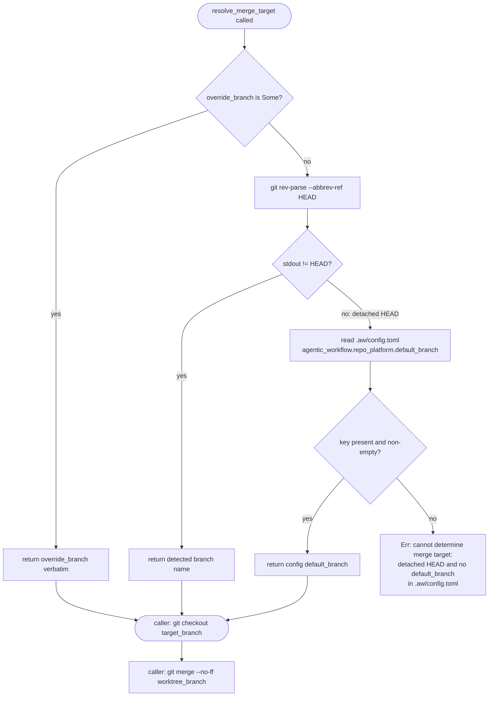

## Overview
<!-- type: overview lang: markdown -->

> **Root-resolution note.** This spec is about merge target branch selection,
> not filesystem root selection. `project_root` in the described helper is the
> current checkout root returned by `find_project_root()`. Selecting `main` (or
> any other branch) as the merge target must not cause writes to a sibling or
> primary checkout's `.aw/` tree.

`aw td merge` and `aw wi merge` both hard-code `"main"` as the merge target. In `issues.rs`, `MergeArgs.base` carries `default_value = "main"` and is passed verbatim to the underlying `git merge` invocation without any current-branch detection. In `td.rs`, `MergeArgs` has no `base` field at all; the `git merge` runs against whatever HEAD the main repo is on, but there is no `--target-branch` override and the code contains a stale `// Merge branch to main` comment. Fix: extract a shared `resolve_merge_target(override_branch, project_root) -> Result<String>` helper that detects the current branch via `git rev-parse --abbrev-ref HEAD`, accepts an explicit `--target-branch <name>` override on both commands, and falls back to `.aw/config.toml` `[agentic_workflow.repo_platform].default_branch` only on detached HEAD. `projects/agentic-workflow/src/tools/merge_git_ops.rs` is NOT a fix site — it already accepts `default_branch` as a caller parameter; all `"main"` strings there are confined to unit-test fixture setup. **Rule 2-2 (hand-written)** — spec tracks intent and scope; `aw td gen-code` produces zero files.

## Changes
<!-- type: changes lang: yaml -->

```yaml
- path: projects/agentic-workflow/src/cli/merge_target.rs
  action: create
  section: logic
  impl_mode: hand-written
  description: >
    New pub(crate) module. Exports resolve_merge_target(override_branch:
    Option<String>, project_root: &Path) -> Result<String>. Resolution order:
    (1) override_branch verbatim if Some; (2) git rev-parse --abbrev-ref HEAD
    if output != "HEAD"; (3) config.toml [agentic_workflow.repo_platform].default_branch;
    (4) Err with message "cannot determine merge target: detached HEAD and no
    default_branch in .aw/config.toml". Never silently falls back to "main".

- path: projects/agentic-workflow/src/cli/issues.rs
  action: modify
  section: overview
  impl_mode: hand-written
  description: >
    Replace MergeArgs.base (default_value = "main") with an optional
    --target-branch <name> flag. In run_merge, call
    resolve_merge_target(args.target_branch, &project_root) to obtain the
    effective branch; pass it to the git checkout step before git merge --no-ff;
    update error messages to use the resolved branch name.

- path: projects/agentic-workflow/src/cli/td.rs
  action: modify
  section: test-plan
  impl_mode: hand-written
  description: >
    Add --target-branch <name> flag to MergeArgs (currently absent). In
    run_merge, call resolve_merge_target(args.target_branch, &project_root)
    before the git merge command; add git checkout <target_branch> step so the
    merge lands on the intended branch. Remove stale "Merge branch to main"
    comment.

- path: projects/agentic-workflow/tests/merge_target_branch.rs
  action: create
  section: overview
  impl_mode: hand-written
  description: >
    Four-case regression test covering: (A) feature branch -> merge lands on
    feature branch; (B) main -> merge lands on main (existing behaviour
    preserved); (C) --target-branch release-1.0 override wins over detected
    branch; (D) detached HEAD falls back to config default_branch.
```

## Logic
<!-- type: logic lang: mermaid -->



## Test Plan
<!-- type: test-plan lang: mermaid -->

```mermaid
---
id: merge-target-branch-test-plan
requirements:
  case_a:
    id: TP-A
    text: "invoke merge from feature-branch -> merge commit lands on feature-branch not main"
    risk: high
    verifymethod: test
  case_b:
    id: TP-B
    text: "invoke merge from main -> merge lands on main (existing behaviour preserved)"
    risk: medium
    verifymethod: test
  case_c:
    id: TP-C
    text: "--target-branch release-1.0 override from feature branch -> merge lands on release-1.0"
    risk: medium
    verifymethod: test
  case_d:
    id: TP-D
    text: "detached HEAD + config default_branch=develop -> merge lands on develop"
    risk: medium
    verifymethod: test
  regression:
    id: TP-E
    text: "all existing score merge integration tests continue to pass"
    risk: high
    verifymethod: test
elements:
  merge_target_branch_tests:
    type: "projects/agentic-workflow/tests/merge_target_branch.rs"
relations:
  - from: merge_target_branch_tests
    to: case_a
    kind: satisfies
  - from: merge_target_branch_tests
    to: case_b
    kind: satisfies
  - from: merge_target_branch_tests
    to: case_c
    kind: satisfies
  - from: merge_target_branch_tests
    to: case_d
    kind: satisfies
  - from: merge_target_branch_tests
    to: regression
    kind: satisfies
---
requirementDiagram
    requirement case_a {
        id: TP-A
        text: "invoke merge from feature-branch -> merge commit lands on feature-branch not main"
        risk: high
        verifymethod: test
    }
    requirement case_b {
        id: TP-B
        text: "invoke merge from main -> merge lands on main (existing behaviour preserved)"
        risk: medium
        verifymethod: test
    }
    requirement case_c {
        id: TP-C
        text: "--target-branch release-1.0 override from feature branch -> merge lands on release-1.0"
        risk: medium
        verifymethod: test
    }
    requirement case_d {
        id: TP-D
        text: "detached HEAD + config default_branch=develop -> merge lands on develop"
        risk: medium
        verifymethod: test
    }
    requirement regression {
        id: TP-E
        text: "all existing score merge integration tests continue to pass"
        risk: high
        verifymethod: test
    }
    element merge_target_branch_tests {
        type: "projects/agentic-workflow/tests/merge_target_branch.rs"
    }
    merge_target_branch_tests - satisfies -> case_a
    merge_target_branch_tests - satisfies -> case_b
    merge_target_branch_tests - satisfies -> case_c
    merge_target_branch_tests - satisfies -> case_d
    merge_target_branch_tests - satisfies -> regression
```

## Reference Context
<!-- type: reference-context lang: markdown -->

| Artifact | Purpose |
|----------|---------|
| `projects/agentic-workflow/src/cli/issues.rs` lines 348-358, 3339-3443 | `MergeArgs` with `base` field and `run_merge` body — primary fix site for `aw wi merge` |
| `projects/agentic-workflow/src/cli/td.rs` lines 102-109, 1584-1690 | `MergeArgs` (no base field) and `run_merge` body — primary fix site for `aw td merge` |
| `projects/agentic-workflow/src/tools/merge_git_ops.rs` lines 60-70, 282-310 | `merge_worktree_branch` — caller-parameterised, not a fix site; shows established pattern for threaded `default_branch` |
| `.aw/config.toml` | `[agentic_workflow.repo_platform].default_branch` — detached-HEAD fallback source |
| `.aw/tech-design/AUTHORING.md` §"Codegen Policy (1 / 2-1 / 2-2)" | Rule 2-2 definition and `impl_mode: hand-written` vocabulary |
| `.aw/issues/open/bug-td-merge-and-issues-merge-hard-code-target-branch.md` | Issue source (R1-R6) |

# Reviews

## Review 1
<!-- type: review lang: markdown -->

**Verdict:** approved

- [changes] Rule 2-2 framing is valid: all 4 Changes entries carry `impl_mode: hand-written`; the bug is pure imperative Rust glue (clap flag, `git rev-parse` shell-out, TOML read fallback) with no codegen surface, so `aw td gen-code` correctly produces zero files.
- [changes] Fix-site identification is accurate: author pre-grepped `merge_git_ops.rs` and correctly excluded it — production code at lines 1-589 already threads `default_branch` as a caller parameter; all `"main"` literals (lines 699-1189) are inside `#[cfg(test)] mod tests` fixture setup only.
- [logic] Flowchart is in canonical Mermaid `flowchart TD` with four clearly ordered resolution steps and a terminal error node for the detached-HEAD + no-config case; no ambiguity in the branching paths.
- [test-plan] `requirementDiagram` covers all four resolution cases (A–D) plus a regression requirement (TP-E); element-to-requirement `satisfies` links are complete and match the Changes entry `projects/agentic-workflow/tests/merge_target_branch.rs`.
