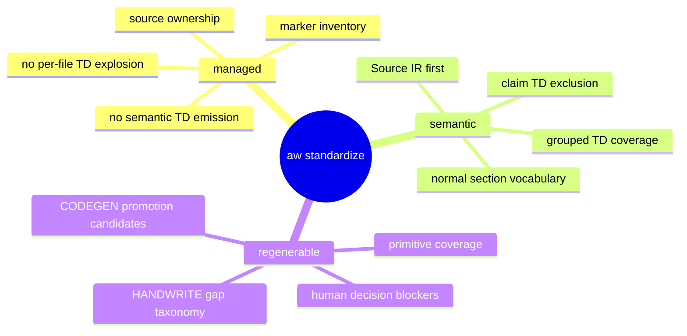
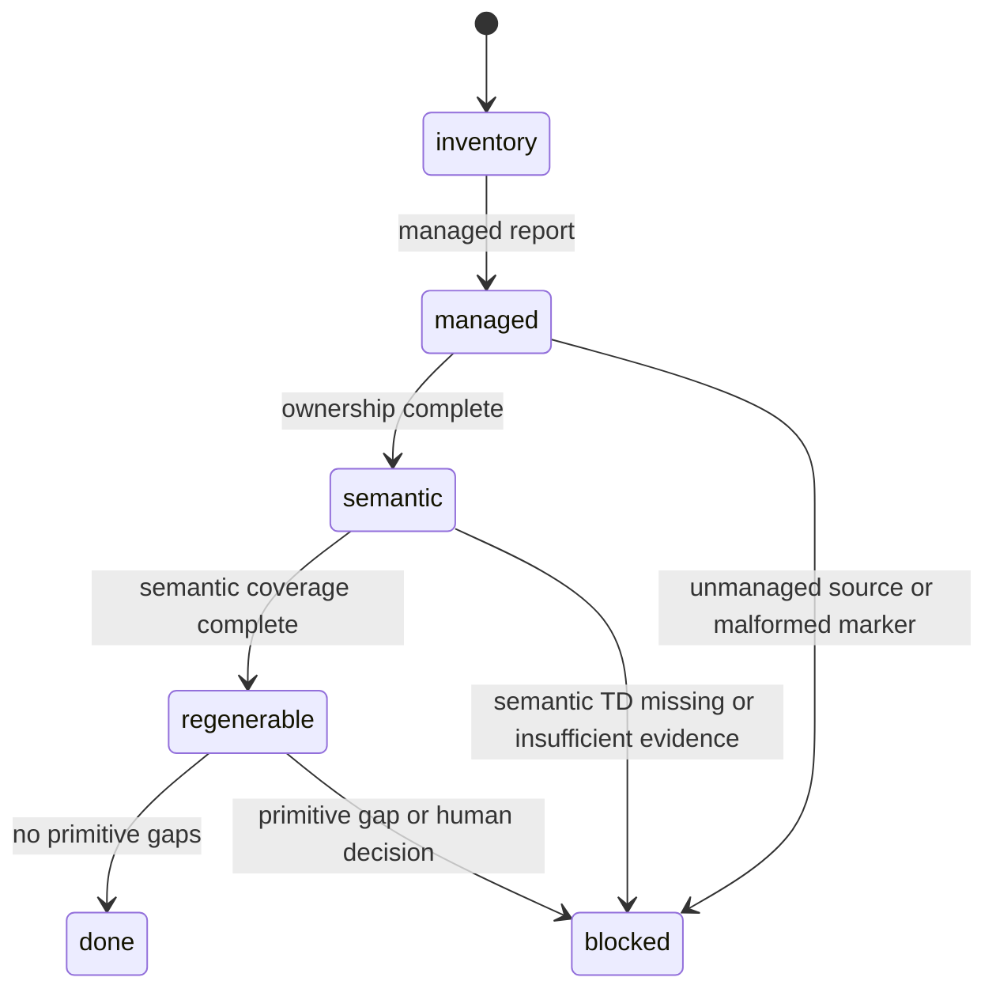
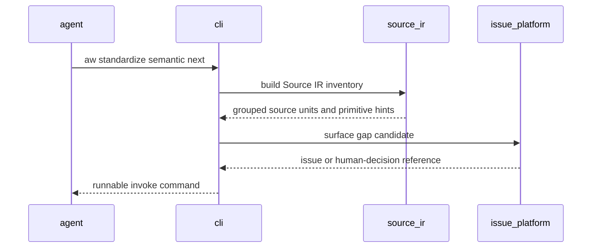
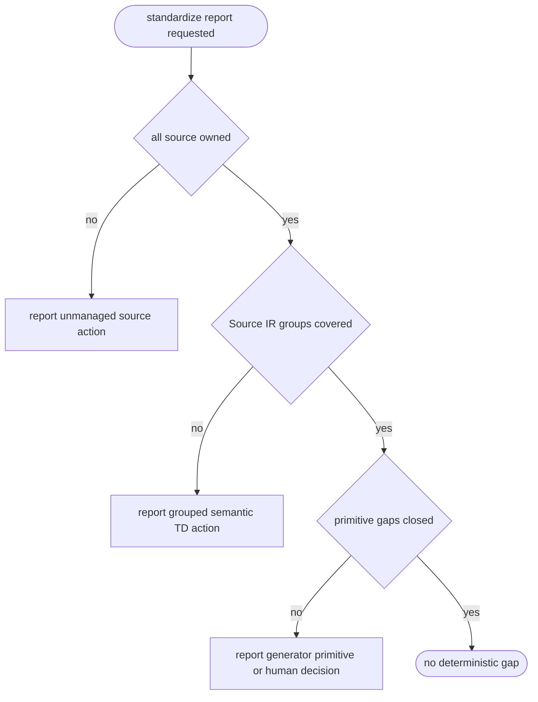
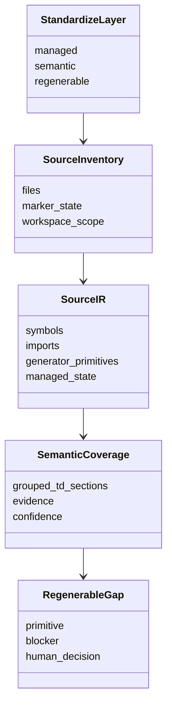
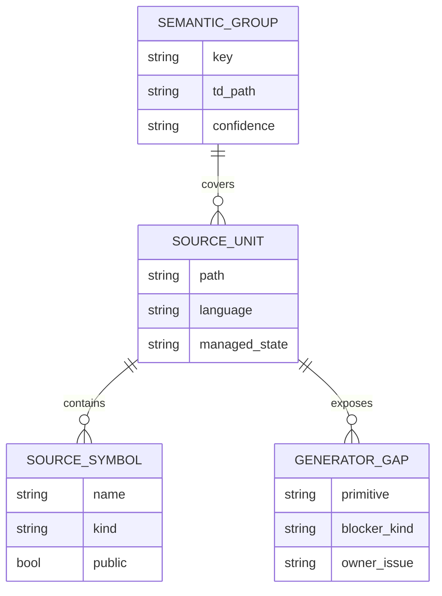

# Score Standardize Layer Contracts And Source IR

## Layer Model
<!-- type: schema lang: yaml -->

```yaml
$schema: "https://json-schema.org/draft/2020-12/schema"
$id: "score-standardize-layer-contracts-source-ir#layer-model"
type: object
required:
  - layers
  - source_ir
  - coverage_axes
properties:
  layers:
    type: object
    additionalProperties: false
    required: [managed, semantic, regenerable]
    properties:
      managed:
        type: object
        required: [owns, forbids]
        properties:
          owns:
            const: source ownership and marker inventory
          forbids:
            const: semantic TD generation and per-file TD creation
      semantic:
        type: object
        required: [owns, forbids]
        properties:
          owns:
            const: Source IR grouping and evidence-backed semantic TD coverage
          forbids:
            const: file-level claim TD coverage and PROJECT plus scope command conflicts
      regenerable:
        type: object
        required: [owns, forbids]
        properties:
          owns:
            const: generator primitive coverage and HANDWRITE to CODEGEN promotion gaps
          forbids:
            const: marker-count-only reporting
  source_ir:
    type: array
    items:
      type: object
      required: [path, language, symbols, imports, generator_primitives, managed_state]
      properties:
        path: { type: string }
        language: { type: string }
        symbols: { type: array }
        imports: { type: array }
        generator_primitives:
          type: array
          items: { type: string }
        managed_state:
          enum: [unmanaged, handwrite, codegen, mixed]
  coverage_axes:
    type: object
    required: [managed_percent, semantic_percent, regenerable_percent]
    properties:
      managed_percent: { type: number }
      semantic_percent: { type: number }
      regenerable_percent: { type: number }
      next_gap: { type: [string, "null"] }
      blocked_gap_count: { type: integer }
      human_decision_required_count: { type: integer }
```
## CLI Contract
<!-- type: cli lang: yaml -->

```yaml
command: aw standardize
subcommands:
  managed:
    report: source ownership and marker coverage only
    next: next unmanaged or malformed marker action
    run: claim unmanaged source without creating semantic TD files
  semantic:
    report: Source IR, grouped semantic TD coverage, claim exclusion, primitive gaps
    next: next deterministic Source IR or semantic TD coverage action
    run: create or update grouped semantic TDs from evidence-backed Source IR
  regenerable:
    report: semantic coverage plus generator primitive gap categories
    next: next semantic or generator primitive action required for CODEGEN ownership
    run: advance only deterministic primitive, marker, or gap-report actions
invariants:
  - managed does not create one-file claim TD markdown under td_path
  - managed does not create one semantic TD per source file
  - semantic TDs use approved section types, not deprecated overview or requirements
  - semantic next emits a directly runnable command
  - semantic next never combines PROJECT and --scope in one rejected command shape
  - regenerable separates insufficient TD sections, missing generator primitives, and human decisions
```
## Changes
<!-- type: changes lang: yaml -->

```yaml
changes:
  - path: projects/agentic-workflow/src/cli/standardize.rs
    action: modify
    section: cli
    impl_mode: hand-written
    description: |
      Separate managed, semantic, and regenerable contracts. Managed stops
      emitting one-file claim TDs, semantic emits Source IR based grouped TDs,
      and regenerable reports primitive gap categories.
  - path: projects/agentic-workflow/src/cli/td.rs
    action: modify
    section: cli
    impl_mode: hand-written
    description: |
      Keep TD authoring queues aligned with the current section registry by
      excluding deprecated non-contract section types from new TD prompts.
  - path: projects/agentic-workflow/tests
    action: modify
    section: test-plan
    impl_mode: hand-written
    description: |
      Add regression coverage proving fixture platform backend standardization
      does not mean one semantic TD file per backend source file.
  - action: annotate
    section: async-api
    impl_mode: hand-written
    description: "Traceability metadata edge for the async-api section."

  - action: annotate
    section: component
    impl_mode: hand-written
    description: "Traceability metadata edge for the component section."

  - action: annotate
    section: config
    impl_mode: hand-written
    description: "Traceability metadata edge for the config section."

  - action: annotate
    section: db-model
    impl_mode: hand-written
    description: "Traceability metadata edge for the db-model section."

  - action: annotate
    section: dependency
    impl_mode: hand-written
    description: "Traceability metadata edge for the dependency section."

  - action: annotate
    section: design-token
    impl_mode: hand-written
    description: "Traceability metadata edge for the design-token section."

  - action: annotate
    section: interaction
    impl_mode: hand-written
    description: "Traceability metadata edge for the interaction section."

  - action: annotate
    section: logic
    impl_mode: hand-written
    description: "Traceability metadata edge for the logic section."

  - action: annotate
    section: manifest
    impl_mode: hand-written
    description: "Traceability metadata edge for the manifest section."

  - action: annotate
    section: mindmap
    impl_mode: hand-written
    description: "Traceability metadata edge for the mindmap section."

  - action: annotate
    section: rest-api
    impl_mode: hand-written
    description: "Traceability metadata edge for the rest-api section."

  - action: annotate
    section: rpc-api
    impl_mode: hand-written
    description: "Traceability metadata edge for the rpc-api section."

  - action: annotate
    section: scenarios
    impl_mode: hand-written
    description: "Traceability metadata edge for the scenarios section."

  - action: annotate
    section: schema
    impl_mode: hand-written
    description: "Traceability metadata edge for the schema section."

  - action: annotate
    section: state-machine
    impl_mode: hand-written
    description: "Traceability metadata edge for the state-machine section."

  - action: annotate
    section: wireframe
    impl_mode: hand-written
    description: "Traceability metadata edge for the wireframe section."

```
## Scenarios
<!-- type: scenarios lang: yaml -->

```yaml
scenarios:
  - id: managed-does-not-create-per-file-tds
    given:
      - fixture platform backend source has hundreds of managed HANDWRITE files.
      - The project td_path is examples/fixture_platform/tech_design.
    when:
      - aw standardize managed run executes for the backend scope.
    then:
      - managed records source ownership and marker state only.
      - managed does not create one TD file per source file.
      - 743 backend files do not imply 743 semantic TD files.
  - id: semantic-groups-source-ir
    given:
      - managed coverage is complete.
      - Source IR exists for backend source units.
    when:
      - aw standardize semantic report or next runs.
    then:
      - semantic coverage groups related source units into normal TD sections.
      - claim TDs and per-file managed adoption TDs do not count as semantic coverage.
      - the next action contains a runnable command that does not combine PROJECT and --scope.
  - id: regenerable-reports-generator-gaps
    given:
      - semantic TD coverage exists for a source group.
      - one or more files still contain HANDWRITE ownership.
    when:
      - aw standardize regenerable report or next runs.
    then:
      - regenerable separates missing primitives, insufficient TD sections, and human decisions.
      - external project HANDWRITE regions become explicit generator gap candidates.
      - regenerable does not pretend marker count alone proves CODEGEN readiness.
```
## Mindmap
<!-- type: mindmap lang: mermaid -->


## State Machine
<!-- type: state-machine lang: mermaid -->


## Interaction
<!-- type: interaction lang: mermaid -->


## Logic
<!-- type: logic lang: mermaid -->


## Dependency
<!-- type: dependency lang: mermaid -->


## Data Model
<!-- type: db-model lang: mermaid -->


## REST API
<!-- type: rest-api lang: yaml -->

```yaml
openapi: 3.1.0
info:
  title: Not applicable
  version: "0.0.0"
  x-score-applicability: not_applicable
paths: {}
components:
  schemas: {}
x-score-reason: >
  This change only affects the Score CLI standardization protocol and does not
  introduce HTTP endpoints.
```
## RPC API
<!-- type: rpc-api lang: yaml -->

```yaml
openrpc: 1.3.2
info:
  title: Not applicable
  version: "0.0.0"
methods: []
x-score-applicability: not_applicable
x-score-reason: >
  This change does not add JSON-RPC methods; it changes existing CLI report,
  next, and run semantics.
```
## Async API
<!-- type: async-api lang: yaml -->

```yaml
asyncapi: 2.6.0
info:
  title: Not applicable
  version: "0.0.0"
channels: {}
x-score-applicability: not_applicable
x-score-reason: >
  Standardize layer reporting is synchronous CLI behavior and does not add
  pub-sub, WebSocket, or queue contracts.
```
## Wireframe
<!-- type: wireframe lang: yaml -->

```yaml
applicability: not_applicable
reason: >
  This change has no user interface surface. The observable contract is CLI
  output and project health reporting.
layout:
  type: none
```
## Component
<!-- type: component lang: yaml -->

```yaml
schemaVersion: "1.0.0"
modules: []
applicability: not_applicable
reason: >
  No web component, desktop component, or UI component contract is introduced.
```
## Design Tokens
<!-- type: design-token lang: yaml -->

```yaml
applicability: not_applicable
tokens: {}
reason: >
  The work is backend CLI protocol behavior and has no design-token surface.
```
## Config
<!-- type: config lang: yaml -->

```yaml
$schema: "https://json-schema.org/draft/2020-12/schema"
$id: "score-standardize-layer-contracts-source-ir#config"
type: object
properties:
  projects:
    type: array
    items:
      type: object
      properties:
        name: { type: string }
        path: { type: string }
        td_path: { type: string }
        workspaces:
          type: array
          items:
            type: object
            properties:
              name: { type: string }
              paths:
                type: array
                items: { type: string }
required: []
x-score-note: >
  Existing project and workspace config is consumed as input. This issue does
  not add a new config key.
```
## Test Plan
<!-- type: test-plan lang: mermaid -->

```mermaid
---
id: standardize-layer-test-plan
---
requirementDiagram
    requirement R1 {
      id: R1
      text: managed run does not create per-file TDs
    }
    requirement R2 {
      id: R2
      text: semantic next emits a runnable command
    }
    requirement R3 {
      id: R3
      text: semantic coverage excludes file-level claim TDs
    }
    requirement R4 {
      id: R4
      text: regenerable reports primitive gap categories
    }
    requirement R5 {
      id: R5
      text: project health reports all three axes
    }
    element T1 {
      type: test
      docRef: aw standardize managed tests
    }
    element T2 {
      type: test
      docRef: aw standardize semantic tests
    }
    element T3 {
      type: test
      docRef: aw health tests
    }
    R1 - satisfies -> T1
    R2 - satisfies -> T2
    R3 - satisfies -> T2
    R4 - satisfies -> T2
    R5 - satisfies -> T3
```
## Manifest
<!-- type: manifest lang: yaml -->

```yaml
applicability: not_applicable
manifests: []
reason: >
  The work changes Score CLI behavior and tests without adding package
  dependencies or manifest metadata.
```
## Tests
<!-- type: tests lang: yaml -->

```yaml
test_suites:
  - name: standardize_managed_layer
    target: aw standardize managed
    assertions:
      - managed report returns ownership coverage without semantic TD creation.
      - managed run does not create one TD file per source file.
  - name: standardize_semantic_layer
    target: aw standardize semantic
    assertions:
      - semantic report uses Source IR groups.
      - semantic next emits a runnable command.
      - claim TDs do not count as semantic coverage.
  - name: standardize_regenerable_layer
    target: aw standardize regenerable
    assertions:
      - regenerable report separates primitive gaps from human decisions.
      - remaining HANDWRITE is explained by concrete blocker categories.
  - name: project_health
    target: aw health
    assertions:
      - managed_percent, semantic_percent, and regenerable_percent remain separate.
      - next_gap and blocker counts preserve the layer that produced them.
```

# Reviews

### Review 1
**Verdict:** approved

- [scenarios] Approved: the scenarios define the fixture platform failure mode precisely, including the explicit rejection of 743 per-file semantic TDs.
- [cli] Approved: the contract separates managed, semantic, and regenerable commands and includes the runnable `semantic next` command invariant.
- [schema] Approved: the layer model captures Source IR, managed state, coverage axes, and blocker counts needed for implementation.
- [test-plan] Approved: the required regressions cover managed no-per-file TD creation, semantic Source IR grouping, primitive-gap reporting, and project health axis separation.
