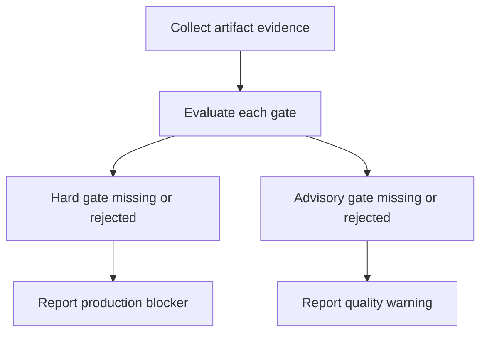
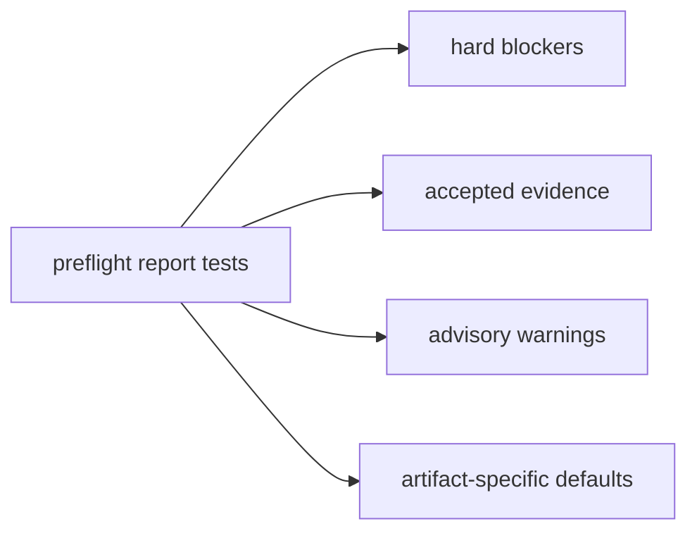

# Artifact Pre-Flight Gates

## Overview
<!-- type: overview lang: markdown -->

Public API manifest for `projects/agentic-workflow/src/models/preflight.rs` generated from AST during Score force-regeneration standardization.

### Symbols

| Name | Target | Kind | Visibility | Line | Signature |
|------|--------|------|------------|------|-----------|
| `PreFlightEvidence` | projects/agentic-workflow/src/models/preflight.rs | struct | pub | 58 |  |
| `PreFlightEvidenceKind` | projects/agentic-workflow/src/models/preflight.rs | enum | pub | 18 |  |
| `PreFlightEvidenceStatus` | projects/agentic-workflow/src/models/preflight.rs | enum | pub | 30 |  |
| `PreFlightGate` | projects/agentic-workflow/src/models/preflight.rs | struct | pub | 48 |  |
| `PreFlightGateReport` | projects/agentic-workflow/src/models/preflight.rs | struct | pub | 76 |  |
| `PreFlightGateResult` | projects/agentic-workflow/src/models/preflight.rs | struct | pub | 67 |  |
| `PreFlightGateSeverity` | projects/agentic-workflow/src/models/preflight.rs | enum | pub | 10 |  |
| `PreFlightGateStatus` | projects/agentic-workflow/src/models/preflight.rs | enum | pub | 39 |  |
| `blocks_production` | projects/agentic-workflow/src/models/preflight.rs | function | pub | 177 | blocks_production(&self) -> bool |
| `default_preflight_gates` | projects/agentic-workflow/src/models/preflight.rs | function | pub | 193 | default_preflight_gates(artifact_kind: ArtifactKind) -> Vec<PreFlightGate> |
| `evaluate` | projects/agentic-workflow/src/models/preflight.rs | function | pub | 86 | evaluate(         artifact_ref: impl Into<String>,         gates: &[PreFlightGate],         evidence: &[PreFlightEvidence],     ) -> Self |
| `production_blockers` | projects/agentic-workflow/src/models/preflight.rs | function | pub | 182 | production_blockers(&self) -> &[String] |
| `quality_warnings` | projects/agentic-workflow/src/models/preflight.rs | function | pub | 187 | quality_warnings(&self) -> &[String] |
## Schema
<!-- type: schema lang: yaml -->

```yaml
definitions:
  PreFlightGateSeverity:
    enum: [hard, advisory]
    semantics:
      hard: missing or rejected evidence blocks production readiness
      advisory: missing or rejected evidence is reported as quality warning
  PreFlightEvidenceKind:
    enum:
      - test
      - screenshot
      - transcript
      - link_check
      - source_annotation
      - review_note
  PreFlightEvidenceStatus:
    enum: [accepted, rejected, missing]
  PreFlightGateStatus:
    enum: [passed, missing, failed, warning]
  PreFlightGate:
    fields:
      id: string
      artifact_kind: ArtifactKind
      severity: PreFlightGateSeverity
      evidence_kind: PreFlightEvidenceKind
      description: string
  PreFlightEvidence:
    fields:
      gate_id: string
      evidence_kind: PreFlightEvidenceKind
      source_ref: string
      status: PreFlightEvidenceStatus
  PreFlightGateResult:
    fields:
      gate_id: string
      severity: PreFlightGateSeverity
      status: PreFlightGateStatus
      evidence_ref: string?
  PreFlightGateReport:
    fields:
      artifact_ref: string
      results: PreFlightGateResult[]
      production_blockers: string[]
      quality_warnings: string[]
```

## Source
<!-- type: source lang: rust -->
<!-- source-from-target: strip-managed-markers -->

<!-- source-snapshot: path=projects/agentic-workflow/src/models/preflight.rs -->
```rust
use serde::{Deserialize, Serialize};

use super::artifact_quality::ArtifactKind;

/// @spec projects/agentic-workflow/tech-design/surface/specs/aw-artifact-preflight-gates.md#schema
#[derive(Debug, Clone, Copy, PartialEq, Eq, Serialize, Deserialize)]
#[serde(rename_all = "snake_case")]
pub enum PreFlightGateSeverity {
    Hard,
    Advisory,
}

/// @spec projects/agentic-workflow/tech-design/surface/specs/aw-artifact-preflight-gates.md#schema
#[derive(Debug, Clone, Copy, PartialEq, Eq, Serialize, Deserialize)]
#[serde(rename_all = "snake_case")]
pub enum PreFlightEvidenceKind {
    Test,
    Screenshot,
    Transcript,
    LinkCheck,
    SourceAnnotation,
    ReviewNote,
}

/// @spec projects/agentic-workflow/tech-design/surface/specs/aw-artifact-preflight-gates.md#schema
#[derive(Debug, Clone, Copy, PartialEq, Eq, Serialize, Deserialize)]
#[serde(rename_all = "snake_case")]
pub enum PreFlightEvidenceStatus {
    Accepted,
    Rejected,
    Missing,
}

/// @spec projects/agentic-workflow/tech-design/surface/specs/aw-artifact-preflight-gates.md#schema
#[derive(Debug, Clone, Copy, PartialEq, Eq, Serialize, Deserialize)]
#[serde(rename_all = "snake_case")]
pub enum PreFlightGateStatus {
    Passed,
    Missing,
    Failed,
    Warning,
}

/// @spec projects/agentic-workflow/tech-design/surface/specs/aw-artifact-preflight-gates.md#schema
#[derive(Debug, Clone, PartialEq, Eq, Serialize, Deserialize)]
pub struct PreFlightGate {
    pub id: String,
    pub artifact_kind: ArtifactKind,
    pub severity: PreFlightGateSeverity,
    pub evidence_kind: PreFlightEvidenceKind,
    pub description: String,
}

/// @spec projects/agentic-workflow/tech-design/surface/specs/aw-artifact-preflight-gates.md#schema
#[derive(Debug, Clone, PartialEq, Eq, Serialize, Deserialize)]
pub struct PreFlightEvidence {
    pub gate_id: String,
    pub evidence_kind: PreFlightEvidenceKind,
    pub source_ref: String,
    pub status: PreFlightEvidenceStatus,
}

/// @spec projects/agentic-workflow/tech-design/surface/specs/aw-artifact-preflight-gates.md#schema
#[derive(Debug, Clone, PartialEq, Eq, Serialize, Deserialize)]
pub struct PreFlightGateResult {
    pub gate_id: String,
    pub severity: PreFlightGateSeverity,
    pub status: PreFlightGateStatus,
    pub evidence_ref: Option<String>,
}

/// @spec projects/agentic-workflow/tech-design/surface/specs/aw-artifact-preflight-gates.md#schema
#[derive(Debug, Clone, PartialEq, Eq, Serialize, Deserialize)]
pub struct PreFlightGateReport {
    pub artifact_ref: String,
    pub results: Vec<PreFlightGateResult>,
    pub production_blockers: Vec<String>,
    pub quality_warnings: Vec<String>,
}

/// @spec projects/agentic-workflow/tech-design/surface/specs/aw-artifact-preflight-gates.md#logic
impl PreFlightGateReport {
    /// @spec projects/agentic-workflow/tech-design/surface/specs/aw-artifact-preflight-gates.md#logic
    pub fn evaluate(
        artifact_ref: impl Into<String>,
        gates: &[PreFlightGate],
        evidence: &[PreFlightEvidence],
    ) -> Self {
        let mut results = Vec::with_capacity(gates.len());
        let mut production_blockers = Vec::new();
        let mut quality_warnings = Vec::new();

        for gate in gates {
            let accepted = evidence.iter().find(|candidate| {
                candidate.gate_id == gate.id
                    && candidate.evidence_kind == gate.evidence_kind
                    && candidate.status == PreFlightEvidenceStatus::Accepted
            });
            let rejected = evidence.iter().find(|candidate| {
                candidate.gate_id == gate.id
                    && candidate.evidence_kind == gate.evidence_kind
                    && candidate.status == PreFlightEvidenceStatus::Rejected
            });

            let (status, evidence_ref) = if let Some(accepted) = accepted {
                (
                    PreFlightGateStatus::Passed,
                    Some(accepted.source_ref.clone()),
                )
            } else if let Some(rejected) = rejected {
                (
                    PreFlightGateStatus::Failed,
                    Some(rejected.source_ref.clone()),
                )
            } else if gate.severity == PreFlightGateSeverity::Advisory {
                (PreFlightGateStatus::Warning, None)
            } else {
                (PreFlightGateStatus::Missing, None)
            };

            match (gate.severity, status) {
                (PreFlightGateSeverity::Hard, PreFlightGateStatus::Missing) => {
                    production_blockers.push(format!(
                        "pre-flight gate {} missing {} evidence",
                        gate.id,
                        evidence_kind_label(gate.evidence_kind)
                    ));
                }
                (PreFlightGateSeverity::Hard, PreFlightGateStatus::Failed) => {
                    production_blockers.push(format!(
                        "pre-flight gate {} rejected {} evidence",
                        gate.id,
                        evidence_kind_label(gate.evidence_kind)
                    ));
                }
                (PreFlightGateSeverity::Advisory, PreFlightGateStatus::Warning) => {
                    quality_warnings.push(format!(
                        "pre-flight gate {} missing advisory {} evidence",
                        gate.id,
                        evidence_kind_label(gate.evidence_kind)
                    ));
                }
                (PreFlightGateSeverity::Advisory, PreFlightGateStatus::Failed) => {
                    quality_warnings.push(format!(
                        "pre-flight gate {} rejected advisory {} evidence",
                        gate.id,
                        evidence_kind_label(gate.evidence_kind)
                    ));
                }
                _ => {}
            }

            results.push(PreFlightGateResult {
                gate_id: gate.id.clone(),
                severity: gate.severity,
                status,
                evidence_ref,
            });
        }

        production_blockers.sort();
        production_blockers.dedup();
        quality_warnings.sort();
        quality_warnings.dedup();

        Self {
            artifact_ref: artifact_ref.into(),
            results,
            production_blockers,
            quality_warnings,
        }
    }

    /// @spec projects/agentic-workflow/tech-design/surface/specs/aw-artifact-preflight-gates.md#logic
    pub fn blocks_production(&self) -> bool {
        !self.production_blockers.is_empty()
    }

    /// @spec projects/agentic-workflow/tech-design/surface/specs/aw-artifact-preflight-gates.md#logic
    pub fn production_blockers(&self) -> &[String] {
        &self.production_blockers
    }

    /// @spec projects/agentic-workflow/tech-design/surface/specs/aw-artifact-preflight-gates.md#logic
    pub fn quality_warnings(&self) -> &[String] {
        &self.quality_warnings
    }
}

/// @spec projects/agentic-workflow/tech-design/surface/specs/aw-artifact-preflight-gates.md#logic
pub fn default_preflight_gates(artifact_kind: ArtifactKind) -> Vec<PreFlightGate> {
    match artifact_kind {
        ArtifactKind::FrontendPage => vec![
            preflight_gate(
                "frontend-page-screenshot",
                artifact_kind,
                PreFlightGateSeverity::Hard,
                PreFlightEvidenceKind::Screenshot,
                "Frontend page artifacts require a rendered screenshot.",
            ),
            preflight_gate(
                "frontend-page-e2e",
                artifact_kind,
                PreFlightGateSeverity::Hard,
                PreFlightEvidenceKind::Test,
                "Frontend page artifacts require an exercised e2e or smoke test.",
            ),
            preflight_gate(
                "frontend-page-ux-review",
                artifact_kind,
                PreFlightGateSeverity::Advisory,
                PreFlightEvidenceKind::ReviewNote,
                "Frontend page artifacts should include an explicit visual quality review note.",
            ),
        ],
        ArtifactKind::RedesignStandardization => vec![
            preflight_gate(
                "standardization-managed-coverage",
                artifact_kind,
                PreFlightGateSeverity::Hard,
                PreFlightEvidenceKind::Transcript,
                "Standardization artifacts require managed coverage command evidence.",
            ),
            preflight_gate(
                "standardization-cb-verify",
                artifact_kind,
                PreFlightGateSeverity::Hard,
                PreFlightEvidenceKind::Transcript,
                "Standardization artifacts require cb verify command evidence.",
            ),
        ],
        ArtifactKind::Documentation => vec![
            preflight_gate(
                "documentation-link-check",
                artifact_kind,
                PreFlightGateSeverity::Hard,
                PreFlightEvidenceKind::LinkCheck,
                "Documentation artifacts require link/reference validation evidence.",
            ),
            preflight_gate(
                "documentation-reader-review",
                artifact_kind,
                PreFlightGateSeverity::Advisory,
                PreFlightEvidenceKind::ReviewNote,
                "Documentation artifacts should include a reader-focused review note.",
            ),
        ],
        ArtifactKind::ApiSurface => vec![
            preflight_gate(
                "api-surface-contract",
                artifact_kind,
                PreFlightGateSeverity::Hard,
                PreFlightEvidenceKind::ReviewNote,
                "API surface artifacts require contract review evidence.",
            ),
            preflight_gate(
                "api-surface-test",
                artifact_kind,
                PreFlightGateSeverity::Advisory,
                PreFlightEvidenceKind::Test,
                "API surface artifacts should include targeted request/response test evidence.",
            ),
        ],
        ArtifactKind::CodeArtifact => vec![
            preflight_gate(
                "code-artifact-test",
                artifact_kind,
                PreFlightGateSeverity::Hard,
                PreFlightEvidenceKind::Test,
                "Code artifacts require targeted test evidence.",
            ),
            preflight_gate(
                "code-artifact-spec-annotation",
                artifact_kind,
                PreFlightGateSeverity::Hard,
                PreFlightEvidenceKind::SourceAnnotation,
                "Code artifacts require spec ownership annotation evidence.",
            ),
        ],
        ArtifactKind::TestArtifact => vec![preflight_gate(
            "test-artifact-transcript",
            artifact_kind,
            PreFlightGateSeverity::Hard,
            PreFlightEvidenceKind::Transcript,
            "Test artifacts require command transcript evidence.",
        )],
        ArtifactKind::CliSurface => vec![
            preflight_gate(
                "cli-surface-transcript",
                artifact_kind,
                PreFlightGateSeverity::Hard,
                PreFlightEvidenceKind::Transcript,
                "CLI surface artifacts require command transcript evidence.",
            ),
            preflight_gate(
                "cli-surface-json-contract",
                artifact_kind,
                PreFlightGateSeverity::Advisory,
                PreFlightEvidenceKind::ReviewNote,
                "CLI surface artifacts should include a JSON/text contract review note.",
            ),
        ],
        ArtifactKind::Other => vec![preflight_gate(
            "artifact-review-note",
            artifact_kind,
            PreFlightGateSeverity::Advisory,
            PreFlightEvidenceKind::ReviewNote,
            "Unclassified artifacts should include a reviewer note explaining evidence sufficiency.",
        )],
    }
}

fn preflight_gate(
    id: &str,
    artifact_kind: ArtifactKind,
    severity: PreFlightGateSeverity,
    evidence_kind: PreFlightEvidenceKind,
    description: &str,
) -> PreFlightGate {
    PreFlightGate {
        id: id.to_string(),
        artifact_kind,
        severity,
        evidence_kind,
        description: description.to_string(),
    }
}

fn evidence_kind_label(kind: PreFlightEvidenceKind) -> &'static str {
    match kind {
        PreFlightEvidenceKind::Test => "test",
        PreFlightEvidenceKind::Screenshot => "screenshot",
        PreFlightEvidenceKind::Transcript => "transcript",
        PreFlightEvidenceKind::LinkCheck => "link-check",
        PreFlightEvidenceKind::SourceAnnotation => "source-annotation",
        PreFlightEvidenceKind::ReviewNote => "review-note",
    }
}

#[cfg(test)]
mod tests {
    use super::*;

    fn gate(severity: PreFlightGateSeverity) -> PreFlightGate {
        PreFlightGate {
            id: "frontend-page-screenshot".to_string(),
            artifact_kind: ArtifactKind::FrontendPage,
            severity,
            evidence_kind: PreFlightEvidenceKind::Screenshot,
            description: "rendered screenshot evidence".to_string(),
        }
    }

    #[test]
    fn missing_hard_gate_blocks_production() {
        let report =
            PreFlightGateReport::evaluate("page.md", &[gate(PreFlightGateSeverity::Hard)], &[]);

        assert!(report.blocks_production());
        assert_eq!(report.results[0].status, PreFlightGateStatus::Missing);
        assert_eq!(
            report.production_blockers(),
            &["pre-flight gate frontend-page-screenshot missing screenshot evidence".to_string()]
        );
        assert!(report.quality_warnings().is_empty());
    }

    #[test]
    fn accepted_evidence_passes_required_gate() {
        let evidence = PreFlightEvidence {
            gate_id: "frontend-page-screenshot".to_string(),
            evidence_kind: PreFlightEvidenceKind::Screenshot,
            source_ref: "screenshots/page.png".to_string(),
            status: PreFlightEvidenceStatus::Accepted,
        };

        let report = PreFlightGateReport::evaluate(
            "page.md",
            &[gate(PreFlightGateSeverity::Hard)],
            &[evidence],
        );

        assert!(!report.blocks_production());
        assert_eq!(report.results[0].status, PreFlightGateStatus::Passed);
        assert_eq!(
            report.results[0].evidence_ref.as_deref(),
            Some("screenshots/page.png")
        );
    }

    #[test]
    fn advisory_gate_warns_without_blocking() {
        let report =
            PreFlightGateReport::evaluate("page.md", &[gate(PreFlightGateSeverity::Advisory)], &[]);

        assert!(!report.blocks_production());
        assert_eq!(report.results[0].status, PreFlightGateStatus::Warning);
        assert!(report.production_blockers().is_empty());
        assert_eq!(
            report.quality_warnings(),
            &[
                "pre-flight gate frontend-page-screenshot missing advisory screenshot evidence"
                    .to_string()
            ]
        );
    }

    #[test]
    fn default_bundles_are_artifact_specific() {
        let frontend = default_preflight_gates(ArtifactKind::FrontendPage);
        let documentation = default_preflight_gates(ArtifactKind::Documentation);

        assert!(frontend.iter().any(|gate| gate.id == "frontend-page-e2e"));
        assert!(documentation
            .iter()
            .any(|gate| gate.id == "documentation-link-check"));
        assert!(!documentation
            .iter()
            .any(|gate| gate.id == "frontend-page-e2e"));
    }
}
```

## Logic
<!-- type: logic lang: mermaid -->



## Unit Test
<!-- type: unit-test lang: mermaid -->



## Changes
<!-- type: changes lang: yaml -->

```yaml
coverage_kind: semantic
changes:
  - path: "projects/agentic-workflow/src/models/preflight.rs"
    action: modify
    section: source
    impl_mode: codegen
  - path: "projects/agentic-workflow/src/models/mod.rs"
    action: update
    section: source
    impl_mode: hand-written
  - path: "projects/agentic-workflow/src/cli/project.rs"
    action: update
    section: source
    impl_mode: hand-written
  - path: "projects/agentic-workflow/src/cli/cb_review.rs"
    action: update
    section: source
    impl_mode: hand-written
  - path: "projects/agentic-workflow/tests/cli/tests/project_health_test.rs"
    action: update
    section: unit-test
    impl_mode: hand-written
  - action: annotate
    section: logic
    impl_mode: hand-written
    description: "Traceability metadata edge for the logic section."

  - action: annotate
    section: schema
    impl_mode: hand-written
    description: "Traceability metadata edge for the schema section."

```
