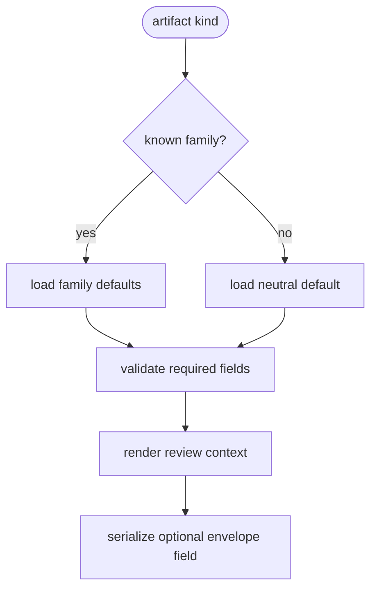

# Artifact Quality Profile

## Overview
<!-- type: overview lang: markdown -->

Public API manifest for `projects/agentic-workflow/src/models/artifact_quality.rs` generated from AST during Score force-regeneration standardization.

### Symbols

| Name | Target | Kind | Visibility | Line | Signature |
|------|--------|------|------------|------|-----------|
| `ArtifactKind` | projects/agentic-workflow/src/models/artifact_quality.rs | enum | pub | 8 |  |
| `ArtifactQualityProfile` | projects/agentic-workflow/src/models/artifact_quality.rs | struct | pub | 141 |  |
| `ArtifactSourceMode` | projects/agentic-workflow/src/models/artifact_quality.rs | enum | pub | 174 |  |
| `ArtifactSourcePolicy` | projects/agentic-workflow/src/models/artifact_quality.rs | struct | pub | 163 |  |
| `PreflightGateSet` | projects/agentic-workflow/src/models/artifact_quality.rs | struct | pub | 186 |  |
| `QualityDial` | projects/agentic-workflow/src/models/artifact_quality.rs | struct | pub | 154 |  |
| `default_for_kind` | projects/agentic-workflow/src/models/artifact_quality.rs | function | pub | 195 | default_for_kind(artifact_kind: ArtifactKind) -> Self |
| `infer_artifact_kind_from_hint` | projects/agentic-workflow/src/models/artifact_quality.rs | function | pub | 20 | infer_artifact_kind_from_hint(hint: &str) -> ArtifactKind |
| `neutral_default` | projects/agentic-workflow/src/models/artifact_quality.rs | function | pub | 312 | neutral_default() -> Self |
| `to_review_prompt_context` | projects/agentic-workflow/src/models/artifact_quality.rs | function | pub | 348 | to_review_prompt_context(&self) -> String |
| `validate` | projects/agentic-workflow/src/models/artifact_quality.rs | function | pub | 331 | validate(&self) -> Result<(), String> |
## Schema
<!-- type: schema lang: yaml -->

```yaml
artifact_quality_profile:
  fields:
    artifact_kind: "frontend_page | redesign_standardization | documentation | cli_surface | api_surface | code_artifact | test_artifact | other"
    intent_read: "one-line artifact intent"
    audience: "primary reader, user, or operator"
    constraints: ["hard boundaries"]
    quality_dials: [{ key: "string", value: "string", rationale: "optional string" }]
    source_policy: { mode: "spec | screenshot_reference | cli_transcript | api_contract | validation_inventory | code_ownership_map | mixed", evidence_ref: "optional string" }
    preflight_gate_set: { id: "string", gates: ["string"] }
```

## Logic
<!-- type: logic lang: mermaid -->



## CLI
<!-- type: cli lang: yaml -->

```yaml
commands:
  - name: aw run --json
    artifact_quality_profile: "optional; omitted when absent"
  - name: aw td review
    artifact_quality_profile: "available to prompt builders when present"
  - name: aw cb review
    artifact_quality_profile: "available to prompt builders when present"
```

## Unit Test
<!-- type: unit-test lang: mermaid -->

```mermaid
---
id: aw-artifact-quality-profile-unit-test
coverage_kind: semantic
strategy: profile defaults and envelope compatibility are verified by targeted Rust tests
---
requirementDiagram
requirement PROFILE_DEFAULTS {
  id: AQP-UT-1
  text: default profiles cover at least five artifact families
  risk: medium
  verifymethod: test
}
requirement ENVELOPE_COMPAT {
  id: AQP-UT-2
  text: runtime envelopes accept missing profile and roundtrip present profile
  risk: medium
  verifymethod: test
}
```

## E2E Test
<!-- type: e2e-test lang: yaml -->

```yaml
e2e_tests:
  - name: artifact_quality_fixture_roundtrip
    capability_id: td-cb-lifecycle-automation
    claim_id: td-lifecycle-dispatch
    command: "cargo test -p agentic-workflow artifact_quality -- --nocapture"
```

## Source
<!-- type: source lang: rust -->
<!-- source-from-target: strip-managed-markers -->

<!-- source-snapshot: path=projects/agentic-workflow/src/models/artifact_quality.rs -->
```rust
use serde::{Deserialize, Serialize};

/// @spec projects/agentic-workflow/tech-design/surface/specs/aw-artifact-quality-profile.md#schema
#[derive(Debug, Clone, Copy, PartialEq, Eq, Serialize, Deserialize)]
#[serde(rename_all = "snake_case")]
pub enum ArtifactKind {
    FrontendPage,
    RedesignStandardization,
    Documentation,
    CliSurface,
    ApiSurface,
    CodeArtifact,
    TestArtifact,
    Other,
}

/// @spec projects/agentic-workflow/tech-design/surface/specs/aw-artifact-quality-profile.md#schema
#[derive(Debug, Clone, PartialEq, Eq, Serialize, Deserialize)]
pub struct ArtifactQualityProfile {
    pub artifact_kind: ArtifactKind,
    pub intent_read: String,
    pub audience: String,
    #[serde(default, skip_serializing_if = "Vec::is_empty")]
    pub constraints: Vec<String>,
    pub quality_dials: Vec<QualityDial>,
    pub source_policy: ArtifactSourcePolicy,
    pub preflight_gate_set: PreflightGateSet,
}

/// @spec projects/agentic-workflow/tech-design/surface/specs/aw-artifact-quality-profile.md#schema
#[derive(Debug, Clone, PartialEq, Eq, Serialize, Deserialize)]
pub struct QualityDial {
    pub key: String,
    pub value: String,
    #[serde(default, skip_serializing_if = "Option::is_none")]
    pub rationale: Option<String>,
}

/// @spec projects/agentic-workflow/tech-design/surface/specs/aw-artifact-quality-profile.md#schema
#[derive(Debug, Clone, PartialEq, Eq, Serialize, Deserialize)]
pub struct ArtifactSourcePolicy {
    pub mode: ArtifactSourceMode,
    #[serde(default, skip_serializing_if = "Option::is_none")]
    pub evidence_ref: Option<String>,
    #[serde(default, skip_serializing_if = "Option::is_none")]
    pub freshness: Option<String>,
}

/// @spec projects/agentic-workflow/tech-design/surface/specs/aw-artifact-quality-profile.md#schema
#[derive(Debug, Clone, Copy, PartialEq, Eq, Serialize, Deserialize)]
#[serde(rename_all = "snake_case")]
pub enum ArtifactSourceMode {
    Spec,
    ScreenshotReference,
    CliTranscript,
    ApiContract,
    ValidationInventory,
    CodeOwnershipMap,
    Mixed,
}

/// @spec projects/agentic-workflow/tech-design/surface/specs/aw-artifact-quality-profile.md#schema
#[derive(Debug, Clone, PartialEq, Eq, Serialize, Deserialize)]
pub struct PreflightGateSet {
    pub id: String,
    #[serde(default, skip_serializing_if = "Vec::is_empty")]
    pub gates: Vec<String>,
}

/// @spec projects/agentic-workflow/tech-design/surface/specs/aw-artifact-quality-profile.md#logic
impl ArtifactQualityProfile {
    /// @spec projects/agentic-workflow/tech-design/surface/specs/aw-artifact-quality-profile.md#logic
    pub fn default_for_kind(artifact_kind: ArtifactKind) -> Self {
        match artifact_kind {
            ArtifactKind::FrontendPage => profile(
                artifact_kind,
                "Render a usable page that matches the brief, audience, and visible constraints.",
                "end users and product reviewers",
                &[
                    "respect existing UX conventions",
                    "avoid layout overlap at supported viewport sizes",
                ],
                &[
                    dial("visual_fit", "brief-matched", "page choices must serve the stated artifact goal"),
                    dial("accessibility", "keyboard-and-contrast-aware", "frontend output needs basic usability proof"),
                    dial("responsive_layout", "required", "viewport behavior is part of the artifact contract"),
                ],
                ArtifactSourceMode::ScreenshotReference,
                Some("design brief, screenshots, or live UI reference"),
                "frontend-page-preflight",
                &["layout smoke", "accessibility smoke", "responsive smoke"],
            ),
            ArtifactKind::RedesignStandardization => profile(
                artifact_kind,
                "Standardize an existing artifact without changing unrelated behavior.",
                "maintainers reviewing ownership and regeneration safety",
                &["preserve observed behavior", "separate generator gaps from handwrite ownership"],
                &[
                    dial("behavior_preservation", "strict", "standardization must not become a redesign"),
                    dial("ownership_clarity", "required", "CODEGEN/HANDWRITE boundaries must stay inspectable"),
                    dial("regeneration_readiness", "evidence-backed", "claims need cb/cold verification evidence"),
                ],
                ArtifactSourceMode::CodeOwnershipMap,
                Some("managed coverage, semantic TDs, and code ownership map"),
                "standardization-preflight",
                &["managed coverage check", "semantic coverage check", "cb verify"],
            ),
            ArtifactKind::Documentation => profile(
                artifact_kind,
                "Produce documentation that explains the contract without adding product-only filler.",
                "operators, implementers, and reviewers",
                &["keep docs aligned with the canonical spec", "avoid unverifiable claims"],
                &[
                    dial("contract_precision", "high", "docs must be actionable by implementation agents"),
                    dial("reader_path", "scannable", "operators need fast command and state lookup"),
                    dial("evidence_links", "required", "workflow docs need source references"),
                ],
                ArtifactSourceMode::Spec,
                Some("canonical spec and README capability map"),
                "documentation-preflight",
                &["spec alignment check", "link/path check"],
            ),
            ArtifactKind::CliSurface => profile(
                artifact_kind,
                "Expose CLI behavior that is deterministic, scriptable, and backward compatible.",
                "agents and operators invoking AW commands",
                &["stdout is the live protocol", "do not require new flags for existing flows"],
                &[
                    dial("machine_readability", "strict", "JSON envelopes are consumed by agents"),
                    dial("compatibility", "backward-compatible", "existing CLI consumers must continue to parse output"),
                    dial("error_actionability", "high", "CLI failures should emit next commands or concrete causes"),
                ],
                ArtifactSourceMode::CliTranscript,
                Some("CLI transcript or command contract"),
                "cli-surface-preflight",
                &["json roundtrip", "help/output smoke"],
            ),
            ArtifactKind::ApiSurface => profile(
                artifact_kind,
                "Preserve API contracts while making intent, compatibility, and validation explicit.",
                "client implementers and service maintainers",
                &["schema changes need compatibility notes", "typed contracts beat prose"],
                &[
                    dial("schema_stability", "high", "API clients depend on field-level compatibility"),
                    dial("validation_clarity", "required", "invalid states need structured rejection paths"),
                    dial("migration_scope", "bounded", "API work must state old/new behavior"),
                ],
                ArtifactSourceMode::ApiContract,
                Some("OpenAPI, RPC schema, or typed interface spec"),
                "api-surface-preflight",
                &["schema validation", "compatibility review"],
            ),
            ArtifactKind::CodeArtifact => profile(
                artifact_kind,
                "Implement the spec with bounded source changes and reviewable ownership markers.",
                "maintainers and lifecycle reviewers",
                &["keep edits scoped to the TD changes list", "include deterministic tests for behavior"],
                &[
                    dial("scope_control", "strict", "code artifacts should not absorb unrelated refactors"),
                    dial("testability", "required", "behavior needs local verification"),
                    dial("ownership_markers", "required", "source ownership is part of AW readiness"),
                ],
                ArtifactSourceMode::Spec,
                Some("TD contract and changes section"),
                "code-artifact-preflight",
                &["cargo fmt", "targeted unit tests", "diff ownership check"],
            ),
            ArtifactKind::TestArtifact => profile(
                artifact_kind,
                "Create tests that prove the declared behavior and fail on meaningful regressions.",
                "maintainers and release gates",
                &["tests must avoid fixture-only assertions", "skip only unavailable external services"],
                &[
                    dial("regression_signal", "high", "tests should fail on behavior drift"),
                    dial("fixture_realism", "representative", "fixtures must encode the profile contract"),
                    dial("gate_cost", "bounded", "tests should stay usable in lifecycle gates"),
                ],
                ArtifactSourceMode::ValidationInventory,
                Some("unit-test/e2e-test TD sections and fixture inventory"),
                "test-artifact-preflight",
                &["targeted test run", "fixture roundtrip"],
            ),
            ArtifactKind::Other => Self::neutral_default(),
        }
    }

    /// @spec projects/agentic-workflow/tech-design/surface/specs/aw-artifact-quality-profile.md#logic
    pub fn neutral_default() -> Self {
        profile(
            ArtifactKind::Other,
            "Produce the artifact according to its governing workflow brief.",
            "workflow reviewers",
            &["preserve backward compatibility when the artifact kind is not known"],
            &[dial(
                "intent_alignment",
                "required",
                "unknown artifact kinds still need an explicit review target",
            )],
            ArtifactSourceMode::Mixed,
            None,
            "artifact-quality-default",
            &["profile present or neutral default"],
        )
    }

    /// @spec projects/agentic-workflow/tech-design/surface/specs/aw-artifact-quality-profile.md#schema
    pub fn validate(&self) -> Result<(), String> {
        if self.intent_read.trim().is_empty() {
            return Err("intent_read must not be empty".to_string());
        }
        if self.audience.trim().is_empty() {
            return Err("audience must not be empty".to_string());
        }
        if self.quality_dials.is_empty() {
            return Err("quality_dials must not be empty".to_string());
        }
        if self.preflight_gate_set.id.trim().is_empty() {
            return Err("preflight_gate_set.id must not be empty".to_string());
        }
        Ok(())
    }

    /// @spec projects/agentic-workflow/tech-design/surface/specs/aw-artifact-quality-profile.md#logic
    pub fn to_review_prompt_context(&self) -> String {
        let mut out = String::new();
        out.push_str("Artifact Quality Profile\n");
        out.push_str(&format!("kind: {:?}\n", self.artifact_kind));
        out.push_str(&format!("intent_read: {}\n", self.intent_read));
        out.push_str(&format!("audience: {}\n", self.audience));
        if !self.constraints.is_empty() {
            out.push_str("constraints:\n");
            for constraint in &self.constraints {
                out.push_str(&format!("- {}\n", constraint));
            }
        }
        out.push_str("quality_dials:\n");
        for dial in &self.quality_dials {
            out.push_str(&format!("- {}={}", dial.key, dial.value));
            if let Some(rationale) = &dial.rationale {
                out.push_str(&format!(" ({})", rationale));
            }
            out.push('\n');
        }
        out.push_str(&format!("source_policy: {:?}", self.source_policy.mode));
        if let Some(evidence_ref) = &self.source_policy.evidence_ref {
            out.push_str(&format!(" evidence_ref={}", evidence_ref));
        }
        out.push('\n');
        out.push_str(&format!(
            "preflight_gate_set: {} [{}]\n",
            self.preflight_gate_set.id,
            self.preflight_gate_set.gates.join(", ")
        ));
        out
    }
}

fn profile(
    artifact_kind: ArtifactKind,
    intent_read: &str,
    audience: &str,
    constraints: &[&str],
    quality_dials: &[QualityDial],
    source_mode: ArtifactSourceMode,
    evidence_ref: Option<&str>,
    gate_id: &str,
    gates: &[&str],
) -> ArtifactQualityProfile {
    ArtifactQualityProfile {
        artifact_kind,
        intent_read: intent_read.to_string(),
        audience: audience.to_string(),
        constraints: constraints.iter().map(|value| value.to_string()).collect(),
        quality_dials: quality_dials.to_vec(),
        source_policy: ArtifactSourcePolicy {
            mode: source_mode,
            evidence_ref: evidence_ref.map(str::to_string),
            freshness: None,
        },
        preflight_gate_set: PreflightGateSet {
            id: gate_id.to_string(),
            gates: gates.iter().map(|value| value.to_string()).collect(),
        },
    }
}

fn dial(key: &str, value: &str, rationale: &str) -> QualityDial {
    QualityDial {
        key: key.to_string(),
        value: value.to_string(),
        rationale: Some(rationale.to_string()),
    }
}


#[cfg(test)]
mod tests {
    use super::*;

    #[test]
    fn artifact_quality_default_profiles_cover_families() {
        let kinds = [
            ArtifactKind::FrontendPage,
            ArtifactKind::RedesignStandardization,
            ArtifactKind::Documentation,
            ArtifactKind::CliSurface,
            ArtifactKind::ApiSurface,
            ArtifactKind::CodeArtifact,
            ArtifactKind::TestArtifact,
        ];
        let complete = kinds
            .iter()
            .map(|kind| ArtifactQualityProfile::default_for_kind(*kind))
            .inspect(|profile| profile.validate().unwrap())
            .filter(|profile| {
                !profile.quality_dials.is_empty()
                    && !profile.preflight_gate_set.gates.is_empty()
                    && profile.source_policy.evidence_ref.is_some()
            })
            .count();

        assert!(
            complete >= 5,
            "expected at least five complete profile families"
        );
    }

    #[test]
    fn artifact_quality_fixture_roundtrip() {
        let fixtures = [
            include_str!("../../tests/fixtures/artifact_quality_profiles/frontend_page.json"),
            include_str!("../../tests/fixtures/artifact_quality_profiles/documentation.json"),
            include_str!("../../tests/fixtures/artifact_quality_profiles/cli_surface.json"),
            include_str!("../../tests/fixtures/artifact_quality_profiles/api_surface.json"),
            include_str!("../../tests/fixtures/artifact_quality_profiles/code_artifact.json"),
        ];

        for raw in fixtures {
            let profile: ArtifactQualityProfile = serde_json::from_str(raw).unwrap();
            profile.validate().unwrap();
            let context = profile.to_review_prompt_context();
            assert!(context.contains("intent_read:"));
            assert!(context.contains("quality_dials:"));
            assert!(context.contains("source_policy:"));
            assert!(context.contains("preflight_gate_set:"));
        }
    }

    #[test]
    fn artifact_quality_skips_empty_optional_fields() {
        let profile = ArtifactQualityProfile::neutral_default();
        let json = serde_json::to_value(profile).unwrap();
        assert!(json.get("constraints").is_some());
        assert!(json["source_policy"].get("evidence_ref").is_none());
    }
}
```

## Changes
<!-- type: changes lang: yaml -->

```yaml
changes:
  - path: "projects/agentic-workflow/src/models/artifact_quality.rs"
    action: modify
    impl_mode: codegen
    section: source
    description: "Source replay for the serializable profile model and default profile families."
  - path: "projects/agentic-workflow/src/runtime/envelope.rs"
    action: modify
    impl_mode: hand-written
    section: source
    description: "Add optional artifact_quality_profile to runtime Dispatch envelopes."
  - path: "projects/agentic-workflow/src/cli/run.rs"
    action: modify
    impl_mode: hand-written
    section: source
    description: "Add optional artifact_quality_profile to aw run JSON envelopes and serialization coverage."
  - action: annotate
    section: cli
    impl_mode: hand-written
    description: "Traceability metadata edge for the cli section."

  - action: annotate
    section: e2e-test
    impl_mode: hand-written
    description: "Traceability metadata edge for the e2e-test section."

  - action: annotate
    section: logic
    impl_mode: hand-written
    description: "Traceability metadata edge for the logic section."

  - action: annotate
    section: schema
    impl_mode: hand-written
    description: "Traceability metadata edge for the schema section."

  - action: annotate
    section: unit-test
    impl_mode: hand-written
    description: "Traceability metadata edge for the unit-test section."

```
