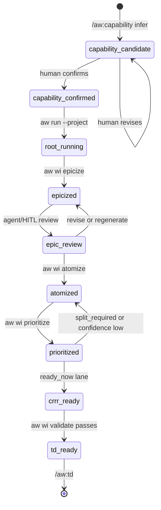

# AW Capability Alignment WI Planning

## Scenarios
<!-- type: scenarios lang: yaml -->

```yaml
id: aw-capability-alignment-wi-planning
scenarios:
  - id: S1
    title: "capability publish is HITL"
    given: ["human invokes /aw:capability with a project direction prompt"]
    when: ["agent infers a candidate capability map"]
    then:
      - "candidate is not written to cap_path until human confirmation"
      - "published README uses # Project, ## Brief, ## Capabilities, ### Capability Index, and ### capability roots"
      - "each capability root uses field-style contract lines for ID, Type, Surfaces, EC Dimensions, Root WI, Status, Required Verification, Promise, and Gate Inventory"
      - "the lower Work Root table stays table-shaped because each row is naturally one work root"
      - "YAML capability sections, Field/Value contract tables, and legacy one-row contract tables are migration input only and cannot count as verified"

  - id: S2
    title: "roadmap-sized request becomes epic or atomization draft"
    given: ["prompt says 'build Google Maps in Rust'"]
    when: ["agent routes through /aw:wi planning"]
    then:
      - "non-epic implementation WI is rejected as too-large"
      - "aw wi atomize produces local candidates under /tmp/aw/{project}/atomize"

  - id: S3
    title: "prioritize classifies readiness and dependency lanes"
    given: ["open issues include bounded work, dependency-blocked work, roadmap-sized work, and triage gaps"]
    when: ["aw wi prioritize --project P runs"]
    then:
      - "artifact records ready_now, blocked_by_dependency, needs_atomize, needs_triage, and deferred lanes"
      - "readiness is based on bounded sections, dependencies, and roadmap-size signals"

  - id: S4
    title: "project run consumes readiness instead of sprint batches"
    given: ["project capability graph and issue backend contain open work"]
    when: ["aw run --project P runs"]
    then:
      - "the project root consumes the prioritize readiness lanes and selects the next ready_now WI"
      - "if no ready_now work exists, the project root dispatches atomize or blocks with a prioritize readiness artifact"
      - "cron-style sprint batches are not part of the public workflow"

  - id: S5
    title: "Claude-facing skills stay aligned"
    given: ["aw init installs Claude Code skills from embedded templates"]
    when: ["the capability alignment workflow is installed or refreshed"]
    then:
      - "aw-capability is installed as a Claude Code skill"
      - "aw-wi skill documents atomize, prioritize readiness, and bounded WI gates"
      - "aw-standardize is the single human-facing standardization skill"

  - id: S6
    title: "capability command emits deterministic next action"
    given: ["project README contains Markdown capability headings and contract/work-root tables"]
    when: ["aw capability init creates a missing capability map shell, aw capability report|next|run|check executes for the project, or aw capability sweep executes across configured projects"]
    then:
      - "init creates only a canonical README shell and does not invent capability promises"
      - "draft emits pending-review field-style capability contracts with placeholders for Type, Surfaces, EC Dimensions, Root WI, Promise, and Gate Inventory"
      - "apply-draft refuses unreviewed placeholder drafts and writes only reviewed canonical capability sections"
      - "report emits capability_count, verified_count, percent, claim_count, claim_percent, blockers, capabilities, and next_action"
      - "next emits exactly one next_action"
      - "run executes at most one bounded tick unless --max-ticks raises the bound"
      - "check validates README capability format and TD capability refs without lifecycle execution"
      - "sweep emits grouped project rows by report status and next_action kind without mutating capability maps"

  - id: S7
    title: "confirmed capability carries verification contract"
    given: ["capability status is confirmed, auditing, blocked, or verified"]
    when: ["aw capability check validates cap_path"]
    then:
      - "capability type is one of AgentFirst, Service, Devops, DeveloperTool, RuntimeTool, or SecurityTool"
      - "surfaces list public interfaces such as CLI, HTTP, UI, file/config, generated artifacts, or agent hook entrypoints with short purposes"
      - "EC Dimensions list declared proof dimensions and runners; behavior is required for production when the capability is non-candidate"
      - "Service may require behavior, efficiency, security, and stability; Devops behavior and stability; DeveloperTool/RuntimeTool behavior, efficiency, and stability; SecurityTool behavior, security, and stability; AgentFirst behavior"
      - "non-behavior dimensions become production-required only when the README declares content for that dimension or an efficiency backfill slot"
      - "efficiency dimensions may declare Efficiency Operating Point and Efficiency Cube, and generated/backfilled efficiency sections are owned by aw ec"
      - "capability must define required verification through README tables"
      - "required claims must include maturity plus either a gate command or a fixture/inventory reference"
      - "TD primary capability_refs must name a known claim for contracted capabilities"
      - "aw wi plan uses required claims as bounded WI planning inputs"
  - id: S8
    title: "root runner rolls child completion upward"
    given: ["agent invokes aw run with a project, capability, epic, or change root"]
    when: ["the current layer is complete or blocked"]
    then:
      - "JSON output includes next.kind, invoke.command, agent_prompt, and completion"
      - "completion.workflow_complete is true only when the project root has no remaining capability work or prioritized open WI backlog"
      - "child completion can set action=done while completion.workflow_complete remains false"
      - "completed changes ask the agent to inspect the parent epic"
      - "completed capabilities ask the agent to inspect the project root"
  - id: S9
    title: "root runner does not duplicate pending planning artifacts"
    given: ["aw wi epicize has produced a local /tmp/aw/{project}/epics artifact with agent_review_required=true and review_status=pending"]
    when: ["aw run --project executes before the artifact is reviewed"]
    then:
      - "aw run emits action=blocked instead of invoking epicize again"
      - "next.kind is review_planning_artifact and next.payload_path points at the pending artifact"
      - "hitl_question.tool_hint is ask_user_question so the decision is captured before tracker mutation"
```

## State Machine
<!-- type: state-machine lang: mermaid -->



## Logic

```mermaid
---
id: aw-capability-alignment-wi-planning-logic
entry: cap_prompt
nodes:
  cap_prompt: { kind: start, label: "human invokes aw:capability prompt" }
  infer_capability: { kind: process, label: "agent proposes capability map" }
  human_confirm: { kind: decision, label: "human confirms cap_path update?" }
  write_cap_path: { kind: process, label: "write confirmed Markdown capability sections and contract/work-root tables to cap_path" }
  capability_command: { kind: process, label: "aw capability report/next/run/check evaluates capability/gap/claim graph" }
  root_run: { kind: process, label: "aw run selects project/capability/wi root and emits invoke.command" }
  wi_planning: { kind: process, label: "aw:wi routes gaps and required claims through planning operators" }
  epicize: { kind: process, label: "epicize roadmap-sized direction" }
  epic_review: { kind: decision, label: "pending epic artifact reviewed?" }
  atomize: { kind: process, label: "atomize epic into atomic WI candidates" }
  prioritize: { kind: process, label: "prioritize readiness and dependency lanes" }
  validate: { kind: decision, label: "non-epic WI bounded and aligned?" }
  td_ready: { kind: terminal, label: "aw:td may start" }
  split_or_hitl: { kind: terminal, label: "return to atomize or HITL decision" }
edges:
  - { from: cap_prompt, to: infer_capability, label: "prompt" }
  - { from: infer_capability, to: human_confirm, label: "candidate only" }
  - { from: human_confirm, to: infer_capability, label: "revise" }
  - { from: human_confirm, to: write_cap_path, label: "confirm" }
  - { from: write_cap_path, to: capability_command, label: "capability anchor" }
  - { from: capability_command, to: root_run, label: "root runnable" }
  - { from: root_run, to: wi_planning, label: "open gap or missing WI" }
  - { from: wi_planning, to: epicize, label: "large direction" }
  - { from: epicize, to: epic_review, label: "agent_review_required" }
  - { from: epic_review, to: atomize, label: "approved" }
  - { from: epic_review, to: epicize, label: "revise or regenerate" }
  - { from: atomize, to: prioritize, label: "candidate set" }
  - { from: prioritize, to: validate, label: "ready_now candidate WI" }
  - { from: validate, to: td_ready, label: "pass" }
  - { from: validate, to: split_or_hitl, label: "split_required, low confidence, decision, or too-large" }
---
flowchart TD
    cap_prompt([aw:capability prompt]) --> infer_capability[propose capability map]
    infer_capability --> human_confirm{human confirms cap_path?}
    human_confirm -- revise --> infer_capability
    human_confirm -- confirm --> write_cap_path[write Markdown capability tables]
    write_cap_path --> capability_command[aw capability report/next/run/check]
    capability_command --> root_run[aw run root envelope]
    root_run --> wi_planning[aw wi planning]
    wi_planning --> epicize[epicize]
    epicize --> epic_review{pending artifact reviewed?}
    epic_review -- approved --> atomize[atomize]
    epic_review -- revise/regenerate --> epicize
    atomize --> prioritize[prioritize readiness]
    prioritize --> validate{bounded and aligned?}
    validate -- pass --> td_ready([aw:td ready])
    validate -- fail --> split_or_hitl([atomize or HITL])
```

<!-- type: logic lang: mermaid -->



`Capability` is a human-confirmed anchor. The model may infer and propose, but
must not publish `cap_path` without confirmation. `aw capability` owns the
read-only graph view and one-tick capability checks. `aw run` owns root
selection and emits `invoke.command`/`agent_prompt` so agents can roll completed
child work back up to the parent root. Its `completion` object is the
authoritative stop condition: `action=done` only means the current root is done,
while `completion.workflow_complete=true` means the root workflow has reached
project-level 100%. Planning artifacts stay local under
`/tmp/aw/{project}/...`; tracker mutation remains in the CRRR lane.
The canonical README capability map is Markdown-first and optimized for agents
that need to understand the project before touching code:

```md
# Project

## Brief

## Capabilities

### Capability Index

| Capability | Root WI | Impl | Verification | Maturity | Production | Notes |
|---|---:|---|---|---|---|---|

### <Capability Name>

ID: <capability-id>
Type: <AgentFirst|Service|Devops|DeveloperTool|RuntimeTool|SecurityTool>
Surfaces:
- CLI: `command` - short command purpose
- HTTP: `METHOD /path` - short API purpose
EC Dimensions:
- behavior: `<runner>` - contract summary
- efficiency: `<runner>` - operating point / cube summary
- security: `<runner>` - security gate summary
- stability: `<runner>` - resilience gate summary
Efficiency Operating Point: <operating-point-id>
Efficiency Cube: projects/<project>/.aw/ec/efficiency/<capability>.cube.json
Root WI: #123
Status: candidate|confirmed|auditing|blocked|verified|retired
Required Verification: smoke, conformance, corpus, negative, dogfood
Promise:
...
Gate Inventory:
- ...

| Work Root | Kind | WI | Impl | Verification | Maturity | Gate / Evidence |
|---|---|---:|---|---|---|---|
```

Capability roots live under `## Capabilities` as `###` headings; they are not
sibling `##` sections. The top contract is field-style text, not a one-row
Markdown table and not a `Field | Value` table. The lower Work Root table stays
table-shaped because each row is naturally one work root. YAML capability
sections, `Field | Value` metadata tables, and one-row capability contract
tables remain parseable only as migration input.

Binary commands are public surfaces. README lists each command with a short
purpose; detailed flags and option grammar stay in command help output.
Behavior runners depend on the surface: web app end-to-end behavior uses
`jet e2e` when the browser workflow drives frontend and API behavior together,
pure backend API behavior uses `rig`, efficiency uses `meter` usually with a
`rig` scenario and explicit operating point/cube, security uses `guard`, and
`vat` is runner-like orchestration. `arena` is legacy compatibility rather than
the default runner for new capability contracts.

## CLI
<!-- type: cli lang: yaml -->

```yaml
commands:
  - path: [run]
    behavior: "choose exactly one root from positional [PROJECT], --project, --capability <project>:<id>, or --wi <id>; emit a root workflow envelope with next.kind, invoke.command, agent_prompt, requires_hitl, optional hitl_question, and completion.root_complete/workflow_complete/missing; project roots consume prioritize readiness lanes before reporting workflow_complete; unreadable or unparseable capability maps emit next.kind=blocked without an invalid follow-up command"
    mutates_tracker: false
  - path: [standardize, capability, report]
    behavior: "report whether README capability roots are Markdown-table runnable"
    mutates_tracker: false
  - path: [standardize, capability, next]
    behavior: "emit the next deterministic capability-standardization action"
    mutates_tracker: false
  - path: [standardize, capability, run]
    behavior: "apply one bounded capability-standardization tick for missing, YAML, or legacy capability maps, then emit completion.complete, completion.missing, and the next root-runner action"
    mutates_tracker: false
  - path: [standardize, PROJECT]
    behavior: "run the project standardization parent workflow to the first incomplete layer, then continue until production health is ready or a blocker/HITL stops the chain; blocked capability maps produce next.kind=blocked without a follow-up command"
    mutates_tracker: false
  - path: [capability, report]
    behavior: "read canonical README field-style capability contracts, migration-input legacy tables, WI inventory, TD refs, CB/evidence, EC dimension metadata, and optional verification gates or inventory refs"
    output: "JSON/text envelope with capability_count, verified_count, percent, claim_count, claim_percent, blockers, capabilities, and next_action"
    mutates_tracker: false
  - path: [capability, next]
    behavior: "emit exactly one deterministic next_action without lifecycle execution"
    mutates_tracker: false
  - path: [capability, run]
    args:
      - name: non-interactive
        meaning: "required for bounded execution"
      - name: max-ticks
        meaning: "defaults to one bounded tick"
    behavior: "execute the next bounded capability tick"
  - path: [capability, draft]
    behavior: "write pending-review inferred field-style capability contract drafts under /tmp without editing cap_path"
    mutates_tracker: false
  - path: [capability, apply-draft]
    behavior: "apply a human-reviewed placeholder-free draft to cap_path and refuse unreviewed drafts"
    mutates_tracker: false
  - path: [capability, migrate]
    behavior: "rewrite YAML, Field/Value, or one-row capability maps to canonical field-style Markdown contracts"
    mutates_tracker: false
  - path: [capability, check]
    behavior: "validate canonical README field-style capability format, capability type/surface/EC dimension data, generated efficiency backfill slots, and TD capability refs"
    mutates_tracker: false
  - path: [capability, set-type]
    behavior: "persist a reviewed capability type into the README field-style contract"
    mutates_tracker: false
  - path: [capability, set-status]
    behavior: "persist a reviewed capability status into the README field-style contract"
    mutates_tracker: false
  - path: [capability, set-surface]
    behavior: "upsert a reviewed public surface entry into the README field-style contract"
    mutates_tracker: false
  - path: [capability, set-ec-dimension]
    behavior: "upsert a reviewed EC dimension entry into the README field-style contract"
    mutates_tracker: false
  - path: [wi, plan]
    behavior: "read cap_path or project README Markdown capability tables, then write a local capability-to-WI planning draft; YAML/legacy tables require migration"
    persistence: "/tmp/aw/{project}/capability-plan"
    mutates_tracker: false
  - path: [wi, epicize]
    behavior: "group roadmap direction into epic or phase candidates"
  - path: [wi, atomize]
    behavior: "split epic or roadmap-sized work into atomic WI candidates"
    persistence: "/tmp/aw/{project}/atomize"
    mutates_tracker: false
  - path: [wi, prioritize]
    behavior: "classify open work into ready_now, blocked_by_dependency, needs_atomize, needs_triage, and deferred lanes"
    persistence: "/tmp/aw/{project}/priorities"
    mutates_tracker: false
validation:
  non_epic_requires:
    - "Capability Alignment section"
    - "Scope section"
    - "Acceptance Criteria list item"
    - "Reference Context tables"
  capability_status: [candidate, confirmed, auditing, blocked, verified, retired]
  capability_gap_status: [open, in_progress, blocked, closed, deferred]
  capability_claim_maturity: [smoke, conformance, corpus, negative, dogfood]
  capability_type: [AgentFirst, Service, Devops, DeveloperTool, RuntimeTool, SecurityTool]
  capability_surface_kind: [CLI, HTTP, UI, File, Config, Artifact, AgentHook]
  ec_dimension: [behavior, efficiency, security, stability]
  ec_runner_defaults:
    web_app_e2e: jet e2e
    backend_api: rig
    efficiency: meter
    efficiency_scenario: rig
    security: guard
    orchestration: vat
    legacy_compatibility: arena
  work_root_impl: [planned, partial, implemented, blocked, out_of_scope]
  work_root_verification: [none, planned, failing, passing, verified, blocked]
  td_capability_ref_role: [primary, contributes, affected, regression_guard, out_of_scope]
  td_capability_ref_coverage: [full, partial, enabling, guardrail]
  contract_rules:
    - "candidate may omit required verification"
    - "confirmed/auditing/blocked/verified require required verification through tables"
    - "capability roots are ### headings under ## Capabilities"
    - "top capability contracts are field-style lines, not one-row tables"
    - "old YAML sections, Field/Value tables, and one-row contract tables are migration input only"
    - "type defines the production-required EC dimension ceiling"
    - "non-behavior EC dimensions are production-required only when declared in README or generated efficiency backfill slots"
    - "aw ec owns generated/backfilled efficiency sections and cube slots"
    - "required claims require maturity and at least one gate command or fixture/inventory reference"
    - "primary TD refs to contracted capabilities require known claim"
  blocked_values:
    roadmap_sized: true
    hitl_decision_required: true
```

## Test Plan
<!-- type: test-plan lang: mermaid -->

```mermaid
---
id: aw-capability-alignment-wi-planning-tests
requirements:
  atomize_help:
    id: AW-CAP-WI-1
    text: "aw wi atomize --help exposes the planning operator"
    risk: medium
    verifymethod: test
  prioritize_help:
    id: AW-CAP-WI-2
    text: "aw wi prioritize --help exposes readiness and dependency ordering"
    risk: medium
    verifymethod: test
  huge_non_epic_rejected:
    id: AW-CAP-WI-3
    text: "huge non-epic work fails validation with too-large"
    risk: high
    verifymethod: test
  bounded_alignment_required:
    id: AW-CAP-WI-4
    text: "non-epic WI requires capability alignment, acceptance criteria, and agent estimate"
    risk: high
    verifymethod: test
  priority_readiness:
    id: AW-CAP-WI-5
    text: "prioritize excludes split_required, low-confidence, and decision-gated work from ready_now"
    risk: high
    verifymethod: test
  cap_hitl:
    id: AW-CAP-WI-6
    text: "aw:capability documents human confirmation, and aw capability/run emits structured hitl_question payloads for decision-gated capability work"
    risk: high
    verifymethod: review
  claude_skill_sync:
    id: AW-CAP-WI-7
    text: "aw init installs aw-capability, aw-wi planning, and aw-standardize human skill names"
    risk: high
    verifymethod: test
  capability_h2_schema:
    id: AW-CAP-WI-8
    text: "aw capability check validates README ## Brief / ## Capabilities / ### Capability Index / ### field-style capability contracts and treats YAML or legacy tables as migration input"
    risk: high
    verifymethod: test
  td_capability_refs:
    id: AW-CAP-WI-9
    text: "aw td check validates declared capability_refs against README capability, gap, and claim IDs"
    risk: high
    verifymethod: test
  capability_contract:
    id: AW-CAP-WI-10
    text: "aw capability check requires non-candidate capabilities to declare type, surfaces, EC dimensions, and required verification through README fields or gate inventory refs"
    risk: high
    verifymethod: test
  claim_scoped_wi_plan:
    id: AW-CAP-WI-11
    text: "aw wi plan emits claim-scoped WI candidates from required capability claims"
    risk: high
    verifymethod: test
elements:
  issues_unit_tests:
    type: "cargo test -p agentic-workflow issues::tests:: --lib"
  capability_unit_tests:
    type: "cargo test -p agentic-workflow capability --lib"
  init_unit_tests:
    type: "cargo test -p agentic-workflow init::tests::test_install_claude_skills_installs_current_skills --lib"
  cli_help_smoke:
    type: "aw wi atomize|prioritize --help"
  skill_review:
    type: "manual doc review"
relations:
  - { from: issues_unit_tests, to: huge_non_epic_rejected, kind: verifies }
  - { from: issues_unit_tests, to: bounded_alignment_required, kind: verifies }
  - { from: issues_unit_tests, to: priority_readiness, kind: verifies }
  - { from: cli_help_smoke, to: atomize_help, kind: verifies }
  - { from: cli_help_smoke, to: prioritize_help, kind: verifies }
  - { from: init_unit_tests, to: claude_skill_sync, kind: verifies }
  - { from: skill_review, to: cap_hitl, kind: verifies }
  - { from: capability_unit_tests, to: capability_h2_schema, kind: verifies }
  - { from: capability_unit_tests, to: td_capability_refs, kind: verifies }
  - { from: capability_unit_tests, to: capability_contract, kind: verifies }
  - { from: issues_unit_tests, to: claim_scoped_wi_plan, kind: verifies }
---
requirementDiagram
    requirement atomize_help {
        id: AW-CAP-WI-1
        text: "aw wi atomize help exposes the planning operator"
        risk: medium
        verifymethod: test
    }
    requirement prioritize_help {
        id: AW-CAP-WI-2
        text: "aw wi prioritize help exposes readiness and dependency ordering"
        risk: medium
        verifymethod: test
    }
    requirement huge_non_epic_rejected {
        id: AW-CAP-WI-3
        text: "huge non-epic work fails validation with too-large"
        risk: high
        verifymethod: test
    }
    requirement bounded_alignment_required {
        id: AW-CAP-WI-4
        text: "non-epic WI requires alignment, AC, and estimate"
        risk: high
        verifymethod: test
    }
    requirement priority_readiness {
        id: AW-CAP-WI-5
        text: "prioritize excludes unbounded work from ready_now"
        risk: high
        verifymethod: test
    }
    requirement cap_hitl {
        id: AW-CAP-WI-6
        text: "aw:capability requires human confirmation before cap_path writes"
        risk: high
        verifymethod: review
    }
    requirement claude_skill_sync {
        id: AW-CAP-WI-7
        text: "aw init installs aw-capability, aw-wi planning, and aw-standardize"
        risk: high
        verifymethod: test
    }
    requirement capability_h2_schema {
        id: AW-CAP-WI-8
        text: "aw capability check validates README Markdown capability headings/tables"
        risk: high
        verifymethod: test
    }
    requirement td_capability_refs {
        id: AW-CAP-WI-9
        text: "aw td check validates capability, gap, and claim refs"
        risk: high
        verifymethod: test
    }
    requirement capability_contract {
        id: AW-CAP-WI-10
        text: "non-candidate capabilities require verification contracts"
        risk: high
        verifymethod: test
    }
    requirement claim_scoped_wi_plan {
        id: AW-CAP-WI-11
        text: "aw wi plan emits claim-scoped candidates"
        risk: high
        verifymethod: test
    }
    element issues_unit_tests {
        type: "cargo-test"
    }
    element capability_unit_tests {
        type: "cargo-test"
    }
    element init_unit_tests {
        type: "cargo-test"
    }
    element cli_help_smoke {
        type: "cli-help"
    }
    element skill_review {
        type: "manual-review"
    }
    issues_unit_tests - verifies -> huge_non_epic_rejected
    issues_unit_tests - verifies -> bounded_alignment_required
    issues_unit_tests - verifies -> priority_readiness
    cli_help_smoke - verifies -> atomize_help
    cli_help_smoke - verifies -> prioritize_help
    init_unit_tests - verifies -> claude_skill_sync
    skill_review - verifies -> cap_hitl
    capability_unit_tests - verifies -> capability_h2_schema
    capability_unit_tests - verifies -> td_capability_refs
    capability_unit_tests - verifies -> capability_contract
    issues_unit_tests - verifies -> claim_scoped_wi_plan
```

## Changes
<!-- type: changes lang: yaml -->

```yaml
changes:
  - path: .agents/skills/aw-capability/SKILL.md
    action: modify
    section: cli
    impl_mode: hand-written
    description: Document HITL capability anchoring and Markdown capability table rules.
  - path: projects/agentic-workflow/src/cli/capability.rs
    action: modify
    section: cli
    impl_mode: hand-written
    description: Add Markdown capability table parsing, claim progress reporting, TD claim validation, and claim-scoped next actions.
  - path: projects/agentic-workflow/src/cli/issues.rs
    action: modify
    section: cli
    impl_mode: hand-written
    description: Feed required capability claims into aw wi plan candidates.
  - path: projects/jet/README.md
    action: modify
    section: changes
    impl_mode: hand-written
    description: Migrate Jet capability sections to Markdown capability tables without marking capabilities verified.
  - path: .agents/skills/aw-wi/SKILL.md
    action: modify
    section: cli
    impl_mode: hand-written
    description: Document planning operators and bounded-WI validation behavior.
  - path: AGENTS.md
    action: modify
    section: changes
    impl_mode: hand-written
    description: Update agent-facing AW CLI surface with atomize, prioritize readiness, and bounded planning rules.
  - path: CLAUDE.md
    action: modify
    section: cli
    impl_mode: hand-written
    description: Mirror AW planning commands and bounded-WI rules for Claude Code sessions.
  - path: .claude/skills/aw-capability/SKILL.md
    action: add
    section: cli
    impl_mode: hand-written
    description: Install the Claude-visible capability anchoring skill in the current checkout.
  - path: .claude/skills/aw-wi/SKILL.md
    action: modify
    section: cli
    impl_mode: hand-written
    description: Mirror the updated WI planning operators and bounded gate in the Claude-visible skill.
  - path: .agents/skills/aw-standardize/SKILL.md
    action: add
    section: cli
    impl_mode: hand-written
    description: Add the single human-facing standardization skill.
  - path: .claude/skills/aw-standardize/SKILL.md
    action: add
    section: cli
    impl_mode: hand-written
    description: Add the Claude-visible standardization skill.
  - path: .agents/skills/aw-standardize-run/SKILL.md
    action: delete
    section: cli
    impl_mode: hand-written
    description: Remove stale human-facing standardization skill alias file.
  - path: .agents/skills/aw-standardize-managed-loop/SKILL.md
    action: delete
    section: cli
    impl_mode: hand-written
    description: Remove old layer-specific human skill in favor of aw:standardize.
  - path: .agents/skills/aw-standardize-regenerable-loop/SKILL.md
    action: delete
    section: cli
    impl_mode: hand-written
    description: Remove old layer-specific human skill in favor of aw:standardize.
  - path: .claude/skills/aw-standardize-run/SKILL.md
    action: delete
    section: cli
    impl_mode: hand-written
    description: Remove stale Claude-visible standardization skill alias file.
  - path: .claude/skills/aw-standardize-managed-loop/SKILL.md
    action: delete
    section: cli
    impl_mode: hand-written
    description: Remove old Claude layer-specific human skill in favor of aw:standardize.
  - path: .claude/skills/aw-standardize-regenerable-loop/SKILL.md
    action: delete
    section: cli
    impl_mode: hand-written
    description: Remove old Claude layer-specific human skill in favor of aw:standardize.
  - path: projects/agentic-workflow/templates/cli/mainthread/CLAUDE.md
    action: modify
    section: cli
    impl_mode: hand-written
    description: Update the aw init CLAUDE.md template with atomize, prioritize readiness, and bounded-WI guidance.
  - path: projects/agentic-workflow/templates/cli/mainthread/skills/aw-capability/SKILL.md
    action: add
    section: cli
    impl_mode: hand-written
    description: Add aw-capability to the embedded Claude Code skill templates.
  - path: projects/agentic-workflow/templates/cli/mainthread/skills/aw-wi/SKILL.md
    action: modify
    section: cli
    impl_mode: hand-written
    description: Keep the embedded aw-wi template aligned with the updated runtime skill.
  - path: projects/agentic-workflow/templates/cli/mainthread/skills/aw-standardize/SKILL.md
    action: add
    section: cli
    impl_mode: hand-written
    description: Add aw-standardize to the embedded Claude Code skill templates.
  - path: projects/agentic-workflow/templates/cli/mainthread/skills/aw-standardize-run/SKILL.md
    action: delete
    section: cli
    impl_mode: hand-written
    description: Remove old embedded aw-standardize-run template.
  - path: projects/agentic-workflow/templates/cli/README.md
    action: modify
    section: cli
    impl_mode: hand-written
    description: Document aw-capability and aw-wi as installed Claude Code skills.
  - path: projects/agentic-workflow/src/cli/init.rs
    action: modify
    impl_mode: codegen
    section: source
    description: Include aw-capability and aw-standardize in aw init skill installation and tests, and prune old standardize-run/loop skills.
  - path: projects/agentic-workflow/src/cli/issues.rs
    action: modify
    impl_mode: codegen
    section: source
    description: Add capability-map plan, atomize and prioritize planning operators, section-based readiness checks, and alignment validation gates.
  - path: projects/agentic-workflow/tech-design/surface/src/issues.md
    action: modify
    section: logic
    impl_mode: codegen
    description: Refresh the standardized source snapshot for issues.rs ownership.
  - action: annotate
    section: scenarios
    impl_mode: hand-written
    description: "Traceability metadata edge for the scenarios section."

  - action: annotate
    section: state-machine
    impl_mode: hand-written
    description: "Traceability metadata edge for the state-machine section."

  - action: annotate
    section: unit-test
    impl_mode: hand-written
    description: "Traceability metadata edge for the unit-test section."

```
