# Score CB Fill — CRRR Author/Reviewer/Reviser Loop

> **Phase C root note.** Any "active worktree" wording below should be read as
> the active checkout/branch resolved from CLI CWD via `find_project_root()`.
> Current `aw cb` handlers must read and write `.aw/` under that checkout,
> including linked worktrees, not under a sibling or primary checkout.

## CLI: aw-cb-fill-crrr
<!-- type: cli lang: yaml -->

```yaml
$schema: "https://json-schema.org/draft/2020-12/schema"
$id: aw-cb-fill-crrr#cli
title: Score CB Fill — CRRR Author/Reviewer/Reviser Loop
description: >
  Extends the `cb` namespace (@spec projects/agentic-workflow/tech-design/surface/specs/score-namespaces.md#cli) with a fully
  spec-driven CRRR loop for filling HANDWRITE-BEGIN/END marker blocks generated by
  `aw cb gen`. Introduces `aw cb fill <slug>` (brief and --apply modes) and
  promotes `aw cb check <slug>` to the sole-commit gate for the `cb_filled` phase.
  Three new subagent roles — score-cb-handwriter, score-cb-reviewer,
  score-cb-reviser — mirror the score-td-author/reviewer/reviser contract.
  The --non-interactive flag convention follows @spec projects/agentic-workflow/tech-design/surface/specs/score-recovery-verbs-non-interactive.md#cli.

commands:
  cb:
    description: >
      Code-artifact verbs. Phase 3 adds `fill` brief/apply modes and promotes
      `check` to the sole-commit gate for the cb_filled phase.
    subcommands:
      fill:
        description: >
          Brief mode (no flags): enumerate HANDWRITE-BEGIN/END marker blocks in the
          codebase for the given issue slug, print a plain-text brief listing marker
          IDs and their locations, and emit a dispatch envelope to
          `score-cb-handwriter` with the full marker list and spec path inline.
          The handwriter agent loop-fills all markers internally and calls
          `aw cb fill --apply --marker <id>` for each one.

          Apply mode (--apply --marker <id>): merge the HANDWRITE block payload
          at `.aw/payloads/<slug>/<id>.md` into the matching HANDWRITE-BEGIN/END
          block in the target source file. Pure merge — no commit. On the last
          marker, calls `aw cb check <slug>` as the quality gate; on pass,
          the check command advances phase to cb_filled and commits
          `Lifecycle-Stage: Cb-Fill`. Emits done envelope on success, error envelope
          on validation failure.
        args:
          - name: slug
            required: true
            type: string
            description: >
              Issue slug identifying the active worktree whose generated code
              contains HANDWRITE-BEGIN/END marker blocks to be filled.
        flags:
          - name: apply
            type: boolean
            default: false
            description: >
              Switch to apply mode. When set, --marker must also be provided.
              Reads `.aw/payloads/<slug>/<marker-id>.md`, locates the
              matching HANDWRITE-BEGIN/END block by marker ID in the codebase,
              and replaces the block body in-place. No commit.
          - name: marker
            type: string
            description: >
              Marker ID corresponding to one HANDWRITE-BEGIN block in the
              generated codebase (e.g. "validate_input"). Required when
              --apply is set. The ID is the token immediately following the
              `HANDWRITE-BEGIN reason:` prefix on the marker comment line.
            required: false
          - name: non-interactive
            type: boolean
            default: false
            description: >
              Suppress all interactive prompts. When set, the brief is emitted
              without waiting for stdin confirmation. Required in agent-dispatch
              and CI contexts. Follows the convention from
              @spec projects/agentic-workflow/tech-design/surface/specs/score-recovery-verbs-non-interactive.md#cli.
          - name: json
            type: boolean
            default: false
            description: "Emit envelope as pretty-printed JSON on stdout."
        exit_codes:
          0: >
            Brief mode: dispatch envelope emitted on stdout.
            Apply mode: marker block merged; or last marker merged and cb check passed
            with Lifecycle-Stage: Cb-Fill committed and done envelope emitted.
          1: >
            Apply mode: marker not found in codebase; payload file missing;
            cb check quality gate failed (error envelope emitted).
          2: "Invocation error (slug malformed; --apply without --marker; marker ID empty)."

      check:
        description: >
          Unified code-space walk: detect Clean / Drift / MarkerGap / Uncovered /
          Aggregate / Unresolvable / Handwrite status for all source files in the
          worktree. Phase 3 promotes this from a read-only drift check to the
          sole-commit gate for `cb_filled`: on quality pass it advances the issue
          phase to cb_filled and writes `Lifecycle-Stage: Cb-Fill` to the git log.
          On failure it emits an error envelope and rolls back. Replaces
          `aw td audit`. (@spec projects/agentic-workflow/tech-design/surface/specs/score-namespaces.md#cli)
        args:
          - name: path
            required: true
            type: string
            description: >
              Code-space prefix (e.g. `projects/mamba/mambalibs/httpkit/`) or single source file to
              walk. Also accepts an issue slug when invoked as the sole-commit gate
              from `aw cb fill --apply` (slug mode resolves the worktree path
              automatically).
        flags:
          - name: slug
            type: string
            description: >
              Issue slug. When provided, cb check runs in commit-gate mode:
              advances phase to cb_filled and commits Lifecycle-Stage: Cb-Fill on
              quality pass. Emits dispatch envelope to aw td merge when
              no HANDWRITE markers remain. Required for phase advancement.
            required: false
          - name: group-by
            type: string
            description: >
              Aggregation dimension. One of: gap | file | status.
              gap subsumes the deprecated score sdd coverage view.
            enum: [gap, file, status]
            required: false
          - name: json
            type: boolean
            default: false
            description: "Emit structured JSON report on stdout."
        exit_codes:
          0: >
            Read-only mode: no findings. Commit-gate mode: quality pass;
            phase advanced to cb_filled; Lifecycle-Stage: Cb-Fill committed.
          1: "Findings present (any status other than Clean). Commit-gate: quality fail; error envelope emitted; no commit."
          2: "Invocation error (path not found; path malformed)."

      review:
        description: >
          Reviewer apply verb. Reads `.aw/payloads/<slug>/cb_review.md`
          (verdict line + per-marker bullets), validates the payload schema,
          appends the review block under `# Reviews` in the spec, advances
          phase to cb_reviewed, and emits the next dispatch envelope. On
          `approved` → dispatch `aw td merge`. On `needs-revision` with
          review_count < 2 → dispatch `score-cb-reviser`. On review_count
          >= 2 → dispatch `aw cb arbitrate`.
        args:
          - name: slug
            required: true
            type: string
            description: "Issue slug for the active worktree."
        flags:
          - name: apply
            type: boolean
            default: false
            description: >
              Apply mode (only mode supported today): merge payload, validate,
              commit `Lifecycle-Stage: Cb-Review`, emit next dispatch envelope.
        exit_codes:
          0: "Review applied; next-step dispatch envelope emitted."
          1: "Payload missing/malformed; rollback applied; error envelope emitted."
          2: "Invocation error (slug malformed; --apply not set)."

      revise:
        description: >
          Reviser apply verb. Reads `.aw/payloads/<slug>/cb_revise.md`
          (per-flagged-marker summary), validates that all flagged markers
          have been re-filled, advances phase to cb_revised, commits
          `Lifecycle-Stage: Cb-Revise`, and emits a dispatch envelope back
          to `score-cb-reviewer` for round 2.
        args:
          - name: slug
            required: true
            type: string
            description: "Issue slug for the active worktree."
        flags:
          - name: apply
            type: boolean
            default: false
            description: "Apply mode (only mode supported today). Required."
        exit_codes:
          0: "Revision applied; reviewer round-2 dispatch envelope emitted."
          1: "Flagged markers not all re-filled; rollback applied; error envelope emitted."
          2: "Invocation error (slug malformed; --apply not set)."
```
## State Machine: cb-fill-phase-lifecycle
<!-- type: state-machine lang: mermaid -->

```mermaid
---
id: cb-fill-phase-lifecycle
initial: cb_genned
nodes:
  cb_genned:
    kind: normal
    label: "Code generated (HANDWRITE markers present)"
  cb_fill_dispatched:
    kind: normal
    label: "Handwriter agent dispatched"
  cb_fill_applied:
    kind: normal
    label: "All marker blocks filled (no commit)"
  cb_reviewed:
    kind: normal
    label: "Review complete"
  cb_revised:
    kind: normal
    label: "Flagged markers re-filled"
  cb_filled:
    kind: normal
    label: "Quality gate passed; Lifecycle-Stage: Cb-Fill committed"
  cb_arbitrated:
    kind: normal
    label: "Escalated to arbitration (review_count >= 2, needs-revision)"
  td_merged:
    kind: terminal
    label: "Merged"
edges:
  - from: cb_genned
    to: cb_fill_dispatched
    event: "aw cb fill <slug> (brief → dispatch score-cb-handwriter)"
  - from: cb_fill_dispatched
    to: cb_fill_applied
    event: "score-cb-handwriter loop-fills all markers via --apply --marker"
  - from: cb_fill_applied
    to: cb_filled
    event: "aw cb check --slug (sole-commit gate writes Lifecycle-Stage: Cb-Fill, advances phase)"
  - from: cb_filled
    to: cb_reviewed
    event: "score-cb-reviewer dispatched and verdict applied via aw cb review --apply"
  - from: cb_reviewed
    to: cb_filled
    event: "verdict: approved"
  - from: cb_reviewed
    to: cb_revised
    event: "verdict: needs-revision (review_count == 1)"
    guard: "review_count < 2"
  - from: cb_reviewed
    to: cb_arbitrated
    event: "verdict: needs-revision (review_count == 2)"
    guard: "review_count >= 2"
  - from: cb_revised
    to: cb_reviewed
    event: "score-cb-reviser re-fills flagged markers; score-cb-reviewer re-dispatched"
  - from: cb_filled
    to: td_merged
    event: "aw td merge"
  - from: cb_arbitrated
    to: td_merged
    event: "arbitrate: force-merge"
  - from: cb_arbitrated
    to: cb_genned
    event: "arbitrate: send-back (reset; regen)"
---
stateDiagram-v2
    [*] --> cb_genned
    cb_genned --> cb_fill_dispatched : aw cb fill slug (brief)
    cb_fill_dispatched --> cb_fill_applied : handwriter loop-fills all markers
    cb_fill_applied --> cb_filled : aw cb check sole-commit gate (pass)
    cb_filled --> cb_reviewed : score-cb-reviewer dispatched
    cb_reviewed --> cb_filled : verdict approved
    cb_reviewed --> cb_revised : verdict needs-revision [review_count < 2]
    cb_reviewed --> cb_arbitrated : verdict needs-revision [review_count >= 2]
    cb_revised --> cb_reviewed : reviser re-fills; reviewer re-dispatched
    cb_filled --> td_merged : aw td merge
    cb_arbitrated --> td_merged : force-merge
    cb_arbitrated --> cb_genned : send-back (reset)
    td_merged --> [*]
```
## Logic: cb-fill-mainthread-loop

```mermaid
---
id: cb-fill-mainthread-loop
entry: read_verb
nodes:
  read_verb:
    kind: start
    label: "aw cb fill <slug> invoked"
  check_apply_flag:
    kind: decision
    label: "--apply flag set?"
  check_marker_flag:
    kind: decision
    label: "--marker <id> provided?"
  error_apply_no_marker:
    kind: terminal
    label: "Error: --apply requires --marker; exit 2"
  enumerate_markers:
    kind: process
    label: "Walk codebase for HANDWRITE-BEGIN/END blocks; build marker list"
  has_markers:
    kind: decision
    label: "Any HANDWRITE markers found?"
  done_no_markers:
    kind: terminal
    label: "No markers; emit done envelope; exit 0"
  emit_brief:
    kind: process
    label: "Print plain-text brief: marker IDs + file paths"
  emit_dispatch_handwriter:
    kind: terminal
    label: "Emit dispatch envelope to score-cb-handwriter; exit 0"
  read_payload:
    kind: process
    label: "Read .aw/payloads/<slug>/<marker-id>.md"
  payload_exists:
    kind: decision
    label: "Payload file exists?"
  error_missing_payload:
    kind: terminal
    label: "Error: payload not found; emit error envelope; exit 1"
  locate_marker_block:
    kind: process
    label: "Locate HANDWRITE-BEGIN <marker-id> block in source file"
  marker_found:
    kind: decision
    label: "Marker block found in codebase?"
  error_marker_not_found:
    kind: terminal
    label: "Error: HANDWRITE marker not found; emit error envelope; exit 1"
  replace_block:
    kind: process
    label: "Replace HANDWRITE-BEGIN/END block body with payload content"
  delete_payload:
    kind: process
    label: "Delete .aw/payloads/<slug>/<marker-id>.md"
  check_last_marker:
    kind: decision
    label: "All markers filled? (none remaining)"
  emit_apply_ok:
    kind: terminal
    label: "Marker applied; await next --apply call; exit 0"
  run_cb_check:
    kind: process
    label: "aw cb check <path> --slug <slug> (sole-commit gate)"
  cb_check_passed:
    kind: decision
    label: "cb check quality gate passed?"
  error_check_failed:
    kind: terminal
    label: "Error: cb check failed; emit error envelope; rollback; exit 1"
  dispatch_reviewer:
    kind: process
    label: "Advance phase to cb_filled; commit Lifecycle-Stage: Cb-Fill"
  emit_dispatch_reviewer:
    kind: process
    label: "Emit dispatch envelope to score-cb-reviewer"
  reviewer_runs:
    kind: process
    label: "score-cb-reviewer writes review payload + runs `aw cb review --apply`"
  read_reviewer_verdict:
    kind: decision
    label: "Reviewer verdict: approved or needs-revision?"
  check_review_count:
    kind: decision
    label: "review_count < 2?"
  dispatch_reviser:
    kind: process
    label: "Emit dispatch envelope to score-cb-reviser"
  reviser_runs:
    kind: process
    label: "score-cb-reviser re-fills flagged markers + runs `aw cb revise --apply`"
  emit_dispatch_arbitrate:
    kind: terminal
    label: "Emit dispatch envelope to aw cb arbitrate (R12, human-only)"
  emit_dispatch_td_merge:
    kind: terminal
    label: "Emit dispatch envelope to aw td merge; exit 0"
edges:
  - from: read_verb
    to: check_apply_flag
  - from: check_apply_flag
    to: check_marker_flag
    label: "yes"
  - from: check_apply_flag
    to: enumerate_markers
    label: "no (brief mode)"
  - from: check_marker_flag
    to: read_payload
    label: "yes"
  - from: check_marker_flag
    to: error_apply_no_marker
    label: "no"
  - from: enumerate_markers
    to: has_markers
  - from: has_markers
    to: emit_brief
    label: "yes"
  - from: has_markers
    to: done_no_markers
    label: "no"
  - from: emit_brief
    to: emit_dispatch_handwriter
  - from: read_payload
    to: payload_exists
  - from: payload_exists
    to: locate_marker_block
    label: "yes"
  - from: payload_exists
    to: error_missing_payload
    label: "no"
  - from: locate_marker_block
    to: marker_found
  - from: marker_found
    to: replace_block
    label: "yes"
  - from: marker_found
    to: error_marker_not_found
    label: "no"
  - from: replace_block
    to: delete_payload
  - from: delete_payload
    to: check_last_marker
  - from: check_last_marker
    to: run_cb_check
    label: "yes (last marker)"
  - from: check_last_marker
    to: emit_apply_ok
    label: "no (more markers remain)"
  - from: run_cb_check
    to: cb_check_passed
  - from: cb_check_passed
    to: dispatch_reviewer
    label: "yes"
  - from: cb_check_passed
    to: error_check_failed
    label: "no"
  - from: dispatch_reviewer
    to: emit_dispatch_reviewer
  - from: emit_dispatch_reviewer
    to: reviewer_runs
  - from: reviewer_runs
    to: read_reviewer_verdict
  - from: read_reviewer_verdict
    to: emit_dispatch_td_merge
    label: "approved"
  - from: read_reviewer_verdict
    to: check_review_count
    label: "needs-revision"
  - from: check_review_count
    to: dispatch_reviser
    label: "yes (review_count < 2)"
  - from: check_review_count
    to: emit_dispatch_arbitrate
    label: "no (review_count >= 2)"
  - from: dispatch_reviser
    to: reviser_runs
  - from: reviser_runs
    to: emit_dispatch_reviewer
---
flowchart TD
    read_verb([aw cb fill slug invoked]) --> check_apply_flag{"--apply flag set?"}
    check_apply_flag -->|"yes"| check_marker_flag{"--marker id provided?"}
    check_apply_flag -->|"no (brief mode)"| enumerate_markers["Walk codebase for HANDWRITE-BEGIN/END blocks"]
    check_marker_flag -->|yes| read_payload["Read .aw/payloads/slug/marker-id.md"]
    check_marker_flag -->|no| error_apply_no_marker(["Error: --apply requires --marker — exit 2"])
    enumerate_markers --> has_markers{"Any HANDWRITE markers found?"}
    has_markers -->|yes| emit_brief["Print plain-text brief: marker IDs + file paths"]
    has_markers -->|no| done_no_markers(["No markers — emit done envelope — exit 0"])
    emit_brief --> emit_dispatch_handwriter(["Emit dispatch envelope to score-cb-handwriter — exit 0"])
    read_payload --> payload_exists{"Payload file exists?"}
    payload_exists -->|yes| locate_marker_block["Locate HANDWRITE-BEGIN marker-id block in source file"]
    payload_exists -->|no| error_missing_payload(["Error: payload not found — emit error envelope — exit 1"])
    locate_marker_block --> marker_found{"Marker block found in codebase?"}
    marker_found -->|yes| replace_block["Replace HANDWRITE-BEGIN/END block body with payload content"]
    marker_found -->|no| error_marker_not_found(["Error: HANDWRITE marker not found — emit error envelope — exit 1"])
    replace_block --> delete_payload["Delete .aw/payloads/slug/marker-id.md"]
    delete_payload --> check_last_marker{"All markers filled?"}
    check_last_marker -->|"yes (last marker)"| run_cb_check["aw cb check path --slug slug (sole-commit gate)"]
    check_last_marker -->|"no (more markers remain)"| emit_apply_ok(["Marker applied — await next --apply call — exit 0"])
    run_cb_check --> cb_check_passed{"cb check quality gate passed?"}
    cb_check_passed -->|yes| dispatch_reviewer["Advance phase to cb_filled; commit Lifecycle-Stage: Cb-Fill"]
    cb_check_passed -->|no| error_check_failed(["Error: cb check failed — emit error envelope — rollback — exit 1"])
    dispatch_reviewer --> emit_dispatch_reviewer["Emit dispatch envelope to score-cb-reviewer"]
    emit_dispatch_reviewer --> reviewer_runs["score-cb-reviewer writes payload + runs aw cb review --apply"]
    reviewer_runs --> read_reviewer_verdict{"Reviewer verdict?"}
    read_reviewer_verdict -->|approved| emit_dispatch_td_merge(["Emit dispatch to aw td merge — exit 0"])
    read_reviewer_verdict -->|needs-revision| check_review_count{"review_count < 2?"}
    check_review_count -->|yes| dispatch_reviser["Emit dispatch envelope to score-cb-reviser"]
    check_review_count -->|no| emit_dispatch_arbitrate(["Emit dispatch to aw cb arbitrate (R12) — exit 0"])
    dispatch_reviser --> reviser_runs["score-cb-reviser re-fills flagged markers + runs aw cb revise --apply"]
    reviser_runs --> emit_dispatch_reviewer
```

<!-- type: logic lang: mermaid -->


## Schema
<!-- type: schema lang: yaml -->

```yaml
"$schema": "https://json-schema.org/draft/2020-12/schema"
$id: aw-cb-fill-crrr#schema
definitions:
  IssuePhase:
    type: string
    description: >
      Issue phase enum. Phase 3 adds `cb_filled` between `cb_genned` and `td_merged`,
      following the migration-alias pattern used when `td_gen_coded` was aliased to `cb_genned`.
      Extends @spec projects/agentic-workflow/tech-design/surface/specs/score-namespaces.md#schema IssuePhase.
    enum:
      - td_inited
      - td_created
      - td_reviewed
      - td_revised
      - cb_genned
      - td_gen_coded
      - cb_filled
      - td_merged
    x-rust-enum:
      derive: [Debug, Clone, Copy, PartialEq, Eq, Serialize, Deserialize]
      variants:
        - name: TdInited
          rename: "td_inited"
          doc: "Tech-design worktree provisioned."
        - name: TdCreated
          rename: "td_created"
          doc: "Spec authored."
        - name: TdReviewed
          rename: "td_reviewed"
          doc: "Spec reviewed and approved."
        - name: TdRevised
          rename: "td_revised"
          doc: "Flagged sections revised."
        - name: CbGenned
          rename: "cb_genned"
          doc: "Code generated via aw cb gen; HANDWRITE markers present."
        - name: TdGenCoded
          rename: "td_gen_coded"
          doc: "Legacy alias for CbGenned. Reader-only; never written."
        - name: CbFilled
          rename: "cb_filled"
          doc: "All HANDWRITE markers filled and approved; Lifecycle-Stage: Cb-Fill committed."
        - name: TdMerged
          rename: "td_merged"
          doc: "Spec merged to main."

  LifecycleTrailer:
    type: string
    description: >
      Git commit trailer values for Lifecycle-Stage.
      Phase 3 adds `Cb-Fill` written by `aw cb check --slug` on quality pass.
      Extends @spec projects/agentic-workflow/tech-design/surface/specs/score-namespaces.md#schema LifecycleTrailer.
    enum:
      - TdInit
      - TdCreate
      - TdValidate
      - TdReview
      - TdRevise
      - CbGen
      - TdGenCode
      - TdMerge
      - TdClaim
      - CbClaim
      - CbFill
    x-rust-enum:
      derive: [Debug, Clone, Copy, PartialEq, Eq, Serialize, Deserialize]
      variants:
        - name: TdInit
          rename: "Td-Init"
          doc: "Worktree initialised."
        - name: TdCreate
          rename: "Td-Create"
          doc: "Spec authored."
        - name: TdValidate
          rename: "Td-Validate"
          doc: "Spec validated."
        - name: TdReview
          rename: "Td-Review"
          doc: "Spec reviewed."
        - name: TdRevise
          rename: "Td-Revise"
          doc: "Spec revised."
        - name: CbGen
          rename: "Cb-Gen"
          doc: "Code generated."
        - name: TdGenCode
          rename: "Td-GenCode"
          doc: "Legacy alias for Cb-Gen. Reader-only."
        - name: TdMerge
          rename: "Td-Merge"
          doc: "Spec merged."
        - name: TdClaim
          rename: "Td-Claim"
          doc: "TD spec adopted from disk; phase bypassed to td_reviewed."
        - name: CbClaim
          rename: "Cb-Claim"
          doc: "Existing code adopted; TD spec generated by fillback pipeline."
        - name: CbFill
          rename: "Cb-Fill"
          doc: "All HANDWRITE markers filled; sole-commit gate by aw cb check --slug."

  CbFillMarker:
    type: object
    description: >
      Identifies one HANDWRITE-BEGIN/END block in the generated codebase.
      Collected by `aw cb fill <slug>` brief mode and embedded in the
      dispatch envelope sent to `score-cb-handwriter`.
    required: [id, file_path, reason]
    properties:
      id:
        type: string
        description: >
          Token immediately following `HANDWRITE-BEGIN reason:` on the marker
          comment line. Used as the payload filename: `.aw/payloads/<slug>/<id>.md`.
      file_path:
        type: string
        description: "Repo-root-relative path to the source file containing the marker."
      reason:
        type: string
        description: >
          Full reason string from the HANDWRITE-BEGIN comment, e.g.
          'gap in state-machine generator — closes with projects/agentic-workflow/tech-design/surface/specs/aw-cb-fill-crrr.md'.
      line_start:
        type: integer
        description: "1-based line number of the HANDWRITE-BEGIN comment."
        nullable: true
      line_end:
        type: integer
        description: "1-based line number of the HANDWRITE-END comment."
        nullable: true

  CbFillBrief:
    type: object
    description: >
      Payload embedded in the dispatch envelope sent to `score-cb-handwriter`.
      Contains the marker list and the spec path so the agent can begin filling
      without reading the filesystem itself.
    required: [slug, spec_path, markers]
    properties:
      slug:
        type: string
        description: "Issue slug for the active worktree."
      spec_path:
        type: string
        description: "Worktree-relative path to the approved TD spec."
      markers:
        type: array
        items:
          $ref: "#/definitions/CbFillMarker"
        description: "Ordered list of HANDWRITE marker blocks to fill."

  CbCheckStatus:
    type: string
    description: >
      Per-item status codes emitted by `aw cb check`. Used in the
      structured JSON report and as the sole-commit gate decision input.
    enum:
      - Clean
      - Drift
      - MarkerGap
      - Uncovered
      - Aggregate
      - Unresolvable
      - Handwrite
    x-rust-enum:
      derive: [Debug, Clone, Copy, PartialEq, Eq, Serialize, Deserialize]
      variants:
        - name: Clean
          doc: "Codegen block matches spec output byte-for-byte."
        - name: Drift
          doc: "Codegen block present but content differs from spec output."
        - name: MarkerGap
          doc: "Hand-edit detected inside a CODEGEN block (no @spec marker)."
        - name: Uncovered
          doc: "File claimed by a spec changes: entry but item has no CODEGEN block."
        - name: Aggregate
          doc: "Rolled-up status across multiple items in a file."
        - name: Unresolvable
          doc: "Spec reference in @spec marker cannot be resolved to a known section."
        - name: Handwrite
          doc: "HANDWRITE-BEGIN/END block present; content not yet filled (marker unfilled)."

  CbFillAgentRoles:
    type: object
    description: >
      Defines the three subagent roles introduced by this spec for the
      cb fill CRRR loop. Each role mirrors its `aw wi` counterpart
      but operates on HANDWRITE marker blocks rather than issue sections.
    properties:
      handwriter:
        type: object
        description: "score-cb-handwriter: loop-fills all HANDWRITE markers in one dispatch."
        properties:
          agent_id:
            type: string
            const: "score-cb-handwriter"
          template_path:
            type: string
            const: "projects/agentic-workflow/templates/mainthread/agents/score-cb-handwriter.md"
          inputs:
            type: array
            items:
              type: string
            description: "Brief envelope (CbFillBrief), spec file, source files with HANDWRITE blocks."
          output:
            type: string
            description: "Calls aw cb fill --apply --marker <id> for each marker in sequence."
          max_turns:
            type: integer
            const: 30
          model:
            type: string
            const: "sonnet"
      reviewer:
        type: object
        description: "score-cb-reviewer: judges drift, completeness, and correctness of filled markers."
        properties:
          agent_id:
            type: string
            const: "score-cb-reviewer"
          template_path:
            type: string
            const: "projects/agentic-workflow/templates/mainthread/agents/score-cb-reviewer.md"
          inputs:
            type: array
            items:
              type: string
            description: "Filled source files, spec file, cb check report."
          output:
            type: string
            description: >
              Writes review markdown to `.aw/payloads/<slug>/cb_review.md` (verdict
              header + per-marker bullets), then runs `aw cb review --slug <slug> --apply`.
              Mainthread re-runs `aw td validate` to advance the phase via the
              CRRR sole-commit gate. Mirrors the score-issue-reviewer two-phase
              commit pattern.
          max_turns:
            type: integer
            const: 10
          model:
            type: string
            const: "sonnet"
      reviser:
        type: object
        description: "score-cb-reviser: re-fills only the flagged markers after a needs-revision verdict."
        properties:
          agent_id:
            type: string
            const: "score-cb-reviser"
          template_path:
            type: string
            const: "projects/agentic-workflow/templates/mainthread/agents/score-cb-reviser.md"
          inputs:
            type: array
            items:
              type: string
            description: "Review verdict, flagged marker IDs, spec file, source files."
          output:
            type: string
            description: >
              Re-fills only the flagged HANDWRITE markers via repeated
              `aw cb fill --apply --marker <id>` calls (one per flagged marker).
              On completion, runs `aw cb revise --slug <slug> --apply` which
              writes the per-marker revision summary to
              `.aw/payloads/<slug>/cb_revise.md` and emits a dispatch envelope
              back to score-cb-reviewer for round 2.
          max_turns:
            type: integer
            const: 20
          model:
            type: string
            const: "sonnet"
```
## Test Plan

```mermaid
---
id: aw-cb-fill-crrr-test-plan
requirements:
  r1_cb_fill_brief:
    id: R1
    text: "aw cb fill <slug> brief mode enumerates HANDWRITE markers, emits dispatch envelope to score-cb-handwriter with CbFillBrief payload"
    kind: functional
    risk: high
    verify: test
  r2_cb_fill_apply:
    id: R2
    text: "aw cb fill --apply --marker <id> merges .aw/payloads/<slug>/<id>.md into the matching HANDWRITE block in source; no commit; deletes payload on success"
    kind: functional
    risk: high
    verify: test
  r3_cb_check_sole_commit_gate:
    id: R3
    text: "aw cb check --slug <slug> advances phase to cb_filled and commits Lifecycle-Stage: Cb-Fill on quality pass; emits error envelope and rolls back on failure"
    kind: functional
    risk: high
    verify: test
  r4_crrr_retry_cap:
    id: R4
    text: "cb fill CRRR loop caps at 2 review cycles; a third needs-revision verdict routes to aw wi arbitrate, matching the aw wi policy"
    kind: functional
    risk: high
    verify: test
  r5_phase_enum_cb_filled:
    id: R5
    text: "cb_filled phase variant serialises as 'cb_filled' and is positioned after cb_genned; td_gen_coded alias remains reader-only and never written"
    kind: functional
    risk: high
    verify: test
  r6_lifecycle_trailer_cb_fill:
    id: R6
    text: "LifecycleTrailer::CbFill serialises as 'Cb-Fill' and is committed exactly once on quality pass by aw cb check --slug"
    kind: functional
    risk: high
    verify: test
  r7_envelope_conformance:
    id: R7
    text: "aw cb fill brief mode and aw cb check --slug emit only dispatch/done/error envelope shapes conforming to issue-cli-envelope.md; no new top-level keys"
    kind: interface
    risk: high
    verify: test
  r8_skill_template:
    id: R8
    text: "score-cb-fill/SKILL.md exists at projects/agentic-workflow/templates/mainthread/skills/score-cb-fill/SKILL.md"
    kind: interface
    risk: medium
    verify: inspection
  r9_placeholder_markers_reuse:
    id: R9
    text: "aw cb check --slug reuses PLACEHOLDER_MARKERS from issue-validator-placeholder-rejection for HANDWRITE block content quality checks"
    kind: functional
    risk: medium
    verify: inspection
  r10_single_dispatch:
    id: R10
    text: "score-cb-handwriter fills all markers sequentially in a single dispatch; no per-marker parallel dispatch"
    kind: functional
    risk: medium
    verify: test
  r11_smoke_flag_registration:
    id: R11
    text: "aw cb fill --help displays --apply, --marker, --non-interactive, --json flags registered via clap"
    kind: interface
    risk: high
    verify: test
  r12_e2e_crrr_loop:
    id: R12
    text: "End-to-end: spawning aw binary against a synthesised tempdir crate with HANDWRITE markers completes the full CRRR loop (fill → check → phase cb_filled committed)"
    kind: functional
    risk: high
    verify: test
elements:
  test_cb_fill_brief_dispatch_envelope:
    kind: test
    type: "rs/#[test]"
  test_cb_fill_brief_marker_enumeration:
    kind: test
    type: "rs/#[test]"
  test_cb_fill_apply_block_replaced:
    kind: test
    type: "rs/#[test]"
  test_cb_fill_apply_payload_deleted:
    kind: test
    type: "rs/#[test]"
  test_cb_fill_apply_no_commit:
    kind: test
    type: "rs/#[test]"
  test_cb_check_sole_commit_phase_advance:
    kind: test
    type: "rs/#[test]"
  test_cb_check_sole_commit_trailer:
    kind: test
    type: "rs/#[test]"
  test_cb_check_quality_fail_rollback:
    kind: test
    type: "rs/#[test]"
  test_crrr_retry_cap_arbitrate:
    kind: test
    type: "rs/#[test]"
  test_cb_reviewer_approved_td_merge_dispatch:
    kind: test
    type: "rs/#[test]"
  test_cb_reviser_dispatched_on_needs_revision:
    kind: test
    type: "rs/#[test]"
  test_phase_enum_cb_filled_serde:
    kind: test
    type: "rs/#[test]"
  test_lifecycle_trailer_cb_fill_serde:
    kind: test
    type: "rs/#[test]"
  test_envelope_shapes:
    kind: test
    type: "rs/#[test]"
  inspect_skill_template:
    kind: inspection
    type: "grep/score-cb-fill/SKILL.md"
  inspect_placeholder_markers_reuse:
    kind: inspection
    type: "rs/source"
  test_handwriter_single_dispatch:
    kind: test
    type: "rs/#[test]"
  test_cb_fill_smoke_flag_registration:
    kind: test
    type: "rs/#[test]"
  test_cb_fill_e2e_crrr_loop:
    kind: test
    type: "rs/integration"
relations:
  - from: test_cb_fill_brief_dispatch_envelope
    verifies: r1_cb_fill_brief
  - from: test_cb_fill_brief_marker_enumeration
    verifies: r1_cb_fill_brief
  - from: test_cb_fill_apply_block_replaced
    verifies: r2_cb_fill_apply
  - from: test_cb_fill_apply_payload_deleted
    verifies: r2_cb_fill_apply
  - from: test_cb_fill_apply_no_commit
    verifies: r2_cb_fill_apply
  - from: test_cb_check_sole_commit_phase_advance
    verifies: r3_cb_check_sole_commit_gate
  - from: test_cb_check_sole_commit_trailer
    verifies: r3_cb_check_sole_commit_gate
  - from: test_cb_check_quality_fail_rollback
    verifies: r3_cb_check_sole_commit_gate
  - from: test_crrr_retry_cap_arbitrate
    verifies: r4_crrr_retry_cap
  - from: test_cb_reviewer_approved_td_merge_dispatch
    verifies: r4_crrr_retry_cap
  - from: test_cb_reviser_dispatched_on_needs_revision
    verifies: r4_crrr_retry_cap
  - from: test_phase_enum_cb_filled_serde
    verifies: r5_phase_enum_cb_filled
  - from: test_lifecycle_trailer_cb_fill_serde
    verifies: r6_lifecycle_trailer_cb_fill
  - from: test_envelope_shapes
    verifies: r7_envelope_conformance
  - from: inspect_skill_template
    verifies: r8_skill_template
  - from: inspect_placeholder_markers_reuse
    verifies: r9_placeholder_markers_reuse
  - from: test_handwriter_single_dispatch
    verifies: r10_single_dispatch
  - from: test_cb_fill_smoke_flag_registration
    verifies: r11_smoke_flag_registration
  - from: test_cb_fill_e2e_crrr_loop
    verifies: r12_e2e_crrr_loop
---
requirementDiagram
    requirement R1 {
      id: R1
      text: "aw cb fill brief: enumerates markers, emits dispatch to score-cb-handwriter"
      risk: high
      verifymethod: test
    }
    requirement R2 {
      id: R2
      text: "aw cb fill --apply --marker: merges payload into HANDWRITE block, no commit"
      risk: high
      verifymethod: test
    }
    requirement R3 {
      id: R3
      text: "aw cb check --slug: sole-commit gate; advances phase to cb_filled; Cb-Fill trailer"
      risk: high
      verifymethod: test
    }
    requirement R4 {
      id: R4
      text: "CRRR retry cap at 2 reviews; third needs-revision routes to arbitrate"
      risk: high
      verifymethod: test
    }
    requirement R5 {
      id: R5
      text: "cb_filled phase enum: serialises as cb_filled, positioned after cb_genned"
      risk: high
      verifymethod: test
    }
    requirement R6 {
      id: R6
      text: "LifecycleTrailer::CbFill serialises as Cb-Fill; committed once on quality pass"
      risk: high
      verifymethod: test
    }
    requirement R7 {
      id: R7
      text: "All new verbs emit only dispatch/done/error envelope shapes"
      risk: high
      verifymethod: test
    }
    requirement R8 {
      id: R8
      text: "score-cb-fill/SKILL.md present at template path"
      risk: medium
      verifymethod: inspection
    }
    requirement R9 {
      id: R9
      text: "cb check reuses PLACEHOLDER_MARKERS for HANDWRITE block quality checks"
      risk: medium
      verifymethod: inspection
    }
    requirement R10 {
      id: R10
      text: "score-cb-handwriter fills all markers sequentially; no parallel dispatch"
      risk: medium
      verifymethod: test
    }
    requirement R11 {
      id: R11
      text: "aw cb fill --help shows --apply, --marker, --non-interactive, --json"
      risk: high
      verifymethod: test
    }
    requirement R12 {
      id: R12
      text: "E2E: tempdir crate with HANDWRITE markers completes CRRR loop to cb_filled"
      risk: high
      verifymethod: test
    }
    element test_cb_fill_brief_dispatch_envelope {
      type: "rs/#[test]"
    }
    element test_cb_fill_brief_marker_enumeration {
      type: "rs/#[test]"
    }
    element test_cb_fill_apply_block_replaced {
      type: "rs/#[test]"
    }
    element test_cb_fill_apply_payload_deleted {
      type: "rs/#[test]"
    }
    element test_cb_fill_apply_no_commit {
      type: "rs/#[test]"
    }
    element test_cb_check_sole_commit_phase_advance {
      type: "rs/#[test]"
    }
    element test_cb_check_sole_commit_trailer {
      type: "rs/#[test]"
    }
    element test_cb_check_quality_fail_rollback {
      type: "rs/#[test]"
    }
    element test_crrr_retry_cap_arbitrate {
      type: "rs/#[test]"
    }
    element test_phase_enum_cb_filled_serde {
      type: "rs/#[test]"
    }
    element test_lifecycle_trailer_cb_fill_serde {
      type: "rs/#[test]"
    }
    element test_envelope_shapes {
      type: "rs/#[test]"
    }
    element inspect_skill_template {
      type: "grep/score-cb-fill/SKILL.md"
    }
    element inspect_placeholder_markers_reuse {
      type: "rs/source"
    }
    element test_handwriter_single_dispatch {
      type: "rs/#[test]"
    }
    element test_cb_fill_smoke_flag_registration {
      type: "rs/#[test]"
    }
    element test_cb_fill_e2e_crrr_loop {
      type: "rs/integration"
    }
    test_cb_fill_brief_dispatch_envelope - verifies -> R1
    test_cb_fill_brief_marker_enumeration - verifies -> R1
    test_cb_fill_apply_block_replaced - verifies -> R2
    test_cb_fill_apply_payload_deleted - verifies -> R2
    test_cb_fill_apply_no_commit - verifies -> R2
    test_cb_check_sole_commit_phase_advance - verifies -> R3
    test_cb_check_sole_commit_trailer - verifies -> R3
    test_cb_check_quality_fail_rollback - verifies -> R3
    test_crrr_retry_cap_arbitrate - verifies -> R4
    test_phase_enum_cb_filled_serde - verifies -> R5
    test_lifecycle_trailer_cb_fill_serde - verifies -> R6
    test_envelope_shapes - verifies -> R7
    inspect_skill_template - verifies -> R8
    inspect_placeholder_markers_reuse - verifies -> R9
    test_handwriter_single_dispatch - verifies -> R10
    test_cb_fill_smoke_flag_registration - verifies -> R11
    test_cb_fill_e2e_crrr_loop - verifies -> R12
```

<!-- type: test-plan lang: mermaid -->


## Changes
<!-- type: changes lang: yaml -->

```yaml
changes:
  # ── Phase enum + lifecycle trailer (projects/agentic-workflow) ─────────────────────────
  - path: projects/agentic-workflow/src/issues/types/phase.rs
    action: modify
    section: schema
    impl_mode: hand-written
    description: >
      Add `CbFilled` variant to `IssuePhase` enum, serialised as "cb_filled".
      Position it after `CbGenned` and before `TdMerged`.
      Keep `TdGenCoded` as an existing reader-only legacy alias for `CbGenned`
      (already present from Phase 2); no new alias needed for `CbFilled`.
      Update the `from_str` / `Display` impls accordingly.
      No changes to existing variants.

  - path: projects/agentic-workflow/src/issues/types/lifecycle_trailer.rs
    action: modify
    section: schema
    impl_mode: hand-written
    description: >
      Add `CbFill` variant to `LifecycleTrailer` enum, serialised as "Cb-Fill".
      This trailer is written exclusively by `aw cb check --slug` on quality
      pass. No changes to existing variants.

  # ── CLI implementation (projects/agentic-workflow/src/cli/cb.rs) ──────────────────
  - path: projects/agentic-workflow/src/cli/cb.rs
    action: modify
    section: cli
    impl_mode: hand-written
    description: >
      Implement `aw cb fill` brief and apply modes:
        - Add `Fill(CbFillArgs)` variant to `CbCommand` enum.
        - Implement `CbFillArgs` struct with clap fields: `slug` (positional),
          `--apply` (bool), `--marker` (Option<String>),
          `--non-interactive` (bool), `--json` (bool).
        - Implement `run_fill(args: CbFillArgs)`:
            Brief path: walk the codebase for HANDWRITE-BEGIN/END blocks,
              build a `CbFillBrief` value, print plain-text brief, emit
              dispatch envelope targeting `score-cb-handwriter`.
            Apply path: read payload at `.aw/payloads/<slug>/<marker-id>.md`,
              locate the HANDWRITE-BEGIN <marker-id> block in the source file,
              replace the block body, delete the payload. If no HANDWRITE blocks
              remain, invoke `aw cb check --slug <slug>` as the sole-commit gate.
        - Extend `aw cb check` dispatch in `CbCommand::Check` to honour
          the new `--slug` flag: when present, run in commit-gate mode
          (advance phase to `CbFilled`, commit `Lifecycle-Stage: Cb-Fill`,
          emit dispatch envelope to `score-cb-reviewer` on pass).
        - CbFillArgs stub already exists (cb_fill.rs); integrate the full
          implementation into this file, following the pattern established
          by `run_claim` in the same file.

  - path: projects/agentic-workflow/src/cli/cb_fill.rs
    action: modify
    section: cli
    impl_mode: hand-written
    description: >
      Replace the stub implementation with the full `run_fill` logic extracted
      from `cb.rs` if the stub is in a separate file, or delete this file and
      inline into `cb.rs`. Confirm by checking whether `cb_fill.rs` is a
      standalone module or re-exported through `cb.rs` before implementation.

  # ── Skill templates ──────────────────────────────────────────────────────
  - path: projects/agentic-workflow/templates/mainthread/skills/score-cb-fill/SKILL.md
    action: create
    section: logic
    impl_mode: hand-written
    description: >
      New mainthread skill template for the `aw cb fill` loop.
      Mirrors the structure of `score-td-init/SKILL.md` and
      `score-issue-create/SKILL.md`. Covers:
        - How to invoke `aw cb fill <slug>` to get the dispatch envelope.
        - How to dispatch `score-cb-handwriter` with the CbFillBrief payload.
        - How mainthread handles each subsequent `aw td validate` step.
        - CRRR retry cap (2 reviews) and arbitrate trigger.
        - Error rollback semantics for failed `aw cb check --slug`.

  # ── Agent definitions ────────────────────────────────────────────────────
  - path: projects/agentic-workflow/templates/mainthread/agents/score-cb-handwriter.md
    action: create
    section: cli
    impl_mode: hand-written
    description: >
      Subagent definition for `score-cb-handwriter`. Mirrors the structure of
      `score-td-author.md`. Specifies:
        - Inputs: CbFillBrief envelope (slug, spec_path, markers list), source files.
        - Task: for each marker in the markers list, read the HANDWRITE block,
          consult the spec section referenced in the block's SPEC-REF comment,
          write a payload to `.aw/payloads/<slug>/<marker-id>.md`, and call
          `aw cb fill --apply --marker <id>`.
        - Output: all marker payloads applied; last apply triggers sole-commit gate.
        - Tool restrictions: Read, Write, Bash (only aw cb fill --apply --marker).
        - Model: sonnet, maxTurns: 30.

  - path: projects/agentic-workflow/templates/mainthread/agents/score-cb-reviewer.md
    action: create
    section: cli
    impl_mode: hand-written
    description: >
      Subagent definition for `score-cb-reviewer`. Mirrors the structure of
      `score-issue-reviewer.md`. Specifies:
        - Inputs: filled source files, spec file, `aw cb check` report.
        - Task: judge whether each HANDWRITE block is correctly filled
          (no placeholder markers, consistent with spec, no obvious logic errors).
          Emit verdict (approved | needs-revision) with per-marker comments.
        - Output: verdict written to `.aw/payloads/<slug>/cb_review.md`;
          calls `aw cb review --slug <slug> --apply` to merge the verdict
          payload and advance the phase.
        - Tool restrictions: Read, Bash (readonly).
        - Model: sonnet, maxTurns: 10.

  - path: projects/agentic-workflow/templates/mainthread/agents/score-cb-reviser.md
    action: create
    section: cli
    impl_mode: hand-written
    description: >
      Subagent definition for `score-cb-reviser`. Mirrors the structure of
      `score-issue-reviser.md`. Specifies:
        - Inputs: review verdict, flagged marker IDs, spec file, source files.
        - Task: re-fill only the flagged HANDWRITE blocks (non-flagged blocks
          are untouched by design). Write new payloads and call
          `aw cb fill --apply --marker <id>` for each flagged marker.
        - Output: flagged marker payloads applied via `aw cb fill --apply
          --marker <id>` for each flagged marker; on completion writes
          `.aw/payloads/<slug>/cb_revise.md` and runs
          `aw cb revise --slug <slug> --apply` which dispatches reviewer round 2.
        - Tool restrictions: Read, Write, Bash (only aw cb fill / cb revise --apply).
        - Model: sonnet, maxTurns: 20.

  # ── Test files ────────────────────────────────────────────────────────────
  - path: projects/agentic-workflow/tests/cb_fill_test.rs
    action: create
    section: test-plan
    impl_mode: hand-written
    description: >
      Integration tests for `aw cb fill`, mirroring the structure of
      `projects/agentic-workflow/tests/cb_claim_test.rs`:
        - test_cb_fill_smoke_flag_registration: spawn `aw cb fill --help`; assert
          --apply, --marker, --non-interactive, --json are present in output (R11).
        - test_cb_fill_brief_dispatch_envelope: synthesise tempdir crate with one
          HANDWRITE-BEGIN block; invoke `aw cb fill <slug>`; assert stdout is a
          valid dispatch envelope with agent="score-cb-handwriter" and
          invoke.args.markers is non-empty (R1).
        - test_cb_fill_apply_replaces_block: write a payload for the test marker;
          invoke `aw cb fill --apply --marker <id>`; assert HANDWRITE block in
          source file now contains payload content and `HANDWRITE-BEGIN` is replaced (R2).
        - test_cb_fill_apply_no_commit: after --apply, assert git log shows no new
          commit in the test tempdir (R2).
        - test_cb_check_phase_advance: after all markers applied, invoke
          `aw cb check --slug <slug>` directly; assert issue frontmatter
          phase == "cb_filled" and git log contains "Lifecycle-Stage: Cb-Fill" (R3, R6).
        - test_cb_fill_e2e_crrr_loop: full e2e — synthesise tempdir crate with
          HANDWRITE markers, drive the full brief → apply → check → cb_filled
          loop by spawning the binary; assert phase cb_filled in frontmatter and
          dispatch envelope to score-cb-reviewer emitted (R12).

  # ── Spec file ─────────────────────────────────────────────────────────────
  - path: projects/agentic-workflow/tech-design/surface/specs/aw-cb-fill-crrr.md
    action: create
    section: logic
    impl_mode: hand-written
    description: "This spec file."
  - action: annotate
    section: state-machine
    impl_mode: hand-written
    description: "Traceability metadata edge for the state-machine section."

```

# Reviews

## Review 2
<!-- type: review lang: markdown -->

**Verdict:** approved

- [overall] All four round-1 findings are resolved. State-machine: only `cb_fill_applied → cb_filled` exists; the direct `→ cb_reviewed` shortcut is gone. Logic: the flowchart now covers the full CRRR loop — `reviewer_runs`, `read_reviewer_verdict`, `check_review_count`, `dispatch_reviser`, `reviser_runs`, `emit_dispatch_arbitrate`, `emit_dispatch_td_merge` are all present with correct edges including the `reviser_runs → emit_dispatch_reviewer` back-edge. Schema: `CbFillAgentRoles.reviewer.output` and `reviser.output` consistently reference `aw cb review --slug <slug> --apply` and `aw cb revise --slug <slug> --apply` respectively; no stale `--section review` text remains. CLI: `aw cb review` and `aw cb revise` subcommands are defined with `--apply` flags and correct exit codes. Test plan: `test_cb_reviewer_approved_td_merge_dispatch` and `test_cb_reviser_dispatched_on_needs_revision` appear in both elements and relations. Changes: agent template descriptions for `score-cb-reviewer.md` and `score-cb-reviser.md` reference the correct `--apply` verbs with no stale text.

## Review 1
<!-- type: review lang: markdown -->

**Verdict:** needs-revision

- [logic] (item 3) The Logic section (`cb-fill-mainthread-loop`) covers only the `aw cb fill` verb — brief mode, apply mode, and the `aw cb check` gate. It terminates at `emit_dispatch_reviewer`. However, the primary contribution of this spec over `score-cb-fill-workflow.md` is the CRRR reviewer/reviser loop (R4, R6). None of the novel logic — reading the reviewer verdict, the `review_count` guard, dispatching the reviser, re-dispatching the reviewer after revision, or triggering arbitration — has any node or edge in the flowchart. An implementer cannot derive the CRRR orchestration path from the Logic section alone. Add a second logic diagram (e.g. `cb-fill-crrr-mainthread-loop`) with nodes for: `read_cb_check_result`, `dispatch_reviewer`, `read_reviewer_verdict`, `verdict_approved`, `verdict_needs_revision`, `check_review_count`, `dispatch_reviser`, `dispatch_arbitrate`, `dispatch_td_merge`. All R-ids in R4 and the review/revise cycle must be traceable to nodes in the diagram.

- [state-machine] (item 3) The state machine has a structural ambiguity between `cb_fill_applied → cb_filled` (via `aw cb check` sole-commit gate) and `cb_filled → cb_reviewed` (reviewer dispatched). The edge labelled `cb_fill_applied → cb_reviewed` with event "score-cb-reviewer dispatched (cb check quality gate pass → phase cb_filled)" implies the reviewer fires directly from `cb_fill_applied`, bypassing `cb_filled`. But two other edges show the path as `cb_fill_applied → cb_filled → cb_reviewed`. These are contradictory: either `cb_filled` is committed before the reviewer is dispatched, or it is not. The issue CRRR (`issue-crrr-state-machine.md`) commits each phase atomically before dispatching the next agent. Make the path unambiguous: `cb_fill_applied → cb_filled` (sole-commit gate writes `Lifecycle-Stage: Cb-Fill`, advances phase) → `cb_reviewed` (reviewer dispatched). Remove the direct `cb_fill_applied → cb_reviewed` edge.

- [schema] (item 4) `CbFillAgentRoles.reviewer.output` states the reviewer "calls `aw cb fill --apply --section review` to merge". The `aw cb fill` CLI (defined in the same spec's `## CLI` section) has no `--section` flag. The reviewer has no merge mechanism defined in the CLI. Either: (a) define a `aw cb fill --apply --verdict` or `aw cb check --apply-review` flag in the CLI section, or (b) specify that the reviewer writes its verdict to `.aw/payloads/<slug>/review.md` and mainthread drives a separate merge (consistent with the two-phase-commit model). The current text instructs the reviewer to call a nonexistent flag, which would make the reviewer agent fail at runtime.

- [test-plan] (item 2/5) R4 tests the CRRR retry cap (third `needs-revision` → arbitrate), but there are no test elements covering the baseline CRRR happy path: reviewer dispatched → approved → `td_merged`. Add at minimum: `test_cb_reviewer_approved_td_merge_dispatch` (verifies that `approved` verdict from `score-cb-reviewer` leads to dispatch envelope to `aw td merge`) and `test_cb_reviser_dispatched_on_needs_revision` (verifies that `needs-revision` with `review_count == 1` dispatches `score-cb-reviser`). Without these, the primary parity claim of this spec — that the CRRR loop works — is untested.
