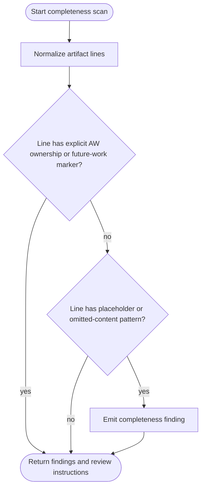
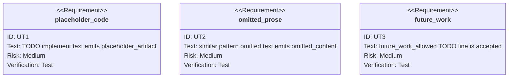

<!-- HANDWRITE-BEGIN gap="missing-generator:schema:eea02923" tracker="pending-tracker" reason="Canonical completeness placeholder gate contract." -->

# AW Completeness Placeholder Gate

## Contract Scenarios
<!-- type: scenarios lang: yaml -->

```yaml
id: completeness-placeholder-gate-scenarios
scenarios:
  - id: S1
    title: placeholder code is rejected
    given:
      - "a CB review artifact is presented as complete"
      - "the artifact contains TODO implement text"
    when:
      - "CB review evaluates completeness guidance"
    then:
      - "review treats the artifact as incomplete"
      - "a placeholder_artifact finding is required"
  - id: S2
    title: omitted prose is rejected
    given:
      - "a generated document uses rest omitted or similar pattern omitted wording"
    when:
      - "CB review evaluates completeness guidance"
    then:
      - "review treats the artifact as truncated"
      - "an omitted_content finding is required"
  - id: S3
    title: explicit future work is allowed
    given:
      - "a TODO line is explicitly marked future_work_allowed"
    when:
      - "CB review evaluates completeness guidance"
    then:
      - "review does not reject that line as a placeholder"
```

## Contract Logic
<!-- type: logic lang: mermaid -->



## Contract Schema
<!-- type: schema lang: yaml -->

```yaml
definitions:
  CompletenessFinding:
    fields:
      code: string
      artifact_ref: string
      line: integer
      pattern: string
      message: string
  CompletenessReviewBrief:
    fields:
      instructions: string[]
      hard_patterns: CompletenessPattern[]
      allowed_markers: string[]
  CompletenessPattern:
    fields:
      pattern: string
      code: string
allowed_markers:
  - handwrite_marker_delimiter
  - generator-gap
  - future_work_allowed
hard_patterns:
  - { pattern: "todo implement", code: "placeholder_artifact" }
  - { pattern: "todo: implement", code: "placeholder_artifact" }
  - { pattern: "rest omitted", code: "omitted_content" }
  - { pattern: "similar pattern omitted", code: "omitted_content" }
  - { pattern: "omitted for brevity", code: "omitted_content" }
  - { pattern: "...", code: "omitted_content" }
```

## Contract CLI
<!-- type: cli lang: yaml -->

```yaml
commands:
  - name: aw
    subcommands:
      - name: cb
        subcommands:
          - name: review
            brief_args:
              completeness_review:
                required: true
                fields: [instructions, hard_patterns, allowed_markers]
            reviewer_tasks:
              - count expected deliverables from TD changes
              - compare produced artifacts with expected deliverables
              - reject placeholder code and omitted prose
              - allow explicit AW ownership and future_work_allowed markers
```

## Contract Unit Test
<!-- type: unit-test lang: mermaid -->



## Contract E2E Test
<!-- type: e2e-test lang: yaml -->

```yaml
e2e_tests:
  - id: completeness-placeholder-unit-command
    capability_id: td-cb-lifecycle-automation
    claim_id: cb-lifecycle-dispatch
    command: cargo test -p agentic-workflow --lib completeness_placeholder_scanner_contract -- --nocapture
    assertions:
      - placeholder code is rejected
      - omitted prose is rejected
      - future_work_allowed TODO is accepted
```

## Contract Changes
<!-- type: changes lang: yaml -->

```yaml
changes:
  - path: projects/agentic-workflow/src/cli/cb.rs
    action: modify
    section: logic
    impl_mode: hand-written
    description: "Adds completeness review instructions and scanner tests."
  - path: projects/agentic-workflow/tech-design/surface/specs/aw-completeness-placeholder-gate.md
    action: create
    section: schema
    impl_mode: hand-written
    description: "Canonical contract for placeholder completeness review behavior."
  - action: annotate
    section: cli
    impl_mode: hand-written
    description: "Traceability metadata edge for the cli section."

  - action: annotate
    section: e2e-test
    impl_mode: hand-written
    description: "Traceability metadata edge for the e2e-test section."

  - action: annotate
    section: scenarios
    impl_mode: hand-written
    description: "Traceability metadata edge for the scenarios section."

  - action: annotate
    section: unit-test
    impl_mode: hand-written
    description: "Traceability metadata edge for the unit-test section."

```
<!-- HANDWRITE-END -->
