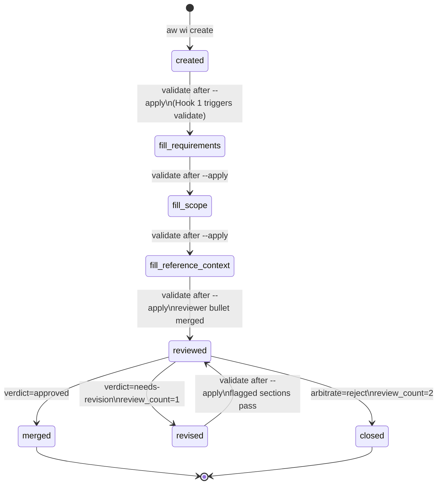
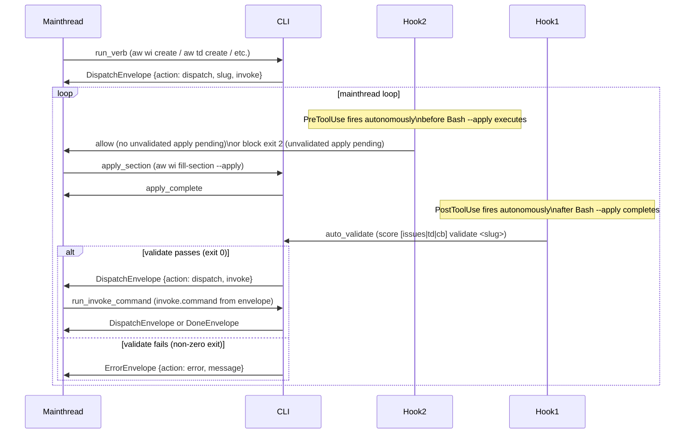
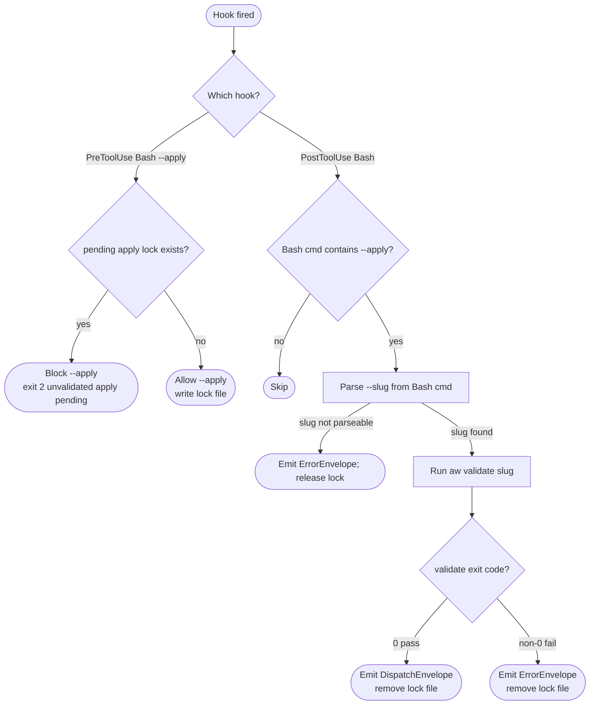

# Score Mainthread-Only Execution

## Envelope Schema
<!-- type: schema lang: yaml -->

```yaml
"$schema": "https://json-schema.org/draft/2020-12/schema"
"$id": "aw-mainthread-only-execution#schema"
title: IssueEnvelope
description: >
  Canonical JSON envelope emitted on stdout by aw wi, aw td, and
  aw cb verbs. The `agent` field is removed; all dispatch is handled by
  mainthread directly. Hook 1 (PostToolUse Bash) auto-triggers validate after
  --apply; Hook 2 (PreToolUse Bash) blocks a second --apply while the first
  is unvalidated. Idle discovery hooks and lifecycle batch scanners are removed.
oneOf:
  - title: DispatchEnvelope
    description: >
      Instructs mainthread to run invoke.command directly (agent-null invoke).
      Replaces the former agent-dispatch variant; the `agent` field is absent.
    type: object
    required: [action, slug, invoke]
    additionalProperties: false
    properties:
      action:
        const: dispatch
      slug:
        type: string
        pattern: "^[a-z0-9-]+$"
      invoke:
        type: object
        required: [command, args]
        additionalProperties: false
        properties:
          command:
            type: string
            description: "CLI command string, e.g. 'aw wi validate my-slug'"
          args:
            type: object
            description: "Named arguments forwarded to the CLI command."

  - title: DoneEnvelope
    description: Terminal success — mainthread prints summary and ends loop.
    type: object
    required: [action, slug]
    additionalProperties: false
    properties:
      action:
        const: done
      slug:
        type: string
        pattern: "^[a-z0-9-]+$"
      message:
        type: string
        description: "Optional human-readable summary."

  - title: ErrorEnvelope
    description: >
      Terminal or recoverable failure. Mainthread surfaces message; if the
      message indicates a fixable payload defect, mainthread re-runs the
      invoke.command. Otherwise ends loop.
    type: object
    required: [action, slug, message]
    additionalProperties: false
    properties:
      action:
        const: error
      slug:
        type: string
        pattern: "^[a-z0-9-]+$"
      message:
        type: string
```
## CRRR Phase Machine
<!-- type: state-machine lang: mermaid -->


## Mainthread Hook Interaction
<!-- type: interaction lang: mermaid -->


## Hook Decision Logic
<!-- type: logic lang: mermaid -->


## Changes
<!-- type: changes lang: yaml -->

```yaml
changes:
  # R1: Remove all score-* subagent definition files
  - path: .claude/agents/score-issue-author.md
    action: delete
    section: interaction
    description: "Remove score-issue-author subagent definition (R1)"
    impl_mode: hand-written

  - path: .claude/agents/score-issue-reviewer.md
    action: delete
    section: interaction
    description: "Remove score-issue-reviewer subagent definition (R1)"
    impl_mode: hand-written

  - path: .claude/agents/score-issue-reviser.md
    action: delete
    section: interaction
    description: "Remove score-issue-reviser subagent definition (R1)"
    impl_mode: hand-written

  - path: .claude/agents/score-td-author.md
    action: delete
    section: interaction
    description: "Remove score-td-author subagent definition (R1)"
    impl_mode: hand-written

  - path: .claude/agents/score-cb-handwriter.md
    action: delete
    section: interaction
    description: "Remove score-cb-handwriter subagent definition (R1)"
    impl_mode: hand-written

  # R1: Delete agents template directory
  - path: projects/agentic-workflow/templates/mainthread/agents/
    action: delete
    section: interaction
    description: "Delete entire agents/ template directory (R1)"
    impl_mode: hand-written

  # R2: Update envelope builders to emit agent: null / omit agent field
  - path: projects/agentic-workflow/src/cli/issues.rs
    action: modify
    section: interaction
    description: "Remove agent field from all dispatch envelopes; IssueEnvelope dispatch variant drops agent (R2, R10)"
    impl_mode: hand-written

  - path: projects/agentic-workflow/src/cli/td.rs
    action: modify
    section: interaction
    description: "Remove agent field from all td dispatch envelopes (R2)"
    impl_mode: hand-written

  - path: projects/agentic-workflow/src/cli/cb_fill.rs
    action: modify
    section: interaction
    description: "Remove agent field from cb fill dispatch envelopes (R2, R12)"
    impl_mode: hand-written

  - path: projects/agentic-workflow/src/cli/cb_gen.rs
    action: modify
    section: interaction
    description: "Remove agent field from cb gen dispatch envelopes (R2)"
    impl_mode: hand-written

  - path: projects/agentic-workflow/src/cli/cb_review.rs
    action: modify
    section: interaction
    description: "Remove agent field from cb review dispatch envelopes (R2)"
    impl_mode: hand-written

  # R3: Rewrite mainthread skill prompts
  - path: projects/agentic-workflow/templates/mainthread/skills/score-issue/SKILL.md
    action: modify
    section: logic
    description: "Rewrite: replace Agent(subagent_type=score-issue-author) dispatch with mainthread loop step (R3)"
    impl_mode: hand-written

  - path: projects/agentic-workflow/templates/mainthread/skills/score-td/SKILL.md
    action: modify
    section: logic
    description: "Rewrite: replace Agent(subagent_type=score-td-author) dispatch with mainthread loop step (R3)"
    impl_mode: hand-written

  - path: projects/agentic-workflow/templates/mainthread/skills/score-cb-fill/SKILL.md
    action: modify
    section: logic
    description: "Rewrite: replace Agent(subagent_type=score-cb-handwriter) dispatch with mainthread loop step (R3)"
    impl_mode: hand-written

  # R4: Implement hooks as shell scripts
  - path: .claude/hooks/hook1-post-apply-validate.sh
    action: create
    section: interaction
    description: "Hook 1 (PostToolUse Bash): detect --apply in Bash cmd, auto-run aw validate <slug>, emit DispatchEnvelope or ErrorEnvelope (R4, R6)"
    impl_mode: hand-written

  - path: .claude/hooks/hook2-pre-apply-guard.sh
    action: create
    section: interaction
    description: "Hook 2 (PreToolUse Bash): check pending apply lock, block second --apply while first is unvalidated (R4, R7)"
    impl_mode: hand-written

  # R4: Register hooks in .claude/settings.json
  - path: .claude/settings.json
    action: modify
    section: interaction
    description: "Register Hook 1 (PostToolUse) and Hook 2 (PreToolUse) in hooks array (R4)"
    impl_mode: hand-written

  # R6: Hook 1 PostToolUse auto-validate test fixture
  - path: projects/agentic-workflow/tests/hooks/hook1_post_apply_validate.sh
    action: create
    section: logic
    description: >
      Integration test fixture for R6 (Hook 1 PostToolUse). Simulates a
      `aw wi fill-section --apply` Bash call, then fires hook1-post-apply-validate.sh
      as PostToolUse. Asserts: (a) aw validate is invoked with the correct slug,
      (b) a DispatchEnvelope is emitted on stdout when validate exits 0,
      (c) an ErrorEnvelope is emitted when validate exits non-zero.
      Pass: all three assertions exit 0; the lock file is removed after each run.
    impl_mode: hand-written

  # R7: Hook 2 PreToolUse reject-orphaned-apply test fixture
  - path: projects/agentic-workflow/tests/hooks/hook2_pre_apply_guard.sh
    action: create
    section: logic
    description: >
      Integration test fixture for R7 (Hook 2 PreToolUse). Creates a synthetic
      pending-apply lock file, then fires hook2-pre-apply-guard.sh as PreToolUse
      against a second `--apply` Bash call. Asserts: (a) the hook exits 2 with
      reason "unvalidated apply pending" when the lock exists, (b) the hook exits 0
      and writes the lock file when no prior lock is present.
      Pass: both assertions exit as expected; no stale lock files remain after cleanup.
    impl_mode: hand-written

  # R10: Update envelope schema spec
  - path: projects/agentic-workflow/tech-design/surface/specs/issue-cli-envelope.md
    action: modify
    section: interaction
    description: "Deprecate/remove agent field from dispatch envelope schema; update R6 requirement; update interaction diagram to remove SubagentStop hook actor (R10)"
    impl_mode: hand-written

  # R11: Update CRRR state machine spec
  - path: projects/agentic-workflow/tech-design/surface/specs/issue-crrr-state-machine.md
    action: modify
    section: state-machine
    description: "Remove subagent dispatch boxes from all flow diagrams; replace with mainthread loop steps and Hook 1 trigger annotations (R11)"
    impl_mode: hand-written

  # R12: Update cb fill workflow spec
  - path: projects/agentic-workflow/tech-design/surface/specs/score-cb-fill-workflow.md
    action: modify
    section: logic
    description: "Update brief mode to emit agent: null dispatch; remove score-cb-handwriter subagent reference; reflect mainthread-only execution (R12)"
    impl_mode: hand-written

  # R3: Update three-role contract spec
  - path: projects/agentic-workflow/tech-design/surface/specs/three-role-contract.md
    action: modify
    section: logic
    description: >
      Update the three-column role table: drop the Subagent column; replace with
      Hook column documenting Hook 1 (PostToolUse auto-validate), Hook 2
      (PreToolUse apply guard), and explicit mainthread continuation.
      Mainthread column retains sole ownership of run_verb, run_invoke_command,
      and validate. CLI column remains unchanged. (R3)
    impl_mode: hand-written

  # R3/CLAUDE.md: Update mainthread protocol docs
  - path: CLAUDE.md
    action: modify
    section: interaction
    description: "Replace subagent dispatch protocol section with mainthread-only protocol; document Hook 1/2/5 (R3)"
    impl_mode: hand-written

  - path: projects/agentic-workflow/CLAUDE.md
    action: modify
    section: interaction
    description: "Mirror CLAUDE.md protocol update for aw project (R3)"
    impl_mode: hand-written

  # New spec (this file)
  - path: projects/agentic-workflow/tech-design/surface/specs/aw-mainthread-only-execution.md
    action: create
    section: logic
    description: "This spec — documents envelope schema, CRRR phase machine, mainthread hook interaction, and hook decision logic for mainthread-only execution"
    impl_mode: hand-written
  - action: annotate
    section: schema
    impl_mode: hand-written
    description: "Traceability metadata edge for the schema section."

```

# Reviews

## Review 2
<!-- type: review lang: markdown -->

**Verdict:** approved

- [logic] (checklist-item-5) `h1_slug_missing` terminal node and parse-failure edge are present and correct. ErrorEnvelope emission + lock release on missing slug is fully specified. Finding resolved.
- [interaction] (checklist-item-5) Hook 2 is now modeled as an autonomous `Note over Hook2: PreToolUse fires autonomously` + `Hook2->>Mainthread` flow, correctly inverting the prior causality. The `alt/else` block on Hook 1 now covers both `DispatchEnvelope` (exit 0) and `ErrorEnvelope` (non-zero exit) return paths. Finding resolved.
- [changes] (checklist-item-6) Both `hook1_post_apply_validate.sh` and `hook2_pre_apply_guard.sh` test fixtures are present with concrete assertions and pass criteria. `three-role-contract.md` entry is present with a description that explicitly names the dropped Subagent column and the new Hook column. Both findings resolved.

## Review 1
<!-- type: review lang: markdown -->

**Verdict:** needs-revision

- [changes] (checklist-item-6) R6 and R7 each require a test fixture ("A test fixture must demonstrate Hook 1 firing" / "Hook 2 firing"), but the Changes section has no file entries for these fixtures. An implementer has no location, format, or mechanism to target. Add at least one changes entry per requirement — e.g. a shell-based integration test under `projects/agentic-workflow/tests/hooks/` or a Rust test in the relevant `_test.rs` file — with a description of what the fixture exercises and what passing looks like.

- [changes] (checklist-item-6) `three-role-contract.md` is explicitly called out in the issue's Reference Context spec plan ("three-role-contract | update | ... overview, requirements, changes") and in the Scope section ("the contract doc needs an updated three-column table"), but it has no entry in the Changes section. This is a missing file scope — the contract document is the primary artifact that defines mainthread/subagent/hook role separation, and without updating it the design is incomplete relative to what the issue commits to deliver.

- [logic] (checklist-item-5) The `h1_parse_slug` node has no error branch. If the Bash command matched by Hook 1 contains `--apply` but no parseable `--slug` (e.g. `aw td merge --apply` where the slug is positional, or a malformed invocation), the flowchart has no exit path from `h1_parse_slug`. Add a `h1_slug_missing` terminal node and an edge `h1_parse_slug → h1_slug_missing` (label: "slug not found") emitting an ErrorEnvelope, so the hook degrades gracefully rather than crashing or silently forwarding a blank slug to validate.

- [interaction] (checklist-item-5) The sequence diagram models `Mainthread->>Hook2: PreToolUse — check_pending_apply`, inverting the actual control flow: Claude Code fires PreToolUse/PostToolUse as autonomous framework events, not as calls initiated by Mainthread. This misrepresentation would mislead implementers into thinking mainthread must explicitly invoke the guard. Redraw Hook 1 and Hook 2 as self-triggering participants that intercept the Bash tool call autonomously. Additionally, the Hook 1 return path only shows `DispatchEnvelope` — the `ErrorEnvelope` branch (when validate returns non-zero) is absent from the sequence diagram.
