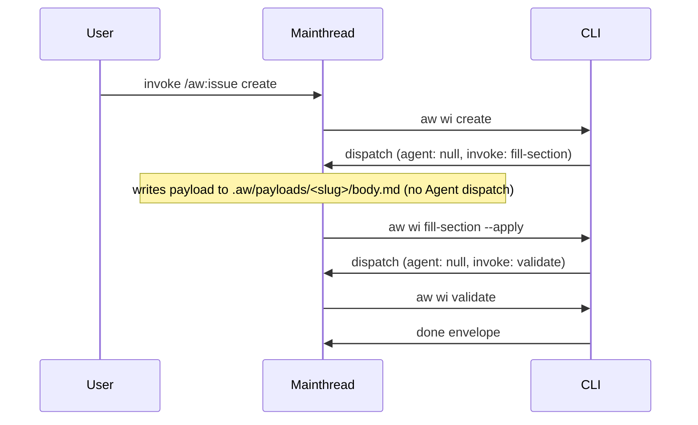
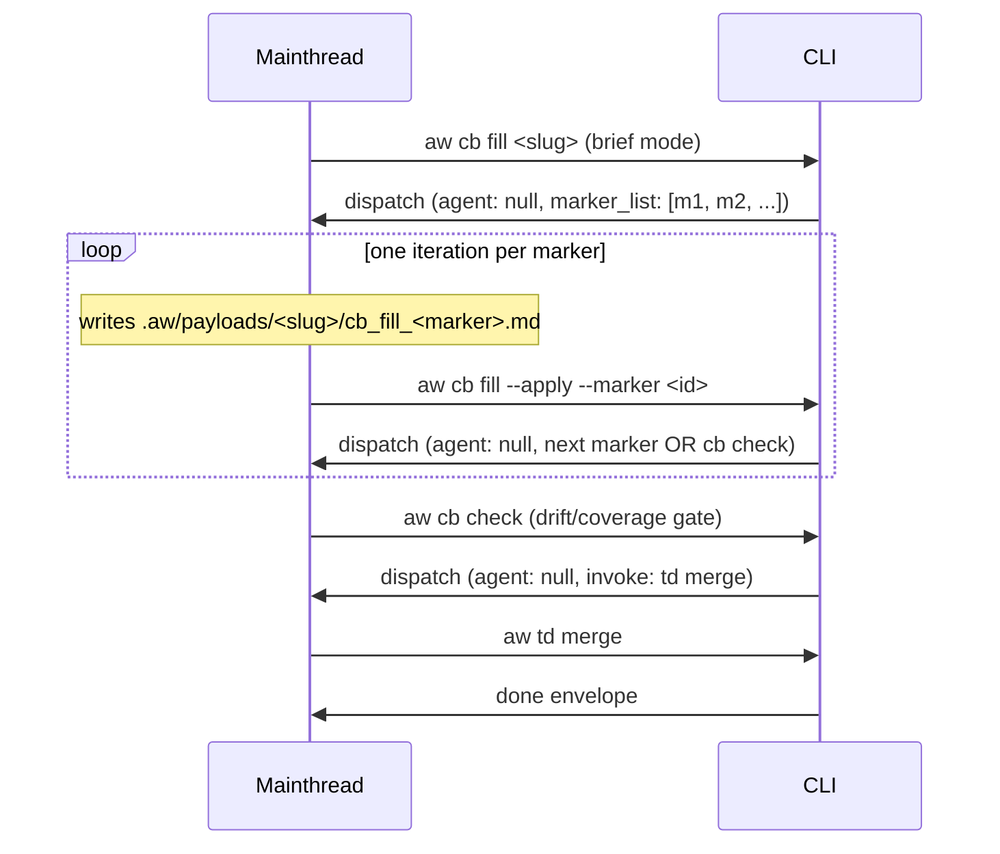

## Interaction: mainthread-only CRRR after agent-files removal
<!-- type: interaction lang: mermaid -->



### cb-fill marker loop (per-marker dispatch, then check, then merge)

The `score-cb-fill` skill rewrite drives a different envelope shape than the
issues/td CRRR flow above: it loops once per HANDWRITE marker emitted by
`aw cb fill` (brief mode), then runs `aw cb check` as the gate, then
`aw td merge` as the terminal advance. Implementer must wire the
mainthread loop to this envelope rhythm — not the single-payload CRRR
rhythm of the issues/td flow.


## Changes
<!-- type: changes lang: yaml -->

```yaml
# Phase 2: rewrite skill templates + delete stale agent files atomically
# Every entry is impl_mode: hand-written (markdown / agent-definition files
# outside the codegen surface).

changes:
  # R1: Rewrite four mainthread skill templates so they instruct mainthread
  # to take over --apply / validate directly instead of dispatching
  # Agent(subagent_type=score-*).
  - path: projects/agentic-workflow/templates/mainthread/skills/score-issue/SKILL.md
    action: modify
    section: changes
    impl_mode: hand-written
    description: |
      Replace every `Agent(subagent_type=score-issue-author |
      score-issue-reviewer | score-issue-reviser)` instruction with the
      mainthread-takeover loop wording: write payload, run
      `aw wi fill-section --apply --section <X>`, run
      `aw wi validate`, loop on emitted dispatch envelopes.
      Also rewrite any markdown table or prose phrasing of the form
      `` Dispatch `score-*` agent ``, `score-issue-* subagent`, or
      `subagent: score-issue-*` so no residual stale-agent wording
      survives — the R4 acceptance grep below catches both forms.

  - path: projects/agentic-workflow/templates/mainthread/skills/score-td-init/SKILL.md
    action: modify
    section: changes
    impl_mode: hand-written
    description: |
      Replace every `Agent(subagent_type=score-td-author |
      score-td-reviewer | score-td-reviser)` with mainthread-direct
      payload-write + `aw td create --apply --section <X>` +
      `aw td validate --spec-path <path>` flow. Update the Mermaid
      flow diagram to drop the Agent boxes. Also rewrite any
      `` Dispatch `score-td-*` agent `` / `score-td-* subagent` table
      cells or prose so no stale-agent wording remains.

  - path: projects/agentic-workflow/templates/mainthread/skills/score-td-create/SKILL.md
    action: modify
    section: changes
    impl_mode: hand-written
    description: |
      Same rewrite as score-td-init/SKILL.md but for the resume-stalled
      flow; mainthread reads current TD phase, writes the next section
      payload, runs `aw td create --apply --section <X>`, validates.
      Same table/prose-phrasing sweep as score-td-init.

  - path: projects/agentic-workflow/templates/mainthread/skills/score-cb-fill/SKILL.md
    action: modify
    section: changes
    impl_mode: hand-written
    description: |
      Replace `Agent(subagent_type=score-cb-handwriter)` with mainthread
      per-marker loop: read marker list from `aw cb fill` brief
      envelope, write each marker's body to
      `.aw/payloads/<slug>/cb_fill_<marker>.md`, run
      `aw cb fill --apply --marker <id>`, repeat until all markers
      filled, then `aw cb check` then `aw td merge`. Sweep the
      same table/prose phrasings (`` Dispatch `score-cb-handwriter`
      agent ``, `score-cb-handwriter subagent`) so they do not survive.

  # R3: score-cb-handwriter/SKILL.md outcome — delete (it is a thin
  # wrapper that exists only to invoke its namesake subagent; with that
  # agent removed, the skill has no remaining function — score-cb-fill
  # already provides the user-facing entry point).
  - path: projects/agentic-workflow/templates/mainthread/skills/score-cb-handwriter/
    action: delete
    section: changes
    impl_mode: hand-written
    description: |
      Delete the entire score-cb-handwriter skill directory. The
      score-cb-fill skill handles the same workflow under the new
      mainthread-only model.

  # R2a: Delete eight installed score-* agent definitions.
  - path: .claude/agents/score-issue-author.md
    action: delete
    section: interaction
    impl_mode: hand-written
    description: "Remove score-issue-author subagent definition (R2)."

  - path: .claude/agents/score-issue-reviewer.md
    action: delete
    section: interaction
    impl_mode: hand-written
    description: "Remove score-issue-reviewer subagent definition (R2)."

  - path: .claude/agents/score-issue-reviser.md
    action: delete
    section: interaction
    impl_mode: hand-written
    description: "Remove score-issue-reviser subagent definition (R2)."

  - path: .claude/agents/score-td-author.md
    action: delete
    section: interaction
    impl_mode: hand-written
    description: "Remove score-td-author subagent definition (R2)."

  - path: .claude/agents/score-td-reviewer.md
    action: delete
    section: interaction
    impl_mode: hand-written
    description: "Remove score-td-reviewer subagent definition (R2)."

  - path: .claude/agents/score-td-reviser.md
    action: delete
    section: interaction
    impl_mode: hand-written
    description: "Remove score-td-reviser subagent definition (R2)."

  - path: .claude/agents/score-cb-handwriter.md
    action: delete
    section: interaction
    impl_mode: hand-written
    description: "Remove score-cb-handwriter subagent definition (R2)."

  - path: .claude/agents/score-review.md
    action: delete
    section: interaction
    impl_mode: hand-written
    description: "Remove score-review subagent definition (R2)."

  # R2b: Delete ten template copies under projects/agentic-workflow/templates/mainthread/agents/.
  - path: projects/agentic-workflow/templates/mainthread/agents/score-issue-author.md
    action: delete
    section: interaction
    impl_mode: hand-written
    description: "Template copy of score-issue-author (R2)."

  - path: projects/agentic-workflow/templates/mainthread/agents/score-issue-reviewer.md
    action: delete
    section: interaction
    impl_mode: hand-written
    description: "Template copy of score-issue-reviewer (R2)."

  - path: projects/agentic-workflow/templates/mainthread/agents/score-issue-reviser.md
    action: delete
    section: interaction
    impl_mode: hand-written
    description: "Template copy of score-issue-reviser (R2)."

  - path: projects/agentic-workflow/templates/mainthread/agents/score-td-author.md
    action: delete
    section: interaction
    impl_mode: hand-written
    description: "Template copy of score-td-author (R2)."

  - path: projects/agentic-workflow/templates/mainthread/agents/score-td-reviewer.md
    action: delete
    section: interaction
    impl_mode: hand-written
    description: "Template copy of score-td-reviewer (R2)."

  - path: projects/agentic-workflow/templates/mainthread/agents/score-td-reviser.md
    action: delete
    section: interaction
    impl_mode: hand-written
    description: "Template copy of score-td-reviser (R2)."

  - path: projects/agentic-workflow/templates/mainthread/agents/score-cb-handwriter.md
    action: delete
    section: interaction
    impl_mode: hand-written
    description: "Template copy of score-cb-handwriter (R2)."

  - path: projects/agentic-workflow/templates/mainthread/agents/score-cb-reviewer.md
    action: delete
    section: interaction
    impl_mode: hand-written
    description: "Template copy of score-cb-reviewer (R2)."

  - path: projects/agentic-workflow/templates/mainthread/agents/score-cb-reviser.md
    action: delete
    section: interaction
    impl_mode: hand-written
    description: "Template copy of score-cb-reviser (R2)."

  - path: projects/agentic-workflow/templates/mainthread/agents/score-review.md
    action: delete
    section: interaction
    impl_mode: hand-written
    description: "Template copy of score-review (R2)."

  # R4 (docs sync): update installed user-facing skill copies under
  # .claude/skills/ that mirror the four templates above.
  - path: .claude/skills/score-issue/SKILL.md
    action: modify
    section: interaction
    impl_mode: hand-written
    description: |
      Mirror the rewrite in projects/agentic-workflow/templates/mainthread/skills/
      score-issue/SKILL.md so the installed user-facing skill matches.
      Includes the same table/prose-phrasing sweep so the second R4
      acceptance grep also returns zero on the installed copy.

  - path: .claude/skills/score-td-init/SKILL.md
    action: modify
    section: interaction
    impl_mode: hand-written
    description: "Mirror score-td-init/SKILL.md template rewrite (incl. table/prose sweep)."

  - path: .claude/skills/score-td-create/SKILL.md
    action: modify
    section: interaction
    impl_mode: hand-written
    description: "Mirror score-td-create/SKILL.md template rewrite (incl. table/prose sweep)."
```

### R4 acceptance grep — broadened (addresses Review 1 finding)

The acceptance audit now runs **two** greps to catch both the code-style
`Agent(subagent_type=...)` invocation form AND the markdown table /
prose phrasings (`` Dispatch `score-*` agent ``, `score-* subagent`,
`subagent: score-*`). Both greps must return zero matches across the
four template paths and three installed skill copies above.

```bash
# Form 1 — code-style invocation (original grep)
grep -rE 'Agent\(subagent_type=score-' \
  projects/agentic-workflow/templates/mainthread/skills/{score-issue,score-td-init,score-td-create,score-cb-fill}/SKILL.md \
  .claude/skills/{score-issue,score-td-init,score-td-create}/SKILL.md
# expect: 0 matches

# Form 2 — table / prose wording (NEW; catches the cases the first grep misses)
grep -rEi 'Dispatch[[:space:]]*`?score-(issue|td|cb)-[a-z-]+`?[[:space:]]*agent|score-(issue|td|cb)-[a-z-]+[[:space:]]+subagent|subagent_type[[:space:]]*[:=][[:space:]]*"?score-(issue|td|cb)-' \
  projects/agentic-workflow/templates/mainthread/skills/{score-issue,score-td-init,score-td-create,score-cb-fill}/SKILL.md \
  .claude/skills/{score-issue,score-td-init,score-td-create}/SKILL.md
# expect: 0 matches
```
```
# Reviews

## Review 1
<!-- type: review lang: markdown -->

**Verdict:** needs-revision

- [changes] R4 acceptance grep `'Agent(subagent_type=score-'` will miss table-style references like `` Dispatch `score-td-author` agent `` that exist in the installed `.claude/skills/score-td-create/SKILL.md`. The Changes table includes the file as `modify` but the acceptance grep would not flag residual stale language post-Phase-2. Either broaden the grep to `'subagent_type=score-\|Dispatch.*score-.*agent\|Agent(subagent_type=score-'` so the audit catches both wordings, or add an explicit second grep to R4 acceptance that scans for `Dispatch.*score-(issue|td|cb)-` markdown table cells.
- [interaction] The Interaction Mermaid diagram only depicts the issues CRRR flow (`aw wi create` → fill-section → validate → done). The Changes section also rewrites `score-cb-fill/SKILL.md` whose loop is materially different — per-marker fill, then `cb check`, then `td merge`. Add a second sequence diagram (or extend the existing one with the cb-fill branch) so the implementer can see exactly which envelope shape they are wiring for the cb-fill skill rewrite.

## Review 2
<!-- type: review lang: markdown -->

**Verdict:** approved

- [changes] (checklist-item-1) Round 1 finding resolved. The R4 acceptance grep subsection now runs two greps: Form 1 catches `Agent(subagent_type=score-` code-style invocations; Form 2's regex catches `` Dispatch `score-*` agent ``, `score-* subagent`, and `subagent_type[:=]"?score-` table/prose phrasings. Each of the four skill-rewrite descriptions explicitly calls out sweeping table/prose phrasing, giving implementers unambiguous acceptance criteria for both wording forms.
- [interaction] (checklist-item-3) Round 1 finding resolved. A second Mermaid Plus sequence diagram (`id: mainthread-only-cb-fill-loop`) is present with a prose explanation distinguishing its per-marker loop rhythm from the CRRR flow. The diagram covers `aw cb fill` brief → per-marker loop → `aw cb check` gate → `aw td merge` terminal, giving implementers the exact envelope shape needed when wiring the cb-fill skill rewrite.

## Traceability Changes
<!-- type: changes lang: yaml -->

```yaml
changes:
  - action: annotate
    section: interaction
    impl_mode: hand-written
    description: "Traceability metadata edge for the interaction section."
```
