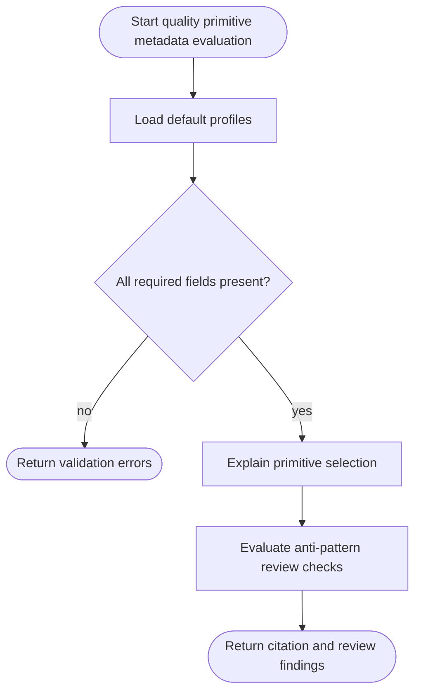

# Quality Primitive Metadata

## Overview
<!-- type: overview lang: markdown -->

Public API manifest for `projects/agentic-workflow/src/generate/generators/quality_primitives.rs`.
Quality primitive metadata is a sidecar to the existing primitive registry:
it explains applicability, required fallbacks, review checks, anti-patterns,
and evidence expectations without changing primitive emission behavior.

### Symbols

| Name | Target | Kind | Visibility | Line | Signature |
|------|--------|------|------------|------|-----------|
| `PrimitiveDialCompatibility` | projects/agentic-workflow/src/generate/generators/quality_primitives.rs | struct | pub | 41 |  |
| `PrimitiveDialSupport` | projects/agentic-workflow/src/generate/generators/quality_primitives.rs | enum | pub | 10 |  |
| `PrimitiveEvidenceExample` | projects/agentic-workflow/src/generate/generators/quality_primitives.rs | struct | pub | 59 |  |
| `PrimitiveEvidenceKind` | projects/agentic-workflow/src/generate/generators/quality_primitives.rs | enum | pub | 29 |  |
| `PrimitiveReviewCheck` | projects/agentic-workflow/src/generate/generators/quality_primitives.rs | struct | pub | 50 |  |
| `PrimitiveReviewFinding` | projects/agentic-workflow/src/generate/generators/quality_primitives.rs | struct | pub | 103 |  |
| `PrimitiveReviewSeverity` | projects/agentic-workflow/src/generate/generators/quality_primitives.rs | enum | pub | 20 |  |
| `PrimitiveSelectionCitation` | projects/agentic-workflow/src/generate/generators/quality_primitives.rs | struct | pub | 92 |  |
| `PrimitiveSelectionRequest` | projects/agentic-workflow/src/generate/generators/quality_primitives.rs | struct | pub | 83 |  |
| `QualityPrimitiveProfile` | projects/agentic-workflow/src/generate/generators/quality_primitives.rs | struct | pub | 67 |  |
| `default_quality_primitive_profiles` | projects/agentic-workflow/src/generate/generators/quality_primitives.rs | function | pub | 111 | default_quality_primitive_profiles() -> Vec<QualityPrimitiveProfile> |
| `evaluate_primitive_review_checks` | projects/agentic-workflow/src/generate/generators/quality_primitives.rs | function | pub | 312 | evaluate_primitive_review_checks(profile: &QualityPrimitiveProfile, artifact_text: &str) -> Vec<PrimitiveReviewFinding> |
| `explain_primitive_selection` | projects/agentic-workflow/src/generate/generators/quality_primitives.rs | function | pub | 258 | explain_primitive_selection(profiles: &[QualityPrimitiveProfile], request: &PrimitiveSelectionRequest) -> PrimitiveSelectionCitation |
| `find_quality_primitive_profile` | projects/agentic-workflow/src/generate/generators/quality_primitives.rs | function | pub | 191 | find_quality_primitive_profile(name: &str) -> Option<QualityPrimitiveProfile> |
| `validate_quality_primitive_profiles` | projects/agentic-workflow/src/generate/generators/quality_primitives.rs | function | pub | 199 | validate_quality_primitive_profiles(profiles: &[QualityPrimitiveProfile]) -> Vec<String> |

## Schema
<!-- type: schema lang: yaml -->

```yaml
definitions:
  PrimitiveDialSupport:
    enum: [required, supported, unsupported]
  PrimitiveReviewSeverity:
    enum: [hard, advisory]
  PrimitiveEvidenceKind:
    enum: [test, screenshot, transcript, link_check, source_annotation, review_note]
  PrimitiveDialCompatibility:
    fields:
      dial: string
      support: PrimitiveDialSupport
      rationale: string
  PrimitiveReviewCheck:
    fields:
      id: string
      severity: PrimitiveReviewSeverity
      description: string
  PrimitiveEvidenceExample:
    fields:
      kind: PrimitiveEvidenceKind
      description: string
  QualityPrimitiveProfile:
    fields:
      name: string
      artifact_kind: ArtifactKind
      dial_compatibility: PrimitiveDialCompatibility[]
      when_to_use: string[]
      not_for: string[]
      required_inputs: string[]
      required_fallbacks: string[]
      anti_patterns: string[]
      review_checks: PrimitiveReviewCheck[]
      evidence_examples: PrimitiveEvidenceExample[]
  PrimitiveSelectionRequest:
    fields:
      primitive_name: string
      artifact_kind: ArtifactKind
      requested_dials: string[]
  PrimitiveSelectionCitation:
    fields:
      primitive_name: string
      applicable: bool
      matched_fields: string[]
      rejected_fields: string[]
      evidence_expectations: string[]
  PrimitiveReviewFinding:
    fields:
      check_id: string
      severity: PrimitiveReviewSeverity
      message: string
defaults:
  required_profiles:
    - frontend_page_responsive_shell
    - cli_help_command_tree
    - documentation_capability_contract
```

## Logic
<!-- type: logic lang: mermaid -->



## Unit Test
<!-- type: unit-test lang: mermaid -->

```mermaid
---
id: aw-quality-primitive-metadata-unit-test
coverage_kind: unit
strategy: validate default profiles, selection citations, and review findings
evidence:
  source_tests:
    - projects/agentic-workflow/src/generate/generators/quality_primitives.rs
---
requirementDiagram
  requirement default_profiles {
    id: UT1
    text: default quality primitive profiles validate and include frontend page, CLI help, and documentation examples
    risk: medium
    verifymethod: test
  }
  requirement selection_citation {
    id: UT2
    text: selection citation records matched fields, rejected fields, and evidence expectations
    risk: medium
    verifymethod: test
  }
  requirement review_findings {
    id: UT3
    text: anti-pattern review checks emit findings with check id and severity
    risk: medium
    verifymethod: test
  }
```

## Changes
<!-- type: changes lang: yaml -->

```yaml
changes:
  - path: projects/agentic-workflow/tech-design/surface/specs/aw-quality-primitive-metadata.md
    action: create
    section: schema
    impl_mode: hand-written
    description: "Canonical quality primitive metadata contract."
  - path: projects/agentic-workflow/src/generate/generators/quality_primitives.rs
    action: create
    section: schema
    impl_mode: hand-written
    description: "Quality primitive profile models, defaults, validation, selection citation, and review helpers."
  - path: projects/agentic-workflow/src/generate/generators/mod.rs
    action: modify
    section: dependency
    impl_mode: hand-written
    description: "Expose quality primitive metadata beside the existing primitive registry facade."
  - action: annotate
    section: logic
    impl_mode: hand-written
    description: "Traceability metadata edge for the logic section."

  - action: annotate
    section: unit-test
    impl_mode: hand-written
    description: "Traceability metadata edge for the unit-test section."

```
