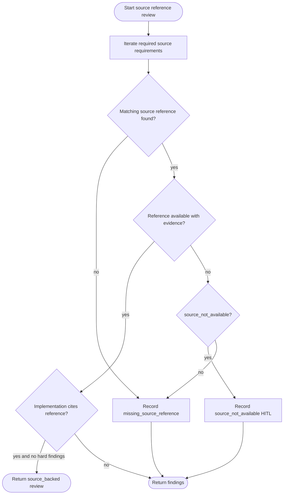

# Source-First Reference Artifacts

## Overview
<!-- type: overview lang: markdown -->

Source-first artifacts require explicit reference evidence before CB review can
accept an implementation that claims fidelity to that reference. The policy is
artifact-kind neutral: UI can use visual references, CLI can use transcripts,
API can use request/response examples, docs can use outlines, and tests can use
validation inventories. Missing required references are hard failures unless
the policy explicitly marks the source as a HITL decision.

### Symbols

| Name | Target | Kind | Visibility | Line | Signature |
|------|--------|------|------------|------|-----------|
| `SourceReferenceKind` | projects/agentic-workflow/src/models/source_reference.rs | enum | pub | 7 |  |
| `SourceReferenceAvailability` | projects/agentic-workflow/src/models/source_reference.rs | enum | pub | 18 |  |
| `SourceFailureMode` | projects/agentic-workflow/src/models/source_reference.rs | enum | pub | 27 |  |
| `SourceReferenceRequirement` | projects/agentic-workflow/src/models/source_reference.rs | struct | pub | 35 |  |
| `SourceReferencePolicy` | projects/agentic-workflow/src/models/source_reference.rs | struct | pub | 45 |  |
| `SourceReference` | projects/agentic-workflow/src/models/source_reference.rs | struct | pub | 53 |  |
| `SourceReviewSeverity` | projects/agentic-workflow/src/models/source_reference.rs | enum | pub | 70 |  |
| `SourceReviewFinding` | projects/agentic-workflow/src/models/source_reference.rs | struct | pub | 78 |  |
| `SourceReferenceReview` | projects/agentic-workflow/src/models/source_reference.rs | struct | pub | 86 |  |
| `evaluate_source_references` | projects/agentic-workflow/src/models/source_reference.rs | function | pub | 93 | evaluate_source_references(policy: &SourceReferencePolicy, references: &[SourceReference], implementation_citations: &[String]) -> SourceReferenceReview |

## Schema
<!-- type: schema lang: yaml -->

```yaml
definitions:
  SourceReferenceKind:
    enum: [visual_reference, cli_transcript, api_contract, doc_outline, validation_inventory]
  SourceReferenceAvailability:
    enum: [available, missing, source_not_available]
  SourceFailureMode:
    enum: [hard_fail, hitl_required, advisory]
  SourceReferenceRequirement:
    fields:
      kind: SourceReferenceKind
      required: bool
      failure_mode: SourceFailureMode
      rationale: string?
  SourceReferencePolicy:
    fields:
      profile_name: string
      requirements: SourceReferenceRequirement[]
  SourceReference:
    fields:
      id: string
      kind: SourceReferenceKind
      availability: SourceReferenceAvailability
      citation: string?
      transcript: string?
      request_response: string?
      outline: string?
  SourceReviewSeverity:
    enum: [hard, advisory, hitl]
  SourceReviewFinding:
    fields:
      code: string
      severity: SourceReviewSeverity
      message: string
  SourceReferenceReview:
    fields:
      source_backed: bool
      findings: SourceReviewFinding[]
```

## Logic
<!-- type: logic lang: mermaid -->



## Unit Test
<!-- type: unit-test lang: mermaid -->

```mermaid
---
id: aw-source-first-reference-artifacts-unit-test
coverage_kind: unit
strategy: missing required source, source-backed API contract, and HITL source_not_available
evidence:
  source_tests:
    - projects/agentic-workflow/src/models/source_reference.rs
---
requirementDiagram
  requirement missing_source {
    id: UT1
    text: missing required CLI transcript emits hard missing_source_reference and source_backed=false
    risk: medium
    verifymethod: test
  }
  requirement api_source_backed {
    id: UT2
    text: available API contract with implementation citation passes source_backed
    risk: medium
    verifymethod: test
  }
  requirement source_not_available {
    id: UT3
    text: explicit source_not_available emits HITL finding instead of fake evidence
    risk: medium
    verifymethod: test
  }
```

## Changes
<!-- type: changes lang: yaml -->

```yaml
changes:
  - path: projects/agentic-workflow/tech-design/surface/specs/aw-source-first-reference-artifacts.md
    action: create
    section: schema
    impl_mode: hand-written
    description: "Canonical source-first reference artifact policy."
  - path: projects/agentic-workflow/src/models/source_reference.rs
    action: create
    section: schema
    impl_mode: hand-written
    description: "Source reference policy, references, review findings, evaluation helper, and unit tests."
  - path: projects/agentic-workflow/src/models/mod.rs
    action: modify
    section: dependency
    impl_mode: hand-written
    description: "Expose source reference models beside artifact quality models."
  - action: annotate
    section: logic
    impl_mode: hand-written
    description: "Traceability metadata edge for the logic section."

  - action: annotate
    section: unit-test
    impl_mode: hand-written
    description: "Traceability metadata edge for the unit-test section."

```
