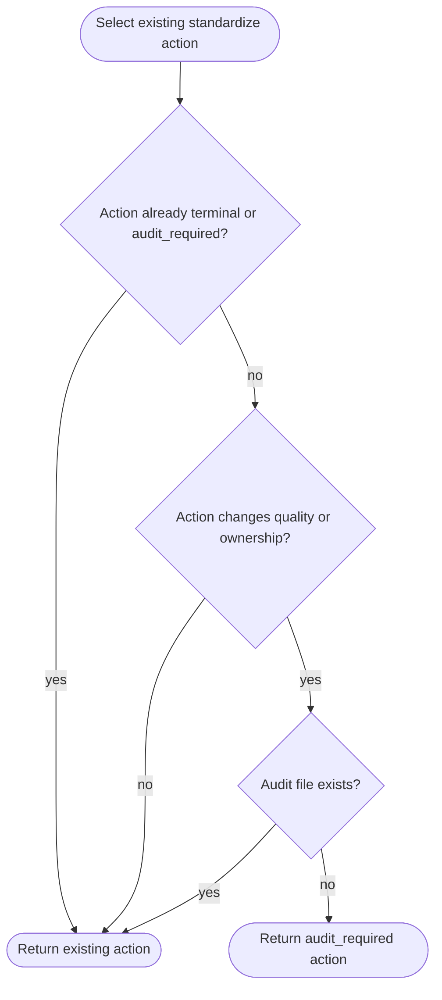

# Standardize Audit-First Quality

## Overview
<!-- type: overview lang: markdown -->

`aw standardize` must record a preservation baseline before it mutates source
ownership, artifact quality, generated-source boundaries, command contracts,
documentation contracts, or route/API surfaces. The audit is intentionally local and bounded:
`.aw/standardize/audit/<project>.json` records the project, optional scope,
preserved surfaces, known quality debt, and low-risk modernization levers.

The audit gate wraps existing `managed`, `semantic`, and `regenerable`
`next`/`run` action selection. When a selected action is quality-changing and no
audit file exists, the public `next_action` becomes `audit_required` with a
mainthread command that records the audit. Existing completion actions,
blockers, and non-quality actions pass through unchanged.

### Symbols

| Name | Target | Kind | Visibility | Line | Signature |
|------|--------|------|------------|------|-----------|
| `StandardizeCommand::Audit` | projects/agentic-workflow/src/cli/standardize.rs | enum variant | pub | 46 | Audit(StandardizeAuditArgs) |
| `StandardizeAuditArgs` | projects/agentic-workflow/src/cli/standardize.rs | struct | pub | 59 |  |
| `StandardizeAuditCommand` | projects/agentic-workflow/src/cli/standardize.rs | enum | pub | 66 |  |
| `StandardizeAuditCheckArgs` | projects/agentic-workflow/src/cli/standardize.rs | struct | pub | 75 |  |
| `StandardizeAuditRecordArgs` | projects/agentic-workflow/src/cli/standardize.rs | struct | pub | 88 |  |
| `StandardizeActionKind::AuditRequired` | projects/agentic-workflow/src/cli/standardize.rs | enum variant | pub | 516 | AuditRequired |
| `PreservationSurfaceKind` | projects/agentic-workflow/src/cli/standardize_audit.rs | enum | pub(crate) | 11 |  |
| `PreservationSurface` | projects/agentic-workflow/src/cli/standardize_audit.rs | struct | pub(crate) | 23 |  |
| `ModernizationRisk` | projects/agentic-workflow/src/cli/standardize_audit.rs | enum | pub(crate) | 31 |  |
| `SafeModernizationLever` | projects/agentic-workflow/src/cli/standardize_audit.rs | struct | pub(crate) | 38 |  |
| `PreservationAudit` | projects/agentic-workflow/src/cli/standardize_audit.rs | struct | pub(crate) | 44 |  |
| `StandardizeAuditDecision` | projects/agentic-workflow/src/cli/standardize_audit.rs | struct | pub(crate) | 53 |  |
| `audit_path` | projects/agentic-workflow/src/cli/standardize_audit.rs | function | pub(crate) | 59 | audit_path(project_root: &Path, project: &str) -> PathBuf |
| `evaluate_audit_decision` | projects/agentic-workflow/src/cli/standardize_audit.rs | function | pub(crate) | 65 | evaluate_audit_decision(project_root: &Path, project: &str, scopes: &[String], action_kind: StandardizeActionKind) -> StandardizeAuditDecision |
| `fixture_audit` | projects/agentic-workflow/src/cli/standardize_audit.rs | function | pub(crate) | 81 | fixture_audit(project: &str, scopes: &[String]) -> PreservationAudit |

## Schema
<!-- type: schema lang: yaml -->

```yaml
definitions:
  PreservationSurfaceKind:
    enum:
      - route
      - command
      - api
      - doc
      - generated_source
      - behavior
      - accessibility
      - operations
  PreservationSurface:
    fields:
      kind: PreservationSurfaceKind
      name: string
      preserve: string
  ModernizationRisk:
    enum: [low, medium, high]
  SafeModernizationLever:
    fields:
      name: string
      risk: ModernizationRisk
  PreservationAudit:
    fields:
      project: string
      scope: string?
      surfaces: PreservationSurface[]
      quality_debt: string[]
      safe_levers: SafeModernizationLever[]
  StandardizeAuditDecision:
    fields:
      audit_required: bool
      audit_path: string
      surfaces_to_preserve: string[]
surface_defaults:
  - routes
  - commands
  - public-contracts
  - docs
  - generated-source
  StandardizeAuditCheckArgs:
    fields:
      project: string
      scopes: string[]
      json: bool
  StandardizeAuditRecordArgs:
    fields:
      project: string
      scopes: string[]
      json: bool
actions:
  audit_required:
    executor: mainthread
    command: aw standardize audit record <project> [--scope <scope>...]
    requires_hitl: true
storage:
  audit_dir: .aw/standardize/audit
  audit_file: .aw/standardize/audit/<sanitized-project>.json
```

## Logic
<!-- type: logic lang: mermaid -->



## Unit Test
<!-- type: unit-test lang: mermaid -->

```mermaid
---
id: aw-standardize-audit-first-quality-unit-test
coverage_kind: unit
strategy: validate missing-audit decisions, existing-audit passthrough, and preserved route/command surfaces
evidence:
  source_tests:
    - projects/agentic-workflow/src/cli/standardize_audit.rs
  cli_smoke:
    - aw standardize audit check demo --json
    - aw standardize regenerable next agentic-workflow --json
---
requirementDiagram
  requirement missing_audit_gate {
    id: UT1
    text: quality-changing standardize actions without an audit return audit_required
    risk: medium
    verifymethod: test
  }
  requirement existing_audit_passthrough {
    id: UT2
    text: existing audit files allow normal action selection to proceed
    risk: medium
    verifymethod: test
  }
  requirement route_command_surfaces {
    id: UT3
    text: generated audit fixtures include route and command preservation surfaces
    risk: medium
    verifymethod: test
  }
```

## Changes
<!-- type: changes lang: yaml -->

```yaml
changes:
  - path: projects/agentic-workflow/tech-design/surface/specs/aw-standardize-audit-first-quality.md
    action: create
    section: schema
    impl_mode: hand-written
    description: "Canonical audit-first standardization preservation protocol."
  - path: projects/agentic-workflow/src/cli/standardize_audit.rs
    action: create
    section: schema
    impl_mode: hand-written
    description: "Preservation audit model, audit decision helper, fixture audit writer, and unit tests."
  - path: projects/agentic-workflow/src/cli/standardize.rs
    action: modify
    section: logic
    impl_mode: hand-written
    description: "CLI audit subcommands and audit_required wrapping for quality-changing standardize actions."
  - action: annotate
    section: unit-test
    impl_mode: hand-written
    description: "Traceability metadata edge for the unit-test section."

```
