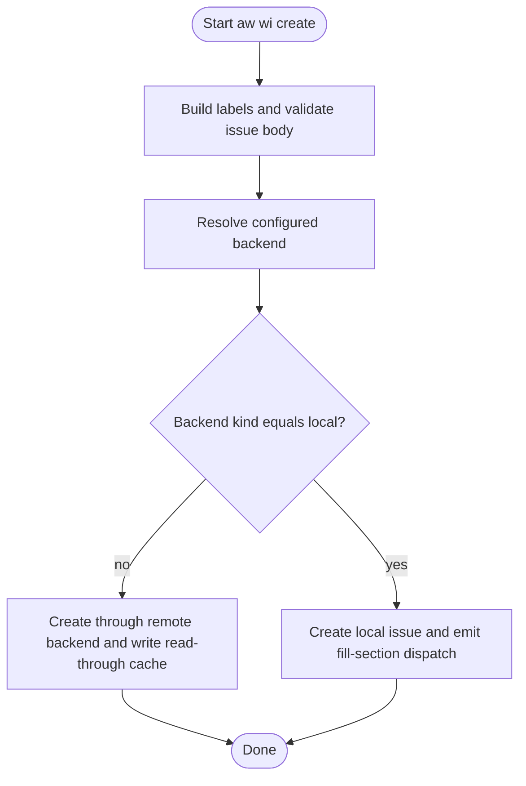

<!-- HANDWRITE-BEGIN gap="missing-generator:schema:6ef074ff" tracker="pending-tracker" reason="Canonical contract for configured-backend wi create behavior." -->

# AW WI Create Configured Backend

## Contract Scenarios
<!-- type: scenarios lang: yaml -->

```yaml
id: wi-create-remove-remote-scenarios
scenarios:
  - id: S1
    title: help hides deprecated flag
    given:
      - "CreateArgs renders help for aw wi create"
    when:
      - "the help text is inspected"
    then:
      - "--remote is absent from public help"
  - id: S2
    title: backend is config driven
    given:
      - ".aw/config.toml resolves an issue backend"
    when:
      - "aw wi create builds a publishable work item"
    then:
      - "local backend writes local issue state"
      - "remote backend publishes through the configured backend"
  - id: S3
    title: old flag remains compatible
    given:
      - "an old caller passes --remote"
    when:
      - "clap parses create args"
    then:
      - "the argument is accepted as a hidden deprecated no-op"
```

## Contract Logic
<!-- type: logic lang: mermaid -->



## Contract CLI
<!-- type: cli lang: yaml -->

```yaml
commands:
  - name: aw
    subcommands:
      - name: wi
        subcommands:
          - name: create
            removed_public_args:
              - --remote
            hidden_compat_args:
              - name: --remote
                behavior: deprecated_noop
            backend_selection: configured_backend
            local_draft_command: aw wi draft
```

## Contract Unit Test
<!-- type: unit-test lang: mermaid -->

```mermaid
---
id: wi-create-remove-remote-unit-tests
coverage_kind: unit
strategy: clap and backend decision tests
evidence:
  source_tests:
    - projects/agentic-workflow/src/cli/issues.rs
---
requirementDiagram
  requirement help_hidden {
    id: UT1
    text: create help does not contain --remote
    risk: medium
    verifymethod: test
  }
  requirement compat_parse {
    id: UT2
    text: hidden --remote still parses for old callers
    risk: medium
    verifymethod: test
  }
  requirement backend_decision {
    id: UT3
    text: backend selection is based on resolved backend kind
    risk: medium
    verifymethod: test
  }
```

## Contract E2E Test
<!-- type: e2e-test lang: yaml -->

```yaml
e2e_tests:
  - id: wi-create-remote-unit-command
    name: wi create remote compatibility unit command
    command: cargo test -p agentic-workflow wi_create_remote -- --nocapture
    assertions:
      - help hides deprecated remote flag
      - compatibility flag parses
      - backend decision is config-driven
  - id: wi-create-help-command
    name: wi create help smoke
    command: ./target/debug/aw wi create --help
    assertions:
      - help output does not list --remote
```

## Contract Changes
<!-- type: changes lang: yaml -->

```yaml
changes:
  - path: projects/agentic-workflow/src/cli/issues.rs
    action: modify
    section: cli
    impl_mode: hand-written
    description: "Hide deprecated --remote and make create backend choice config-driven."
  - path: projects/agentic-workflow/tech-design/surface/specs/aw-wi-create-remove-remote-flag.md
    action: create
    section: schema
    impl_mode: hand-written
    description: "Canonical contract for the configured-backend create path."
  - action: annotate
    section: e2e-test
    impl_mode: hand-written
    description: "Traceability metadata edge for the e2e-test section."

  - action: annotate
    section: logic
    impl_mode: hand-written
    description: "Traceability metadata edge for the logic section."

  - action: annotate
    section: scenarios
    impl_mode: hand-written
    description: "Traceability metadata edge for the scenarios section."

  - action: annotate
    section: unit-test
    impl_mode: hand-written
    description: "Traceability metadata edge for the unit-test section."

```
<!-- HANDWRITE-END -->
