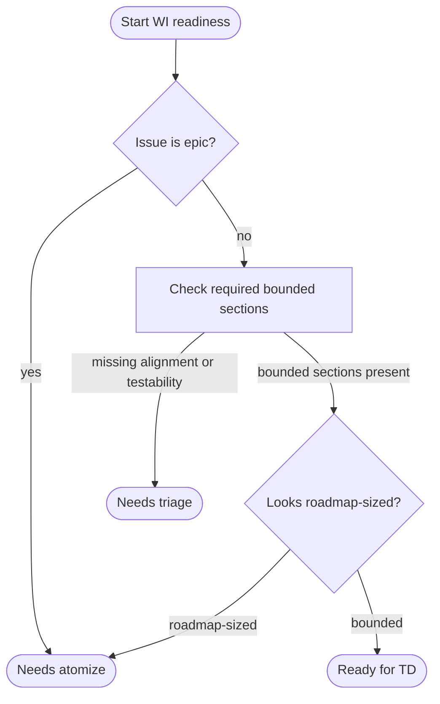
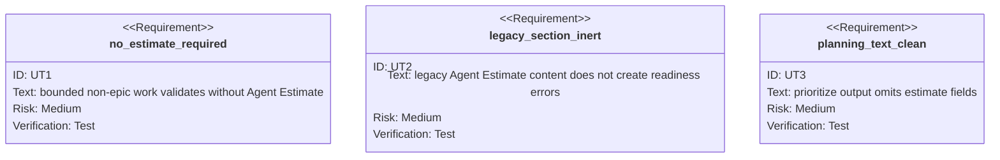

<!-- HANDWRITE-BEGIN gap="missing-generator:schema:c3920953" tracker="pending-tracker" reason="Canonical contract for readiness without estimate fields." -->

# WI Readiness Without Agent Estimate

## Scenarios
<!-- type: scenarios lang: yaml -->

```yaml
id: aw-wi-remove-agent-estimate-scenarios
scenarios:
  - id: S1
    title: bounded non-epic passes without estimates
    given:
      - "a non-epic work item has Capability Alignment, Scope, Acceptance Criteria, and Reference Context"
    when:
      - "readiness validation runs before TD"
    then:
      - "validation does not require an Agent Estimate section"
      - "validation does not read agent_minutes, confidence, risk, or human_attention as gates"
  - id: S2
    title: legacy estimate section is inert
    given:
      - "an older work item body still contains ## Agent Estimate"
    when:
      - "the body is parsed, merged, or validated"
    then:
      - "the old section remains ordinary body text"
      - "invalid legacy estimate values do not create readiness errors"
  - id: S3
    title: planning output is estimate-free
    given:
      - "aw wi atomize or aw wi prioritize renders local planning artifacts"
    then:
      - "artifact lines do not summarize agent_minutes or human_attention"
      - "roadmap-sized routing is based on issue type and size heuristics"
```

## Logic
<!-- type: logic lang: mermaid -->



## CLI
<!-- type: cli lang: yaml -->

```yaml
commands:
  - name: aw
    subcommands:
      - name: wi
        affected:
          - create
          - fill-section
          - validate
          - plan
          - atomize
          - prioritize
        removed_public_contract:
          - "## Agent Estimate"
          - "agent_minutes readiness buckets"
          - "confidence/risk/human_attention readiness gates"
        readiness_contract:
          required_sections:
            - Capability Alignment
            - Scope
            - Acceptance Criteria
            - Reference Context
          routing:
            - dependency blockers
            - roadmap-sized work
            - missing alignment or testability
```

## Unit Test
<!-- type: unit-test lang: mermaid -->



## E2E Test
<!-- type: e2e-test lang: yaml -->

```yaml
e2e_tests:
  - id: wi-remove-agent-estimate-build
    capability_id: work-item-planning
    claim_id: capability-to-epic-planning
    command: cargo build -p agentic-workflow --bin aw
    assertions:
      - "the aw binary builds after removing estimate helpers"
  - id: wi-remove-agent-estimate-spec-check
    capability_id: work-item-planning
    claim_id: capability-to-epic-planning
    command: ./target/debug/aw td check projects/agentic-workflow/tech-design/surface/specs/aw-wi-remove-agent-estimate.md
    assertions:
      - "the canonical contract remains parseable by td check"
```

## Changes
<!-- type: changes lang: yaml -->

```yaml
changes:
  - path: projects/agentic-workflow/src/cli/issues.rs
    action: modify
    section: logic
    impl_mode: hand-written
    description: Remove Agent Estimate from WI templates, fill prompts, readiness validation, and planning output.
  - path: projects/agentic-workflow/tech-design/surface/interfaces/src/issues.md
    action: modify
    section: source
    impl_mode: hand-written
    description: Refresh the issues.rs source snapshot after removing estimate helpers and validation.
  - path: AGENTS.md
    action: modify
    section: cli
    impl_mode: hand-written
    description: Replace estimate-based bounded-WI guidance with section-based readiness guidance.
  - path: CLAUDE.md
    action: modify
    section: cli
    impl_mode: hand-written
    description: Mirror the section-based bounded-WI guidance.
  - path: .agents/skills/aw-wi/SKILL.md
    action: modify
    section: cli
    impl_mode: hand-written
    description: Update human-facing aw:wi bounded gate instructions.
  - path: projects/agentic-workflow/templates/cli/mainthread/CLAUDE.md
    action: modify
    section: cli
    impl_mode: hand-written
    description: Update aw init CLAUDE template guidance.
  - path: projects/agentic-workflow/templates/cli/mainthread/skills/aw-wi/SKILL.md
    action: modify
    section: cli
    impl_mode: hand-written
    description: Update aw init aw-wi skill template guidance.
  - path: projects/agentic-workflow/tech-design/surface/specs/aw-capability-alignment-wi-planning.md
    action: modify
    section: scenarios
    impl_mode: hand-written
    description: Mark planning readiness as section-based instead of estimate-based.
  - path: projects/agentic-workflow/tech-design/surface/specs/aw-wi-draft-valid-by-construction.md
    action: modify
    section: scenarios
    impl_mode: hand-written
    description: Remove Agent Estimate from the draft-valid-by-construction expected section list.
  - path: projects/agentic-workflow/tech-design/surface/specs/aw-wi-remove-agent-estimate.md
    action: create
    section: schema
    impl_mode: hand-written
    description: Canonical contract for WI readiness without estimate fields.
  - action: annotate
    section: e2e-test
    impl_mode: hand-written
    description: "Traceability metadata edge for the e2e-test section."

  - action: annotate
    section: unit-test
    impl_mode: hand-written
    description: "Traceability metadata edge for the unit-test section."

```
<!-- HANDWRITE-END -->
