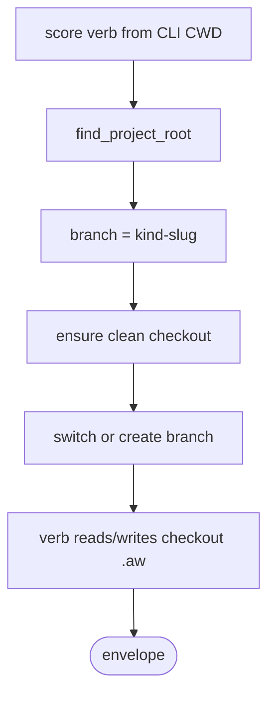

# Current Checkout Branch Lifecycle

## Logic
<!-- type: logic lang: mermaid -->



The root rule is intentionally simple: Score walks from the CLI process CWD to
the nearest `.aw/config.toml` and treats that directory as the current
checkout root. It does not inspect shared git metadata to choose another
checkout, and it does not support an alternate per-slug Score workspace model.

## CLI
<!-- type: cli lang: yaml -->

```yaml
current_public_entrypoints:
  work_items: aw wi <verb>
  tech_design: aw td create|validate|review|revise|merge|claim
  code_artifact: aw cb gen|check|claim|fill|review|revise|arbitrate
removed_public_entrypoints:
  - aw td idle
  - aw cb idle
  - score migrate-worktrees
  - aw wi prune
  - aw td init
root_contract:
  checkout_root: "find_project_root() from CLI CWD"
  writes:
    - "<checkout_root>/.aw/issues/"
    - "<checkout_root>/.aw/payloads/"
    - "<checkout_root>/.aw/tech-design/"
```

## Test Plan
<!-- type: test-plan lang: mermaid -->

```mermaid
---
id: current-checkout-branch-lifecycle-test-plan
requirements:
  score_lib:
    id: TP-1
    text: "cargo test -p agentic-workflow --lib passes"
    risk: high
    verifymethod: test
  score_full:
    id: TP-2
    text: "cargo test -p agentic-workflow passes"
    risk: high
    verifymethod: test
  wi_linked_checkout:
    id: TP-3
    text: "run aw wi update from a linked checkout and assert the primary checkout is unchanged"
    risk: high
    verifymethod: test
  td_linked_checkout:
    id: TP-4
    text: "run aw td create from a linked checkout and assert state writes stay in that checkout"
    risk: high
    verifymethod: test
elements:
  score_tests:
    type: "cargo test -p agentic-workflow"
relations:
  - from: score_tests
    to: score_lib
    kind: verifies
  - from: score_tests
    to: score_full
    kind: verifies
  - from: score_tests
    to: wi_linked_checkout
    kind: verifies
  - from: score_tests
    to: td_linked_checkout
    kind: verifies
---
requirementDiagram
    requirement score_lib {
        id: TP-1
        text: "cargo test -p agentic-workflow --lib passes"
        risk: high
        verifymethod: test
    }
    requirement score_full {
        id: TP-2
        text: "cargo test -p agentic-workflow passes"
        risk: high
        verifymethod: test
    }
    requirement wi_linked_checkout {
        id: TP-3
        text: "run aw wi update from a linked checkout and assert the primary checkout is unchanged"
        risk: high
        verifymethod: test
    }
    requirement td_linked_checkout {
        id: TP-4
        text: "run aw td create from a linked checkout and assert state writes stay in that checkout"
        risk: high
        verifymethod: test
    }
    element score_tests {
        type: "cargo test -p agentic-workflow"
    }
    score_tests - verifies -> score_lib
    score_tests - verifies -> score_full
    score_tests - verifies -> wi_linked_checkout
    score_tests - verifies -> td_linked_checkout
```

## Changes
<!-- type: changes lang: yaml -->

```yaml
changes:
  - path: projects/agentic-workflow/src/cli/mod.rs
    action: keep find_project_root as current-checkout .aw/config.toml walk
    impl_mode: hand-written
    section: source
  - path: projects/agentic-workflow/src/cli/commands.rs
    action: remove retired migration command from public CLI
    impl_mode: hand-written
    section: source
  - path: projects/agentic-workflow/src/cli/issues.rs
    action: remove retired prune and idle recovery surfaces
    impl_mode: hand-written
    section: source
  - path: projects/agentic-workflow/src/cli/td.rs
    action: remove retired idle surface; keep td claim branch-based
    impl_mode: hand-written
    section: source
  - path: projects/agentic-workflow/src/cli/cb.rs
    action: remove retired idle surface; make cb claim checkout-based
    impl_mode: hand-written
    section: source
  - path: AGENTS.md and skill templates
    action: remove old per-slug Score workspace workflow instructions
    section: logic
    impl_mode: hand-written
  - action: annotate
    section: cli
    impl_mode: hand-written
    description: "Traceability metadata edge for the cli section."

  - action: annotate
    section: unit-test
    impl_mode: hand-written
    description: "Traceability metadata edge for the unit-test section."

```
