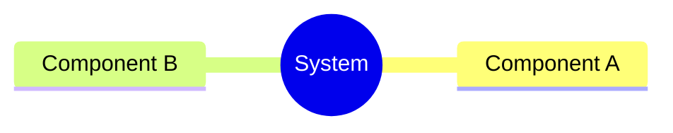
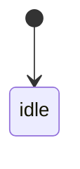
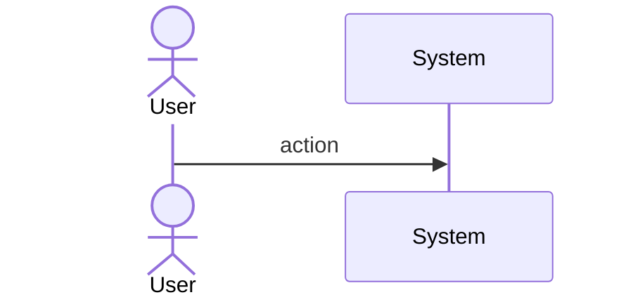
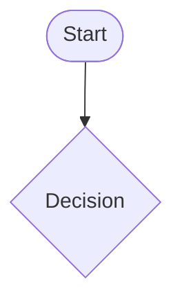
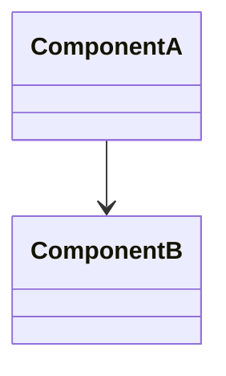
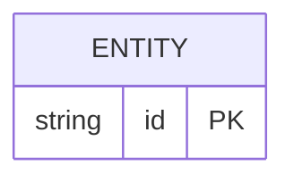

# Score Init Command

## Overview
<!-- type: overview lang: markdown -->

Wires the `aw init` CLI command by adding an `Init` variant to the `Commands` enum in `projects/agentic-workflow/src/cli/commands.rs` and dispatching it to the existing `init::run()` function. Also completes the bootstrap asset set: adds all 5 `score-*` agent definition templates, 3 hook scripts, a `settings.json` template (with SubagentStop hook registration), and the missing work-item skill to `projects/agentic-workflow/templates/mainthread/`. Updates `install_system_files()` to install agents, hooks, and settings alongside skills.
## Requirements

```mermaid
---
id: requirements
---
requirementDiagram

requirement R1 {
  id: R1
  text: "Add Init variant to Commands enum with name: Option<String> and force: bool fields"
  risk: low
  verifymethod: test
}

requirement R2 {
  id: R2
  text: "Dispatch Commands::Init to init::run() in run_command()"
  risk: low
  verifymethod: test
}

requirement R3 {
  id: R3
  text: "aw init --help shows command purpose and flags"
  risk: low
  verifymethod: test
}

requirement R4 {
  id: R4
  text: "Add 5 score-* agent definition template files to templates/mainthread/agents/ as include_str! constants"
  risk: low
  verifymethod: inspection
}

requirement R5 {
  id: R5
  text: "install_agents() writes agent files to .claude/agents/ in target project"
  risk: low
  verifymethod: test
}

requirement R6 {
  id: R6
  text: "init removes legacy sdd-*.md files from .claude/agents/ during install"
  risk: low
  verifymethod: test
}

requirement R7 {
  id: R7
  text: "Add 3 hook scripts to templates/mainthread/hooks/ (score-safe-bash.sh, score-readonly-bash.sh, score-next-step.sh)"
  risk: low
  verifymethod: inspection
}

requirement R8 {
  id: R8
  text: "install_hooks() writes hook scripts to .claude/hooks/ with executable permissions (chmod +x)"
  risk: low
  verifymethod: test
}

requirement R9 {
  id: R9
  text: "Add settings.json template to templates/mainthread/ with SubagentStop hook matching score-* pattern"
  risk: low
  verifymethod: inspection
}

requirement R10 {
  id: R10
  text: "install_settings_json() merges template with existing .claude/settings.json preserving user hooks"
  risk: medium
  verifymethod: test
}

requirement R11 {
  id: R11
  text: "If existing settings.json already has SubagentStop score-* hook, warn user and skip"
  risk: low
  verifymethod: test
}

requirement R12 {
  id: R12
  text: "Add score-issue skill template and install via install_claude_skills()"
  risk: low
  verifymethod: test
}

requirement R13 {
  id: R13
  text: "Do not install cron-style issue patrol skills; aw run owns run-to-end project orchestration"
  risk: low
  verifymethod: test
}

requirement R14 {
  id: R14
  text: "Running aw init on already-initialized project updates all assets without losing user customizations"
  risk: medium
  verifymethod: test
}

requirement R15 {
  id: R15
  text: "Version check prevents downgrades (existing behavior preserved)"
  risk: low
  verifymethod: test
}
```

<!-- type: requirements lang: mermaid -->


## Scenarios
<!-- type: scenarios lang: yaml -->

```yaml
scenarios: []
```

## Diagrams
<!-- type: doc lang: markdown -->

### Mindmap
<!-- type: mindmap lang: mermaid -->
<!-- TODO: Use Mermaid Plus mindmap (YAML frontmatter inside mermaid block).

-->

### State Machine
<!-- type: state-machine lang: mermaid -->
<!-- TODO: Use Mermaid Plus stateDiagram-v2 (YAML frontmatter inside mermaid block).

-->

### Interaction
<!-- type: interaction lang: mermaid -->
<!-- TODO: Use Mermaid Plus sequenceDiagram (YAML frontmatter inside mermaid block).

-->

### Logic
<!-- type: logic lang: mermaid -->
<!-- TODO: Use Mermaid Plus flowchart (YAML frontmatter inside mermaid block).

-->

### Dependencies
<!-- type: dependency lang: mermaid -->
<!-- TODO: Use Mermaid Plus classDiagram (YAML frontmatter inside mermaid block).

-->

### Data Model
<!-- type: db-model lang: mermaid -->
<!-- TODO: Use Mermaid Plus erDiagram (YAML frontmatter inside mermaid block).

-->

## API Spec
<!-- type: doc lang: markdown -->

### REST API
<!-- type: rest-api lang: yaml -->
<!-- score-td-placeholder -->

### RPC API
<!-- type: rpc-api lang: yaml -->
<!-- TODO: OpenRPC 1.3 as YAML. Example:
```yaml
openrpc: "1.3.2"
info:
  title: Service Name
  version: "1.0.0"
methods: []
```
-->

### Async API
<!-- type: async-api lang: yaml -->
<!-- score-td-placeholder -->

### CLI
<!-- type: cli lang: yaml -->
<!-- score-td-placeholder -->

### Schema
<!-- type: schema lang: yaml -->
<!-- TODO: JSON Schema as YAML. Example:
```yaml
"$schema": "https://json-schema.org/draft/2020-12/schema"
type: object
properties:
  id:
    type: string
required: [id]
```
-->

### Config
<!-- type: config lang: yaml -->
<!-- score-td-placeholder -->

## Test Plan
<!-- type: test-plan lang: mermaid -->

```mermaid
---
id: score-init-command-test-plan
requirements:
  command_wiring:
    id: T1
    text: "aw init command wiring is covered by score tests"
    risk: high
    verifymethod: test
  bootstrap_assets:
    id: T2
    text: "mainthread agents, hooks, settings, and skills install correctly"
    risk: high
    verifymethod: test
elements:
  score_tests:
    type: "cargo test -p agentic-workflow"
relations:
  - from: score_tests
    to: command_wiring
    kind: verifies
  - from: score_tests
    to: bootstrap_assets
    kind: verifies
---
requirementDiagram

element T1 {
  type: "Test"
}

element T2 {
  type: "Test"
}

T1 - verifies -> R1
T2 - verifies -> R2
```

## Changes
<!-- type: changes lang: yaml -->

```yaml
changes:
  - path: projects/agentic-workflow/src/cli/commands.rs
    action: modify
    impl_mode: hand-written
    section: source
    description: |
      Add Init variant to Commands enum with doc comment, name:
      Option<String>, force: bool args. Add crate::init import at top.
      Add Commands::Init dispatch arm in run_command() calling
      init::run(name, force, None).

  - path: projects/agentic-workflow/src/cli/init.rs
    action: modify
    impl_mode: hand-written
    section: source
    description: |
      Add bootstrap asset include_str! constants, install_agents(),
      install_hooks(), install_settings_json(), install_system_files()
      wiring, skill installation updates, deprecated skill pruning, and
      init success output updates.

  - path: projects/agentic-workflow/templates/mainthread/agents/score-change-implementation.md
    action: create
    impl_mode: hand-written
    section: source
    description: Copy content from .claude/agents/score-change-implementation.md.

  - path: projects/agentic-workflow/templates/mainthread/agents/score-change-spec.md
    action: create
    impl_mode: hand-written
    section: source
    description: Copy content from .claude/agents/score-change-spec.md.

  - path: projects/agentic-workflow/templates/mainthread/agents/score-reference-context.md
    action: create
    impl_mode: hand-written
    section: source
    description: Copy content from .claude/agents/score-reference-context.md.

  - path: projects/agentic-workflow/templates/mainthread/agents/score-review.md
    action: create
    impl_mode: hand-written
    section: source
    description: Copy content from .claude/agents/score-review.md.

  - path: projects/agentic-workflow/templates/mainthread/agents/score-issue-author.md
    action: create
    impl_mode: hand-written
    section: source
    description: Copy content from .claude/agents/score-issue-author.md.

  - path: projects/agentic-workflow/templates/mainthread/hooks/score-safe-bash.sh
    action: create
    impl_mode: hand-written
    section: source
    description: Copy content from .claude/hooks/score-safe-bash.sh.

  - path: projects/agentic-workflow/templates/mainthread/hooks/score-readonly-bash.sh
    action: create
    impl_mode: hand-written
    section: source
    description: Copy content from .claude/hooks/score-readonly-bash.sh.

  - path: projects/agentic-workflow/templates/mainthread/hooks/score-next-step.sh
    action: create
    impl_mode: hand-written
    section: source
    description: Copy content from .claude/hooks/score-next-step.sh.

  - path: projects/agentic-workflow/templates/mainthread/settings.json
    action: create
    impl_mode: hand-written
    section: source
    description: Minimal settings.json template with SubagentStop hook for score-* pattern.

  - path: projects/agentic-workflow/templates/mainthread/skills/score-issue/SKILL.md
    action: create
    impl_mode: hand-written
    section: source
    description: Copy content from .claude/skills/score-issue/SKILL.md.

  - action: annotate
    section: async-api
    impl_mode: hand-written
    description: "Traceability metadata edge for the async-api section."

  - action: annotate
    section: cli
    impl_mode: hand-written
    description: "Traceability metadata edge for the cli section."

  - action: annotate
    section: component
    impl_mode: hand-written
    description: "Traceability metadata edge for the component section."

  - action: annotate
    section: config
    impl_mode: hand-written
    description: "Traceability metadata edge for the config section."

  - action: annotate
    section: db-model
    impl_mode: hand-written
    description: "Traceability metadata edge for the db-model section."

  - action: annotate
    section: dependency
    impl_mode: hand-written
    description: "Traceability metadata edge for the dependency section."

  - action: annotate
    section: design-token
    impl_mode: hand-written
    description: "Traceability metadata edge for the design-token section."

  - action: annotate
    section: interaction
    impl_mode: hand-written
    description: "Traceability metadata edge for the interaction section."

  - action: annotate
    section: logic
    impl_mode: hand-written
    description: "Traceability metadata edge for the logic section."

  - action: annotate
    section: mindmap
    impl_mode: hand-written
    description: "Traceability metadata edge for the mindmap section."

  - action: annotate
    section: requirements
    impl_mode: hand-written
    description: "Traceability metadata edge for the requirements section."

  - action: annotate
    section: rest-api
    impl_mode: hand-written
    description: "Traceability metadata edge for the rest-api section."

  - action: annotate
    section: rpc-api
    impl_mode: hand-written
    description: "Traceability metadata edge for the rpc-api section."

  - action: annotate
    section: scenarios
    impl_mode: hand-written
    description: "Traceability metadata edge for the scenarios section."

  - action: annotate
    section: schema
    impl_mode: hand-written
    description: "Traceability metadata edge for the schema section."

  - action: annotate
    section: state-machine
    impl_mode: hand-written
    description: "Traceability metadata edge for the state-machine section."

  - action: annotate
    section: unit-test
    impl_mode: hand-written
    description: "Traceability metadata edge for the unit-test section."

  - action: annotate
    section: wireframe
    impl_mode: hand-written
    description: "Traceability metadata edge for the wireframe section."

```
## Wireframe
<!-- type: wireframe lang: yaml -->

```yaml
# score-td-placeholder
```

## Component
<!-- type: component lang: yaml -->

```yaml
# score-td-placeholder
```

## Design Token
<!-- type: design-token lang: yaml -->

```yaml
# score-td-placeholder
```

## Doc
<!-- type: doc lang: markdown -->

<!-- TODO -->


## CLI
<!-- type: cli lang: yaml -->

```yaml
command: aw init
description: Bootstrap .aw/ workspace and .claude/ assets in the current project
args: []
options:
  - name: --name
    short: -n
    type: Option<String>
    description: Project name (deprecated, ignored)
  - name: --force
    short: -f
    type: bool
    description: Override version downgrade protection and force-replace all assets
subcommands: []
examples:
  - cmd: aw init
    desc: Fresh install — creates .aw/, .claude/agents/, .claude/skills/, .claude/hooks/, .claude/settings.json
  - cmd: aw init --force
    desc: Force update — replaces all system assets even if same/older version
```
