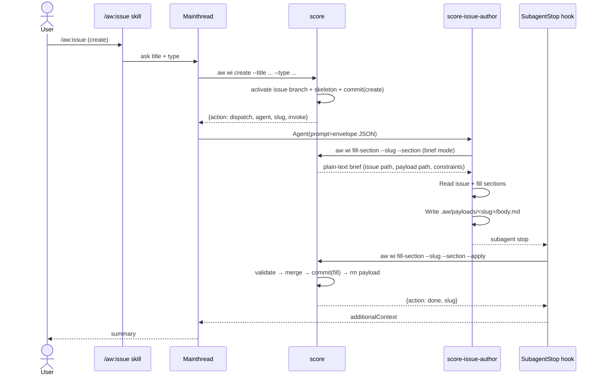

# Score Work-Item CLI Envelope

> **AMENDMENT (2026-05-03).** The `agent` field on the `dispatch` envelope
> is being dropped as part of `aw-mainthread-only-execution.md`. While
> the rollout is in progress, the field is **optional and nullable**:
> emitters MAY still include `"agent": "score-<role>"` for backward
> compatibility, but mainthread no longer dispatches subagents — it
> invokes `invoke.command` directly regardless of the field. Once the
> rollout completes, the field will be removed from the schema and from
> all emit sites in `projects/agentic-workflow/src/cli/`. New code MUST NOT rely on
> the `agent` field for routing decisions.

> **Phase C root note.** Current Score handlers resolve the filesystem
> root from the CLI process CWD via `find_project_root()` and write
> `.aw/issues`, `.aw/payloads`, and `.aw/tech-design` under that
> current checkout. The JSON envelope remains compatible; this note fixes
> storage/root interpretation for all examples in this file.

## Schema
<!-- type: schema lang: yaml -->

```yaml
{
  "$schema": "https://json-schema.org/draft/2020-12/schema",
  "title": "IssueEnvelope",
  "oneOf": [
    {
      "type": "object",
      "required": ["action", "slug", "invoke"],
      "additionalProperties": false,
      "properties": {
        "action": { "const": "dispatch" },
        "slug":   { "type": "string", "pattern": "^[a-z0-9-]+$" },
        "agent":  {
          "type": ["string", "null"],
          "pattern": "^score-",
          "description": "DEPRECATED — see amendment banner. Optional + nullable during rollout; removed after subagents retire (aw-mainthread-only-execution.md). Mainthread routes by invoke.command alone."
        },
        "invoke": {
          "type": "object",
          "required": ["command", "args"],
          "additionalProperties": false,
          "properties": {
            "command": { "type": "string" },
            "args":    { "type": "object" }
          }
        }
      }
    },
    {
      "type": "object",
      "required": ["action", "slug"],
      "additionalProperties": false,
      "properties": {
        "action": { "const": "done" },
        "slug":   { "type": "string", "pattern": "^[a-z0-9-]+$" }
      }
    },
    {
      "type": "object",
      "required": ["action", "slug", "message"],
      "additionalProperties": false,
      "properties": {
        "action":  { "const": "error" },
        "slug":    { "type": "string", "pattern": "^[a-z0-9-]+$" },
        "message": { "type": "string" }
      }
    }
  ]
}
```

## Interaction
<!-- type: interaction lang: mermaid -->



## Changes
<!-- type: doc lang: markdown -->

| File | Action | Purpose |
|------|--------|---------|
| `projects/agentic-workflow/src/cli/issues.rs` | modify | `IssueEnvelope` enum, envelope emission in `run_create`, new `FillSection` subcommand + `run_fill_section` (brief + apply) |
| `CLAUDE.md` | modify | Insert "Score envelope (mainthread protocol)" section |
| `projects/agentic-workflow/templates/mainthread/CLAUDE.md` | modify | Same as CLAUDE.md (template source of truth) |
| `projects/agentic-workflow/templates/mainthread/agents/score-issue-author.md` | modify | Rewrite Inputs/Process/Output to consume envelope JSON + write `.aw/payloads/<slug>/body.md`. Add `Write` tool + PreToolUse guard |
| `projects/agentic-workflow/templates/mainthread/skills/score-issue/SKILL.md` | modify | Slim to intent-router; delegate envelope handling to CLAUDE.md |
| `projects/agentic-workflow/templates/mainthread/settings.json` | modify | Register `score-issue-author` SubagentStop hook ahead of generic `score-*` validate hook |
| `projects/agentic-workflow/templates/mainthread/hooks/agents/issue-author/pretooluse-write-guard.sh` | create | Allow Write only to `.aw/payloads/<slug>/body.md` |
| `projects/agentic-workflow/templates/mainthread/hooks/agents/issue-author/subagentstop-apply.sh` | create | Parse transcript first row as envelope JSON, call `fill-section --apply`, return hook decision |
| `projects/agentic-workflow/templates/mainthread/hooks/global/subagentstop-validate.sh` | modify | Add early-skip for `score-issue-author` so the new specific hook owns it |
| `projects/agentic-workflow/src/cli/init.rs` | modify | `include_str!` + installation for the two new hook scripts |
| `projects/agentic-workflow/tech-design/surface/specs/issue-cli-envelope.md` | create | This TD |

## Traceability Changes
<!-- type: changes lang: yaml -->

```yaml
changes:
  - action: annotate
    section: interaction
    impl_mode: hand-written
    description: "Traceability metadata edge for the interaction section."

  - action: annotate
    section: schema
    impl_mode: hand-written
    description: "Traceability metadata edge for the schema section."

```