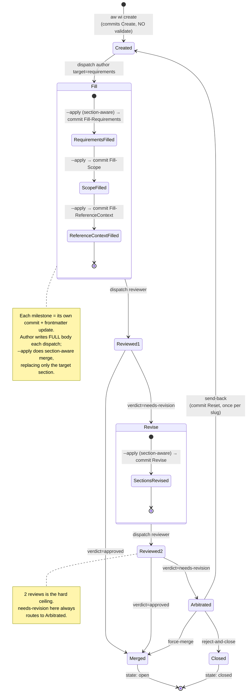
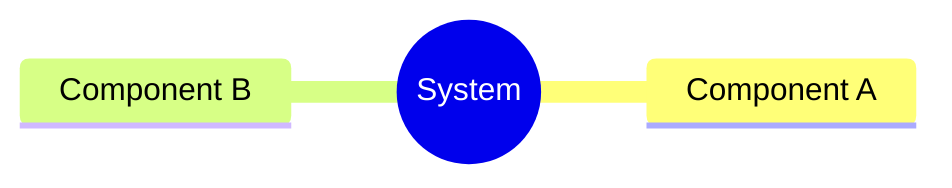
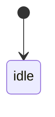
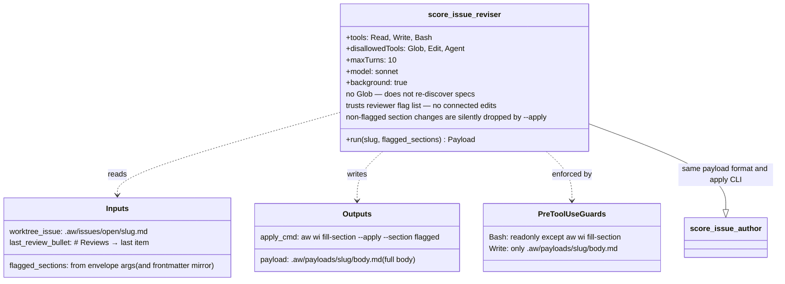
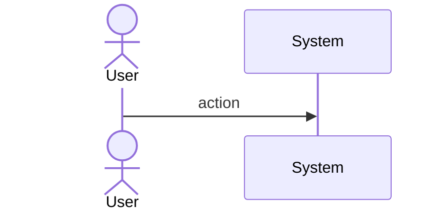
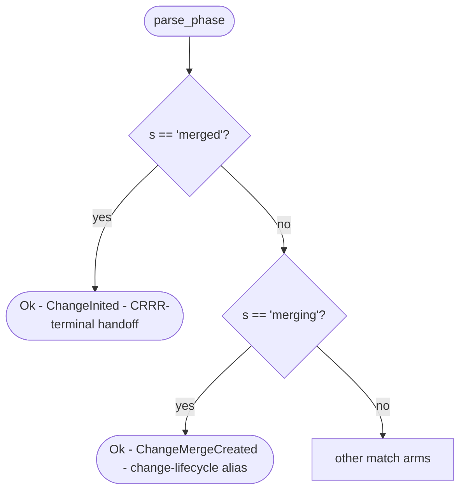
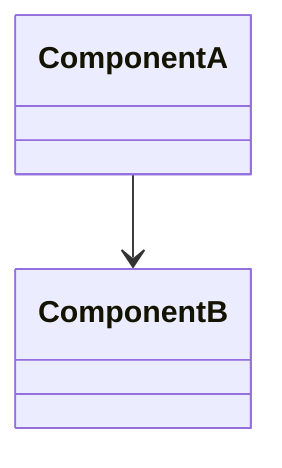
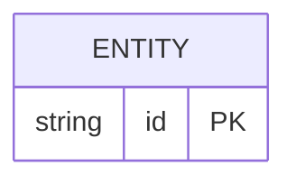

# Bug Init Change Phase Mapping Conflates Crrr Terminal Spec

> **AMENDMENT (2026-05-03).** All "subagent dispatch" / "SubagentStop hook"
> language in this spec's state-machine prose is being retired. Phase
> advancement and `Lifecycle-Stage:` trailer commits have moved to a
> mainthread-only model where `aw wi validate` runs synchronously
> in the mainthread and Claude Code's PostToolUse Hook 1 enforces the
> auto-validate-after-apply gate that `SubagentStop` previously owned.
> The phase machine itself is unchanged — only the actor that drives it
> moves from `subagent → SubagentStop hook` to `mainthread → PostToolUse
> hook`. See `projects/agentic-workflow/tech-design/surface/specs/aw-mainthread-only-execution.md`
> for the new dispatch contract.

> **Phase C root note.** The state machine remains authoritative. Current
> verbs resolve the active checkout root from CLI CWD with
> `find_project_root()` and read/write the issue frontmatter, payloads, and
> tech-design artifacts in that checkout's `.aw/` tree.

## Storage Model — Dual Source of Truth
<!-- type: doc lang: markdown -->

State is stored in **two write models, both authoritative for their respective concerns**. They are not derived from each other — the CLI writes both atomically.

### Write model #1: Issue frontmatter (current state snapshot)

Lives in `.aw/issues/{open,closed}/<slug>.md` YAML frontmatter. Answers *"what is this issue right now?"*.

```yaml
state: draft | open | closed
phase: created | fill_requirements | fill_scope | fill_reference_context
       | reviewed | revised | merged
review_count: 0 | 1 | 2
flagged_sections: [requirements, reference_context]   # only during Revise
updated_at: <iso8601>
title: <string>
type: bug | enhancement | epic | refactor | test
labels: [crate:foo, priority:p2, ...]
```

**Used by:** `aw wi list/show`, idle scanner, GitHub UI viewers, IDE file viewers, validate's "what to do next" routing.

### Write model #2: Worktree git log (event history)

Lives as `Lifecycle-Stage: <stage>` trailers on commits in the issue's worktree branch. Answers *"how did this issue get to its current state?"*.

```
commit abc: Lifecycle-Stage: Review (verdict=approved)
commit def: Lifecycle-Stage: Fill-ReferenceContext
commit ghi: Lifecycle-Stage: Fill-Scope
commit jkl: Lifecycle-Stage: Fill-Requirements
commit mno: Lifecycle-Stage: Create
```

**Used by:** audit, debugging, replay, review-count verification, time-tracking, drift detection.

### Field-to-model assignment

| Question | Source |
|----------|--------|
| Current phase / state | Frontmatter |
| Review count | Frontmatter |
| Flagged sections (during Revise) | Frontmatter |
| Title, labels, type | Frontmatter |
| Created/updated timestamps | Frontmatter |
| When was each phase entered? | Git log (commit timestamp + trailer) |
| Who/what dispatched each step? | Git log (commit author + message) |
| First review's verdict | Git log (commit body for `Lifecycle-Stage: Review` trailer) |
| Was there a Reset (send-back)? | Git log (count `Reset` trailers) |

### Rules

1. **CLI writes both atomically** — every state-changing CLI command produces ONE commit that includes both the frontmatter update and the `Lifecycle-Stage` trailer. Never write one without the other.
2. **No derivation** — frontmatter is not recomputed from git log on read. Both are direct writes.
3. **Drift is a bug** — `aw wi verify <slug>` checks that frontmatter is consistent with the event log. Drift means something bypassed the CLI; reconcile manually.
4. **No STATE.yaml** — earlier designs used a separate state file. Removed; frontmatter holds everything.
5. **Different model for different question** — performance queries use frontmatter (fast read), audit/debug uses git log (full history).

## State Machine — Macro
<!-- type: state-machine lang: mermaid -->



## Lifecycle-Stage Trailers
<!-- type: doc lang: markdown -->

Trailer values written to git commits, in the order they appear in a happy-path issue:

| Trailer | Committed by | When | Frontmatter side-effect |
|---------|-------------|------|-------------------------|
| `Create` | `aw wi create` | Worktree provisioned, skeleton + Problem written | `phase: created`, `state: draft` |
| `Fill-Requirements` | `validate` (after author --apply) | Requirements section passes format check | `phase: fill_requirements` |
| `Fill-Scope` | `validate` | Scope section passes format check | `phase: fill_scope` |
| `Fill-ReferenceContext` | `validate` | Reference Context section passes format check | `phase: fill_reference_context` |
| `Review` | `validate` (after reviewer --apply) | Reviewer's bullet merged into `# Reviews` | `phase: reviewed`, `review_count: +=1` |
| `Revise` | `validate` (after reviser --apply) | All flagged sections re-pass format check | `phase: revised`, `flagged_sections: cleared` |
| `Merge` | `aw wi merge` | Issue moved to `closed/`, frontmatter updated | `state: open`, `phase: merged` |
| `Reset` | `aw wi arbitrate` | Send-back outcome chosen | `phase: created`, `review_count: 0`, `flagged_sections: cleared` |

**One milestone = one commit = one frontmatter snapshot.** The trailer and frontmatter `phase` field are written together in the same commit.

### CRRR-terminal → change-lifecycle-initial handoff

When `aw wi merge` writes `Lifecycle-Stage: Merge`, the issue frontmatter is set to `state: open, phase: merged`. This `"merged"` value is a **CRRR-terminal** marker — it signals that the issue completed its review loop and is ready to start a change lifecycle.

When `score workflow init-change` subsequently reads the issue frontmatter and calls `parse_phase("merged")`, the result is `StatePhase::ChangeInited` (not `ChangeMergeCreated`). This is the handoff translation point: the CRRR loop ends at `phase: merged` and the change lifecycle begins fresh at `ChangeInited`. The translation is implemented by the `"merged"` arm in `parse_phase` (`projects/agentic-workflow/src/tools/phase_transition.rs`).

## Section-Aware Merge
<!-- type: logic lang: mermaid -->

```mermaid
---
id: section-aware-merge
entry: Start
---
flowchart TD
    Start[aw wi fill-section --apply<br/>--section requirements scope ...] --> ReadPayload[Read .aw/payloads/slug/body.md<br/>FULL body written by agent]

    ReadPayload --> ReadTargets[Read --section CLI args]

    ReadTargets --> ParsePayload[Parse payload by ## headings<br/>into section map]

    ParsePayload --> ReadIssue[Read worktree issue body<br/>into section map]

    ReadIssue --> Loop{For each<br/>target section}

    Loop -->|next| Replace[issue.section[target] =<br/>payload.section[target]]
    Replace --> Loop

    Loop -->|done| Validate[Format check on target sections only]

    Validate -->|fail| Rollback[Don't write<br/>emit error envelope]
    Validate -->|pass| WriteIssue[Write merged issue body<br/>NO commit yet]

    WriteIssue --> DeletePayload[rm .aw/payloads/slug/body.md]
    DeletePayload --> EmitDispatch[emit dispatch envelope:<br/>agent=null, invoke=validate]

    note1[Non-target sections in payload<br/>are SILENTLY DROPPED.<br/>This protects against agents<br/>regressing previously-validated sections.]
    Replace -.-> note1
```

**Key invariants:**
- Agent (author or reviser) ALWAYS writes the FULL body to payload, including unchanged sections
- `--apply` honors `--section` flags as the authoritative target list — payload content for non-target sections is discarded
- `--apply` does NOT commit. Validate is the next step; validate commits.

## Scenarios
<!-- type: scenarios lang: markdown -->

```yaml
- id: S1
  given: issue frontmatter has phase: merged (CRRR-terminal, set by aw wi merge)
  when: parse_phase("merged") is called
  then: returns Ok(StatePhase::ChangeInited)

- id: S2
  given: issue frontmatter has a legacy change-lifecycle alias phase: merging
  when: parse_phase("merging") is called
  then: returns Ok(StatePhase::ChangeMergeCreated)

- id: S3
  given: score workflow init-change is invoked for an issue with phase: merged
  when: StateManager reads the issue phase and routes the change lifecycle
  then: change starts at ChangeInited, traverses all intermediate phases normally (change_spec_created, change_implementation_created, etc.)

- id: S4
  given: an issue stuck at phase: merged due to the pre-fix bug
  when: the fix lands (no manual frontmatter edit needed)
  then: next init-change invocation succeeds, reading phase: merged as ChangeInited

- id: S5
  given: parse_phase regression test suite
  when: the test for "merged" is executed
  then: asserts Ok(StatePhase::ChangeInited) and the inline comment documents CRRR-terminal handoff semantics

- id: S6
  given: the CRRR state machine spec (issue-crrr-state-machine.md) after the update
  when: the Lifecycle-Stage Trailers table is inspected
  then: the Merge row documents that phase: merged at the CRRR level maps to ChangeInited when init-change is invoked
```
## Mindmap
<!-- type: mindmap lang: mermaid -->
<!-- TODO: Use Mermaid Plus mindmap (YAML frontmatter inside mermaid block).

-->

## State Machine
<!-- type: state-machine lang: mermaid -->
<!-- TODO: Use Mermaid Plus stateDiagram-v2 (YAML frontmatter inside mermaid block).

-->

## Stage Detection Logic
<!-- type: logic lang: mermaid -->

```mermaid
---
id: stage-detection
---
flowchart TD
    Start[validate invoked] --> ReadPhase[Read frontmatter.phase<br/>and frontmatter.review_count]

    ReadPhase --> Switch{phase value?}

    Switch -->|created| DispReq[dispatch author<br/>target=requirements<br/>commit Fill-Requirements when --apply re-validates]
    Switch -->|fill_requirements| DispScope[dispatch author<br/>target=scope]
    Switch -->|fill_scope| DispRef[dispatch author<br/>target=reference_context]
    Switch -->|fill_reference_context| DispReviewer[dispatch reviewer]

    Switch -->|reviewed| ReadVerdict{Last bullet<br/>verdict?}
    ReadVerdict -->|approved| DispMerge[dispatch agent=null<br/>invoke=merge]
    ReadVerdict -->|needs-revision| CountReviews{review_count?}
    CountReviews -->|1| ExtractFlags[Extract section tags from bullet<br/>Write flagged_sections to frontmatter<br/>Dispatch reviser sections=flagged]
    CountReviews -->|2| DispArbitrate[dispatch agent=null<br/>invoke=arbitrate]
    CountReviews -->|>=3| Bug[ERROR: invariant R10 violated]

    Switch -->|revised| DispReviewer2[dispatch reviewer]

    Switch -->|merged| EmitDone[done: issue open]

    note1[validate is called after every --apply.<br/>It re-reads frontmatter (which --apply<br/>already updated) and decides next dispatch.<br/>If --apply succeeded, frontmatter.phase<br/>already advanced — validate just routes.]
    Start -.-> note1
```

## Arbitration Decision Table
<!-- type: doc lang: markdown -->

When `aw wi arbitrate` runs, mainthread inspects the worktree and chooses one of three outcomes. This table is the decision contract — implementations may add tooling but cannot add a fourth branch without amending this spec.

| Signal | Outcome | Envelope emitted | Rationale |
|--------|---------|------------------|-----------|
| Both review bullets cite the **same finding** the body already addresses (reviewer thrashing on style) | `force-merge` | `dispatch{agent: null, invoke: aw wi merge}` | Reviewer is wrong; author work is acceptable. Mainthread overrides. |
| Both review bullets cite **different but unaddressable** findings (issue's premise is wrong) | `reject-and-close` | `done{slug, message: "rejected at arbitration"}` + closes worktree | Issue should not exist; no amount of revision fixes it. |
| Reviewer's findings are **substantive but the reviser misread them** | `send-back` | `dispatch{score-issue-author, target: requirements}` + `Lifecycle-Stage: Reset` commit | Author needs another shot. Bounded once per slug — a second Reset is rejected. |
| Cannot decide from worktree state alone | `ask-user` (sub-case) | `AskUserQuestion`, then re-run arbitrate | Escape hatch. Does not consume the send-back budget. |

## Reviser Agent Contract
<!-- type: dependency lang: mermaid -->



## Interaction
<!-- type: interaction lang: mermaid -->
<!-- TODO: Use Mermaid Plus sequenceDiagram (YAML frontmatter inside mermaid block).

-->

## Logic
<!-- type: logic lang: mermaid -->


## Dependencies
<!-- type: dependency lang: mermaid -->
<!-- TODO: Use Mermaid Plus classDiagram (YAML frontmatter inside mermaid block).

-->

## Data Model
<!-- type: db-model lang: mermaid -->
<!-- TODO: Use Mermaid Plus erDiagram (YAML frontmatter inside mermaid block).

-->

## RPC API
<!-- type: rpc-api lang: yaml -->
<!-- TODO: OpenRPC 1.3 as YAML. Example:
```yaml
openrpc: "1.3.2"
info:
  title: Service Name
  version: "1.0.0"
methods: []
```
-->

## Schema
<!-- type: schema lang: yaml -->
<!-- TODO: JSON Schema as YAML. Example:
```yaml
"$schema": "https://json-schema.org/draft/2020-12/schema"
type: object
properties:
  id:
    type: string
required: [id]
```
-->

## Test Plan
<!-- type: test-plan lang: markdown -->
<!-- score-td-placeholder -->

```mermaid
---
id: phase-mapping-test-plan
---
requirementDiagram

requirement R1 {
  id: R1
  text: "parse_phase(\"merged\") returns Ok(StatePhase::ChangeInited)"
  risk: high
  verifymethod: test
}

requirement R2 {
  id: R2
  text: "parse_phase(\"merging\") still returns Ok(StatePhase::ChangeMergeCreated) after split"
  risk: high
  verifymethod: test
}

requirement R3 {
  id: R3
  text: "Unit test includes inline comment documenting CRRR-terminal handoff semantics"
  risk: high
  verifymethod: inspection
}

requirement R4 {
  id: R4
  text: "issue-crrr-state-machine.md Lifecycle-Stage Trailers row for Merge documents ChangeInited handoff"
  risk: medium
  verifymethod: inspection
}

requirement R5 {
  id: R5
  text: "score workflow init-change on issue with phase: merged transitions to change_inited and populates .aw/changes/<slug>/"
  risk: high
  verifymethod: test
}

requirement R6 {
  id: R6
  text: "Alias audit findings recorded in Changes section comments; no unrelated aliases modified"
  risk: low
  verifymethod: inspection
}

element T1 {
  type: "test"
  docref: "phase_transition.rs::tests::merged_maps_to_change_inited"
}

element T2 {
  type: "test"
  docref: "phase_transition.rs::tests::merging_maps_to_change_merge_created"
}

element T3 {
  type: "test"
  docref: "phase_transition.rs::tests::merged_is_ok_not_err"
}

element T4 {
  type: "test"
  docref: "integration: score workflow init-change on CRRR-merged issue produces change_inited frontmatter"
}

element T5 {
  type: "inspection"
  docref: "issue-crrr-state-machine.md Lifecycle-Stage Trailers table"
}

element T6 {
  type: "inspection"
  docref: "Changes section alias audit comment in this spec"
}

T1 - verifies -> R1
T1 - verifies -> R3
T2 - verifies -> R2
T3 - verifies -> R1
T4 - verifies -> R5
T5 - verifies -> R4
T6 - verifies -> R6
```
## Changes
<!-- type: changes lang: yaml -->

```yaml
# Alias audit (R6): other legacy aliases in parse_phase reviewed for the same
# dual-meaning conflation as "merged".
#   - "archived"   => ChangeArchived  : change-lifecycle alias only; CRRR writes "change_archived". No conflict.
#   - "rejected"   => ChangeRejected  : change-lifecycle alias only; CRRR writes "change_rejected". No conflict.
#   - "impl_approved" => ChangeMergeCreated: removed phase alias; no CRRR semantic. No conflict.
# No other alias exhibits the CRRR-terminal / change-lifecycle dual-meaning pattern.
# None of the above are modified in this change.
changes:
  - path: projects/agentic-workflow/src/tools/phase_transition.rs
    action: MODIFY
    section: logic
    impl_mode: hand-written
    description: split "merging" | "merged" arm so "merged" maps to ChangeInited (CRRR-terminal handoff) and "merging" stays on ChangeMergeCreated
    targets:
      - type: function
        name: parse_phase
        change: replace combined arm `"merging" | "merged" => Ok(StatePhase::ChangeMergeCreated)` with two separate arms; "merged" => Ok(StatePhase::ChangeInited) with inline comment documenting CRRR-terminal handoff semantics (satisfies R1, R2, R5)
    do_not_touch: [phase_to_string, phase_order, validate_transition]

  - path: projects/agentic-workflow/src/tools/phase_transition.rs
    action: MODIFY
    section: logic
    impl_mode: hand-written
    description: add unit tests T1, T2, T3 asserting correct parse_phase behavior post-split
    targets:
      - type: impl
        name: tests
        change: add tests merged_maps_to_change_inited (T1), merging_maps_to_change_merge_created (T2), merged_is_ok_not_err (T3); T1 includes inline comment explaining CRRR-terminal handoff (satisfies R3)

  - path: projects/agentic-workflow/tech-design/surface/specs/issue-crrr-state-machine.md
    action: MODIFY
    section: state-machine
    impl_mode: hand-written
    description: document CRRR-terminal to change-lifecycle-initial transition rule (R4)
    targets:
      - type: function
        name: Lifecycle-Stage Trailers table (Merge row)
        change: add note that phase:merged written at CRRR-terminal maps to ChangeInited (not ChangeMergeCreated) when score workflow init-change reads issue frontmatter
  - action: annotate
    section: db-model
    impl_mode: hand-written
    description: "Traceability metadata edge for the db-model section."

  - action: annotate
    section: dependency
    impl_mode: hand-written
    description: "Traceability metadata edge for the dependency section."

  - action: annotate
    section: interaction
    impl_mode: hand-written
    description: "Traceability metadata edge for the interaction section."

  - action: annotate
    section: mindmap
    impl_mode: hand-written
    description: "Traceability metadata edge for the mindmap section."

  - action: annotate
    section: rpc-api
    impl_mode: hand-written
    description: "Traceability metadata edge for the rpc-api section."

  - action: annotate
    section: scenarios
    impl_mode: hand-written
    description: "Traceability metadata edge for the scenarios section."

  - action: annotate
    section: schema
    impl_mode: hand-written
    description: "Traceability metadata edge for the schema section."

  - action: annotate
    section: unit-test
    impl_mode: hand-written
    description: "Traceability metadata edge for the unit-test section."

```

## Traceability Changes
<!-- type: changes lang: yaml -->

```yaml
changes:
  - action: annotate
    section: logic
    impl_mode: hand-written
    description: "Traceability metadata edge for the logic section."
  - action: annotate
    section: state-machine
    impl_mode: hand-written
    description: "Traceability metadata edge for the state-machine section."
```
