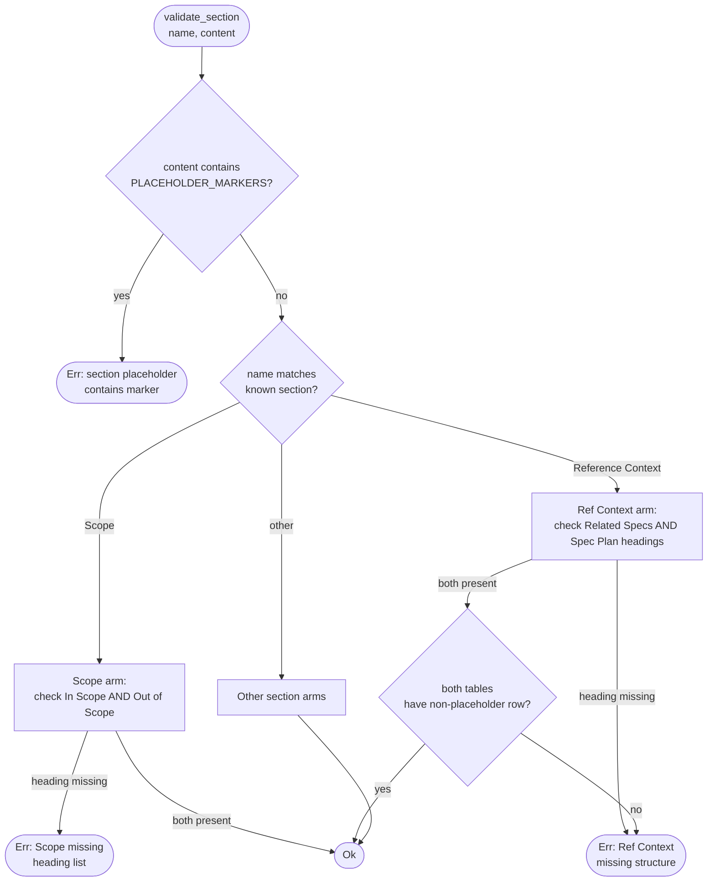

# Issue Validator: Placeholder Rejection

## Schema
<!-- type: schema lang: yaml -->

```yaml
$id: issue-validator-placeholder-rejection#schema
definitions:
  PlaceholderMarkers:
    type: array
    description: |
      Module-scope constant slice of literal strings that identify placeholder
      content left by fill agents. Checked as an early-return branch inside
      validate_section before per-section structural dispatch.
      Declared as a named constant (PLACEHOLDER_MARKERS) so adding a new marker
      is a one-line change rather than a scattered edit. Does not overlap the
      existing ambiguous-word denylist.
    items:
      type: string
      enum:
        - "(fill)"
        - "(replace-this)"
    x-rust-type: "&'static [&'static str]"

  ValidateSectionError:
    type: object
    description: |
      Structured error returned from validate_section when a check fails.
      Two distinct error families must never overlap in wording so that an
      LLM reviser agent can decide whether to re-fill or restructure:
        - PlaceholderContent: section contains a known placeholder marker.
        - MissingStructure: section is missing required headings or table rows.
    required:
      - kind
      - section_name
      - message
    properties:
      kind:
        $ref: "#/definitions/ValidateSectionErrorKind"
      section_name:
        type: string
        description: The section name as it appears in the issue body (e.g. "Scope", "Reference Context").
      message:
        type: string
        description: |
          Human-readable error. PlaceholderContent messages MUST contain the
          literal token "placeholder" and the section name. MissingStructure
          messages MUST contain "missing or empty" and the section name.
          These two patterns must never overlap in wording (R6).

  ValidateSectionErrorKind:
    type: string
    description: Discriminant for the two error families in ValidateSectionError.
    enum:
      - PlaceholderContent
      - MissingStructure
    x-rust-enum:
      derive: [Debug, Clone, PartialEq, Eq]
      variants:
        - name: PlaceholderContent
          doc: "Section content contains a PLACEHOLDER_MARKERS entry. Fix: re-fill with real content."
        - name: MissingStructure
          doc: "Section is missing required headings or table rows. Fix: restructure the section."
```
## Logic: validate_section
<!-- type: logic lang: mermaid -->


## Test Plan

```mermaid
---
id: validate-section-placeholder-test-plan
requirements:
  placeholder_early_return:
    id: R1
    text: "validate_section returns PlaceholderContent error when content contains a PLACEHOLDER_MARKERS entry, before any per-section dispatch"
    kind: functional
    risk: high
    verify: test
  scope_both_headings:
    id: R2
    text: "validate_section Scope arm rejects body missing '### In Scope' and/or '### Out of Scope'"
    kind: functional
    risk: medium
    verify: test
  ref_ctx_table_rows:
    id: R3
    text: "validate_section Reference Context arm rejects body whose every table row first-cell matches PLACEHOLDER_MARKERS"
    kind: functional
    risk: medium
    verify: test
  clean_body_passes:
    id: R4
    text: "validate_section returns Ok for Scope and Reference Context bodies with real content in required headings and tables"
    kind: functional
    risk: low
    verify: test
  placeholder_constant:
    id: R5
    text: "PLACEHOLDER_MARKERS constant is declared at module scope with both '(fill)' and '(replace-this)' entries"
    kind: functional
    risk: low
    verify: inspection
  error_message_distinction:
    id: R6
    text: "PlaceholderContent error message contains 'placeholder' token; MissingStructure message contains 'missing or empty'; the two message patterns do not overlap"
    kind: functional
    risk: medium
    verify: test
elements:
  test_placeholder_scope:
    kind: test
    type: "rs/#[test]"
  test_placeholder_ref_ctx:
    kind: test
    type: "rs/#[test]"
  test_clean_body:
    kind: test
    type: "rs/#[test]"
  inspect_placeholder_constant:
    kind: inspection
    type: "rs/source"
relations:
  - from: test_placeholder_scope
    verifies: placeholder_early_return
  - from: test_placeholder_scope
    verifies: scope_both_headings
  - from: test_placeholder_ref_ctx
    verifies: placeholder_early_return
  - from: test_placeholder_ref_ctx
    verifies: ref_ctx_table_rows
  - from: test_clean_body
    verifies: clean_body_passes
  - from: test_placeholder_scope
    verifies: error_message_distinction
  - from: test_placeholder_ref_ctx
    verifies: error_message_distinction
  - from: inspect_placeholder_constant
    verifies: placeholder_constant
---
requirementDiagram
    requirement R1 {
      id: R1
      text: "validate_section returns PlaceholderContent error when content has placeholder marker"
      risk: high
      verifymethod: test
    }
    requirement R2 {
      id: R2
      text: "Scope arm rejects body missing In Scope or Out of Scope heading"
      risk: medium
      verifymethod: test
    }
    requirement R3 {
      id: R3
      text: "Reference Context arm rejects placeholder-only table rows"
      risk: medium
      verifymethod: test
    }
    requirement R4 {
      id: R4
      text: "validate_section returns Ok for bodies with real content"
      risk: low
      verifymethod: test
    }
    requirement R5 {
      id: R5
      text: "PLACEHOLDER_MARKERS constant at module scope with both entries"
      risk: low
      verifymethod: inspection
    }
    requirement R6 {
      id: R6
      text: "Error message patterns do not overlap between PlaceholderContent and MissingStructure"
      risk: medium
      verifymethod: test
    }
    element test_placeholder_scope {
      type: "rs/#[test]"
    }
    element test_placeholder_ref_ctx {
      type: "rs/#[test]"
    }
    element test_clean_body {
      type: "rs/#[test]"
    }
    element inspect_placeholder_constant {
      type: "rs/source"
    }
    test_placeholder_scope - verifies -> R1
    test_placeholder_scope - verifies -> R2
    test_placeholder_ref_ctx - verifies -> R1
    test_placeholder_ref_ctx - verifies -> R3
    test_clean_body - verifies -> R4
    test_placeholder_scope - verifies -> R6
    test_placeholder_ref_ctx - verifies -> R6
    inspect_placeholder_constant - verifies -> R5
```

<!-- type: test-plan lang: mermaid -->


## Changes
<!-- type: changes lang: yaml -->

```yaml
changes:
  - path: projects/agentic-workflow/src/cli/issues.rs
    action: modify
    section: logic
    impl_mode: hand-written
    description: |
      1. Declare `PLACEHOLDER_MARKERS: &[&str] = &["(fill)", "(replace-this)"]`
         as a module-scope constant near the other section constants (R5).
      2. In `validate_section`, insert an early-return branch at the top of
         the function body that iterates PLACEHOLDER_MARKERS and returns
         `Err("section '<name>' contains '<marker>' placeholder; replace with
         real content")` if any marker is found in `content`. This check runs
         BEFORE the per-section match dispatch (R1, R6).
      3. Extend the Scope match arm (around line 2744) to test BOTH
         `### In Scope` and `### Out of Scope` substrings, returning a
         combined error that lists whichever headings are absent (R2).
      4. Extend the Reference Context match arm to require both
         `### Related Specs` and `### Spec Plan` table headings, then walk
         the markdown table rows under each heading and reject any body
         whose every row's first cell matches a PLACEHOLDER_MARKERS entry (R3).
      5. Update inline comments that describe the validator's quality-check
         coverage to mention the new placeholder-early-return branch.

  - path: projects/agentic-workflow/src/cli/issues.rs
    action: modify
    section: tests
    impl_mode: hand-written
    description: |
      Add three `#[test]` functions inside the existing
      `#[cfg(test)] mod tests` block, immediately after the existing
      validation tests (R4):
        a. `test_validate_section_scope_placeholder` — calls
           `validate_section("Scope", "(fill) ...")` and asserts the
           returned error contains "placeholder".
        b. `test_validate_section_ref_ctx_placeholder` — calls
           `validate_section("Reference Context", body_with_fill_rows)`
           and asserts the returned error contains "placeholder".
        c. `test_validate_section_clean_body_passes` — calls
           `validate_section` for both Scope and Reference Context with
           well-formed bodies containing real content and asserts Ok(()).
      All three tests call `validate_section` directly (not a wrapper)
      so regressions land on the correct code path.
  - action: annotate
    section: schema
    impl_mode: hand-written
    description: "Traceability metadata edge for the schema section."

```

# Reviews

## Review 1
<!-- type: review lang: markdown -->

**Verdict:** approved

- [logic] (item 3) All six R-ids are reachable from the entry node. R1 maps to `check_placeholder → return_placeholder_err`; R2 to `scope_arm → scope_missing`; R3 to `ref_ctx_table_check → ref_ctx_missing`; R4 to the `return_ok` terminals; R5 is implicit in the `check_placeholder` decision node's use of `PLACEHOLDER_MARKERS`; R6 is enforced by the distinct wording in the two error terminal labels. No R-id is orphaned.
- [schema] (item 4) `ValidateSectionError` and `ValidateSectionErrorKind` are used by Logic terminals and Test Plan assertions; `PlaceholderMarkers` maps to the `PLACEHOLDER_MARKERS` constant iterated in the early-return branch. No unused definitions; no missing definitions.
- [test-plan] (item 2) R3's acceptance criterion ("every row's first cell matches PLACEHOLDER_MARKERS") is correctly implemented by the `ref_ctx_table_check` positive-framing decision ("both tables have >= 1 non-placeholder row"). An empty table (zero rows) also fails this check, so the empty-table edge case is covered without a separate requirement.
- [changes] (item 6) Single-file scope (`issues.rs`) is appropriate; both change entries are clearly decomposed between production logic and the test block. The line-number hint (around 2744) is advisory and does not affect correctness.
