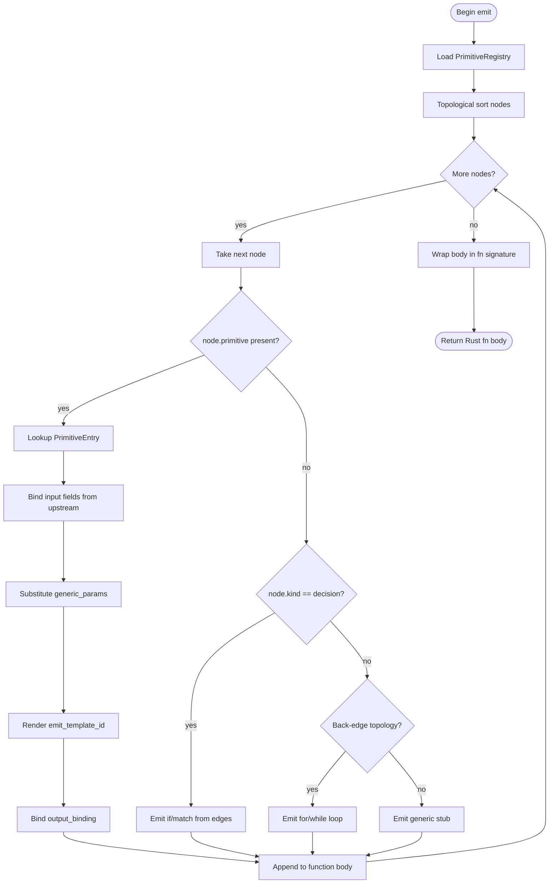

# Mermaid Plus Primitive Vocabulary

## Schema: Primitive Vocabulary
<!-- type: schema lang: yaml -->

```yaml
$schema: "https://json-schema.org/draft/2020-12/schema"
$id: mermaid-plus-primitive-vocabulary#schema
title: Mermaid Plus Primitive Vocabulary
description: >
  Standardized primitive: field values for Mermaid Plus flowchart YAML nodes.
  Each entry defines the primitive name, input field names and types, output type,
  and a template identifier used by the logic generator to emit Rust.
  The primitive: field is additive — existing node fields (kind, label) are unchanged.
definitions:
  PrimitiveKind:
    type: string
    description: >
      Discriminant placed in the node's `primitive:` field. The logic generator
      dispatches emit per this value.
    enum:
      - read_file
      - write_file
      - append_file
      - path_exists
      # JSONL stream IO + subprocess (added by score-chat-jsonl-migration self-bootstrap)
      - parse_jsonl_stream
      - append_line_atomic
      - run_subprocess
      # JSONL string variants (added by enhancement-swap-handwrite-codegen-on-parse-channel-jsonl-seri):
      # parse_jsonl_str takes &str (in-memory); serialize_jsonl_line returns String (no file write).
      - parse_jsonl_str
      - serialize_jsonl_line
      - walk_up_to_marker
      - parse_yaml
      - parse_json
      - parse_toml
      - parse_markdown
      - serialize_yaml
      - serialize_json
      - serialize_toml
      - format_template
      - truncate_at
      - join_with_separator
      - for_each
      - reduce
      - find
      - filter
      - sort_by
      - match
      - now
      - sleep
      - format_timestamp
      - tty_check
      - print_stdout
      - print_stderr
      - read_stdin
      - call
      - terminal

  InputField:
    type: object
    required: [name, field_type]
    properties:
      name:
        type: string
        description: Local binding name used in the emit template.
      field_type:
        type: string
        description: >
          Abstract type token: string | bool | usize | PathBuf | Duration |
          DateTime | Iterator | T (generic). Resolved to Rust types by the
          emitter using the PrimitiveEntry.generic_params list.

  PrimitiveEntry:
    type: object
    required: [name, category, inputs, output_type, emit_template_id]
    description: >
      Full specification for one primitive. Stored in the in-memory registry
      (PrimitiveRegistry) keyed by PrimitiveKind.
    properties:
      name:
        $ref: "#/definitions/PrimitiveKind"
      category:
        type: string
        enum: [file_io, serde, format, control, time, io_surface, generic]
        description: Grouping for documentation and registry iteration.
      inputs:
        type: array
        items:
          $ref: "#/definitions/InputField"
        description: >
          Ordered list of inputs. For variadic primitives (call, for_each),
          extra inputs are accepted as dynamic args.
      output_type:
        type: string
        description: >
          Abstract output type token: unit | bool | string | String | PathBuf |
          DateTime | T | Option<PathBuf>. The emitter maps to Rust type.
      generic_params:
        type: array
        items:
          type: string
        description: >
          Generic type parameter names (e.g. [T]) resolved from node's
          type_args field when present.
      emit_template_id:
        type: string
        description: >
          Key into the emitter's template table
          (sdd/templates/primitive/<emit_template_id>.tera).
          Template variables match input field names plus __out for the
          output binding.
      fallible:
        type: boolean
        default: true
        description: >
          When true the emit appends ? to propagate errors via the function's
          Result return. When false the expression is infallible.

  PrimitiveRegistry:
    type: object
    description: >
      Flat map from PrimitiveKind to PrimitiveEntry.
      Populated at startup from the static table in
      projects/agentic-workflow/src/generate/generators/primitive_registry.rs.
    properties:
      entries:
        type: object
        additionalProperties:
          $ref: "#/definitions/PrimitiveEntry"

  FlowchartNodeWithPrimitive:
    type: object
    description: >
      Extension of the existing FlowchartNodeDef (in flowchart_plus/schema.rs)
      with the additive primitive: field. The existing fields kind and label
      are preserved unchanged; primitive: is optional.
    required: [kind, label]
    properties:
      kind:
        type: string
        enum: [start, process, decision, terminal]
        description: Existing node kind field — unchanged.
      label:
        type: string
        description: Existing display label — unchanged.
      primitive:
        $ref: "#/definitions/PrimitiveKind"
        description: >
          When present, the logic generator uses the named primitive's
          emit template rather than generic process/decision scaffolding.
      inputs:
        type: object
        description: >
          Key-value map binding the primitive's input field names to upstream
          variable names (outputs of predecessor nodes) or literal values.
        additionalProperties:
          type: string
      output_binding:
        type: string
        description: >
          Rust variable name to which this node's output is bound.
          Downstream nodes reference it by this name via the inputs map.
      type_args:
        type: object
        description: >
          Concrete type substitutions for generic_params (e.g. T: Config).
        additionalProperties:
          type: string

  PrimitiveTable:
    type: object
    description: Static vocabulary — all 30 entries grouped by category.
    properties:
      file_io:
        type: array
        items:
          $ref: "#/definitions/PrimitiveEntry"
        x-entries:
          - name: read_file
            category: file_io
            inputs:
              - { name: path, field_type: string }
            output_type: string
            fallible: true
            emit_template_id: read_file
          - name: write_file
            category: file_io
            inputs:
              - { name: path, field_type: string }
              - { name: content, field_type: string }
            output_type: unit
            fallible: true
            emit_template_id: write_file
          - name: append_file
            category: file_io
            inputs:
              - { name: path, field_type: string }
              - { name: content, field_type: string }
            output_type: unit
            fallible: true
            emit_template_id: append_file
          - name: path_exists
            category: file_io
            inputs:
              - { name: path, field_type: string }
            output_type: bool
            fallible: false
            emit_template_id: path_exists
          - name: walk_up_to_marker
            category: file_io
            inputs:
              - { name: start, field_type: PathBuf }
              - { name: marker, field_type: string }
            output_type: "Option<PathBuf>"
            fallible: false
            emit_template_id: walk_up_to_marker
      serde:
        type: array
        items:
          $ref: "#/definitions/PrimitiveEntry"
        x-entries:
          - name: parse_yaml
            category: serde
            inputs:
              - { name: text, field_type: string }
            output_type: T
            generic_params: [T]
            fallible: true
            emit_template_id: parse_yaml
          - name: parse_json
            category: serde
            inputs:
              - { name: text, field_type: string }
            output_type: T
            generic_params: [T]
            fallible: true
            emit_template_id: parse_json
          - name: parse_toml
            category: serde
            inputs:
              - { name: text, field_type: string }
            output_type: T
            generic_params: [T]
            fallible: true
            emit_template_id: parse_toml
          - name: parse_markdown
            category: serde
            inputs:
              - { name: text, field_type: string }
            output_type: MarkdownDoc
            fallible: true
            emit_template_id: parse_markdown
          - name: serialize_yaml
            category: serde
            inputs:
              - { name: value, field_type: T }
            output_type: string
            generic_params: [T]
            fallible: true
            emit_template_id: serialize_yaml
          - name: serialize_json
            category: serde
            inputs:
              - { name: value, field_type: T }
            output_type: string
            generic_params: [T]
            fallible: true
            emit_template_id: serialize_json
          - name: serialize_toml
            category: serde
            inputs:
              - { name: value, field_type: T }
            output_type: string
            generic_params: [T]
            fallible: true
            emit_template_id: serialize_toml
      format:
        type: array
        items:
          $ref: "#/definitions/PrimitiveEntry"
        x-entries:
          - name: format_template
            category: format
            inputs:
              - { name: template, field_type: string }
              - { name: vars, field_type: "Map<string,string>" }
            output_type: string
            fallible: false
            emit_template_id: format_template
          - name: truncate_at
            category: format
            inputs:
              - { name: s, field_type: string }
              - { name: n, field_type: usize }
            output_type: string
            fallible: false
            emit_template_id: truncate_at
          - name: join_with_separator
            category: format
            inputs:
              - { name: iter, field_type: "Iterator<String>" }
              - { name: sep, field_type: string }
            output_type: string
            fallible: false
            emit_template_id: join_with_separator
      control:
        type: array
        items:
          $ref: "#/definitions/PrimitiveEntry"
        x-entries:
          - name: for_each
            category: control
            inputs:
              - { name: iter, field_type: Iterable }
              - { name: body_subgraph, field_type: subgraph_id }
            output_type: unit
            fallible: false
            emit_template_id: for_each
          - name: reduce
            category: control
            inputs:
              - { name: iter, field_type: Iterable }
              - { name: reducer_fn, field_type: fn_ref }
              - { name: init, field_type: T }
            output_type: T
            generic_params: [T]
            fallible: false
            emit_template_id: reduce
          - name: find
            category: control
            inputs:
              - { name: iter, field_type: Iterable }
              - { name: predicate_fn, field_type: fn_ref }
            output_type: "Option<T>"
            generic_params: [T]
            fallible: false
            emit_template_id: find
          - name: filter
            category: control
            inputs:
              - { name: iter, field_type: Iterable }
              - { name: predicate_fn, field_type: fn_ref }
            output_type: "Iterator<T>"
            generic_params: [T]
            fallible: false
            emit_template_id: filter
          - name: sort_by
            category: control
            inputs:
              - { name: iter, field_type: "Vec<T>" }
              - { name: key_fn, field_type: fn_ref }
            output_type: unit
            generic_params: [T]
            fallible: false
            emit_template_id: sort_by
          - name: match
            category: control
            inputs:
              - { name: value, field_type: T }
              - { name: arms, field_type: "List<MatchArm>" }
            output_type: U
            generic_params: [T, U]
            fallible: false
            emit_template_id: match
      time:
        type: array
        items:
          $ref: "#/definitions/PrimitiveEntry"
        x-entries:
          - name: now
            category: time
            inputs: []
            output_type: DateTime
            fallible: false
            emit_template_id: now
          - name: sleep
            category: time
            inputs:
              - { name: duration, field_type: Duration }
            output_type: unit
            fallible: false
            emit_template_id: sleep
          - name: format_timestamp
            category: time
            inputs:
              - { name: dt, field_type: DateTime }
              - { name: fmt, field_type: string }
            output_type: string
            fallible: false
            emit_template_id: format_timestamp
      io_surface:
        type: array
        items:
          $ref: "#/definitions/PrimitiveEntry"
        x-entries:
          - name: tty_check
            category: io_surface
            inputs: []
            output_type: bool
            fallible: false
            emit_template_id: tty_check
          - name: print_stdout
            category: io_surface
            inputs:
              - { name: text, field_type: string }
            output_type: unit
            fallible: false
            emit_template_id: print_stdout
          - name: print_stderr
            category: io_surface
            inputs:
              - { name: text, field_type: string }
            output_type: unit
            fallible: false
            emit_template_id: print_stderr
          - name: read_stdin
            category: io_surface
            inputs: []
            output_type: string
            fallible: true
            emit_template_id: read_stdin
      generic:
        type: array
        items:
          $ref: "#/definitions/PrimitiveEntry"
        x-entries:
          - name: call
            category: generic
            inputs:
              - { name: target, field_type: fn_ref }
              - { name: args, field_type: "List<NamedArg>" }
            output_type: T
            generic_params: [T]
            fallible: true
            emit_template_id: call
          - name: terminal
            category: generic
            inputs: []
            output_type: unit
            fallible: false
            emit_template_id: terminal
```
## Logic: Primitive Emit Algorithm
<!-- type: logic lang: mermaid -->


## Changes
<!-- type: changes lang: yaml -->

```yaml
changes:
  - path: packages/cclab-agkit/schemas/mermaid-plus-flowchart-node.schema.yaml
    action: modify
    section: schema
    impl_mode: hand-written
    description: >
      Add the optional primitive: field to the flowchart node schema,
      referencing PrimitiveKind enum values. Additive — no existing
      fields are changed. Update the node JSON Schema to include
      primitive, inputs, output_binding, and type_args as optional properties.

  - path: projects/agentic-workflow/src/generate/generators/primitive_registry.rs
    action: create
    section: schema
    impl_mode: hand-written
    description: >
      New file: static PrimitiveRegistry initialized from the vocabulary
      table defined in this spec. Exports a lazy_static PRIMITIVE_REGISTRY
      constant and a lookup fn that returns Option<&PrimitiveEntry> by name.

  - path: projects/agentic-workflow/src/generate/diagrams/flowchart_plus/schema.rs
    action: modify
    section: schema
    impl_mode: hand-written
    description: >
      Extend FlowchartNodeDef (hand-written region outside CODEGEN block)
      with three optional fields: primitive (Option<PrimitiveKind>),
      inputs (Option<IndexMap<String, String>>), output_binding
      (Option<String>), and type_args (Option<IndexMap<String, String>>).
      No codegen block is touched.

  - path: projects/agentic-workflow/src/generate/generators/flowchart_plus_gen.rs
    action: modify
    section: logic
    impl_mode: hand-written
    description: >
      Extend the generate_from_ir method to call the new
      LogicPrimitiveEmitter when at least one node carries a primitive:
      field. The emitter performs topological sort, resolves bindings,
      and renders Rust via emit templates. Output file changes from
      {id}_flow.py to {id}_flow.rs when target is rust.

  - path: projects/agentic-workflow/src/generate/generators/logic_primitive_emitter.rs
    action: create
    section: logic
    impl_mode: hand-written
    description: >
      New file: LogicPrimitiveEmitter struct implementing the emit
      algorithm described in this spec's ## Logic section. Depends on
      PrimitiveRegistry. Exports emit_flowchart(def, settings) -> Result<String>.

  - path: projects/agentic-workflow/src/generate/generators/mod.rs
    action: modify
    section: schema
    impl_mode: hand-written
    description: >
      Pub-use the new primitive_registry and logic_primitive_emitter modules.

  - path: projects/agentic-workflow/src/generate/generators/primitive_registry_tests.rs
    action: create
    section: tests
    impl_mode: hand-written
    description: >
      Unit tests: one round-trip test per primitive entry confirming the
      registry lookup returns the correct PrimitiveEntry with expected
      inputs, output_type, fallible, and emit_template_id fields.
      (R7: 1778+ tests baseline must hold.)
```

# Reviews

## Review 1
<!-- type: review lang: markdown -->

**Verdict:** approved

- [schema] All 30 primitives are present across 7 categories with complete `inputs`, `output_type`, `fallible`, and `emit_template_id` fields — the vocabulary table is machine-readable and implementation-ready.
- [logic] The emit algorithm flowchart is complete and internally consistent: topological sort, primitive dispatch, generic/decision/loop fallback, and function wrapping are all covered.
- [changes] The `primitive_registry_tests.rs` entry carries `section: tests` which is not in `fill_sections: [overview, schema, logic, changes]` — cosmetic inconsistency, does not affect implementability.
- [changes] The `flowchart_plus_gen.rs` description mentions "Output file changes from {id}_flow.py to {id}_flow.rs when target is rust" — the `.py` reference is a stale copy-paste artifact; surrounding prose and the new `logic_primitive_emitter.rs` change make intent unambiguous, so this does not block implementation.
