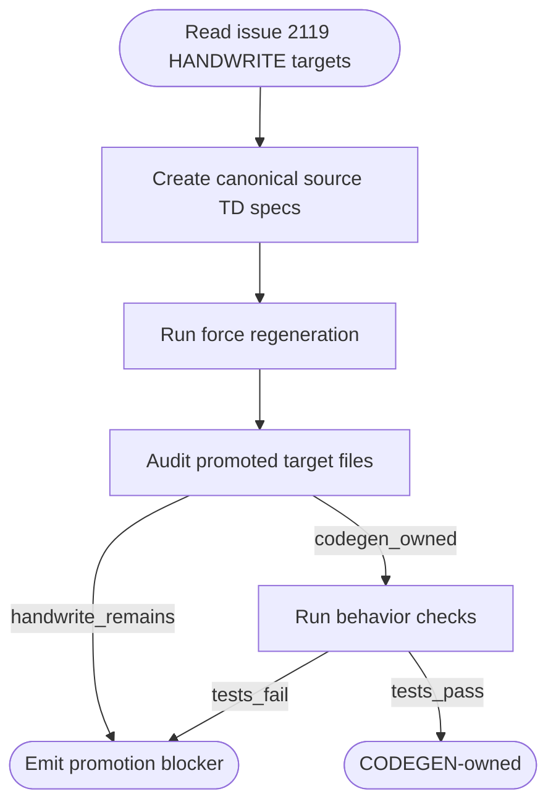

# Project Health Codegen Promotion

## Schema
<!-- type: schema lang: yaml -->

```yaml
definitions:
  ProjectHealthPromotionTarget:
    type: object
    required: [path, td_spec, source_template, promotion_mode]
    description: "A file whose issue-2119 HANDWRITE bridge must become CODEGEN-owned through a canonical source TD."
    properties:
      path: { type: string }
      td_spec: { type: string }
      source_template:
        type: string
        enum: [source-from-target]
      promotion_mode:
        type: string
        enum: [strip-handwrite]
      blocker_closed: { type: string }
    x-rust-struct:
      derive: [Debug, Clone, Serialize, Deserialize]

  ProjectHealthPromotionReport:
    type: object
    required: [promoted_targets, remaining_handwrite_targets, force_regen_verified]
    description: "Promotion result consumed by tests and the project health command."
    properties:
      promoted_targets:
        type: array
        items: { $ref: "#/definitions/ProjectHealthPromotionTarget" }
      remaining_handwrite_targets:
        type: array
        items: { type: string }
      force_regen_verified: { type: boolean }
    x-rust-struct:
      derive: [Debug, Clone, Serialize, Deserialize]
```

## Logic
<!-- type: logic lang: mermaid -->



## CLI
<!-- type: cli lang: yaml -->

```yaml
commands:
  - name: score
    subcommands:
      - name: cb
        subcommands:
          - name: gen
            description: "Force-regenerate canonical source TD entries for a configured project."
            flags:
              - name: force-regen
                type: boolean
                default: false
              - name: project
                type: string
                required: true
              - name: verify
                type: boolean
                default: false
      - name: project
        subcommands:
          - name: health
            description: "Report project governance health after promotion."
            args:
              - name: project
                required: true
                type: string
            flags:
              - name: json
                type: boolean
                default: false
```

## Test Plan
<!-- type: test-plan lang: mermaid -->

```mermaid
---
id: project_health_codegen_promotion_tests
requirements:
  R1: { id: R1, text: "Project health source module is CODEGEN-owned after promotion", kind: functional, risk: high, verify: test }
  R2: { id: R2, text: "Project health test module is CODEGEN-owned after promotion", kind: functional, risk: medium, verify: test }
  R3: { id: R3, text: "Force-regeneration does not reintroduce HANDWRITE markers for promoted targets", kind: functional, risk: high, verify: test }
  R4: { id: R4, text: "Project health command behavior remains unchanged", kind: functional, risk: high, verify: test }
tests:
  project_health_targets_are_codegen_owned:
    verifies: [R1, R2, R3]
    kind: integration
  project_health_behavior_still_reports_blocked_state:
    verifies: [R4]
    kind: integration
---
requirementDiagram
    requirement R1 {
      id: R1
      text: "project.rs is CODEGEN-owned"
      risk: high
      verifymethod: test
    }
    requirement R2 {
      id: R2
      text: "project_health_test.rs is CODEGEN-owned"
      risk: medium
      verifymethod: test
    }
    requirement R3 {
      id: R3
      text: "force regen keeps promoted targets CODEGEN"
      risk: high
      verifymethod: test
    }
    requirement R4 {
      id: R4
      text: "behavior unchanged"
      risk: high
      verifymethod: test
    }
    element project_health_targets_are_codegen_owned {
      type: test
    }
    element project_health_behavior_still_reports_blocked_state {
      type: test
    }
    project_health_targets_are_codegen_owned - verifies -> R1
    project_health_targets_are_codegen_owned - verifies -> R2
    project_health_targets_are_codegen_owned - verifies -> R3
    project_health_behavior_still_reports_blocked_state - verifies -> R4
```

## Changes
<!-- type: changes lang: yaml -->

```yaml
changes:
  - path: projects/agentic-workflow/tech-design/surface/generate/project-health-source.md
    action: create
    impl_mode: codegen
    section: source
    description: "Canonical source TD for projects/agentic-workflow/src/cli/project.rs using source-from-target strip-handwrite."
  - path: projects/agentic-workflow/tech-design/surface/generate/project-health-test-source.md
    action: create
    impl_mode: codegen
    section: source
    description: "Canonical source TD for projects/agentic-workflow/tests/cli/tests/project_health_test.rs using source-from-target strip-handwrite."
  - path: projects/agentic-workflow/src/cli/project.rs
    action: modify
    impl_mode: codegen
    section: source
    description: "Replace issue-2119 HANDWRITE ownership with CODEGEN ownership generated from the canonical source TD."
  - path: projects/agentic-workflow/tests/cli/tests/project_health_test.rs
    action: modify
    impl_mode: codegen
    section: source
    description: "Replace issue-2119 HANDWRITE ownership with CODEGEN ownership generated from the canonical source TD."
  - action: annotate
    section: cli
    impl_mode: hand-written
    description: "Traceability metadata edge for the cli section."

  - action: annotate
    section: logic
    impl_mode: hand-written
    description: "Traceability metadata edge for the logic section."

  - action: annotate
    section: schema
    impl_mode: hand-written
    description: "Traceability metadata edge for the schema section."

  - action: annotate
    section: unit-test
    impl_mode: hand-written
    description: "Traceability metadata edge for the unit-test section."

```

# Reviews

### Review 1
**Verdict:** approved

- [changes] The first slice is intentionally limited to source-template promotion of the two issue-2119 HANDWRITE targets; broader safe-splice primitives can follow after this bridge is CODEGEN-owned.
- [logic] The promotion flow is deterministic: create canonical source TDs, force-regenerate, audit marker ownership, then re-run behavior checks.
