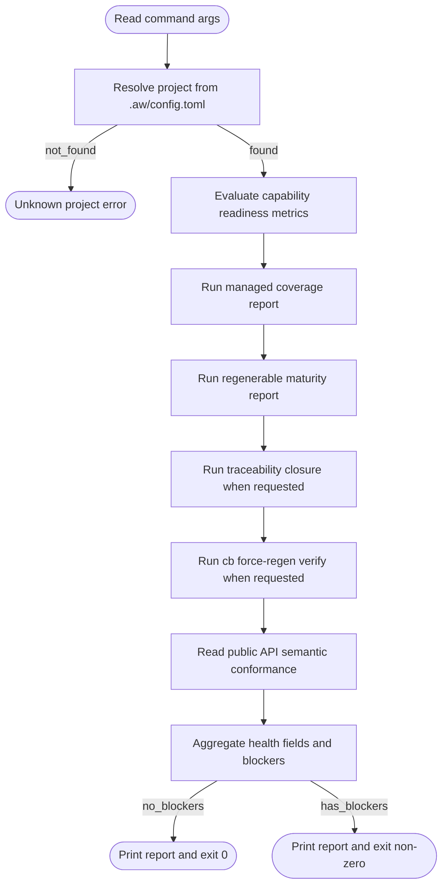

# Project Health Governance Report

## Overview
<!-- type: overview lang: markdown -->

Public API manifest for 2 target files generated from AST during Score force-regeneration standardization.

### Symbols

| Name | Target | Kind | Visibility | Line | Signature |
|------|--------|------|------------|------|-----------|
| `ProductionCapabilityInput` | projects/agentic-workflow/src/cli/production.rs | struct | pub | 39 |  |
| `ProductionCapabilityReadiness` | projects/agentic-workflow/src/cli/production.rs | struct | pub | 19 |  |
| `ProductionReadinessReport` | projects/agentic-workflow/src/cli/production.rs | struct | pub | 29 |  |
| `ProductionStatus` | projects/agentic-workflow/src/cli/production.rs | enum | pub | 11 |  |
| `evaluate_capability_scope` | projects/agentic-workflow/src/cli/production.rs | function | pub | 89 | evaluate_capability_scope(     inputs: Vec<ProductionCapabilityInput>,     capability_id: &str,     global_blockers: Vec<String>,     production_gates_evaluated: bool, ) -> ProductionReadinessReport |
| `evaluate_capability_scope_with_regenerability` | projects/agentic-workflow/src/cli/production.rs | function | pub | 119 | evaluate_capability_scope_with_regenerability(     inputs: Vec<ProductionCapabilityInput>,     capability_id: &str,     global_blockers: Vec<String>,     production_gates_evaluated: bool,     regenerability_gap_count: usize, ) -> ProductionReadinessReport |
| `evaluate_release_scope` | projects/agentic-workflow/src/cli/production.rs | function | pub | 81 | evaluate_release_scope(     inputs: Vec<ProductionCapabilityInput>,     global_blockers: Vec<String>,     production_gates_evaluated: bool, ) -> ProductionReadinessReport |
| `evaluate_release_scope_with_regenerability` | projects/agentic-workflow/src/cli/production.rs | function | pub | 104 | evaluate_release_scope_with_regenerability(     inputs: Vec<ProductionCapabilityInput>,     global_blockers: Vec<String>,     production_gates_evaluated: bool,     regenerability_gap_count: usize, ) -> ProductionReadinessReport |
| `inputs_from_report_items` | projects/agentic-workflow/src/cli/production.rs | function | pub | 66 | inputs_from_report_items(     items: &[CapabilityReportItem], ) -> Vec<ProductionCapabilityInput> |
| `inputs_from_sections` | projects/agentic-workflow/src/cli/production.rs | function | pub | 47 | inputs_from_sections(     sections: &[CapabilitySection],     verified_by_id: &BTreeMap<String, bool>, ) -> Vec<ProductionCapabilityInput> |
| `RegenerabilityAuthority` | projects/agentic-workflow/src/cli/regenerability_policy.rs | enum | pub | 9 |  |
| `RegenerabilityPolicy` | projects/agentic-workflow/src/cli/regenerability_policy.rs | struct | pub | 16 |  |
| `required_for_production` | projects/agentic-workflow/src/cli/regenerability_policy.rs | function | pub | 24 | required_for_production(&self) -> bool |
| `resolve_regenerability_policy` | projects/agentic-workflow/src/cli/regenerability_policy.rs | function | pub | 55 | resolve_regenerability_policy(project: Option<&str>) -> RegenerabilityPolicy |
| `resolve_regenerability_policy_at` | projects/agentic-workflow/src/cli/regenerability_policy.rs | function | pub | 67 | resolve_regenerability_policy_at(     project_root: &Path,     project: &str, ) -> Option<RegenerabilityPolicy> |
## Logic
<!-- type: logic lang: mermaid -->



## CLI
<!-- type: cli lang: yaml -->

```yaml
commands:
  - name: aw
    subcommands:
      - name: health
        description: "Aggregate SDD governance health for one configured project."
        args:
          - name: project
            required: true
            type: string
            description: "Configured project name from [[projects]] in .aw/config.toml."
        flags:
          - name: verify-traceability
            type: boolean
            default: false
            description: "Run expensive TD/source/CB traceability closure verification; default health reports this gate as not evaluated."
          - name: verify-cb
            type: boolean
            default: false
            description: "Run expensive deterministic CB replay/drift verification; default health reports this gate as not evaluated."
          - name: verify-cold
            type: boolean
            default: false
            description: "Run expensive TD-only cold rebuild verification for workspaces with verify_cold = true."
          - name: verify-tests
            type: boolean
            default: false
            description: "Run configured workspace test commands as production release gates."
          - name: json
            type: boolean
            default: false
            description: "Deprecated compatibility no-op; health emits JSON by default."
          - name: human
            type: boolean
            default: false
            description: "Emit the legacy human-readable health report."
          - name: pretty
            type: boolean
            default: false
            description: "Pretty-print the JSON report."
        exit_codes:
          0: "Project is deterministically healthy."
          1: "Project has governance blockers."
          2: "Invocation error, including unknown project."
output:
  json:
    fields:
      project: string
      status: "healthy|blocked"
      managed_percent: number
      semantic_percent: number
      production_ready: boolean
      capability:
        evaluated: boolean
        production_evaluated: boolean
        note: string?
        cap_path: string
        format: string
        format_version: number
        capability_count: number
        release_scope_count: number
        root_runner_ready: boolean
        production_ready_count: number
        production_scope_count: number
        production_percent: number
        blocker_count: number
        blockers: array
      regenerable_percent: number
      traceability_evaluated: boolean
      traceability_note: string?
      traceability_percent: number
      regenerability_authority:
        authority: "generator_authoritative|external_advisory"
        required_for_production: boolean
        gap_count: number
        reason: string
        blockers: array
        advisory_gaps: array
      optional_regenerability_gaps: array
      handwrite_files: number
      unmarked_files: number
      cb_verify_evaluated: boolean
      cb_verify_note: string?
      cb_verify_clean: boolean
      public_api_covered: number
      public_api_total: number
      semantic_review_required: number
      blockers: array
  human:
    sections:
      - summary
      - capability
      - coverage
      - cb_verify
      - public_api
      - blockers
```

`semantic_review_required` reports target-derived source template units that need
agent sampling. The count is advisory by itself; `aw health` returns
non-zero only when deterministic governance gates fail.

`regenerable_percent`, `regenerability_authority`, and
`optional_regenerability_gaps` report automation maturity and generator
authority. Regenerability gaps block `production_ready` when the project is
generator-authoritative or when a capability explicitly declares full
regenerability as part of its verification contract. External advisory projects
keep remaining generator gaps in `optional_regenerability_gaps`. Standard
production readiness is otherwise gated by capability readiness, managed
ownership, semantic coverage, traceability closure, cb verify, cold verify,
unresolved blocker state, and HITL decisions. Interactive `aw health`
keeps full traceability closure behind `--verify-traceability` and
deterministic CB replay/drift verification behind `--verify-cb`; when either
flag is absent the report must mark that gate as not evaluated and must not
claim production readiness from a skipped gate.

## Test Plan
<!-- type: test-plan lang: mermaid -->

```mermaid
---
id: project_health_verification
requirements:
  R1: { id: R1, text: "Expose one project health command for configured projects", kind: functional, risk: medium, verify: test }
  R2: { id: R2, text: "Report capability readiness, managed coverage, semantic coverage, regenerable maturity, handwrite count, unmarked count, traceability/cb verify evaluation/status, public API coverage, cold verify status, and semantic review count", kind: functional, risk: high, verify: test }
  R3: { id: R3, text: "Return non-zero when deterministic governance is broken", kind: functional, risk: high, verify: test }
  R4: { id: R4, text: "Support human-readable and JSON output", kind: functional, risk: medium, verify: test }
  R5: { id: R5, text: "Resolve project scope from .aw/config.toml and reject unknown projects", kind: functional, risk: high, verify: test }
  R6: { id: R6, text: "Compose existing standardize and cb verification logic without duplicating scanner implementations", kind: functional, risk: medium, verify: test }
  R7: { id: R7, text: "Cover clean, drift, advisory regenerability, unmarked, and unknown-project cases", kind: functional, risk: medium, verify: test }
  R8: { id: R8, text: "Treat regenerability gaps as advisory automation maturity when production gates are clean and authority is external_advisory", kind: functional, risk: high, verify: test }
  R9: { id: R9, text: "Treat regenerability gaps as blockers when the project or capability requires full regenerability", kind: functional, risk: high, verify: test }
tests:
  clean_project_health_json:
    verifies: [R1, R2, R4, R6]
    kind: unit
  blocked_project_health_exit:
    verifies: [R2, R3, R7]
    kind: unit
  semantic_review_advisory:
    verifies: [R2, R3]
    kind: unit
  regenerability_advisory:
    verifies: [R2, R3, R8]
    kind: unit
  regenerability_authoritative:
    verifies: [R2, R3, R9]
    kind: unit
  unknown_project_rejected:
    verifies: [R5]
    kind: unit
  human_report_contains_blockers:
    verifies: [R2, R4]
    kind: snapshot
---
requirementDiagram
    requirement R1 {
      id: R1
      text: "Expose one project health command"
      risk: medium
      verifymethod: test
    }
    requirement R2 {
      id: R2
      text: "Report all governance signals"
      risk: high
      verifymethod: test
    }
    requirement R3 {
      id: R3
      text: "Fail on deterministic blockers"
      risk: high
      verifymethod: test
    }
    requirement R4 {
      id: R4
      text: "Support human and JSON output"
      risk: medium
      verifymethod: test
    }
    requirement R5 {
      id: R5
      text: "Reject unknown project"
      risk: high
      verifymethod: test
    }
    requirement R6 {
      id: R6
      text: "Compose existing scanners"
      risk: medium
      verifymethod: test
    }
    requirement R7 {
      id: R7
      text: "Cover blocker and advisory cases"
      risk: medium
      verifymethod: test
    }
    requirement R8 {
      id: R8
      text: "Regenerability is advisory maturity"
      risk: high
      verifymethod: test
    }
    element clean_project_health_json {
      type: test
    }
    element blocked_project_health_exit {
      type: test
    }
    element semantic_review_advisory {
      type: test
    }
    element regenerability_advisory {
      type: test
    }
    requirement R9 {
      id: R9
      text: "Regenerability blocks when required"
      risk: high
      verifymethod: test
    }
    element regenerability_authoritative {
      type: test
    }
    element unknown_project_rejected {
      type: test
    }
    element human_report_contains_blockers {
      type: test
    }
    clean_project_health_json - verifies -> R1
    clean_project_health_json - verifies -> R2
    clean_project_health_json - verifies -> R4
    clean_project_health_json - verifies -> R6
    blocked_project_health_exit - verifies -> R2
    blocked_project_health_exit - verifies -> R3
    blocked_project_health_exit - verifies -> R7
    semantic_review_advisory - verifies -> R2
    semantic_review_advisory - verifies -> R3
    regenerability_advisory - verifies -> R2
    regenerability_advisory - verifies -> R3
    regenerability_advisory - verifies -> R8
    regenerability_authoritative - verifies -> R2
    regenerability_authoritative - verifies -> R3
    regenerability_authoritative - verifies -> R9
    unknown_project_rejected - verifies -> R5
    human_report_contains_blockers - verifies -> R2
    human_report_contains_blockers - verifies -> R4
```

## Changes
<!-- type: changes lang: yaml -->

```yaml
coverage_kind: semantic
changes:
  - path: projects/agentic-workflow/src/cli/project.rs
    action: create
    impl_mode: hand-written
    section: source
    description: "Add project command namespace and health aggregation runner with explicit capability readiness metrics, keeping traceability closure behind --verify-traceability and CB replay/drift verification behind --verify-cb for fast interactive health; generator gap: project-health aggregation over multiple existing reports is not yet expressible as a codegen primitive."
  - path: projects/agentic-workflow/src/cli/regenerability_policy.rs
    action: create
    impl_mode: hand-written
    section: source
    description: "Resolve configured regenerability authority and the Agentic Workflow generator-authoritative default for project health and standardize reports."
  - path: projects/agentic-workflow/src/cli/production.rs
    action: create
    impl_mode: hand-written
    section: source
    description: "Add shared production readiness scope model for capability, project health, and run completion; generator gap: cross-command readiness aggregation is not yet expressible as a codegen primitive."
  - path: projects/agentic-workflow/src/cli/commands.rs
    action: modify
    impl_mode: hand-written
    section: source
    description: "Register aw health command and dispatch; generator gap: existing whole-file source template cannot safely splice one enum variant and one dispatch arm."
  - path: projects/agentic-workflow/src/cli/standardize.rs
    action: modify
    impl_mode: hand-written
    section: source
    description: "Expose reusable managed/regenerable report helpers plus a shared project-health coverage helper that reuses inventory and semantic scans while skipping replay drift verification unless requested; generator gap: public helper extraction from existing implementation is not yet a structural primitive."
  - path: projects/agentic-workflow/src/cli/cb.rs
    action: modify
    impl_mode: hand-written
    section: source
    description: "Expose reusable force-regen verification summary for project health; generator gap: report extraction from cb verify is not yet a structural primitive."
  - path: projects/agentic-workflow/tests/cli/tests/project_health_test.rs
    action: modify
    impl_mode: codegen
    section: source
    description: "Cover clean, drift, handwrite, unmarked, and unknown-project project health cases through the canonical source TD."
  - action: annotate
    section: cli
    impl_mode: hand-written
    description: "Traceability metadata edge for the cli section."

  - action: annotate
    section: logic
    impl_mode: hand-written
    description: "Traceability metadata edge for the logic section."

  - action: annotate
    section: unit-test
    impl_mode: hand-written
    description: "Traceability metadata edge for the unit-test section."

```

# Reviews

### Review 1
**Verdict:** approved

- [logic] The aggregation flow is deterministic and composes existing managed, regenerable, cb verification, and public API signals without introducing a second scanner.
- [cli] The command contract is explicit enough for implementation; include any required module export wiring alongside `commands.rs` during codegen.
