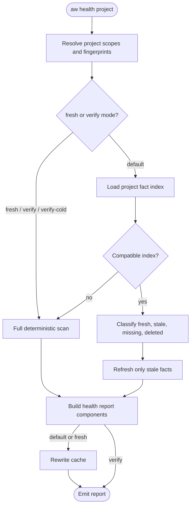

# Project Health Incremental Index

## Overview
<!-- type: overview lang: markdown -->

`aw health` and the standardization reports rebuild the same project
facts on every run: source file inventory, marker ownership, TD annotations,
source evidence nodes, generator primitive hints, stack migration facts,
dependency policies, and deployment facets. Release builds reduce command
overhead, but repeated full scans still make health checks slower than needed
for large standardization targets such as fixture platform.

This spec defines a deterministic project facts index. The index is a local,
rebuildable cache under `.aw/.index/project-health/<project>.json`. It is not a
semantic search index, vector store, or alternate source of truth. Every cached
entry is keyed by reproducible inputs: project scope, scanner versions, config
fingerprints, file content identity, TD root identity, and policy versions.

Default health runs may reuse fresh entries and refresh only stale facts.
Explicit fresh or verification modes still perform full rescans and may rewrite
the index after successful recomputation. If the index is missing, corrupt, or
version-incompatible, the command falls back to a full scan and reports that the
cache was rebuilt.

## Schema
<!-- type: schema lang: yaml -->

```yaml
project_health_incremental_index:
  cache_root: ".aw/.index/project-health"
  file_name: "<project>.json"
  persistence:
    versioned_in_git: false
    source_of_truth: false
    rebuildable: true
    ignored_by: ".gitignore entry .aw/.index/"

  ProjectFactIndex:
    required:
      - schema_version
      - project
      - project_root
      - scope_fingerprint
      - config_fingerprint
      - scanner_versions
      - policy_versions
      - td_root_fingerprint
      - entries
      - aggregate
      - written_at_unix_ms
    fields:
      schema_version: 1
      project: "configured project name"
      project_root: "absolute canonical root used for this index"
      scope_fingerprint: "sha256 of resolved project scan scopes"
      config_fingerprint: "sha256 of .aw/config.toml project/workspace routing relevant to health"
      scanner_versions:
        inventory: "changes when source-file collection rules change"
        marker_ownership: "changes when CODEGEN/HANDWRITE parsing changes"
        td_annotations: "changes when @spec or SPEC-MANAGED parsing changes"
        source_evidence: "changes when SourceEvidenceNode inference changes"
        stack_migration: "changes when stack classification changes"
        dependency_policy: "changes when dependency policy classification changes"
        deployment_facets: "changes when deployment facet extraction changes"
      policy_versions:
        language_layout_profiles: "version of layout profile rules when used"
        section_type_registry: "version of approved section type role registry"
        standardization_layers: "version of managed/semantic/regenerable gate semantics"
      td_root_fingerprint: "sha256 of TD file path, size, content hash, and scanner version tuple"
      entries:
        type: "map repo_relative_path -> ProjectFactEntry"
      aggregate:
        type: "ProjectFactAggregate"
      written_at_unix_ms: "diagnostic timestamp only; not part of freshness decisions"

  ProjectFactEntry:
    required:
      - path
      - freshness
      - source_file
      - marker_ownership
      - td_annotations
      - source_evidence
      - generator_primitives
      - stack_migration
      - dependency_policy
      - deployment_facets
    fields:
      path: "repo-relative path"
      freshness:
        type: "EntryFreshnessKey"
      source_file:
        language: "detected language or artifact family"
        size_bytes: "file size at scan time"
        content_hash: "sha256 of file bytes"
        git_blob_oid: "optional tracked blob oid when available"
        executable: "boolean"
      marker_ownership:
        codegen: "boolean"
        handwrite: "boolean"
        marker_spans: "stable begin/end line spans"
        malformed_markers: "array of diagnostic strings"
      td_annotations:
        spec_managed: "array of TD spec refs from SPEC-MANAGED comments"
        inline_spec_refs: "array of @spec refs"
        stale_refs: "array of refs whose target TD anchor is missing"
      source_evidence:
        node: "optional SourceEvidenceNode equivalent"
        domain: "semantic group key"
        layer: "backend|frontend|operations|test|unknown"
        section_type: "section type v2 role inferred for the source unit"
      generator_primitives:
        primitives: "deterministic generator primitive hints from source shape"
      stack_migration:
        workspace: "optional workspace name"
        manifest_stacks: "array"
        source_stacks: "array"
        migration_state: "normalized migration state label"
        normalized: "boolean"
      dependency_policy:
        dependencies: "array of dependency policy findings for manifests"
        blockers: "array of blocker strings"
      deployment_facets:
        facets: "array of deployment facet records"
        unsupported_kinds: "array of unsupported deployment resource kinds"

  EntryFreshnessKey:
    required:
      - path
      - content_hash
      - scanner_versions
      - config_fingerprint
      - scope_fingerprint
      - td_root_fingerprint
      - policy_versions
    stale_when:
      - "file is missing or content_hash differs"
      - "path enters or leaves resolved scope"
      - "any scanner version used by the entry differs"
      - ".aw/config.toml project/workspace routing fingerprint differs"
      - "TD root fingerprint differs for facts that depend on TD refs"
      - "policy version differs for layout, section-type, dependency, deployment, or standardization rules"

  ProjectFactAggregate:
    fields:
      source_file_count: "count of in-scope files"
      by_language: "language/artifact family counts"
      marker_counts: "CODEGEN/HANDWRITE/unmarked counts"
      td_ref_count: "total TD refs found in source"
      stale_td_ref_count: "stale annotation count"
      dependency_blocker_count: "dependency policy blocker count"
      deployment_blocker_count: "deployment policy blocker count"
      incomplete_stack_migration_workspaces: "count"

  command_modes:
    default:
      read_index: true
      reuse_fresh_entries: true
      refresh_stale_entries: true
      full_rescan: "only when index missing, corrupt, incompatible, or scope/config changed globally"
    fresh:
      read_index: false
      reuse_fresh_entries: false
      refresh_stale_entries: false
      full_rescan: true
      write_index_after_success: true
    verify:
      read_index: false
      reuse_fresh_entries: false
      full_rescan: true
      write_index_after_success: false
      purpose: "prove current tree, not warm the cache"
    verify_cold:
      read_index: false
      reuse_fresh_entries: false
      full_rescan: true
      write_index_after_success: false
      purpose: "compose with existing cold rebuild gates"
```

## Logic
<!-- type: logic lang: mermaid -->



The incremental path must preserve the same output contract as a full scan.
Fresh entries may replace only facts whose freshness key still matches. Any
fact dependent on a changed TD root, layout profile, section registry, config
route, dependency policy, or deployment policy is stale even when the source
file bytes are unchanged.

## CLI
<!-- type: cli lang: yaml -->

```yaml
commands:
  - name: aw
    subcommands:
      - name: project
        subcommands:
          - name: health
            args:
              - name: project
                required: true
                type: string
            flags:
              - name: json
                type: boolean
                default: false
              - name: fresh
                type: boolean
                default: false
                description: "Ignore any project fact index, run a full rescan, and rewrite the index after success."
              - name: verify
                type: boolean
                default: false
                description: "Run a full rescan without reading or writing the index."
              - name: verify-cold
                type: boolean
                default: false
                description: "Run existing cold rebuild verification; does not rely on project fact index entries."
            output:
              cache:
                fields:
                  index_status: "reused|partial_refresh|rebuilt|ignored|disabled"
                  fresh_entries: integer
                  refreshed_entries: integer
                  deleted_entries: integer
                  cache_path: string
                  cache_note: string
```

`--fresh` is the operator escape hatch for timing comparisons and suspected
cache bugs. `--verify` and `--verify-cold` are proof modes and do not silently
trust or warm the cache.

## Test Plan
<!-- type: test-plan lang: mermaid -->

```mermaid
---
id: project_health_incremental_index_tests
requirements:
  R1: { id: R1, text: "Project fact index records source, ownership, TD annotation, deployment, dependency, and invalidation facts", kind: functional, risk: high, verify: test }
  R2: { id: R2, text: "Default project health reuses fresh entries and refreshes stale entries only", kind: functional, risk: high, verify: test }
  R3: { id: R3, text: "--fresh and verify modes perform full rescans without trusting cached entries", kind: functional, risk: high, verify: test }
  R4: { id: R4, text: "Index invalidates on source, config, TD root, scanner version, and policy version changes", kind: functional, risk: high, verify: test }
  R5: { id: R5, text: "Index remains a reproducible facts cache, not a semantic/vector index", kind: functional, risk: medium, verify: inspection }
tests:
  project_fact_index_round_trip:
    verifies: [R1]
    kind: unit
  project_health_reuses_fresh_entries:
    verifies: [R2]
    kind: integration
  project_health_refreshes_changed_file_only:
    verifies: [R2, R4]
    kind: integration
  project_health_fresh_ignores_cache:
    verifies: [R3]
    kind: integration
  project_health_verify_does_not_write_cache:
    verifies: [R3]
    kind: integration
  project_fact_index_has_no_embeddings_or_free_text_vectors:
    verifies: [R5]
    kind: unit
---
requirementDiagram
    requirement R1 {
      id: R1
      text: "index stores deterministic project facts"
      risk: high
      verifymethod: test
    }
    requirement R2 {
      id: R2
      text: "default health reuses fresh entries"
      risk: high
      verifymethod: test
    }
    requirement R3 {
      id: R3
      text: "fresh/verify modes full scan"
      risk: high
      verifymethod: test
    }
    requirement R4 {
      id: R4
      text: "invalidation is complete"
      risk: high
      verifymethod: test
    }
    requirement R5 {
      id: R5
      text: "not semantic or vector indexing"
      risk: medium
      verifymethod: inspection
    }
    element project_fact_index_round_trip {
      type: test
    }
    element project_health_reuses_fresh_entries {
      type: test
    }
    element project_health_refreshes_changed_file_only {
      type: test
    }
    element project_health_fresh_ignores_cache {
      type: test
    }
    element project_health_verify_does_not_write_cache {
      type: test
    }
    element project_fact_index_has_no_embeddings_or_free_text_vectors {
      type: test
    }
    project_fact_index_round_trip - verifies -> R1
    project_health_reuses_fresh_entries - verifies -> R2
    project_health_refreshes_changed_file_only - verifies -> R2
    project_health_refreshes_changed_file_only - verifies -> R4
    project_health_fresh_ignores_cache - verifies -> R3
    project_health_verify_does_not_write_cache - verifies -> R3
    project_fact_index_has_no_embeddings_or_free_text_vectors - verifies -> R5
```

## Changes
<!-- type: changes lang: yaml -->

```yaml
changes:
  - path: projects/agentic-workflow/tech-design/surface/specs/project-health-incremental-index.md
    action: create
    section: overview
    impl_mode: hand-written
    description: |
      Define the deterministic project facts index for faster project health
      reports, including cache location, schema, freshness keys,
      invalidation, command modes, and tests.
  - action: annotate
    section: cli
    impl_mode: hand-written
    description: "Traceability metadata edge for the cli section."

  - action: annotate
    section: logic
    impl_mode: hand-written
    description: "Traceability metadata edge for the logic section."

  - action: annotate
    section: schema
    impl_mode: hand-written
    description: "Traceability metadata edge for the schema section."

  - action: annotate
    section: unit-test
    impl_mode: hand-written
    description: "Traceability metadata edge for the unit-test section."

```
