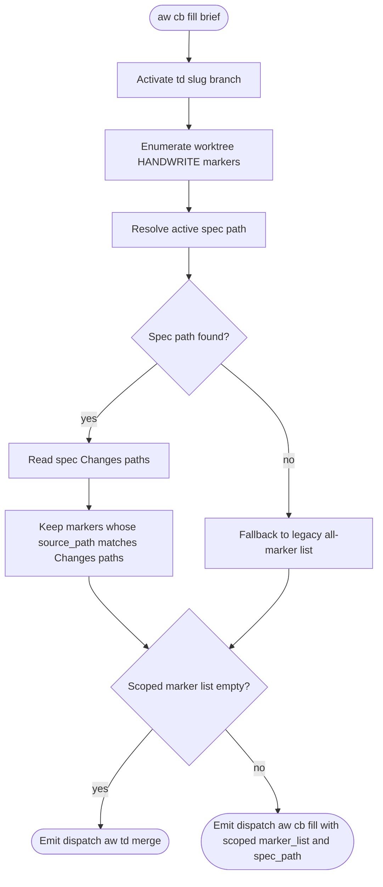

# Score CB Fill Change Scope

`aw cb fill` brief scopes marker enumeration to the active TD's
`## Changes` paths. Inherited HANDWRITE markers outside that path set do not
enter `marker_list`, and a TD whose changed paths contain zero markers
dispatches directly to `aw td merge`.

## Logic: cb-fill-brief-scope
<!-- type: logic lang: mermaid -->



## Test Plan

```mermaid
---
id: score-cb-fill-change-scope-test-plan
requirements:
  r1_zero_marker_fast_path:
    id: R1
    text: "A spec whose Changes paths contain zero HANDWRITE markers yields an empty scoped list and dispatches td merge"
    kind: functional
    risk: high
    verify: test
  r2_filter_to_changes_paths:
    id: R2
    text: "A spec with source Changes paths only includes markers under those exact paths or path prefixes"
    kind: functional
    risk: high
    verify: test
  r3_extract_changes_paths:
    id: R3
    text: "Changes parser extracts path entries from changes or files YAML lists"
    kind: functional
    risk: medium
    verify: test
  r4_preserve_fallback:
    id: R4
    text: "When no active spec path can be resolved, brief mode preserves the legacy all-marker behavior"
    kind: regression
    risk: medium
    verify: test
elements:
  test_scope_zero_marker_for_spec_only_change:
    kind: test
    type: "rs/unit"
  test_scope_filters_to_changed_source_paths:
    kind: test
    type: "rs/unit"
  test_extract_change_paths_supports_changes_and_files:
    kind: test
    type: "rs/unit"
  test_scope_missing_spec_uses_legacy_all_markers:
    kind: test
    type: "rs/unit"
relations:
  - from: test_scope_zero_marker_for_spec_only_change
    verifies: r1_zero_marker_fast_path
  - from: test_scope_filters_to_changed_source_paths
    verifies: r2_filter_to_changes_paths
  - from: test_extract_change_paths_supports_changes_and_files
    verifies: r3_extract_changes_paths
  - from: test_scope_missing_spec_uses_legacy_all_markers
    verifies: r4_preserve_fallback
---
requirementDiagram
    requirement R1 {
      id: R1
      text: "spec-only Changes path yields td merge fast-path"
      risk: high
      verifymethod: test
    }
    requirement R2 {
      id: R2
      text: "marker list is filtered to Changes paths"
      risk: high
      verifymethod: test
    }
    requirement R3 {
      id: R3
      text: "Changes parser reads changes/files path entries"
      risk: medium
      verifymethod: test
    }
    requirement R4 {
      id: R4
      text: "missing spec preserves legacy behavior"
      risk: medium
      verifymethod: test
    }
    element test_scope_zero_marker_for_spec_only_change {
      type: "rs/unit"
    }
    element test_scope_filters_to_changed_source_paths {
      type: "rs/unit"
    }
    element test_extract_change_paths_supports_changes_and_files {
      type: "rs/unit"
    }
    element test_scope_missing_spec_uses_legacy_all_markers {
      type: "rs/unit"
    }
    test_scope_zero_marker_for_spec_only_change - verifies -> R1
    test_scope_filters_to_changed_source_paths - verifies -> R2
    test_extract_change_paths_supports_changes_and_files - verifies -> R3
    test_scope_missing_spec_uses_legacy_all_markers - verifies -> R4
```

<!-- type: test-plan lang: mermaid -->



## Changes
<!-- type: changes lang: yaml -->

```yaml
changes:
  - path: projects/agentic-workflow/src/cli/cb.rs
    action: modify
    section: logic
    impl_mode: hand-written
    description: >
      Add an optional --spec-path flag to aw cb fill so upstream TD/CB
      envelopes can pass the active TD spec explicitly.
  - path: projects/agentic-workflow/src/cli/cb_fill.rs
    action: modify
    section: logic
    impl_mode: hand-written
    description: >
      Resolve the active spec path in brief mode, parse its Changes section,
      filter enumerate_worktree_markers output to those paths, and drive the
      existing 0-marker fast-path from the scoped marker list. Preserve legacy
      all-marker behavior only when no spec path can be resolved.
  - path: projects/agentic-workflow/src/cli/td.rs
    action: modify
    section: logic
    impl_mode: hand-written
    description: >
      Include spec_path in the aw cb fill dispatch emitted after cb gen when
      HANDWRITE markers exist, so cb fill does not need to infer the active spec.
  - path: projects/agentic-workflow/tests/cb_fill_test.rs
    action: modify
    section: test-plan
    impl_mode: hand-written
    description: >
      Add unit coverage for Changes path extraction, scoped marker filtering,
      spec-only zero-marker behavior, and missing-spec legacy fallback.
  - path: projects/agentic-workflow/tech-design/surface/specs/score-cb-fill-workflow.md
    action: modify
    section: logic
    impl_mode: hand-written
    description: >
      Replace the stale known-issue note with the corrected Changes-scoped brief
      behavior and reference this fix.
```

# Reviews

## Review 1
<!-- type: review lang: markdown -->

**Verdict:** approved

- [logic] The brief flow defines a clear precedence for active spec resolution, keeps the no-spec fallback explicit, and drives the existing merge fast-path from the scoped marker list.
- [test-plan] The tests cover the two bug requirements and the fallback behavior: spec-only zero markers, filtering to source Changes paths, YAML path extraction, and missing-spec legacy behavior.
- [changes] The implementation surface is complete: CLI arg plumbing, `cb_fill.rs` logic, `td.rs` envelope propagation, tests, and the stale workflow-spec note.
