# Score CB Fill Workflow — Phase 3

> **AMENDMENT (2026-05-03).** The `score-cb-handwriter` subagent
> dispatch path described below is being retired. As of
> `aw-mainthread-only-execution.md`, mainthread takes over the
> HANDWRITE-marker fill loop directly: it reads the marker list from
> `cb fill brief`, writes payloads, and commits `Lifecycle-Stage:
> Cb-Fill` itself. The agent dispatch envelope `agent: "score-cb-handwriter"`
> remains valid during the rollout window for backward compatibility,
> but emitters and handlers are migrating to `agent: null`. The marker
> list / payload format / gate logic are all unchanged — only the
> actor moves. See `projects/agentic-workflow/tech-design/surface/specs/aw-mainthread-only-execution.md`.
>
> **AMENDMENT (2026-05-11).** `cb fill brief` scopes marker enumeration
> to the active TD spec's `## Changes` paths. Inherited HANDWRITE markers
> outside that path set do not enter `marker_list`; if the scoped list is
> empty, brief mode dispatches directly to `aw td merge`. See
> `projects/agentic-workflow/tech-design/surface/specs/score-cb-fill-change-scope.md`.

> **Phase C root note.** Legacy "worktree" wording in this spec refers to the
> active checkout/branch that owns the code and TD artifacts. Current CLI root
> resolution comes from `find_project_root()` anchored at the process CWD; a
> linked worktree writes its own `.aw/` tree and must not borrow the primary
> checkout's `.aw/`.

## CLI: score-cb-fill-workflow
<!-- type: cli lang: yaml -->

```yaml
$schema: "https://json-schema.org/draft/2020-12/schema"
$id: score-cb-fill-workflow#cli
title: Score CB Fill Workflow CLI — Phase 3
description: >
  Adds `aw cb fill` as the fourth subcommand in the `cb` namespace
  established by Phase 1 (@spec projects/agentic-workflow/tech-design/surface/specs/score-namespaces.md#cli).
  Two modes: brief mode (default, no --apply) emits a dispatch envelope
  to `score-cb-handwriter`; --apply --marker <id> mode merges a single
  filled marker body into the source file HANDWRITE-BEGIN/END block.
  After all markers are applied, `cb check` gates phase advance to `cb_filled`.

commands:
  cb:
    description: "Code-artifact verbs. Phase 3 adds `fill`."
    subcommands:
      fill:
        description: >
          Brief mode (default): walk the worktree source tree, collect all
          open HANDWRITE-BEGIN/END blocks via `parse_handwrite_markers`,
          and emit a `dispatch` envelope addressed to `score-cb-handwriter`
          with the marker list and worktree TD spec path embedded in
          `invoke.args`. When zero markers are found, emit a dispatch
          envelope directly to `aw td merge` (0-marker fast-path).
          --apply --marker <id> mode: merge the filled marker payload into
          the HANDWRITE-BEGIN/END block identified by <id> in the worktree
          source file. After merge, invoke `aw cb check` as a gate.
          On all markers applied and `cb check` passing clean, commit
          `Lifecycle-Stage: Cb-Fill` and advance phase to `cb_filled`;
          then emit a dispatch envelope to `aw td merge`.
        args:
          - name: slug
            required: true
            type: string
            description: "Issue slug identifying the approved tech-design worktree."
        flags:
          - name: apply
            type: boolean
            default: false
            description: >
              Merge mode. When set, --marker <id> MUST also be provided.
              Merges the filled payload at
              `.aw/payloads/<slug>/<marker-id>.md` into the
              HANDWRITE-BEGIN/END block in the worktree source file.
          - name: marker
            type: string
            description: >
              Marker identifier (e.g. `cb-fill-issue-phase-enum`) matching
              the `id` field in the `parse_handwrite_markers` output.
              Required when --apply is set; ignored in brief mode.
            required: false
          - name: json
            type: boolean
            default: false
            description: "Emit envelope as pretty-printed JSON."
          - name: force
            type: boolean
            default: false
            description: >
              Force brief mode to re-enumerate markers even if a
              `dispatch` envelope was previously emitted. Useful for
              retrying after a partial fill.
        exit_codes:
          0: "Brief mode: dispatch envelope emitted. Apply mode: marker merged; cb check passed or partial (next marker pending)."
          1: "Apply mode: cb check failed (drift or remaining markers); error envelope emitted."
          2: "Invocation error (slug not found; wrong phase; --apply without --marker)."

  tdc-handwrite:
    description: >
      DEPRECATED. Stub that prints a deprecation notice and redirects
      users to `aw cb fill <slug>`.
    deprecated: true
    deprecated_message: "deprecated: use 'aw cb fill <slug>' instead"
    delegates_to: "aw cb fill"
    notes:
      - "Skill stub SKILL.md updated to print one deprecation line (R13)."

deprecation_aliases:
  - old: "tdc-handwrite"
    new: "aw cb fill <slug>"
    migration: "Skill stub prints one deprecation line; cb fill covers all marker-fill orchestration"
```
## State Machine: cb-fill-phase-lifecycle

```mermaid
---
id: cb-fill-phase-lifecycle
initial: cb_genned
nodes:
  cb_genned:
    kind: normal
    label: "Code generated (cb_genned)"
  zero_marker_fastpath:
    kind: transient
    label: "0-marker fast-path (skip cb fill)"
  fill_dispatched:
    kind: normal
    label: "score-cb-handwriter dispatched"
  marker_fill_loop:
    kind: normal
    label: "Marker fill in progress (per-marker --apply loop)"
  cb_check_gate:
    kind: normal
    label: "cb check gate (no remaining HANDWRITE markers)"
  cb_filled:
    kind: normal
    label: "All markers filled; Cb-Fill trailer committed"
  td_merge_dispatch:
    kind: terminal
    label: "Dispatch to aw td merge"
edges:
  - from: cb_genned
    to: zero_marker_fastpath
    event: "aw cb gen: marker_count == 0"
    guard: "emitted marker count is zero"
  - from: zero_marker_fastpath
    to: td_merge_dispatch
    event: "fast-path dispatch (R11)"
  - from: cb_genned
    to: fill_dispatched
    event: "aw cb fill (brief mode, marker_count > 0)"
  - from: fill_dispatched
    to: marker_fill_loop
    event: "score-cb-handwriter invoked; first --apply --marker"
  - from: marker_fill_loop
    to: marker_fill_loop
    event: "aw cb fill --apply --marker <next-id>"
    guard: "remaining markers > 0"
  - from: marker_fill_loop
    to: cb_check_gate
    event: "all markers applied"
    guard: "remaining markers == 0"
  - from: cb_check_gate
    to: cb_filled
    event: "cb check exit 0; commit Cb-Fill trailer"
    guard: "no drift, no remaining HANDWRITE markers"
  - from: cb_check_gate
    to: fill_dispatched
    event: "cb check exit 1: error envelope; re-dispatch"
    guard: "drift or remaining markers found"
  - from: cb_filled
    to: td_merge_dispatch
    event: "emit dispatch envelope to aw td merge (R7)"
---
stateDiagram-v2
    [*] --> cb_genned
    cb_genned --> zero_marker_fastpath : aw cb gen: marker count == 0
    zero_marker_fastpath --> td_merge_dispatch : fast-path dispatch (R11)
    cb_genned --> fill_dispatched : aw cb fill brief mode (marker count > 0)
    fill_dispatched --> marker_fill_loop : score-cb-handwriter first apply
    marker_fill_loop --> marker_fill_loop : aw cb fill --apply --marker (remaining > 0)
    marker_fill_loop --> cb_check_gate : all markers applied
    cb_check_gate --> cb_filled : cb check exit 0 — commit Cb-Fill (R6)
    cb_check_gate --> fill_dispatched : cb check exit 1 — error — re-dispatch (R5)
    cb_filled --> td_merge_dispatch : emit dispatch to aw td merge (R7)
    td_merge_dispatch --> [*]
```

<!-- type: state-machine lang: mermaid -->


## Logic: cb-fill-control-flow

```mermaid
---
id: cb-fill-control-flow
entry: read_verb_mode
nodes:
  read_verb_mode:
    kind: start
    label: "Read --apply flag"
  is_apply_mode:
    kind: decision
    label: "--apply flag set?"
  brief_resolve_slug:
    kind: process
    label: "Resolve slug → worktree path"
  enumerate_markers:
    kind: process
    label: "Call parse_handwrite_markers on worktree source tree"
  marker_count_zero:
    kind: decision
    label: "marker_count == 0?"
  emit_fast_path_dispatch:
    kind: terminal
    label: "Emit dispatch to aw td merge (0-marker fast-path, R8/R11)"
  build_cb_handwriter_envelope:
    kind: process
    label: "Build dispatch envelope: agent=score-cb-handwriter, marker list + spec_path in invoke.args"
  emit_dispatch_handwriter:
    kind: terminal
    label: "Emit dispatch envelope to score-cb-handwriter; exit 0 (R2)"
  apply_check_marker_flag:
    kind: decision
    label: "--marker <id> provided?"
  error_missing_marker:
    kind: terminal
    label: "Error: --apply requires --marker; exit 2"
  resolve_marker_file:
    kind: process
    label: "Locate source file for marker <id> in worktree"
  marker_file_found:
    kind: decision
    label: "Source file found?"
  error_marker_not_found:
    kind: terminal
    label: "Error: marker id not found; exit 2"
  read_payload_file:
    kind: process
    label: "Read payload at .aw/payloads/<slug>/<marker-id>.md"
  replace_handwrite_block:
    kind: process
    label: "Replace HANDWRITE-BEGIN/END block for <id> with payload body (R4)"
  check_remaining_markers:
    kind: process
    label: "Re-enumerate parse_handwrite_markers to count remaining blocks"
  all_markers_done:
    kind: decision
    label: "Remaining HANDWRITE markers == 0?"
  partial_done:
    kind: terminal
    label: "Emit partial-progress dispatch; exit 0 (next marker pending)"
  compute_branch_diff:
    kind: process
    label: "Call branch_changed_files(worktree, base_branch) to get slug_files set (R2, R3)"
  intersect_markers_with_slug_files:
    kind: process
    label: "Intersect enumerate_worktree_markers result with slug_files to produce slug_markers"
  slug_markers_empty:
    kind: decision
    label: "slug_markers is empty? (R1, R4)"
  emit_error_cb_check:
    kind: terminal
    label: "Emit error envelope: slug_markers has remaining HANDWRITE blocks; exit 1 (R5)"
  commit_cb_fill_trailer:
    kind: process
    label: "Commit Lifecycle-Stage: Cb-Fill; advance phase to cb_filled (R6)"
  emit_dispatch_td_merge:
    kind: terminal
    label: "Emit dispatch envelope to aw td merge; exit 0 (R7)"
edges:
  - from: read_verb_mode
    to: is_apply_mode
  - from: is_apply_mode
    to: brief_resolve_slug
    label: "no (brief mode)"
  - from: is_apply_mode
    to: apply_check_marker_flag
    label: "yes (apply mode)"
  - from: brief_resolve_slug
    to: enumerate_markers
  - from: enumerate_markers
    to: marker_count_zero
  - from: marker_count_zero
    to: emit_fast_path_dispatch
    label: "yes (0-marker, R11)"
  - from: marker_count_zero
    to: build_cb_handwriter_envelope
    label: "no (markers present)"
  - from: build_cb_handwriter_envelope
    to: emit_dispatch_handwriter
  - from: apply_check_marker_flag
    to: error_missing_marker
    label: "no"
  - from: apply_check_marker_flag
    to: resolve_marker_file
    label: "yes"
  - from: resolve_marker_file
    to: marker_file_found
  - from: marker_file_found
    to: error_marker_not_found
    label: "no"
  - from: marker_file_found
    to: read_payload_file
    label: "yes"
  - from: read_payload_file
    to: replace_handwrite_block
  - from: replace_handwrite_block
    to: check_remaining_markers
  - from: check_remaining_markers
    to: all_markers_done
  - from: all_markers_done
    to: partial_done
    label: "no (more markers remain)"
  - from: all_markers_done
    to: compute_branch_diff
    label: "yes (all markers applied)"
  - from: compute_branch_diff
    to: intersect_markers_with_slug_files
  - from: intersect_markers_with_slug_files
    to: slug_markers_empty
  - from: slug_markers_empty
    to: commit_cb_fill_trailer
    label: "yes — gate passes (R4, R5)"
  - from: slug_markers_empty
    to: emit_error_cb_check
    label: "no — slug_markers non-empty (R5)"
  - from: commit_cb_fill_trailer
    to: emit_dispatch_td_merge
---
flowchart TD
    read_verb_mode([Read --apply flag]) --> is_apply_mode{"--apply flag set?"}
    is_apply_mode -->|"no (brief mode)"| brief_resolve_slug[Resolve slug to worktree path]
    is_apply_mode -->|"yes (apply mode)"| apply_check_marker_flag{"--marker provided?"}
    brief_resolve_slug --> enumerate_markers["Call parse_handwrite_markers on worktree source tree (R2)"]
    enumerate_markers --> marker_count_zero{"marker_count == 0?"}
    marker_count_zero -->|"yes (R11)"| emit_fast_path_dispatch(["Emit dispatch to aw td merge — 0-marker fast-path"])
    marker_count_zero -->|"no"| build_cb_handwriter_envelope["Build dispatch envelope: agent=score-cb-handwriter + marker list + spec_path"]
    build_cb_handwriter_envelope --> emit_dispatch_handwriter(["Emit dispatch to score-cb-handwriter — exit 0 (R2)"])
    apply_check_marker_flag -->|no| error_missing_marker(["Error: --apply requires --marker — exit 2"])
    apply_check_marker_flag -->|yes| resolve_marker_file["Locate source file for marker id in worktree"]
    resolve_marker_file --> marker_file_found{"Source file found?"}
    marker_file_found -->|no| error_marker_not_found(["Error: marker id not found — exit 2"])
    marker_file_found -->|yes| read_payload_file["Read payload at .aw/payloads/<slug>/<marker-id>.md"]
    read_payload_file --> replace_handwrite_block["Replace HANDWRITE-BEGIN/END block for id with payload body (R4)"]
    replace_handwrite_block --> check_remaining_markers["Re-enumerate parse_handwrite_markers to count remaining blocks"]
    check_remaining_markers --> all_markers_done{"Remaining HANDWRITE markers == 0?"}
    all_markers_done -->|"no — more markers"| partial_done(["Emit partial-progress dispatch — exit 0"])
    all_markers_done -->|"yes — all applied"| compute_branch_diff["Call branch_changed_files(worktree, base_branch) to get slug_files (R2, R3)"]
    compute_branch_diff --> intersect_markers_with_slug_files["Intersect enumerate_worktree_markers with slug_files to get slug_markers"]
    intersect_markers_with_slug_files --> slug_markers_empty{"slug_markers empty? (R1, R4)"}
    slug_markers_empty -->|"yes — gate passes (R4, R5)"| commit_cb_fill_trailer["Commit Lifecycle-Stage: Cb-Fill; advance phase to cb_filled (R6)"]
    slug_markers_empty -->|"no — slug_markers non-empty (R5)"| emit_error_cb_check(["Emit error envelope: slug_markers has remaining HANDWRITE blocks — exit 1 (R5)"])
    commit_cb_fill_trailer --> emit_dispatch_td_merge(["Emit dispatch to aw td merge — exit 0 (R7)"])
```

<!-- type: logic lang: mermaid -->


## Schema
<!-- type: schema lang: yaml -->

```yaml
"$schema": "https://json-schema.org/draft/2020-12/schema"
$id: score-cb-fill-workflow#schema
definitions:
  MarkerId:
    type: string
    description: >
      Identifier for a HANDWRITE-BEGIN/END block as returned by
      `parse_handwrite_markers`. Matches the `id:` field in the marker
      comment annotation (e.g. `// HANDWRITE-BEGIN id: cb-fill-issue-phase-enum`).
    minLength: 1
    pattern: "^[a-z][a-z0-9-]*$"

  HandwriteMarkerEntry:
    type: object
    description: >
      A single open HANDWRITE-BEGIN/END block enumerated by `parse_handwrite_markers`.
      Used as elements of the `marker_list` in the `CbFillBriefEnvelope`.
    required: [id, source_path, start_line, end_line, reason]
    properties:
      id:
        $ref: "#/definitions/MarkerId"
        description: "Marker identifier from the annotation comment."
      source_path:
        type: string
        description: "Repo-root-relative path to the source file containing this block."
      start_line:
        type: integer
        minimum: 1
        description: "Line number of the HANDWRITE-BEGIN comment (1-indexed)."
      end_line:
        type: integer
        minimum: 1
        description: "Line number of the HANDWRITE-END comment (1-indexed)."
      reason:
        type: string
        description: "Reason string from the HANDWRITE-BEGIN annotation (after 'reason:')."
      spec_ref:
        type: string
        nullable: true
        description: >
          Optional @spec reference from the marker annotation pointing to the TD section
          that specifies this block (e.g. `score-cb-fill-workflow.md#schema`).

  CbFillBriefEnvelope:
    type: object
    description: >
      Dispatch envelope emitted by `aw cb fill <slug>` in brief mode.
      Addressed to `score-cb-handwriter`; the `invoke.args` carries the full
      marker list and the worktree TD spec path so the agent has complete context.
    required: [action, agent, slug, invoke]
    properties:
      action:
        type: string
        const: "dispatch"
      agent:
        type: string
        const: "score-cb-handwriter"
        description: "Agent identifier for the handwriter loop-fill agent."
      slug:
        type: string
        description: "Issue slug."
      invoke:
        type: object
        required: [command, args]
        properties:
          command:
            type: string
            const: "aw cb fill"
          args:
            type: object
            required: [slug, marker_list, spec_path]
            properties:
              slug:
                type: string
                description: "Issue slug repeated in args for agent convenience."
              marker_list:
                type: array
                items:
                  $ref: "#/definitions/HandwriteMarkerEntry"
                description: "All open HANDWRITE markers enumerated by parse_handwrite_markers."
              spec_path:
                type: string
                description: "Worktree-relative path to the approved TD spec file."

  CbFillPartialProgressEnvelope:
    type: object
    description: >
      Envelope emitted by `aw cb fill <slug> --apply --marker <id>` when
      remaining HANDWRITE markers are still present after merging the current
      marker (i.e. `remaining_markers > 0`). This envelope uses `agent: null`
      so mainthread drives the next step directly — it does NOT re-dispatch
      `score-cb-handwriter`, which would break R3's single-invocation guarantee.
      Instead, `score-cb-handwriter` reads this envelope after each
      `--apply --marker` call and advances to the next marker itself without
      waiting for mainthread to re-launch it. Mainthread only sees this envelope
      if the agent crashes mid-loop; in that case it runs
      `invoke.command` directly to resume.
    required: [action, agent, slug, invoke]
    properties:
      action:
        type: string
        const: "dispatch"
      agent:
        type: "null"
        description: >
          Always null. Signals mainthread to run invoke.command directly
          (invoke mode) rather than dispatching a new agent sub-process.
      slug:
        type: string
        description: "Issue slug."
      invoke:
        type: object
        required: [command, args]
        properties:
          command:
            type: string
            const: "aw cb fill"
          args:
            type: object
            required: [slug, marker, apply]
            properties:
              slug:
                type: string
                description: "Issue slug."
              apply:
                type: boolean
                const: true
                description: "Always true — this envelope targets apply mode."
              marker:
                type: string
                description: >
                  The next marker id to apply (i.e. the first remaining
                  HANDWRITE marker after the current one was merged).
                  Matches `HandwriteMarkerEntry.id`.

  CbFillTrailer:
    type: object
    description: >
      Structured representation of a `Lifecycle-Stage: Cb-Fill` commit trailer.
      Committed after all markers are applied and `cb check` passes (R6).
    required: [lifecycle_stage, slug, marker_count]
    properties:
      lifecycle_stage:
        type: string
        const: "Cb-Fill"
        description: "Always 'Cb-Fill' for this trailer type."
      slug:
        type: string
        description: "Issue slug identifying the worktree where fill was applied."
      marker_count:
        type: integer
        minimum: 1
        description: "Number of HANDWRITE markers that were filled in this session."

  IssuePhase:
    type: string
    description: >
      Issue phase enum. Phase 3 adds `cb_filled` as the canonical post-fill phase.
      Extends @spec projects/agentic-workflow/tech-design/surface/specs/score-namespaces.md#schema IssuePhase and
      @spec projects/agentic-workflow/tech-design/surface/specs/score-namespaces.md#schema IssuePhase.
    enum:
      - td_inited
      - td_created
      - td_reviewed
      - td_revised
      - cb_genned
      - td_gen_coded
      - cb_filled
      - td_merged
    x-rust-enum:
      derive: [Debug, Clone, Copy, PartialEq, Eq, Serialize, Deserialize]
      variants:
        - name: TdInited
          rename: "td_inited"
          doc: "Tech-design worktree provisioned."
        - name: TdCreated
          rename: "td_created"
          doc: "Spec authored."
        - name: TdReviewed
          rename: "td_reviewed"
          doc: "Spec reviewed and approved."
        - name: TdRevised
          rename: "td_revised"
          doc: "Flagged sections revised."
        - name: CbGenned
          rename: "cb_genned"
          doc: "Code generated via aw cb gen."
        - name: TdGenCoded
          rename: "td_gen_coded"
          doc: "Legacy alias for CbGenned. Reader-only; never written."
        - name: CbFilled
          rename: "cb_filled"
          doc: "All HANDWRITE markers filled via aw cb fill. Canonical Phase 3+ phase."
        - name: TdMerged
          rename: "td_merged"
          doc: "Spec merged to main."

  LifecycleTrailer:
    type: string
    description: >
      Git commit trailer values for Lifecycle-Stage.
      Phase 3 adds `Cb-Fill`.
      Extends @spec projects/agentic-workflow/tech-design/surface/specs/score-namespaces.md#schema LifecycleTrailer and
      @spec projects/agentic-workflow/tech-design/surface/specs/score-namespaces.md#schema LifecycleTrailer.
    enum:
      - TdInit
      - TdCreate
      - TdValidate
      - TdReview
      - TdRevise
      - CbGen
      - TdGenCode
      - TdMerge
      - TdClaim
      - CbClaim
      - CbFill
    x-rust-enum:
      derive: [Debug, Clone, Copy, PartialEq, Eq, Serialize, Deserialize]
      variants:
        - name: TdInit
          rename: "Td-Init"
          doc: "Worktree initialised."
        - name: TdCreate
          rename: "Td-Create"
          doc: "Spec authored."
        - name: TdValidate
          rename: "Td-Validate"
          doc: "Spec validated."
        - name: TdReview
          rename: "Td-Review"
          doc: "Spec reviewed."
        - name: TdRevise
          rename: "Td-Revise"
          doc: "Spec revised."
        - name: CbGen
          rename: "Cb-Gen"
          doc: "Code generated (canonical Phase 1+ trailer)."
        - name: TdGenCode
          rename: "Td-GenCode"
          doc: "Legacy alias for Cb-Gen. Reader-only."
        - name: TdMerge
          rename: "Td-Merge"
          doc: "Spec merged."
        - name: TdClaim
          rename: "Td-Claim"
          doc: "TD spec adopted from disk; phase bypassed to td_reviewed."
        - name: CbClaim
          rename: "Cb-Claim"
          doc: "Existing code adopted; TD spec generated by fillback pipeline."
        - name: CbFill
          rename: "Cb-Fill"
          doc: "All HANDWRITE markers filled via aw cb fill. Committed after cb check gate passes."
```
## Test Plan

```mermaid
---
id: score-cb-fill-workflow-test-plan
requirements:
  r1_cb_fill_registered:
    id: R1
    text: "aw cb fill <slug> is registered as a first-class subcommand in the cb namespace"
    kind: functional
    risk: high
    verify: test
  r2_brief_mode_envelope:
    id: R2
    text: "brief mode emits dispatch envelope addressed to score-cb-handwriter with marker list and spec_path in invoke.args"
    kind: functional
    risk: high
    verify: test
  r3_agent_loop_fill:
    id: R3
    text: "score-cb-handwriter loop-fills all markers in a single Agent invocation: write payload, --apply --marker, advance to next marker, STOP after last"
    kind: functional
    risk: high
    verify: inspection
  r4_apply_marker_merge:
    id: R4
    text: "--apply --marker <id> replaces only the targeted HANDWRITE-BEGIN/END block; adjacent blocks are not disturbed"
    kind: functional
    risk: high
    verify: test
  r5_cb_check_gate:
    id: R5
    text: "cb check exit 1 (drift or remaining markers) surfaces as error envelope; phase does not advance"
    kind: functional
    risk: high
    verify: test
  r6_cb_fill_trailer:
    id: R6
    text: "Lifecycle-Stage: Cb-Fill trailer committed and phase advanced to cb_filled after cb check passes"
    kind: functional
    risk: high
    verify: test
  r7_dispatch_td_merge:
    id: R7
    text: "dispatch envelope to aw td merge emitted after Cb-Fill trailer committed"
    kind: functional
    risk: high
    verify: test
  r8_cb_gen_dispatch_update:
    id: R8
    text: "aw cb gen auto-dispatch updated: emits cb fill dispatch when marker_count > 0"
    kind: functional
    risk: high
    verify: test
  r9_enum_extensions:
    id: R9
    text: "cb_filled added to IssuePhase enum; CbFill added to LifecycleTrailer enum in sdd crate"
    kind: functional
    risk: high
    verify: test
  r10_phase_machine:
    id: R10
    text: "aw td merge accepts cb_filled as valid pre-merge phase in addition to cb_genned"
    kind: functional
    risk: medium
    verify: test
  r11_zero_marker_fastpath:
    id: R11
    text: "0-marker fast-path: aw cb gen emits dispatch directly to td merge when marker_count == 0; no cb_filled phase written"
    kind: functional
    risk: medium
    verify: test
  r12_agent_definition:
    id: R12
    text: "score-cb-handwriter/SKILL.md exists under templates/mainthread/skills/ with loop-fill contract"
    kind: interface
    risk: high
    verify: inspection
  r13_tdc_handwrite_deprecated:
    id: R13
    text: "tdc-handwrite skill stub prints one deprecation line redirecting to aw cb fill <slug>"
    kind: interface
    risk: medium
    verify: inspection
  r14_integration_tests:
    id: R14
    text: >
      Integration tests cover all six scenarios: (1) smoke happy-path — brief
      mode envelope shape (action=dispatch, agent=score-cb-handwriter);
      (2) marker_count=0 fast-path — brief mode emits dispatch to td merge, no
      cb_filled phase written; (3) --apply --marker single non-last — targeted
      HANDWRITE block replaced, partial-progress envelope emitted, adjacent
      blocks undisturbed; (4) --apply --marker last — all markers applied,
      cb check passes, Cb-Fill trailer committed, phase advanced to cb_filled,
      dispatch to td merge emitted; (5) cb check fail re-dispatch — cb check
      exits 1, error envelope emitted, phase not advanced; (6) deprecated
      tdc-handwrite alias — skill stub prints one deprecation line redirecting
      to aw cb fill.
    kind: functional
    risk: high
    verify: test
elements:
  test_cb_fill_registered:
    kind: test
    type: "rs/#[test]"
  test_brief_mode_envelope_shape:
    kind: test
    type: "rs/#[test]"
  test_brief_mode_marker_list_present:
    kind: test
    type: "rs/#[test]"
  test_brief_mode_agent_address:
    kind: test
    type: "rs/#[test]"
  inspect_agent_loop_fill_contract:
    kind: inspection
    type: "grep/score-cb-handwriter/SKILL.md"
  test_apply_marker_replaces_block:
    kind: test
    type: "rs/#[test]"
  test_apply_marker_no_adjacent_disturbance:
    kind: test
    type: "rs/#[test]"
  test_cb_check_gate_rejection:
    kind: test
    type: "rs/#[test]"
  test_cb_check_gate_error_envelope:
    kind: test
    type: "rs/#[test]"
  test_cb_fill_trailer_committed:
    kind: test
    type: "rs/#[test]"
  test_cb_filled_phase_written:
    kind: test
    type: "rs/#[test]"
  test_dispatch_td_merge_after_fill:
    kind: test
    type: "rs/#[test]"
  test_cb_gen_dispatch_cb_fill:
    kind: test
    type: "rs/#[test]"
  test_issue_phase_cb_filled_variant:
    kind: test
    type: "rs/#[test]"
  test_lifecycle_trailer_cb_fill_variant:
    kind: test
    type: "rs/#[test]"
  test_td_merge_accepts_cb_filled:
    kind: test
    type: "rs/#[test]"
  test_zero_marker_fastpath_no_fill_dispatch:
    kind: test
    type: "rs/#[test]"
  test_zero_marker_fastpath_no_cb_filled_phase:
    kind: test
    type: "rs/#[test]"
  inspect_skill_score_cb_handwriter:
    kind: inspection
    type: "grep/score-cb-handwriter/SKILL.md"
  inspect_tdc_handwrite_deprecation_stub:
    kind: inspection
    type: "grep/tdc-handwrite/SKILL.md"
  test_existing_suite_passes:
    kind: test
    type: "rs/cargo-test"
relations:
  - from: test_cb_fill_registered
    verifies: r1_cb_fill_registered
  - from: test_brief_mode_envelope_shape
    verifies: r2_brief_mode_envelope
  - from: test_brief_mode_marker_list_present
    verifies: r2_brief_mode_envelope
  - from: test_brief_mode_agent_address
    verifies: r2_brief_mode_envelope
  - from: inspect_agent_loop_fill_contract
    verifies: r3_agent_loop_fill
  - from: test_apply_marker_replaces_block
    verifies: r4_apply_marker_merge
  - from: test_apply_marker_no_adjacent_disturbance
    verifies: r4_apply_marker_merge
  - from: test_cb_check_gate_rejection
    verifies: r5_cb_check_gate
  - from: test_cb_check_gate_error_envelope
    verifies: r5_cb_check_gate
  - from: test_cb_fill_trailer_committed
    verifies: r6_cb_fill_trailer
  - from: test_cb_filled_phase_written
    verifies: r6_cb_fill_trailer
  - from: test_dispatch_td_merge_after_fill
    verifies: r7_dispatch_td_merge
  - from: test_cb_gen_dispatch_cb_fill
    verifies: r8_cb_gen_dispatch_update
  - from: test_issue_phase_cb_filled_variant
    verifies: r9_enum_extensions
  - from: test_lifecycle_trailer_cb_fill_variant
    verifies: r9_enum_extensions
  - from: test_td_merge_accepts_cb_filled
    verifies: r10_phase_machine
  - from: test_zero_marker_fastpath_no_fill_dispatch
    verifies: r11_zero_marker_fastpath
  - from: test_zero_marker_fastpath_no_cb_filled_phase
    verifies: r11_zero_marker_fastpath
  - from: inspect_skill_score_cb_handwriter
    verifies: r12_agent_definition
  - from: inspect_tdc_handwrite_deprecation_stub
    verifies: r13_tdc_handwrite_deprecated
  - from: test_cb_fill_trailer_committed
    verifies: r14_integration_tests
  - from: test_cb_filled_phase_written
    verifies: r14_integration_tests
  - from: test_brief_mode_envelope_shape
    verifies: r14_integration_tests
  - from: test_apply_marker_replaces_block
    verifies: r14_integration_tests
  - from: test_zero_marker_fastpath_no_fill_dispatch
    verifies: r14_integration_tests
  - from: test_cb_check_gate_rejection
    verifies: r14_integration_tests
  - from: test_existing_suite_passes
    verifies: r14_integration_tests
---
requirementDiagram
    requirement R1 {
      id: R1
      text: "aw cb fill registered as first-class cb subcommand"
      risk: high
      verifymethod: test
    }
    requirement R2 {
      id: R2
      text: "brief mode: dispatch envelope with marker list + agent address"
      risk: high
      verifymethod: test
    }
    requirement R3 {
      id: R3
      text: "score-cb-handwriter loop-fills all markers in single invocation"
      risk: high
      verifymethod: inspection
    }
    requirement R4 {
      id: R4
      text: "--apply --marker merges only targeted block; adjacent blocks undisturbed"
      risk: high
      verifymethod: test
    }
    requirement R5 {
      id: R5
      text: "cb check gate rejection: error envelope; phase not advanced"
      risk: high
      verifymethod: test
    }
    requirement R6 {
      id: R6
      text: "Cb-Fill trailer committed; phase advanced to cb_filled on cb check pass"
      risk: high
      verifymethod: test
    }
    requirement R7 {
      id: R7
      text: "dispatch envelope to aw td merge after Cb-Fill committed"
      risk: high
      verifymethod: test
    }
    requirement R8 {
      id: R8
      text: "aw cb gen dispatch updated: emits cb fill when marker_count > 0"
      risk: high
      verifymethod: test
    }
    requirement R9 {
      id: R9
      text: "cb_filled in IssuePhase; CbFill in LifecycleTrailer"
      risk: high
      verifymethod: test
    }
    requirement R10 {
      id: R10
      text: "aw td merge accepts cb_filled as valid pre-merge phase"
      risk: medium
      verifymethod: test
    }
    requirement R11 {
      id: R11
      text: "0-marker fast-path: cb gen dispatches td merge directly; no cb_filled"
      risk: medium
      verifymethod: test
    }
    requirement R12 {
      id: R12
      text: "score-cb-handwriter/SKILL.md present with loop-fill contract"
      risk: high
      verifymethod: inspection
    }
    requirement R13 {
      id: R13
      text: "tdc-handwrite stub prints one deprecation line → aw cb fill"
      risk: medium
      verifymethod: inspection
    }
    requirement R14 {
      id: R14
      text: "Integration tests: (1) smoke happy-path brief envelope shape, (2) marker_count=0 fast-path, (3) --apply --marker single non-last, (4) --apply --marker last with Cb-Fill trailer and cb_filled phase, (5) cb check fail re-dispatch error envelope, (6) tdc-handwrite deprecation alias stub"
      risk: high
      verifymethod: test
    }
    element test_cb_fill_registered {
      type: "rs/#[test]"
    }
    element test_brief_mode_envelope_shape {
      type: "rs/#[test]"
    }
    element test_brief_mode_marker_list_present {
      type: "rs/#[test]"
    }
    element test_brief_mode_agent_address {
      type: "rs/#[test]"
    }
    element inspect_agent_loop_fill_contract {
      type: "grep/score-cb-handwriter/SKILL.md"
    }
    element test_apply_marker_replaces_block {
      type: "rs/#[test]"
    }
    element test_apply_marker_no_adjacent_disturbance {
      type: "rs/#[test]"
    }
    element test_cb_check_gate_rejection {
      type: "rs/#[test]"
    }
    element test_cb_check_gate_error_envelope {
      type: "rs/#[test]"
    }
    element test_cb_fill_trailer_committed {
      type: "rs/#[test]"
    }
    element test_cb_filled_phase_written {
      type: "rs/#[test]"
    }
    element test_dispatch_td_merge_after_fill {
      type: "rs/#[test]"
    }
    element test_cb_gen_dispatch_cb_fill {
      type: "rs/#[test]"
    }
    element test_issue_phase_cb_filled_variant {
      type: "rs/#[test]"
    }
    element test_lifecycle_trailer_cb_fill_variant {
      type: "rs/#[test]"
    }
    element test_td_merge_accepts_cb_filled {
      type: "rs/#[test]"
    }
    element test_zero_marker_fastpath_no_fill_dispatch {
      type: "rs/#[test]"
    }
    element test_zero_marker_fastpath_no_cb_filled_phase {
      type: "rs/#[test]"
    }
    element inspect_skill_score_cb_handwriter {
      type: "grep/score-cb-handwriter/SKILL.md"
    }
    element inspect_tdc_handwrite_deprecation_stub {
      type: "grep/tdc-handwrite/SKILL.md"
    }
    element test_existing_suite_passes {
      type: "rs/cargo-test"
    }
    test_cb_fill_registered - verifies -> R1
    test_brief_mode_envelope_shape - verifies -> R2
    test_brief_mode_marker_list_present - verifies -> R2
    test_brief_mode_agent_address - verifies -> R2
    inspect_agent_loop_fill_contract - verifies -> R3
    test_apply_marker_replaces_block - verifies -> R4
    test_apply_marker_no_adjacent_disturbance - verifies -> R4
    test_cb_check_gate_rejection - verifies -> R5
    test_cb_check_gate_error_envelope - verifies -> R5
    test_cb_fill_trailer_committed - verifies -> R6
    test_cb_filled_phase_written - verifies -> R6
    test_dispatch_td_merge_after_fill - verifies -> R7
    test_cb_gen_dispatch_cb_fill - verifies -> R8
    test_issue_phase_cb_filled_variant - verifies -> R9
    test_lifecycle_trailer_cb_fill_variant - verifies -> R9
    test_td_merge_accepts_cb_filled - verifies -> R10
    test_zero_marker_fastpath_no_fill_dispatch - verifies -> R11
    test_zero_marker_fastpath_no_cb_filled_phase - verifies -> R11
    inspect_skill_score_cb_handwriter - verifies -> R12
    inspect_tdc_handwrite_deprecation_stub - verifies -> R13
    test_cb_fill_trailer_committed - verifies -> R14
    test_cb_filled_phase_written - verifies -> R14
    test_brief_mode_envelope_shape - verifies -> R14
    test_apply_marker_replaces_block - verifies -> R14
    test_zero_marker_fastpath_no_fill_dispatch - verifies -> R14
    test_cb_check_gate_rejection - verifies -> R14
    test_existing_suite_passes - verifies -> R14
```

<!-- type: test-plan lang: mermaid -->


## Changes
<!-- type: changes lang: yaml -->

```yaml
changes:
  # ── New source files ─────────────────────────────────────────────────────
  - path: projects/agentic-workflow/src/cli/cb_fill.rs
    action: modify
    section: cli
    impl_mode: hand-written
    description: >
      New module implementing the `aw cb fill` verb.
      Brief mode: calls `parse_handwrite_markers` to enumerate all open
      HANDWRITE-BEGIN/END blocks in the worktree; if count == 0, emits a
      dispatch envelope directly to `aw td merge` (0-marker fast-path, R11);
      otherwise builds a `CbFillBriefEnvelope` addressed to `score-cb-handwriter`
      with the marker list and worktree TD spec path embedded in `invoke.args` (R2).
      --apply --marker <id> mode: reads payload from
      `.aw/payloads/<slug>/<marker-id>.md`, locates the HANDWRITE-BEGIN/END
      block for <id> in the worktree source tree, replaces the block body with
      the payload content (R4). After replacement, re-enumerates remaining
      HANDWRITE markers; if any remain, emits a partial-progress dispatch.
      If none remain, runs `run_cb_check_gate` as the final gate (R1, R2, R5).
      Gate logic (slug-scoped, R1–R5): calls `branch_changed_files(worktree, base_branch)`
      to obtain the set of files modified by the current branch relative to the
      merge base; intersects that file set with `enumerate_worktree_markers` results
      to produce `slug_markers`; if `slug_markers` is empty, the gate passes (R4) —
      even if inherited HANDWRITE markers exist in other files from prior unrelated
      work on `main`; if `slug_markers` is non-empty, emits an error envelope with
      the remaining slug-owned markers and exits 1 (R5).
      On gate pass: calls `commit_lifecycle(slug, LifecycleTrailer::CbFill,
      IssuePhase::CbFilled)` and emits a dispatch envelope to `aw td merge` (R6, R7).
      New helpers added to this module:
        - `branch_changed_files(worktree: &Path, base_branch: &str) -> anyhow::Result<HashSet<PathBuf>>`:
          runs `git diff --name-only <base_branch>..HEAD` in the worktree directory
          using `agentic_workflow::worktree::find_git_bin()`, collects stdout lines as
          worktree-relative paths, and returns the set (R2, R3).
        - `run_cb_check_gate(worktree: &Path, base_branch: &str) -> GateResult`:
          calls `enumerate_worktree_markers(worktree)` to get all HANDWRITE markers,
          calls `branch_changed_files(worktree, base_branch)` to get slug_files,
          intersects the two sets (matching on `HandwriteMarkerEntry.source_path`),
          returns `GateResult::Pass` when the intersection is empty or
          `GateResult::Fail(slug_markers)` otherwise (R1, R4, R5).

  - path: projects/agentic-workflow/tests/cb_fill_test.rs
    action: create
    section: test-plan
    impl_mode: hand-written
    description: >
      Integration tests for `aw cb fill` per R14:
        - test_cb_fill_registered: score help output contains "cb fill".
        - test_brief_mode_envelope_shape: brief mode stdout is a valid
          dispatch envelope JSON with action="dispatch" and agent="score-cb-handwriter".
        - test_brief_mode_marker_list_present: marker_list in invoke.args contains
          all expected HandwriteMarkerEntry elements.
        - test_brief_mode_agent_address: envelope agent field is exactly
          "score-cb-handwriter".
        - test_apply_marker_replaces_block: --apply --marker <id> replaces the
          target HANDWRITE-BEGIN/END block; body matches payload content.
        - test_apply_marker_no_adjacent_disturbance: a second HANDWRITE block
          in the same file is untouched after --apply --marker on the first.
        - test_cb_fill_trailer_committed: after all markers filled and gate
          passes, git log contains "Lifecycle-Stage: Cb-Fill".
        - test_cb_filled_phase_written: issue frontmatter has "phase: cb_filled"
          after successful fill.
        - test_dispatch_td_merge_after_fill: final stdout is a valid dispatch
          envelope to "aw td merge".
        - test_cb_check_gate_rejection: when a slug-owned HANDWRITE block is missed,
          gate emits error envelope and phase does not advance.
        - test_cb_check_gate_inherited_ignored: when only inherited HANDWRITE
          markers from prior unrelated work on main remain (none in slug_files),
          the gate passes and phase advances to cb_filled (R1, R4).
        - test_zero_marker_fastpath_no_fill_dispatch: when worktree has zero
          HANDWRITE markers, brief mode emits dispatch to td merge, not
          score-cb-handwriter.
        - test_zero_marker_fastpath_no_cb_filled_phase: after fast-path dispatch,
          issue phase is still cb_genned, not cb_filled.
        - test_branch_changed_files_returns_diff: `branch_changed_files` returns
          only files touched by the current branch relative to the merge base;
          files only present on main are excluded (R2, R5).

  - path: projects/agentic-workflow/templates/mainthread/skills/score-cb-handwriter/SKILL.md
    action: create
    section: logic
    impl_mode: hand-written
    description: >
      New agent definition for the `score-cb-handwriter` loop-fill agent (R12).
      Skill contract:
        - TASK prompt from mainthread includes the marker list from
          `CbFillBriefEnvelope.invoke.args.marker_list` and the spec_path
          pointing to the approved TD spec in the worktree.
        - For each marker in list (in order): read the TD spec section
          referenced by the marker's `spec_ref`; write the filled body to
          `.aw/payloads/<slug>/<marker-id>.md`; run
          `aw cb fill <slug> --apply --marker <id>`; read the next marker.
        - STOP after the last marker's --apply call completes.
        - Does NOT run `aw td validate` or `aw cb check`; mainthread
          handles validation.

  # ── Modified source files ────────────────────────────────────────────────
  - path: projects/agentic-workflow/src/cli/cb.rs
    action: modify
    section: cli
    impl_mode: hand-written
    description: >
      Add `Fill(CbFillArgs)` variant to `CbCommand` enum.
      `CbFillArgs` holds: `slug: String`, `apply: bool`, `marker: Option<String>`,
      `json: bool`, `force: bool`.
      Add dispatch arm `CbCommand::Fill(args) => crate::cb_fill::run(args).await?`
      in `cb::run`. No changes to existing Gen, Check, Claim, or Idle variants.

  - path: projects/agentic-workflow/src/cli/commands.rs
    action: modify
    section: cli
    impl_mode: hand-written
    description: >
      Register `cb_fill` module: add `mod cb_fill;` and ensure the `cb` dispatch
      arm routes `CbCommand::Fill` to `cb_fill::run`. No other changes.

  - path: projects/agentic-workflow/src/cli/td.rs
    action: modify
    section: cli
    impl_mode: hand-written
    description: >
      Update `run_gen` (the `aw cb gen` implementation) auto-dispatch logic (R8):
        1. After the codegen apply pipeline completes, count emitted HANDWRITE
           markers by calling `parse_handwrite_markers` on the worktree source tree.
        2. If count > 0: emit dispatch envelope addressed to `aw cb fill`
           (instead of the previous `aw td merge` dispatch).
        3. If count == 0: retain existing dispatch envelope to `aw td merge`
           (0-marker fast-path, R11); do NOT advance phase to `cb_filled`.
      Also update `run_merge` to accept `IssuePhase::CbFilled` as a valid
      pre-merge phase in addition to `IssuePhase::CbGenned` (R10).

  - path: projects/agentic-workflow/src/issues/types.rs
    action: modify
    section: schema
    impl_mode: hand-written
    description: >
      Add `CbFilled` variant to `IssuePhase` enum (serialised as "cb_filled").
      Place after `CbGenned` in the declaration order. No changes to existing
      variants or their serde representations (R9).

  - path: projects/agentic-workflow/src/issues/lifecycle.rs
    action: modify
    section: state-machine
    impl_mode: hand-written
    description: >
      Add `CbFill` variant to `LifecycleTrailer` enum (serialised as "Cb-Fill").
      No changes to existing variants (R9).

  - path: projects/agentic-workflow/src/worktree.rs
    action: modify
    section: logic
    impl_mode: hand-written
    description: >
      No changes to `find_git_bin` itself. The `branch_changed_files` helper in
      `cb_fill.rs` calls `agentic_workflow::worktree::find_git_bin()` directly — `find_git_bin`
      is already `pub` and reusable without modification. This entry records the
      dependency to satisfy AP-003: `cb_fill.rs` references the `find_git_bin`
      symbol from this file.

  - path: projects/agentic-workflow/templates/mainthread/skills/score-td-init/SKILL.md
    action: modify
    section: logic
    impl_mode: hand-written
    description: >
      Update the post-review flow diagram and any prose descriptions to show
      the full Phase 3 chain: `aw cb gen → aw cb fill → aw cb check → aw td merge`.
      Replace any remaining references to `aw td gen-code` with `aw cb gen`.

  - path: projects/agentic-workflow/templates/mainthread/skills/score-td-create/SKILL.md
    action: modify
    section: logic
    impl_mode: hand-written
    description: >
      Update the post-review flow diagram and any prose descriptions to show
      the Phase 3 chain: `aw cb gen → aw cb fill → aw cb check → aw td merge`.

  - path: projects/agentic-workflow/templates/mainthread/skills/tdc-handwrite/SKILL.md
    action: modify
    section: logic
    impl_mode: hand-written
    description: >
      Replace body with a deprecation stub per R13.
      Add one-line header: "DEPRECATED: Use aw cb fill <slug> instead."
      Retain the original body text for one release to aid migration.
      Deprecation alias table:

      | Old skill | New equivalent | Migration note |
      |-----------|---------------|----------------|
      | tdc-handwrite | aw cb fill <slug> | Skill stub prints one deprecation line; cb fill covers all marker-fill orchestration |

  - path: .aw/tech-design/AUTHORING.md
    action: modify
    section: changes
    impl_mode: hand-written
    description: >
      Update the Score TD verbs table to add Phase 3 entries:
        - Add row for `aw cb fill`: fills HANDWRITE-BEGIN/END marker blocks
          in generated code; requires approved TD spec; advances phase to cb_filled;
          dispatches to td merge. Two modes: brief (dispatch to score-cb-handwriter)
          and --apply --marker <id> (per-marker merge).
      Update the phase progression diagram or prose to reflect:
        td_reviewed → cb_genned → cb_filled → td_merged.

  - path: projects/agentic-workflow/tech-design/surface/specs/score-namespaces.md
    action: modify
    section: logic
    impl_mode: hand-written
    description: >
      Add `fill` subcommand entry to the `cb` commands block to keep the
      Phase 1 canonical namespace registry in sync with Phase 3 implementation.
      Reference this spec (@spec projects/agentic-workflow/tech-design/surface/specs/score-cb-fill-workflow.md#cli) for full argument
      and flag definitions.

  # ── Spec file (this document) ─────────────────────────────────────────────
  - path: projects/agentic-workflow/tech-design/surface/specs/score-cb-fill-workflow.md
    action: modify
    section: logic
    impl_mode: hand-written
    description: >
      Update the Logic section (cb-fill-control-flow) to document the slug-scoped
      gate: replace the `run_cb_check_gate` single process node with a three-node
      sequence — `compute_branch_diff` → `intersect_markers_with_slug_files` →
      `slug_markers_empty` decision — that implements the `git diff --name-only
      <base>..HEAD` + intersection logic from R1–R5. Update the Changes entry for
      `cb_fill.rs` to describe `branch_changed_files` and the revised
      `run_cb_check_gate` helper signatures.
```
# Reviews

## Review 3
<!-- type: review lang: markdown -->

**Verdict:** needs-revision

- [logic] (item 3) R3 ("base branch defaults to `main` and is overridable via worktree score config or env var") is not traced through any Logic node. The `compute_branch_diff` node label names `base_branch` as a parameter to `branch_changed_files` but no node shows how `base_branch` is resolved — no config-read step, no env-var check, no fallback-to-main decision. An implementer reading only the Logic section cannot determine the resolution order. Add a `resolve_base_branch` process node between `read_verb_mode` / `all_markers_done` and `compute_branch_diff` that describes: read `SCORE_BASE_BRANCH` env var → if absent, read worktree score config `base_branch` field → if absent, default to `"main"`. Without this, the R3 acceptance criterion ("overridable via config or env variable") is untestable from the spec alone.

- [schema] (item 4) The Changes section for `cb_fill.rs` names `GateResult::Pass` and `GateResult::Fail(slug_markers)` as the return type of `run_cb_check_gate`. No `GateResult` definition appears in `## Schema`. Add a `GateResult` union type (or equivalent `oneOf`) with `Pass` and `Fail { slug_markers: [HandwriteMarkerEntry] }` variants so the Schema is self-consistent with Changes.

## Review 2
<!-- type: review lang: markdown -->

**Verdict:** approved

- [schema] (item 4) `CbFillPartialProgressEnvelope` now defined with `agent: null` semantics and the full `invoke.args` shape (`slug`, `apply: true`, `marker`). The R3 single-invocation guarantee is preserved: the agent reads each partial-progress envelope internally and advances without mainthread re-launching it. Finding resolved.
- [logic] (item 3) Scope note at the top of the Logic section clearly delimits that R8's `aw cb gen` post-dispatch decision lives in the Phase 1 spec. State machine edges reference it as a trigger event; Changes/td.rs owns the implementation. Finding resolved.
- [test-plan] (item 2) R14 acceptance criterion now lists all six scenarios inline as concrete descriptions. Self-reference removed. Finding resolved.

## Review 1
<!-- type: review lang: markdown -->

**Verdict:** needs-revision

- [schema] (item 4) The `partial_done` terminal in the Logic flowchart emits a "partial-progress dispatch" envelope, but no corresponding type is defined in Schema. The only dispatch type defined is `CbFillBriefEnvelope`, which is addressed to `score-cb-handwriter` for the initial brief mode call. The per-marker `--apply` call's intermediate envelope (when remaining markers > 0) has no schema definition. This matters for implementation: an implementer cannot determine what fields to include, and it creates an ambiguity about whether mainthread will re-launch `score-cb-handwriter` (breaking R3's single-invocation guarantee) or whether the agent ignores the envelope and loops internally. Add a `CbFillPartialEnvelope` (or document that `--apply` emits `action: "dispatch", agent: null` pointing at the next `aw cb fill --apply --marker <next-id>` invocation so the agent reads it and continues) and specify in the SKILL.md changes entry what the agent does with this envelope on each per-marker call.

- [logic] (item 3) R8 ("aw cb gen auto-dispatch updated: emits cb fill dispatch when marker_count > 0") is implemented exclusively in the Changes section (`td.rs` description) but has no node in the Logic flowchart. The Logic section's entry node is `read_verb_mode` (i.e., `aw cb fill` itself), so the `aw cb gen` side of R8 — the decision to emit `cb fill` vs `td merge` after codegen — is not traced through any logic node. This is acceptable if this spec intentionally covers only `aw cb fill` control flow and treats `aw cb gen`'s dispatch change as an amendment to the Phase 1 spec. If so, add a comment to the Logic section clarifying that scope boundary. If the intent is that this spec owns R8's logic, add the `post_gen_marker_count` decision node branching to either `emit_cb_fill_dispatch` or `emit_td_merge_dispatch` in a separate entry path.

- [test-plan] (item 2) R14's acceptance criterion text reads "Integration tests cover all six scenarios from R14" — it is self-referential (it names itself as the source of the six scenarios). The six scenarios are enumerable from R14's own text, but the self-reference creates a circular definition. Replace "from R14" with a concrete inline list: "brief-mode envelope shape, --apply merge, Cb-Fill trailer, cb_filled phase, 0-marker fast-path, cb check gate rejection" so R14 is testable as a standalone criterion.
