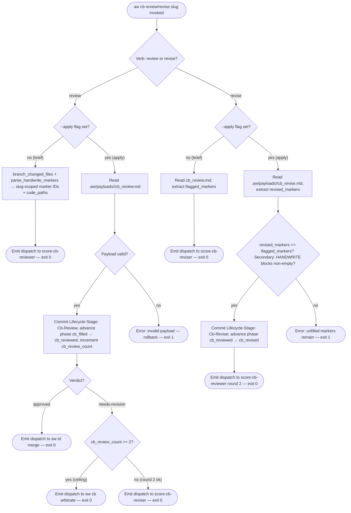

# Score CB Review + Revise — CRRR Parity with TD

Closes the CB CRRR parity gap: adds `aw cb review` and `aw cb revise`
verbs so that HANDWRITE-filled code goes through the same
Create-Review-Revise-Review cycle as TD specs before merge.
Rewires `aw cb fill` end-of-flow from `aw td merge` to
`aw cb review`. Enforces the 2-review ceiling identical to TD CRRR.

## CLI: score-cb-review-revise-crrr
<!-- type: cli lang: yaml -->

```yaml
$schema: "https://json-schema.org/draft/2020-12/schema"
$id: score-cb-review-revise-crrr#cli
title: Score CB Review + Revise — CRRR Parity with TD
description: >
  Extends the `cb` namespace (@spec projects/agentic-workflow/tech-design/surface/specs/aw-cb-fill-crrr.md#cli) with two new
  verbs — `aw cb review` and `aw cb revise` — that close the CB CRRR
  loop by routing HANDWRITE-filled code through the same reviewer/reviser
  cycle used by `aw td review` / `aw td revise` before merge.
  The --non-interactive flag convention follows
  @spec projects/agentic-workflow/tech-design/surface/specs/score-recovery-verbs-non-interactive.md#cli.

commands:
  cb:
    description: >
      Code-artifact verbs. Phase 4 adds `review` and `revise` and rewires
      `fill` end-of-flow to dispatch `aw cb review` instead of `aw td merge`.
    subcommands:
      review:
        description: >
          Brief mode (no --apply): enumerate the slug-introduced HANDWRITE blocks
          via `branch_changed_files` + `parse_handwrite_markers`, read the most
          recent `cb_review.md` verdict if present, compute the current-checkout TD spec
          path, and emit a dispatch envelope to `score-cb-reviewer` with
          `code_paths` (slug-introduced files), `td_spec_path`, and
          `filled_markers` (list of slug-scoped marker IDs filled in this slug).
          Mainthread dispatches `score-cb-reviewer`, waits for it to write
          `.aw/payloads/<slug>/cb_review.md` and call `aw cb review --apply`.

          Apply mode (--apply): read `.aw/payloads/<slug>/cb_review.md`,
          validate the payload (verdict ∈ {approved, needs-revision},
          flagged_markers ⊆ slug-introduced marker IDs), commit
          `Lifecycle-Stage: Cb-Review` with review_count and verdict embedded,
          advance phase `cb_filled → cb_reviewed`, increment `cb_review_count`
          in issue frontmatter.
          On approved → emit dispatch envelope to `aw td merge`.
          On needs-revision (cb_review_count < 2) → emit dispatch to
          `score-cb-reviser`.
          On needs-revision (cb_review_count >= 2) → emit dispatch to
          `aw cb arbitrate` (R12 ceiling).
        args:
          - name: slug
            required: true
            type: string
            description: "Issue slug identifying the active checkout branch."
        flags:
          - name: apply
            type: boolean
            default: false
            description: >
              Apply mode. Reads `.aw/payloads/<slug>/cb_review.md`, runs
              validator, commits Lifecycle-Stage: Cb-Review, advances phase,
              emits next dispatch envelope. Subagent always passes this flag;
              brief mode omits it.
          - name: non-interactive
            type: boolean
            default: false
            description: >
              Suppress all interactive prompts. Required in agent-dispatch and
              CI contexts. Follows @spec projects/agentic-workflow/tech-design/surface/specs/score-recovery-verbs-non-interactive.md#cli.
          - name: json
            type: boolean
            default: false
            description: "Emit envelope as pretty-printed JSON on stdout."
        exit_codes:
          0: >
            Brief mode: dispatch envelope emitted on stdout.
            Apply mode: verdict applied; next-step dispatch envelope emitted.
          1: >
            Apply mode: payload missing or malformed; verdict invalid; flagged
            marker not in slug-introduced set; rollback applied; error envelope.
          2: "Invocation error (slug malformed; --apply without payload present)."

      revise:
        description: >
          Brief mode (no --apply): read the most recent `cb_review.md` payload
          to extract the list of `flagged_markers`, compute the current-checkout TD spec
          path, and emit a dispatch envelope to `score-cb-reviser` with
          `flagged_markers`, `td_spec_path`, and `code_paths`.
          The reviser re-fills only the flagged HANDWRITE blocks via repeated
          `aw cb fill --apply --marker <id>` calls (reuses existing fill
          plumbing), then writes `.aw/payloads/<slug>/cb_revise.md` and
          calls `aw cb revise --apply`.

          Apply mode (--apply, no --marker): check that all flagged markers have
          been re-filled by comparing the marker set in `cb_review.md` against
          the current HANDWRITE block contents in the current checkout. On pass, commit
          `Lifecycle-Stage: Cb-Revise`, advance phase `cb_reviewed → cb_revised`,
          emit a dispatch envelope back to `score-cb-reviewer` for round 2.
          On fail, emit error envelope listing un-re-filled markers.
        args:
          - name: slug
            required: true
            type: string
            description: "Issue slug for the active checkout branch."
        flags:
          - name: apply
            type: boolean
            default: false
            description: >
              Apply mode. Validates that all flagged markers are re-filled,
              commits Lifecycle-Stage: Cb-Revise, advances phase to cb_revised,
              emits round-2 dispatch to score-cb-reviewer.
          - name: non-interactive
            type: boolean
            default: false
            description: >
              Suppress all interactive prompts. Required in agent-dispatch and
              CI contexts.
          - name: json
            type: boolean
            default: false
            description: "Emit envelope as pretty-printed JSON on stdout."
        exit_codes:
          0: >
            Brief mode: dispatch envelope emitted to score-cb-reviser.
            Apply mode: revision validated; Cb-Revise committed; round-2
            dispatch to score-cb-reviewer emitted.
          1: >
            Apply mode: one or more flagged markers not re-filled; rollback;
            error envelope emitted.
          2: "Invocation error (slug malformed; --apply without valid review payload)."

      fill:
        description: >
          Phase 4 adds `--no-review` flag to `aw cb fill`.
          When the final marker is applied and `aw cb check` passes,
          the default end-of-flow dispatches `aw cb review` (R6).
          Pass `--no-review` to bypass the review step and dispatch
          `aw td merge` directly instead (R7, backward compat / fast path).
          All other fill behaviour is unchanged
          (@spec projects/agentic-workflow/tech-design/surface/specs/aw-cb-fill-crrr.md#cli, @spec projects/agentic-workflow/tech-design/surface/specs/score-cb-fill-workflow.md#cli).
        args:
          - name: slug
            required: true
            type: string
            description: "Issue slug identifying the active checkout branch."
        flags:
          - name: no-review
            type: boolean
            default: false
            description: >
              Skip the CB review/revise loop. After the sole-commit gate passes,
              dispatch `aw td merge` directly instead of `aw cb review`.
              Preserves pre-Phase-4 behaviour for backward compatibility (R7).
          - name: apply
            type: boolean
            default: false
            description: "Apply mode — unchanged from Phase 3."
          - name: marker
            type: string
            description: "Marker ID — unchanged from Phase 3."
            required: false
          - name: non-interactive
            type: boolean
            default: false
            description: "Suppress interactive prompts — unchanged from Phase 3."
          - name: json
            type: boolean
            default: false
            description: "Emit JSON envelope — unchanged from Phase 3."
        exit_codes:
          0: "Brief mode: dispatch envelope emitted. Apply mode: marker merged or gate passed."
          1: "Apply mode: gate failed or marker not found; error envelope emitted."
          2: "Invocation error (slug malformed; --apply without --marker; marker ID empty)."

```
## State Machine: cb-review-revise-phase-lifecycle

```mermaid
---
id: cb-review-revise-phase-lifecycle
initial: cb_filled
nodes:
  cb_filled:
    kind: normal
    label: "Quality gate passed; Lifecycle-Stage: Cb-Fill committed"
  cb_review_dispatched:
    kind: normal
    label: "score-cb-reviewer dispatched"
  cb_reviewed:
    kind: normal
    label: "Review verdict applied; Lifecycle-Stage: Cb-Review committed"
  cb_revised:
    kind: normal
    label: "Flagged markers re-filled; Lifecycle-Stage: Cb-Revise committed"
  cb_arbitrated:
    kind: normal
    label: "Escalated to arbitration (cb_review_count >= 2, needs-revision)"
  td_merged:
    kind: terminal
    label: "Merged to main"
edges:
  - from: cb_filled
    to: cb_review_dispatched
    event: "aw cb review <slug> (brief mode emits dispatch to score-cb-reviewer)"
  - from: cb_review_dispatched
    to: cb_reviewed
    event: "score-cb-reviewer writes cb_review.md; calls aw cb review --apply"
  - from: cb_reviewed
    to: td_merged
    event: "aw cb review --apply: verdict approved"
  - from: cb_reviewed
    to: cb_revised
    event: "aw cb review --apply: verdict needs-revision"
    guard: "cb_review_count < 2"
  - from: cb_reviewed
    to: cb_arbitrated
    event: "aw cb review --apply: verdict needs-revision"
    guard: "cb_review_count >= 2"
  - from: cb_revised
    to: cb_review_dispatched
    event: "aw cb revise --apply: dispatch score-cb-reviewer round 2"
  - from: cb_arbitrated
    to: td_merged
    event: "arbitrate: force-merge"
  - from: cb_arbitrated
    to: cb_filled
    event: "arbitrate: send-back (reset markers, re-fill)"
---
stateDiagram-v2
    [*] --> cb_filled
    cb_filled --> cb_review_dispatched : aw cb review slug (brief)
    cb_review_dispatched --> cb_reviewed : score-cb-reviewer applies verdict
    cb_reviewed --> td_merged : verdict approved
    cb_reviewed --> cb_revised : verdict needs-revision [cb_review_count < 2]
    cb_reviewed --> cb_arbitrated : verdict needs-revision [cb_review_count >= 2]
    cb_revised --> cb_review_dispatched : reviser re-fills; reviewer round 2
    cb_arbitrated --> td_merged : force-merge
    cb_arbitrated --> cb_filled : send-back (reset)
    td_merged --> [*]
```

<!-- type: state-machine lang: mermaid -->


## Logic: cb-review-revise-mainthread-loop
<!-- type: logic lang: mermaid -->


## Schema
<!-- type: schema lang: yaml -->

```yaml
"$schema": "https://json-schema.org/draft/2020-12/schema"
$id: score-cb-review-revise-crrr#schema
definitions:
  IssuePhase:
    type: string
    description: >
      Issue phase enum. Phase 4 adds `cb_reviewed` and `cb_revised` between
      `cb_filled` and `td_merged`, closing the CB CRRR loop.
      Extends @spec projects/agentic-workflow/tech-design/surface/specs/aw-cb-fill-crrr.md#schema IssuePhase.
    enum:
      - td_inited
      - td_created
      - td_reviewed
      - td_revised
      - cb_genned
      - td_gen_coded
      - cb_filled
      - cb_reviewed
      - cb_revised
      - td_merged
    x-rust-enum:
      derive: [Debug, Clone, Copy, PartialEq, Eq, Serialize, Deserialize]
      variants:
        - name: TdInited
          rename: "td_inited"
          doc: "Tech-design branch activated."
        - name: TdCreated
          rename: "td_created"
          doc: "Spec authored."
        - name: TdReviewed
          rename: "td_reviewed"
          doc: "Spec reviewed and approved."
        - name: TdRevised
          rename: "td_revised"
          doc: "Flagged sections revised."
        - name: CbGenned
          rename: "cb_genned"
          doc: "Code generated via aw cb gen; HANDWRITE markers present."
        - name: TdGenCoded
          rename: "td_gen_coded"
          doc: "Legacy alias for CbGenned. Reader-only; never written."
        - name: CbFilled
          rename: "cb_filled"
          doc: "All HANDWRITE markers filled and gate passed; Lifecycle-Stage: Cb-Fill committed."
        - name: CbReviewed
          rename: "cb_reviewed"
          doc: "Reviewer verdict applied; Lifecycle-Stage: Cb-Review committed."
        - name: CbRevised
          rename: "cb_revised"
          doc: "Flagged markers re-filled; Lifecycle-Stage: Cb-Revise committed."
        - name: TdMerged
          rename: "td_merged"
          doc: "Spec merged to main."

  LifecycleTrailer:
    type: string
    description: >
      Git commit trailer values for Lifecycle-Stage.
      Phase 4 adds `Cb-Review`, `Cb-Revise`, and `Cb-Arbitrate`.
      Extends @spec projects/agentic-workflow/tech-design/surface/specs/aw-cb-fill-crrr.md#schema LifecycleTrailer.
    enum:
      - TdInit
      - TdCreate
      - TdValidate
      - TdReview
      - TdRevise
      - CbGen
      - TdGenCode
      - TdMerge
      - TdClaim
      - CbClaim
      - CbFill
      - CbReview
      - CbRevise
      - CbArbitrate
    x-rust-enum:
      derive: [Debug, Clone, Copy, PartialEq, Eq, Serialize, Deserialize]
      variants:
        - name: TdInit
          rename: "Td-Init"
          doc: "Worktree initialised."
        - name: TdCreate
          rename: "Td-Create"
          doc: "Spec authored."
        - name: TdValidate
          rename: "Td-Validate"
          doc: "Spec validated."
        - name: TdReview
          rename: "Td-Review"
          doc: "Spec reviewed."
        - name: TdRevise
          rename: "Td-Revise"
          doc: "Spec revised."
        - name: CbGen
          rename: "Cb-Gen"
          doc: "Code generated."
        - name: TdGenCode
          rename: "Td-GenCode"
          doc: "Legacy alias for Cb-Gen. Reader-only."
        - name: TdMerge
          rename: "Td-Merge"
          doc: "Spec merged."
        - name: TdClaim
          rename: "Td-Claim"
          doc: "TD spec adopted from disk; phase bypassed to td_reviewed."
        - name: CbClaim
          rename: "Cb-Claim"
          doc: "Existing code adopted; fillback pipeline."
        - name: CbFill
          rename: "Cb-Fill"
          doc: "All HANDWRITE markers filled; sole-commit gate by aw cb check --slug."
        - name: CbReview
          rename: "Cb-Review"
          doc: "Reviewer verdict applied; written by aw cb review --apply."
        - name: CbRevise
          rename: "Cb-Revise"
          doc: "Flagged markers re-filled; written by aw cb revise --apply."
        - name: CbArbitrate
          rename: "Cb-Arbitrate"
          doc: "Escalated to human arbitration after review_count >= 2 with needs-revision."

  CbReviewPayload:
    type: object
    description: >
      Payload written to `.aw/payloads/<slug>/cb_review.md` by `score-cb-reviewer`.
      Read by `aw cb review --apply` to validate and commit the verdict.
    required: [verdict, flagged_markers]
    properties:
      verdict:
        type: string
        enum: [approved, needs-revision]
        description: "Reviewer verdict. 'approved' routes to aw td merge; 'needs-revision' routes to reviser."
      flagged_markers:
        type: array
        items:
          type: string
          description: "Marker ID (gap= attribute from the HANDWRITE-BEGIN line) that needs re-filling."
        description: >
          List of marker IDs flagged for revision. Must be a subset of the
          slug-introduced marker IDs (from branch_changed_files intersection).
          Empty when verdict is approved.
      review_count:
        type: integer
        minimum: 1
        description: >
          Review round number (1-based). Embedded in the Lifecycle-Stage: Cb-Review
          trailer body for audit. The 2-review ceiling check compares this value
          against cb_review_count in issue frontmatter.

  CbRevisePayload:
    type: object
    description: >
      Payload written to `.aw/payloads/<slug>/cb_revise.md` by `score-cb-reviser`.
      Read by `aw cb revise --apply` to verify all flagged markers were re-filled.
    required: [revised_markers]
    properties:
      revised_markers:
        type: array
        items:
          type: string
          description: "Marker ID that was re-filled in this revision round."
        description: >
          List of marker IDs re-filled by the reviser. Must equal the set of
          flagged_markers from the corresponding cb_review.md payload.

  CbReviewBriefEnvelope:
    type: object
    description: >
      Dispatch envelope emitted by `aw cb review <slug>` (brief mode).
      Addressed to `score-cb-reviewer`.
    required: [action, agent, slug, invoke]
    properties:
      action:
        type: string
        const: "dispatch"
      agent:
        type: string
        const: "score-cb-reviewer"
      slug:
        type: string
        description: "Issue slug."
      invoke:
        type: object
        required: [command, args]
        properties:
          command:
            type: string
            const: "aw cb review"
          args:
            type: object
            required: [slug, td_spec_path, code_paths, filled_markers]
            properties:
              slug:
                type: string
                description: "Issue slug repeated in args for agent convenience."
              td_spec_path:
                type: string
                description: "Worktree-relative path to the approved TD spec file."
              code_paths:
                type: array
                items:
                  type: string
                description: "Slug-introduced source file paths from branch_changed_files."
              filled_markers:
                type: array
                items:
                  type: string
                description: "Ordered list of marker IDs (gap= attributes) filled in this slug."

  CbReviseBriefEnvelope:
    type: object
    description: >
      Dispatch envelope emitted by `aw cb revise <slug>` (brief mode).
      Addressed to `score-cb-reviser`.
    required: [action, agent, slug, invoke]
    properties:
      action:
        type: string
        const: "dispatch"
      agent:
        type: string
        const: "score-cb-reviser"
      slug:
        type: string
        description: "Issue slug."
      invoke:
        type: object
        required: [command, args]
        properties:
          command:
            type: string
            const: "aw cb revise"
          args:
            type: object
            required: [slug, td_spec_path, code_paths, flagged_markers]
            properties:
              slug:
                type: string
                description: "Issue slug repeated in args."
              td_spec_path:
                type: string
                description: "Worktree-relative path to the approved TD spec file."
              code_paths:
                type: array
                items:
                  type: string
                description: "Slug-introduced source file paths."
              flagged_markers:
                type: array
                items:
                  type: string
                description: "Marker IDs flagged in the latest cb_review.md payload."

  CbPhaseRouting:
    type: object
    description: >
      Phase → next-command routing additions for validation/mainthread continuation (R8–R11).
      Each entry maps an issue phase + optional condition to the recommended
      next `aw cb` command to emit in the dispatch envelope.
    properties:
      cb_filled:
        type: object
        description: "Routing for issues at cb_filled phase."
        properties:
          if_review_count_lt_2:
            type: string
            const: "aw cb review"
            description: "Dispatch aw cb review when cb_review_count < 2."
          if_review_count_gte_2_needs_revision:
            type: string
            const: "aw cb arbitrate"
            description: "Dispatch aw cb arbitrate when cb_review_count >= 2 and last verdict was needs-revision (R12)."
      cb_reviewed:
        type: object
        description: "Routing for issues at cb_reviewed phase."
        properties:
          if_verdict_approved:
            type: string
            const: "aw td merge"
            description: "Dispatch aw td merge when last verdict was approved (R9)."
          if_verdict_needs_revision:
            type: string
            const: "aw cb revise"
            description: "Dispatch aw cb revise when last verdict was needs-revision (R10)."
      cb_revised:
        type: object
        description: "Routing for issues at cb_revised phase (R11)."
        properties:
          next:
            type: string
            const: "aw cb review"
            description: "Always dispatch aw cb review (round 2) from cb_revised."
```
## Test Plan

```mermaid
---
id: score-cb-review-revise-crrr-test-plan
requirements:
  r1_cb_review_brief:
    id: R1
    text: "aw cb review <slug> brief mode enumerates slug-introduced markers via branch_changed_files + parse_handwrite_markers and emits dispatch envelope to score-cb-reviewer with code_paths, td_spec_path, filled_markers"
    kind: functional
    risk: high
    verify: test
  r2_cb_review_apply:
    id: R2
    text: "aw cb review <slug> --apply reads cb_review.md, validates payload, commits Lifecycle-Stage: Cb-Review, advances phase cb_filled → cb_reviewed, increments cb_review_count"
    kind: functional
    risk: high
    verify: test
  r3_cb_revise_brief:
    id: R3
    text: "aw cb revise <slug> brief mode reads flagged_markers from cb_review.md and emits dispatch envelope to score-cb-reviser"
    kind: functional
    risk: high
    verify: test
  r4_cb_revise_apply:
    id: R4
    text: "aw cb revise <slug> --apply verifies all flagged markers re-filled, commits Lifecycle-Stage: Cb-Revise, advances phase cb_reviewed → cb_revised, emits round-2 dispatch to score-cb-reviewer"
    kind: functional
    risk: high
    verify: test
  r5_phase_enum_cb_reviewed_revised:
    id: R5
    text: "cb_reviewed and cb_revised phase variants added to IssuePhase enum, serialised correctly, positioned between cb_filled and td_merged"
    kind: functional
    risk: high
    verify: test
  r6_fill_end_dispatches_cb_review:
    id: R6
    text: "aw cb fill end-of-flow (post gate, no --no-review) dispatches aw cb review instead of aw td merge"
    kind: functional
    risk: high
    verify: test
  r7_fill_no_review_flag:
    id: R7
    text: "aw cb fill --no-review dispatches aw td merge directly, bypassing CB review/revise loop"
    kind: functional
    risk: medium
    verify: test
  r8_route_cb_filled:
    id: R8
    text: "cb_filled validation/mainthread continuation dispatches aw cb review when cb_review_count < 2"
    kind: functional
    risk: high
    verify: test
  r9_route_cb_reviewed_approved:
    id: R9
    text: "cb_reviewed + approved validation/mainthread continuation dispatches aw td merge"
    kind: functional
    risk: high
    verify: test
  r10_route_cb_reviewed_needs_revision:
    id: R10
    text: "cb_reviewed + needs-revision validation/mainthread continuation dispatches aw cb revise"
    kind: functional
    risk: high
    verify: test
  r11_route_cb_revised:
    id: R11
    text: "cb_revised validation/mainthread continuation dispatches aw cb review (round 2)"
    kind: functional
    risk: high
    verify: test
  r12_review_ceiling:
    id: R12
    text: "aw cb review --apply emits dispatch to aw cb arbitrate instead of score-cb-reviser when cb_review_count >= 2 and verdict is needs-revision"
    kind: functional
    risk: high
    verify: test
  r13_lifecycle_trailers:
    id: R13
    text: "Cb-Review, Cb-Revise, Cb-Arbitrate added to LifecycleTrailer enum; serialise as their respective dash-cased strings"
    kind: functional
    risk: high
    verify: test
elements:
  test_cb_review_brief_dispatch_envelope:
    kind: test
    type: "rs/#[test]"
  test_cb_review_apply_approved_td_merge:
    kind: test
    type: "rs/#[test]"
  test_cb_review_apply_needs_revision_reviser:
    kind: test
    type: "rs/#[test]"
  test_cb_review_apply_ceiling_arbitrate:
    kind: test
    type: "rs/#[test]"
  test_cb_revise_brief_dispatch_envelope:
    kind: test
    type: "rs/#[test]"
  test_cb_revise_apply_commit_cb_revise:
    kind: test
    type: "rs/#[test]"
  test_cb_revise_apply_unfilled_error:
    kind: test
    type: "rs/#[test]"
  test_phase_enum_cb_reviewed_serde:
    kind: test
    type: "rs/#[test]"
  test_phase_enum_cb_revised_serde:
    kind: test
    type: "rs/#[test]"
  test_lifecycle_trailer_cb_review_serde:
    kind: test
    type: "rs/#[test]"
  test_lifecycle_trailer_cb_revise_serde:
    kind: test
    type: "rs/#[test]"
  test_lifecycle_trailer_cb_arbitrate_serde:
    kind: test
    type: "rs/#[test]"
  test_cb_fill_no_review_dispatches_td_merge:
    kind: test
    type: "rs/#[test]"
  test_cb_fill_default_dispatches_cb_review:
    kind: test
    type: "rs/#[test]"
  test_cb_route_cb_filled_dispatch:
    kind: test
    type: "rs/#[test]"
  test_cb_route_cb_reviewed_approved:
    kind: test
    type: "rs/#[test]"
  test_cb_route_cb_reviewed_needs_revision:
    kind: test
    type: "rs/#[test]"
  test_cb_route_cb_revised_dispatch:
    kind: test
    type: "rs/#[test]"
  test_e2e_crrr_round_trip:
    kind: test
    type: "rs/integration"
relations:
  - from: test_cb_review_brief_dispatch_envelope
    verifies: r1_cb_review_brief
  - from: test_cb_review_apply_approved_td_merge
    verifies: r2_cb_review_apply
  - from: test_cb_review_apply_needs_revision_reviser
    verifies: r2_cb_review_apply
  - from: test_cb_review_apply_ceiling_arbitrate
    verifies: r2_cb_review_apply
  - from: test_cb_revise_brief_dispatch_envelope
    verifies: r3_cb_revise_brief
  - from: test_cb_revise_apply_commit_cb_revise
    verifies: r4_cb_revise_apply
  - from: test_cb_revise_apply_unfilled_error
    verifies: r4_cb_revise_apply
  - from: test_phase_enum_cb_reviewed_serde
    verifies: r5_phase_enum_cb_reviewed_revised
  - from: test_phase_enum_cb_revised_serde
    verifies: r5_phase_enum_cb_reviewed_revised
  - from: test_cb_fill_default_dispatches_cb_review
    verifies: r6_fill_end_dispatches_cb_review
  - from: test_cb_fill_no_review_dispatches_td_merge
    verifies: r7_fill_no_review_flag
  - from: test_cb_route_cb_filled_dispatch
    verifies: r8_route_cb_filled
  - from: test_cb_route_cb_reviewed_approved
    verifies: r9_route_cb_reviewed_approved
  - from: test_cb_route_cb_reviewed_needs_revision
    verifies: r10_route_cb_reviewed_needs_revision
  - from: test_cb_route_cb_revised_dispatch
    verifies: r11_route_cb_revised
  - from: test_cb_review_apply_ceiling_arbitrate
    verifies: r12_review_ceiling
  - from: test_lifecycle_trailer_cb_review_serde
    verifies: r13_lifecycle_trailers
  - from: test_lifecycle_trailer_cb_revise_serde
    verifies: r13_lifecycle_trailers
  - from: test_lifecycle_trailer_cb_arbitrate_serde
    verifies: r13_lifecycle_trailers
  - from: test_e2e_crrr_round_trip
    verifies: r1_cb_review_brief
  - from: test_e2e_crrr_round_trip
    verifies: r2_cb_review_apply
  - from: test_e2e_crrr_round_trip
    verifies: r4_cb_revise_apply
  - from: test_e2e_crrr_round_trip
    verifies: r12_review_ceiling
---
requirementDiagram
    requirement R1 {
      id: R1
      text: "aw cb review brief: dispatch envelope to score-cb-reviewer with code_paths + filled_markers"
      risk: high
      verifymethod: test
    }
    requirement R2 {
      id: R2
      text: "aw cb review --apply: validate payload, commit Cb-Review, advance phase, route verdict"
      risk: high
      verifymethod: test
    }
    requirement R3 {
      id: R3
      text: "aw cb revise brief: dispatch envelope to score-cb-reviser with flagged_markers"
      risk: high
      verifymethod: test
    }
    requirement R4 {
      id: R4
      text: "aw cb revise --apply: verify re-filled markers, commit Cb-Revise, dispatch round-2 reviewer"
      risk: high
      verifymethod: test
    }
    requirement R5 {
      id: R5
      text: "cb_reviewed + cb_revised added to IssuePhase enum; correct serde and position"
      risk: high
      verifymethod: test
    }
    requirement R6 {
      id: R6
      text: "aw cb fill (no --no-review) dispatches aw cb review after gate pass"
      risk: high
      verifymethod: test
    }
    requirement R7 {
      id: R7
      text: "aw cb fill --no-review dispatches aw td merge directly"
      risk: medium
      verifymethod: test
    }
    requirement R8 {
      id: R8
      text: "cb_filled phase → aw cb review dispatch"
      risk: high
      verifymethod: test
    }
    requirement R9 {
      id: R9
      text: "cb_reviewed + approved → aw td merge dispatch"
      risk: high
      verifymethod: test
    }
    requirement R10 {
      id: R10
      text: "cb_reviewed + needs-revision → aw cb revise dispatch"
      risk: high
      verifymethod: test
    }
    requirement R11 {
      id: R11
      text: "cb_revised → aw cb review (round 2) dispatch"
      risk: high
      verifymethod: test
    }
    requirement R12 {
      id: R12
      text: "2-review ceiling: cb_review_count >= 2 and needs-revision → aw cb arbitrate"
      risk: high
      verifymethod: test
    }
    requirement R13 {
      id: R13
      text: "Cb-Review, Cb-Revise, Cb-Arbitrate in LifecycleTrailer; correct serde"
      risk: high
      verifymethod: test
    }
    element test_cb_review_brief_dispatch_envelope {
      type: "rs/#[test]"
    }
    element test_cb_review_apply_approved_td_merge {
      type: "rs/#[test]"
    }
    element test_cb_review_apply_needs_revision_reviser {
      type: "rs/#[test]"
    }
    element test_cb_review_apply_ceiling_arbitrate {
      type: "rs/#[test]"
    }
    element test_cb_revise_brief_dispatch_envelope {
      type: "rs/#[test]"
    }
    element test_cb_revise_apply_commit_cb_revise {
      type: "rs/#[test]"
    }
    element test_cb_revise_apply_unfilled_error {
      type: "rs/#[test]"
    }
    element test_phase_enum_cb_reviewed_serde {
      type: "rs/#[test]"
    }
    element test_phase_enum_cb_revised_serde {
      type: "rs/#[test]"
    }
    element test_lifecycle_trailer_cb_review_serde {
      type: "rs/#[test]"
    }
    element test_lifecycle_trailer_cb_revise_serde {
      type: "rs/#[test]"
    }
    element test_lifecycle_trailer_cb_arbitrate_serde {
      type: "rs/#[test]"
    }
    element test_cb_fill_no_review_dispatches_td_merge {
      type: "rs/#[test]"
    }
    element test_cb_fill_default_dispatches_cb_review {
      type: "rs/#[test]"
    }
    element test_cb_route_cb_filled_dispatch {
      type: "rs/#[test]"
    }
    element test_cb_route_cb_reviewed_approved {
      type: "rs/#[test]"
    }
    element test_cb_route_cb_reviewed_needs_revision {
      type: "rs/#[test]"
    }
    element test_cb_route_cb_revised_dispatch {
      type: "rs/#[test]"
    }
    element test_e2e_crrr_round_trip {
      type: "rs/integration"
    }
    test_cb_review_brief_dispatch_envelope - verifies -> R1
    test_cb_review_apply_approved_td_merge - verifies -> R2
    test_cb_review_apply_needs_revision_reviser - verifies -> R2
    test_cb_review_apply_ceiling_arbitrate - verifies -> R2
    test_cb_revise_brief_dispatch_envelope - verifies -> R3
    test_cb_revise_apply_commit_cb_revise - verifies -> R4
    test_cb_revise_apply_unfilled_error - verifies -> R4
    test_phase_enum_cb_reviewed_serde - verifies -> R5
    test_phase_enum_cb_revised_serde - verifies -> R5
    test_cb_fill_default_dispatches_cb_review - verifies -> R6
    test_cb_fill_no_review_dispatches_td_merge - verifies -> R7
    test_cb_route_cb_filled_dispatch - verifies -> R8
    test_cb_route_cb_reviewed_approved - verifies -> R9
    test_cb_route_cb_reviewed_needs_revision - verifies -> R10
    test_cb_route_cb_revised_dispatch - verifies -> R11
    test_cb_review_apply_ceiling_arbitrate - verifies -> R12
    test_lifecycle_trailer_cb_review_serde - verifies -> R13
    test_lifecycle_trailer_cb_revise_serde - verifies -> R13
    test_lifecycle_trailer_cb_arbitrate_serde - verifies -> R13
    test_e2e_crrr_round_trip - verifies -> R1
    test_e2e_crrr_round_trip - verifies -> R2
    test_e2e_crrr_round_trip - verifies -> R4
    test_e2e_crrr_round_trip - verifies -> R12
```

<!-- type: test-plan lang: mermaid -->


## Changes
<!-- type: changes lang: yaml -->

```yaml
changes:
  # ── Phase enum (projects/agentic-workflow) ─────────────────────────────────────────────
  - path: projects/agentic-workflow/src/issues/phase.rs
    action: modify
    section: logic
    impl_mode: hand-written
    description: >
      Add `CbReviewed` and `CbRevised` variants to `IssuePhase` enum.
      Serialise as "cb_reviewed" and "cb_revised" respectively.
      Position `CbReviewed` after `CbFilled` and `CbRevised` after `CbReviewed`,
      both before `TdMerged`. Update `from_str` / `Display` impls.
      No changes to existing variants.

  # ── Lifecycle trailer registry (projects/agentic-workflow) ─────────────────────────────
  - path: projects/agentic-workflow/src/issues/lifecycle_trailer.rs
    action: modify
    section: state-machine
    impl_mode: hand-written
    description: >
      Add `CbReview`, `CbRevise`, and `CbArbitrate` variants to
      `LifecycleTrailer` enum, serialised as "Cb-Review", "Cb-Revise",
      "Cb-Arbitrate" respectively.
      `CbReview` is written by `aw cb review --apply` on verdict commit.
      `CbRevise` is written by `aw cb revise --apply` on revision commit.
      `CbArbitrate` is written by `aw cb arbitrate` dispatch.
      No changes to existing variants.

  # ── CLI verbs: cb.rs (projects/agentic-workflow) ───────────────────────────────
  - path: projects/agentic-workflow/src/cli/cb.rs
    action: modify
    section: cli
    impl_mode: hand-written
    description: >
      Add `Review(CbReviewArgs)` and `Revise(CbReviseArgs)` variants to
      `CbCommand` enum. Add dispatch arms:
        CbCommand::Review(args) => crate::cb_review::run_review(args).await?
        CbCommand::Revise(args) => crate::cb_revise::run_revise(args).await?
      No changes to existing Gen, Check, Claim, Fill, or Idle variants.

  # ── New module: cb_review.rs ────────────────────────────────────────────
  - path: projects/agentic-workflow/src/cli/cb_review.rs
    action: create
    section: cli
    impl_mode: hand-written
    description: >
      New module implementing `aw cb review` brief and apply modes.

      Brief mode (run_review_brief):
        1. Call branch_changed_files(checkout_root, base_branch) to get slug-introduced files.
        2. Call parse_handwrite_markers(checkout_root) intersected with slug files to get filled_markers.
        3. Resolve td_spec_path from issue frontmatter or the current checkout.
        4. Emit CbReviewBriefEnvelope addressed to score-cb-reviewer.

      Apply mode (run_review_apply):
        1. Read .aw/payloads/<slug>/cb_review.md.
        2. Parse verdict and flagged_markers. Validate:
             - verdict ∈ {approved, needs-revision}
             - flagged_markers ⊆ slug-introduced marker IDs
           On failure: rollback, emit error envelope, exit 1.
        3. Commit Lifecycle-Stage: Cb-Review via commit_lifecycle(slug,
           LifecycleTrailer::CbReview, IssuePhase::CbReviewed).
        4. Read cb_review_count from issue frontmatter; increment.
        5. Write updated cb_review_count + phase: cb_reviewed to frontmatter.
        6. Routing:
             approved → emit dispatch to aw td merge; exit 0.
             needs-revision, cb_review_count < 2 → emit dispatch to
               score-cb-reviser (CbReviseBriefEnvelope); exit 0.
             needs-revision, cb_review_count >= 2 → emit dispatch to
               aw cb arbitrate; exit 0. (R12 ceiling)

  # ── New module: cb_revise.rs ────────────────────────────────────────────
  - path: projects/agentic-workflow/src/cli/cb_revise.rs
    action: create
    section: cli
    impl_mode: hand-written
    description: >
      New module implementing `aw cb revise` brief and apply modes.

      Brief mode (run_revise_brief):
        1. Read .aw/payloads/<slug>/cb_review.md; extract flagged_markers list.
        2. Call branch_changed_files to get code_paths; resolve td_spec_path.
        3. Emit CbReviseBriefEnvelope addressed to score-cb-reviser.

      Apply mode (run_revise_apply):
        1. Read .aw/payloads/<slug>/cb_revise.md; extract revised_markers.
        2. Compare revised_markers to flagged_markers from cb_review.md.
           Verify all flagged markers appear in revised_markers (set equality).
           On failure: emit error envelope listing un-re-filled markers; exit 1.
        3. Verify each revised marker's HANDWRITE block content in the current checkout
           is non-empty (not still a placeholder).
        4. Commit Lifecycle-Stage: Cb-Revise via commit_lifecycle(slug,
           LifecycleTrailer::CbRevise, IssuePhase::CbRevised).
        5. Emit dispatch to score-cb-reviewer for round 2 (CbReviewBriefEnvelope
           with same code_paths + td_spec_path); exit 0.

  # ── Rewire cb_fill.rs end-of-flow ───────────────────────────────────────
  - path: projects/agentic-workflow/src/cli/cb_fill.rs
    action: modify
    section: cli
    impl_mode: hand-written
    description: >
      Rewire `commit_cb_fill_and_dispatch` (post-gate commit logic):
        - Default (no --no-review): after committing Lifecycle-Stage: Cb-Fill,
          emit dispatch envelope to `aw cb review` (CbReviewBriefEnvelope)
          instead of the current `aw td merge` dispatch. (R6)
        - With --no-review: retain existing dispatch to `aw td merge`. (R7)
      Add `no_review: bool` field to `CbFillArgs` struct (clap flag
      `--no-review`, default false). Wire through run_fill() dispatch path.

  # ── Subagent template: score-cb-reviewer.md (verify unchanged) ──────────
  - path: projects/agentic-workflow/templates/mainthread/agents/score-cb-reviewer.md
    action: modify
    section: cli
    impl_mode: hand-written
    description: >
      Verify that the reviewer template's `--apply` invocation matches the new
      CLI surface: `aw cb review --slug <slug> --apply` (not a stale path).
      The existing template already references `aw cb review --slug <slug> --apply`
      (confirmed from review of the current file). No text change required unless
      the brief mode output format (listing code_paths + filled_markers) needs to
      be referenced; update the Turn 1 brief invocation description if so.

  # ── Subagent template: score-cb-reviser.md (verify unchanged) ───────────
  - path: projects/agentic-workflow/templates/mainthread/agents/score-cb-reviser.md
    action: modify
    section: cli
    impl_mode: hand-written
    description: >
      Verify that the reviser template's `--apply` invocation matches the new
      CLI surface: `aw cb revise --slug <slug> --apply` (not a stale path).
      The existing template already references `aw cb revise --slug <slug> --apply`
      (confirmed from review). No text change required unless the brief envelope
      shape (flagged_markers in invoke.args) needs to be reflected in Turn 1;
      update if needed.

  # ── Integration tests ────────────────────────────────────────────────────
  - path: projects/agentic-workflow/tests/cb_review_revise_test.rs
    action: create
    section: test-plan
    impl_mode: hand-written
    description: >
      New integration test file covering the CB review/revise CRRR loop:
        - test_cb_review_brief_dispatch_envelope (R1)
        - test_cb_review_apply_approved_td_merge (R2, R9)
        - test_cb_review_apply_needs_revision_reviser (R2, R3)
        - test_cb_review_apply_ceiling_arbitrate (R2, R12)
        - test_cb_revise_brief_dispatch_envelope (R3)
        - test_cb_revise_apply_commit_cb_revise (R4)
        - test_cb_revise_apply_unfilled_error (R4)
        - test_phase_enum_cb_reviewed_serde (R5)
        - test_phase_enum_cb_revised_serde (R5)
        - test_lifecycle_trailer_cb_review_serde (R13)
        - test_lifecycle_trailer_cb_revise_serde (R13)
        - test_lifecycle_trailer_cb_arbitrate_serde (R13)
        - test_cb_fill_no_review_dispatches_td_merge (R7)
        - test_cb_fill_default_dispatches_cb_review (R6)
        - test_cb_route_cb_filled_dispatch (R8)
        - test_cb_route_cb_reviewed_approved (R9)
        - test_cb_route_cb_reviewed_needs_revision (R10)
        - test_cb_route_cb_revised_dispatch (R11)
        - test_e2e_crrr_round_trip (all R)

  # ── Spec file ─────────────────────────────────────────────────────────────
  - path: projects/agentic-workflow/tech-design/surface/specs/score-cb-review-revise-crrr.md
    action: create
    section: logic
    impl_mode: hand-written
    description: "This spec file."
  - action: annotate
    section: schema
    impl_mode: hand-written
    description: "Traceability metadata edge for the schema section."

```

# Reviews

## Review 1
<!-- type: review lang: markdown -->

**Verdict:** needs-revision

- [logic] (item 4) The `revise_apply_check_refilled` node in `## Logic` describes verification as "compare marker set in cb_review.md vs current HANDWRITE blocks" — i.e., directly inspecting source file contents, with no reference to `cb_revise.md`. But `## Changes` (`cb_revise.rs` apply mode, steps 1–2) describes a two-step approach: first read `.aw/payloads/<slug>/cb_revise.md` and extract `revised_markers`, then cross-check those against `flagged_markers` in `cb_review.md`. These are two distinct verification strategies. The Logic implies `CbRevisePayload` (and the `revised_markers` field) is never read by `--apply`; Changes implies it is the primary source of truth. An implementer reading both sections would produce different behavior depending on which they follow. To resolve: align Logic and Changes to a single strategy. The simpler and more robust approach is the Changes description (read `cb_revise.md` → cross-check set equality against `cb_review.md` flagged_markers → then optionally spot-check HANDWRITE block non-emptiness as a secondary guard). Update the `revise_apply_check_refilled` node label and its incoming process node to reflect the three-step verification sequence shown in Changes.

## Review 2
<!-- type: review lang: markdown -->

**Verdict:** approved

- [logic] (item 3) Round-1 finding resolved. The reviser added `revise_apply_read_revise_payload` as a process node ("Read .aw/payloads/<slug>/cb_revise.md; extract revised_markers list") and wired `revise_check_apply (apply) → revise_apply_read_revise_payload → revise_apply_check_refilled`. The decision node label now reads "revised_markers == flagged_markers (set equality vs cb_review.md)? Secondary: HANDWRITE blocks non-empty?" — matching the three-step sequence specified in `## Changes` (cb_revise.rs apply mode steps 1-3). Logic and Changes are fully aligned; `CbRevisePayload.revised_markers` is now the primary source of truth for revise verification, with the HANDWRITE block spot-check as a secondary guard. All R-ids (R1-R13) are reachable from the entry node. No substantive content gaps remain.
