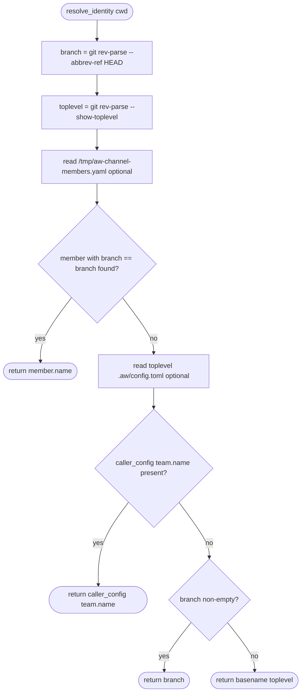

# Score Chat CLI Contract

## Schema: tightened CLI args
<!-- type: schema lang: yaml -->

```yaml
$id: score-chat-cli-contract-schema
description: |
  Tightened argument shapes for aw chat post and listen after G3 fixes.
  Supersedes PostArgs and ListenArgs from score-chat-schema for these verbs.

definitions:
  ListenArgsV3:
    $id: "#/definitions/ListenArgsV3"
    type: object
    description: |
      Args for `aw chat listen` after --once removal.
      --once is removed entirely; the listener is always long-running.
      --all and --mentions remain mutually exclusive (inherited from G2 ListenArgsExt).
    properties:
      interval:
        type: integer
        default: 60
        description: Poll interval in seconds. Default 60.
      mentions:
        type: string
        nullable: true
        description: |
          Override filter identity. @me resolves to caller identity.
          Mutually exclusive with --all.
      all:
        type: boolean
        default: false
        description: |
          Override the 4-rule default filter and emit every message since last_seen.
          Mutually exclusive with --mentions.
      terse:
        type: boolean
        description: Force terse output regardless of TTY.
      human:
        type: boolean
        description: Force human output regardless of TTY.

  PostArgsV3:
    $id: "#/definitions/PostArgsV3"
    type: object
    description: |
      Args for `aw chat post` after --from removal and --to/--all tightening.
      --from is removed entirely; from: is always auto-filled via identity chain.
      --to and --all are mutually exclusive; exactly one must be provided.
    required: [body_file]
    properties:
      to:
        type: array
        items:
          type: string
        description: |
          Addressee team names. Comma-separated on CLI; stored as YAML sequence.
          REQUIRED unless --all is set. Mutually exclusive with --all.
      all:
        type: boolean
        default: false
        description: |
          Broadcast to all teams. Sets stored to: [] in ChannelMessage.
          Mutually exclusive with --to.
      re:
        type: integer
        nullable: true
        description: Anchor msg-id for reply threading. Null on root messages.
      project:
        type: string
        nullable: true
        description: Optional project tag. Written to ChannelMessage.project.
      body_file:
        type: string
        description: Path to body file. Use - for stdin.

  IdentityChain:
    $id: "#/definitions/IdentityChain"
    type: object
    description: |
      Resolution order for the `from:` field on every posted message.
      First match wins. All lookups are rooted at the caller's git toplevel,
      never falling through to a sibling worktree's config.toml.
    required: [steps]
    properties:
      steps:
        type: array
        items:
          type: string
        description: |
          Ordered list of resolution steps (first non-empty result wins).
        example:
          - "members.yaml lookup: find member whose branch matches git rev-parse --abbrev-ref HEAD from CWD"
          - "caller config: read {git_toplevel_from_cwd}/.aw/config.toml [team] name"
          - "git branch name from CWD (git rev-parse --abbrev-ref HEAD)"
          - "git toplevel basename (basename of git rev-parse --show-toplevel from CWD)"
```
## Logic: identity resolution chain
<!-- type: logic lang: mermaid -->


## Changes
<!-- type: changes lang: yaml -->

```yaml
changes:
  - path: projects/agentic-workflow/src/cli/chat.rs
    action: modify
    section: logic
    impl_mode: hand-written
    description: |
      Four contract fixes (~80 LOC change):
      1. Remove `once: bool` field from ListenArgs struct; remove the
         `if args.once { ... return; }` branch in run_listen.
      2. PostArgs: rename to PostArgsV3; make `to: Vec<String>` required at
         clap level when --all not set; add `#[clap(conflicts_with = "all")]`
         to --to and `#[clap(conflicts_with = "to")]` to --all.
      3. Add `all: bool` flag to PostArgs with `#[clap(long)]`.
         When --all is passed, set `to: vec![]` in the stored ChannelMessage.
      4. Remove `from: Option<String>` field from PostArgs entirely;
         remove all `args.from` branches in run_post.
      5. Update existing post and listen tests for new clap behavior.

  - path: projects/agentic-workflow/src/cli/chat_members.rs
    action: modify
    section: logic
    impl_mode: hand-written
    description: |
      Identity chain fix (~40 LOC change):
      Rewrite resolve_identity(cwd: &Path) -> String to:
      1. Call git_toplevel_from_cwd(cwd) -> PathBuf using
         `git -C <cwd> rev-parse --show-toplevel`.
      2. Call git_branch_from_cwd(cwd) -> String using
         `git -C <cwd> rev-parse --abbrev-ref HEAD`.
      3. Read /tmp/aw-channel-members.yaml; if member.branch == branch,
         return member.name.
      4. Read `<toplevel>/.aw/config.toml`; if [team].name present,
         return it. The path is always relative to the caller's git toplevel,
         NOT a hardcoded absolute path or a sibling WT's config.
      5. If branch is non-empty, return branch name.
      6. Fallback: return basename(toplevel).
      Key invariant: step 4 uses toplevel from step 1, which was derived from
      the caller's CWD via `git -C <cwd>`, so it cannot fall through to
      main's config.toml.

  - path: .claude/skills/score-chat-listen/SKILL.md
    action: modify
    section: logic
    impl_mode: hand-written
    description: |
      Remove all references to --once flag. The flag is gone.
      Add note that the listener is always long-running.
      Add note that identity resolves from the caller's WT git toplevel,
      not from main's config.toml.

  - path: projects/agentic-workflow/tech-design/surface/specs/score-chat-cli-contract.md
    action: create
    section: logic
    impl_mode: hand-written
    description: This spec file documenting the G3 tightened CLI contract and identity chain fix.
  - action: annotate
    section: schema
    impl_mode: hand-written
    description: "Traceability metadata edge for the schema section."

  - action: annotate
    section: unit-test
    impl_mode: hand-written
    description: "Traceability metadata edge for the unit-test section."

```
## Tests
<!-- type: tests lang: yaml -->

```yaml
tests:
  - id: T1
    name: post_without_to_or_all_fails_clap
    kind: unit
    description: |
      aw chat post invoked without --to and without --all is rejected at
      parse time by clap with a non-zero exit code.
    setup:
      - no channel file required
    assertions:
      - parse PostArgsV3 with no --to and no --all; expect clap error (required argument missing)
      - exit code is non-zero

  - id: T2
    name: post_all_writes_empty_to
    kind: unit
    description: |
      aw chat post --all --body-file - writes a ChannelMessage with to: []
      in the stored block.
    setup:
      - remove /tmp/aw-channel.md if present
    assertions:
      - post with --all and body=broadcast_body; parse channel; msgs[0].to == []
      - msgs[0].from is non-empty (identity resolved from CWD)

  - id: T3
    name: post_to_multi_writes_addressees
    kind: unit
    description: |
      aw chat post --to a,b --body-file - writes a ChannelMessage with
      to: [a, b] in the stored block.
    setup:
      - remove /tmp/aw-channel.md if present
    assertions:
      - post with --to a,b and body=targeted_body; parse channel; msgs[0].to == ["a", "b"]

  - id: T4
    name: post_from_flag_rejected_by_clap
    kind: unit
    description: |
      aw chat post --from anything is rejected by clap because --from
      does not exist in PostArgsV3.
    setup:
      - no channel file required
    assertions:
      - attempt to parse PostArgsV3 with --from score; expect clap error (unrecognized argument)
      - exit code is non-zero

  - id: T5
    name: listen_once_flag_rejected_by_clap
    kind: unit
    description: |
      aw chat listen --once is rejected by clap because --once does not
      exist in ListenArgsV3.
    setup:
      - no state file required
    assertions:
      - attempt to parse ListenArgsV3 with --once; expect clap error (unrecognized argument)
      - exit code is non-zero

  - id: T6
    name: identity_from_caller_wt_config_not_main
    kind: unit
    description: |
      resolve_identity called from a fake WT at /tmp/fake-wt/ that has its own
      .aw/config.toml with [team] name = "fake" returns "fake", NOT the name
      from main's config.toml. Verifies that the identity chain reads from
      {caller_git_toplevel}/.aw/config.toml, not a hardcoded path.
    setup:
      - create temp dir /tmp/fake-wt/; run git init; create .aw/config.toml with [team] name = "fake"
      - ensure /tmp/aw-channel-members.yaml is absent or does not contain the fake branch
    assertions:
      - resolve_identity(cwd=/tmp/fake-wt/) returns "fake"
      - result does NOT equal the main WT's [team] name (score)
```

# Reviews

## Review 1
<!-- type: review lang: markdown -->

**Verdict:** approved

- [overview] Clear rationale for all four changes; forward-only migration policy stated explicitly.
- [schema] PostArgsV3 and ListenArgsV3 are precise; IdentityChain steps match the logic flowchart exactly.
- [logic] Mermaid flowchart is complete and consistent with the schema and changes section; all four fallback steps are represented.
- [changes] All four files (`chat.rs`, `chat_members.rs`, `SKILL.md`, this spec) are listed with concrete LOC estimates and step-by-step implementation notes; key identity invariant explicitly called out.
- [tests] T1–T6 cover every requirement (R2, R3, R4, R5, R7); T6 setup correctly initialises a fresh git repo so `git -C` resolves to the fake toplevel, not main.
