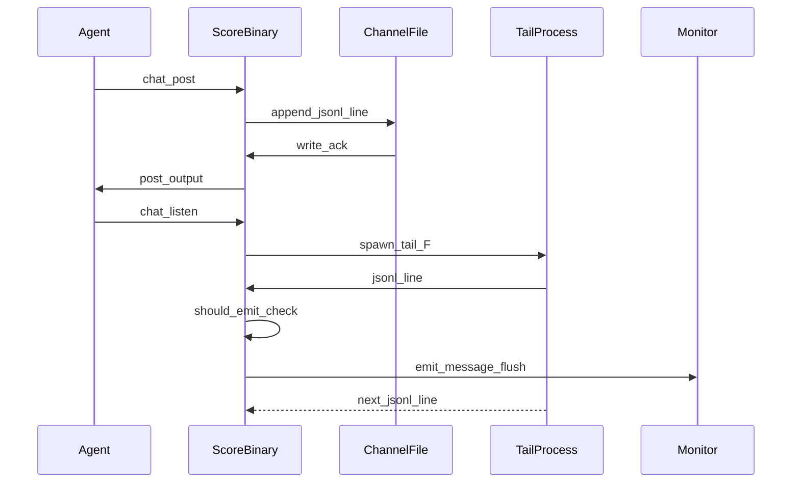

# Score Chat JSONL Migration

## Schema: channel message and listen args
<!-- type: schema lang: yaml -->

```yaml
$id: score-chat-jsonl-migration-schema
description: |
  Updated data shapes for aw chat after JSONL migration.
  ChannelMessage now round-trips cleanly via serde (body is a normal field).
  ListenArgsV4 supersedes ListenArgs from score-chat-schema: drops --once and
  --interval; adds --all (mutually exclusive with --mentions).
  FilterDecision and FilterCategory are imported from score-chat-listen-filter-schema.

definitions:
  ChannelMessage:
    $id: "#/definitions/ChannelMessage"
    type: object
    description: |
      One JSONL line in /tmp/aw-channel.jsonl.
      Serialised as a single serde_json-encoded JSON object followed by a newline.
      The body field is a normal serde field (no skip); the struct round-trips
      cleanly through serde_json::to_string / serde_json::from_str.
      Supersedes the markdown-block framing defined in score-chat-schema.
    required: [id, from, timestamp, body]
    properties:
      id:
        type: integer
        description: Auto-incremented message number (1-based).
      from:
        type: string
        description: Sending team name. Auto-filled via identity resolution chain.
      to:
        type: array
        items:
          type: string
        description: |
          Addressee team names. Empty array means broadcast (@all).
          @me resolves to caller team at post time.
      re:
        type: integer
        nullable: true
        description: Anchor msg-id for reply threading. Null on root messages.
      timestamp:
        type: string
        format: date-time
        description: ISO-8601 UTC timestamp written at post time.
      body:
        type: string
        description: |
          Free-form message body. Read from --body-file or stdin.
          Stored as a normal serde field — no #[serde(skip)].
      project:
        type: string
        nullable: true
        description: Optional project tag. Written from --project flag in PostArgs.

  ListenArgsV4:
    $id: "#/definitions/ListenArgsV4"
    type: object
    description: |
      Args for `aw chat listen` after JSONL migration.
      Supersedes ListenArgs (score-chat-schema) and ListenArgsV3 (score-chat-cli-contract-schema).
      --once is removed; the listener is always long-running (tail -F driven).
      --interval is removed; polling is replaced by tail -F streaming.
      --all overrides the 4-rule default filter and emits every message.
      --all and --mentions are mutually exclusive (clap conflicts_with).
    properties:
      all:
        type: boolean
        default: false
        description: |
          Bypass should_emit and emit every message read from the tail -F stream.
          Intended for debugging. Mutually exclusive with --mentions.
      mentions:
        type: string
        nullable: true
        description: |
          Override the identity used for filtering (default: detected self from
          [team] name in .aw/config.toml). @me resolves to caller team.
          Mutually exclusive with --all.
      terse:
        type: boolean
        description: Force terse output regardless of TTY.
      human:
        type: boolean
        description: Force human output regardless of TTY.

  ParseChannelResult:
    $id: "#/definitions/ParseChannelResult"
    type: object
    description: |
      Intermediate result of parse_channel: a vector of ChannelMessage values
      parsed from the JSONL channel file. Lines that fail serde_json::from_str
      are skipped with a warning; the parse never fails wholesale.
    required: [messages, skipped_lines]
    properties:
      messages:
        type: array
        items:
          $ref: "#/definitions/ChannelMessage"
        description: Successfully parsed messages in file order.
      skipped_lines:
        type: integer
        description: Count of lines skipped due to parse errors (for diagnostics).
```
## Logic: chat dispatch after JSONL migration
<!-- type: logic lang: mermaid -->

```mermaid
---
id: chat-dispatch-jsonl
entry: start
refs:
  - $ref: "score-chat-jsonl-migration#/definitions/ChannelMessage"
  - $ref: "score-chat-jsonl-migration#/definitions/ListenArgsV4"
  - $ref: "score-chat-listen-filter#should_emit"
nodes:
  start: { kind: start, label: "aw chat <cmd>" }
  detect_identity: { kind: process, label: "resolve_identity(cwd) via identity chain" }
  detect_format: { kind: process, label: "Detect output format: tty=human, pipe=terse; --terse/--human overrides" }
  branch_cmd: { kind: decision, label: "subcommand?" }
  run_post: { kind: process, label: "post: read body-file/stdin, auto-increment msg-id, serialize to JSON + newline, O_APPEND to /tmp/aw-channel.jsonl" }
  run_list: { kind: process, label: "list: parse_channel /tmp/aw-channel.jsonl (BufRead::lines + serde_json::from_str), apply --mentions/--last/--status filters, render" }
  run_read: { kind: process, label: "read: parse_channel, find anchor msg-id, collect thread replies in order, render" }
  run_agents: { kind: process, label: "agents: register or list via /tmp/aw-channel-agents.md" }
  tail_spawn: { kind: process, label: "Spawn tail -F -n +1 /tmp/aw-channel.jsonl via Command::new wrapped in TailGuard (Drop calls child.kill().ok() + child.wait().ok())" }
  listen_read_line: { kind: process, label: "BufReader::lines() next line from tail -F stdout" }
  parse_line: { kind: decision, label: "serde_json::from_str succeeds?" }
  skip_line: { kind: process, label: "Skip malformed line (warn)" }
  check_emit: { kind: decision, label: "should_emit(msg, self_name, history, args)?" }
  emit_msg: { kind: process, label: "Print message; flush stdout" }
  update_history: { kind: process, label: "Append msg to in-memory history" }
  next_line: { kind: process, label: "Continue streaming" }
  cleanup_child: { kind: process, label: "TailGuard::drop — child.kill().ok(); child.wait().ok()" }
  listen_exit: { kind: terminal, label: "Process exits; no zombie (parent death reaps tail child via Drop)" }
  output: { kind: terminal, label: "Write stdout; exit 0" }
edges:
  - { from: start, to: detect_identity }
  - { from: detect_identity, to: detect_format }
  - { from: detect_format, to: branch_cmd }
  - { from: branch_cmd, to: run_post, label: "post" }
  - { from: branch_cmd, to: run_list, label: "list" }
  - { from: branch_cmd, to: run_read, label: "read" }
  - { from: branch_cmd, to: run_agents, label: "agents" }
  - { from: branch_cmd, to: tail_spawn, label: "listen" }
  - { from: run_post, to: output }
  - { from: run_list, to: output }
  - { from: run_read, to: output }
  - { from: run_agents, to: output }
  - { from: tail_spawn, to: listen_read_line }
  - { from: listen_read_line, to: parse_line }
  - { from: parse_line, to: skip_line, label: "no" }
  - { from: parse_line, to: check_emit, label: "yes" }
  - { from: skip_line, to: next_line }
  - { from: check_emit, to: emit_msg, label: "yes" }
  - { from: check_emit, to: update_history, label: "no" }
  - { from: emit_msg, to: update_history }
  - { from: update_history, to: next_line }
  - { from: next_line, to: listen_read_line }
  - { from: listen_read_line, to: cleanup_child, label: "signal received / EOF / parent exit" }
  - { from: cleanup_child, to: listen_exit }
---
flowchart TD
    start([aw chat cmd]) --> detect_identity[resolve_identity cwd via identity chain]
    detect_identity --> detect_format[Detect format: tty=human pipe=terse\n--terse/--human overrides]
    detect_format --> branch_cmd{subcommand?}
    branch_cmd -->|post| run_post[Read body-file/stdin\nAuto-increment msg-id\nserialize JSON + newline\nO_APPEND to /tmp/aw-channel.jsonl]
    branch_cmd -->|list| run_list[parse_channel jsonl\nApply filters\nRender]
    branch_cmd -->|read| run_read[parse_channel jsonl\nFind anchor msg-id\nCollect thread\nRender]
    branch_cmd -->|agents| run_agents[Register or list\n/tmp/aw-channel-agents.md]
    branch_cmd -->|listen| tail_spawn[Spawn tail -F -n +1 /tmp/aw-channel.jsonl\nvia Command::new wrapped in TailGuard\nDrop impl calls child.kill().ok() + child.wait().ok()]
    run_post --> output([Write stdout; exit 0])
    run_list --> output
    run_read --> output
    run_agents --> output
    tail_spawn --> listen_read_line[BufReader::lines next line from tail stdout]
    listen_read_line --> parse_line{serde_json::from_str succeeds?}
    parse_line -->|no| skip_line[Skip malformed line warn]
    parse_line -->|yes| check_emit{should_emit msg self_name history args?}
    skip_line --> next_line[Continue streaming]
    check_emit -->|yes| emit_msg[Print message\nFlush stdout]
    check_emit -->|no| update_history[Append msg to history]
    emit_msg --> update_history
    update_history --> next_line
    next_line --> listen_read_line
    listen_read_line -.->|signal received / EOF / parent exit| cleanup_child[TailGuard::drop\nchild.kill().ok()\nchild.wait().ok()]
    cleanup_child --> listen_exit([Process exits; no zombie])
```
## Interaction: post and listen flow
<!-- type: interaction lang: mermaid -->


## CLI: chat listen updated contract
<!-- type: cli lang: yaml -->

```yaml
$id: score-chat-jsonl-cli
description: |
  Updated CLI contract for aw chat after JSONL migration.
  listen subcommand: --once and --interval removed; --all added.
  post subcommand: channel path updated to /tmp/aw-channel.jsonl.

commands:
  chat:
    description: Cross-worktree messaging channel for agents.
    subcommands:
      post:
        description: Post a new message to the shared channel.
        args:
          - name: to
            long: to
            type: array
            items:
              type: string
            description: Addressee team names. Mutually exclusive with --all.
            conflicts_with: [all]
          - name: all
            long: all
            type: boolean
            default: false
            description: Broadcast to all teams. Sets to=[] in stored message.
            conflicts_with: [to]
          - name: re
            long: re
            type: integer
            nullable: true
            description: Anchor msg-id for reply threading.
          - name: project
            long: project
            type: string
            nullable: true
            description: Optional project tag.
          - name: body_file
            long: body-file
            type: string
            description: Path to body file. Use - for stdin.
          - name: terse
            long: terse
            type: boolean
            description: Force terse output.
          - name: human
            long: human
            type: boolean
            description: Force human output.
      listen:
        description: Stream new messages addressed to the caller via tail -F.
        args:
          - name: all
            long: all
            type: boolean
            default: false
            description: Bypass 4-rule filter and emit every message.
            conflicts_with: [mentions]
          - name: mentions
            long: mentions
            type: string
            nullable: true
            description: Override filter identity. @me resolves to caller team.
            conflicts_with: [all]
          - name: terse
            long: terse
            type: boolean
            description: Force terse output.
          - name: human
            long: human
            type: boolean
            description: Force human output.
        removed_flags:
          - name: once
            reason: Removed in JSONL migration; listener is always long-running (tail -F).
          - name: interval
            reason: Removed in JSONL migration; polling replaced by tail -F streaming.
```
## Tests: JSONL migration and filter
<!-- type: tests lang: yaml -->

```yaml
# Canonical test numbering for this spec:
# T1-T6: filter-rule unit tests (inherited from projects/agentic-workflow/tech-design/surface/specs/score-chat-listen-filter.md)
# T7: post_writes_jsonl_line
# T8: concurrent_post_atomic
# T9: listen_rejects_once_flag
# T10: listen_rejects_interval_flag
# T11: flush_smoke (manual)
# NOTE: The issue's R10 originally labeled the flush smoke test "T7". That label
# is superseded by this spec's canonical numbering. T11 is the authoritative ID.

tests:
  - id: T1
    name: test_filter_direct_cue
    kind: unit
    description: |
      A message where msg.to contains self_name is emitted with category direct_cue.
    setup:
      msgs: []
      self_name: "score"
      args: { all: false, mentions: null }
    assertions:
      - input: { id: 1, from: "mamba", to: ["score"], re: null, body: "hello" }
        expect: { emitted: true, category: "direct_cue" }

  - id: T2
    name: test_filter_broadcast
    kind: unit
    description: |
      A message where msg.to is empty (broadcast) is emitted with category broadcast.
    setup:
      msgs: []
      self_name: "score"
      args: { all: false, mentions: null }
    assertions:
      - input: { id: 2, from: "mamba", to: [], re: null, body: "broadcast msg" }
        expect: { emitted: true, category: "broadcast" }

  - id: T3
    name: test_filter_echo
    kind: unit
    description: |
      A message sent by self (msg.from == self_name) is emitted with category echo,
      even if to: does not include self_name.
    setup:
      msgs: []
      self_name: "score"
      args: { all: false, mentions: null }
    assertions:
      - input: { id: 3, from: "score", to: ["mamba"], re: null, body: "my post" }
        expect: { emitted: true, category: "echo" }

  - id: T4
    name: test_filter_dynamic_thread_membership_pulled_in
    kind: unit
    description: |
      Self is not in msg-3.to, but self was cued in msg-2 which is in the same thread.
      Dynamic membership pulls msg-3 in as thread_member.
    setup:
      msgs:
        - { id: 1, from: "A", to: ["B"], re: null, body: "root" }
        - { id: 2, from: "A", to: ["B", "score"], re: 1, body: "cue self" }
      self_name: "score"
      args: { all: false, mentions: null }
    assertions:
      - input: { id: 3, from: "B", to: ["A"], re: 1, body: "reply without self" }
        expect: { emitted: true, category: "thread_member" }

  - id: T5
    name: test_filter_unrelated_thread
    kind: unit
    description: |
      A message in a thread that has no involvement from self is not emitted.
    setup:
      msgs:
        - { id: 10, from: "A", to: ["B"], re: null, body: "unrelated root" }
      self_name: "score"
      args: { all: false, mentions: null }
    assertions:
      - input: { id: 11, from: "B", to: ["A"], re: 10, body: "unrelated reply" }
        expect: { emitted: false, category: null }

  - id: T6
    name: test_filter_all_flag_overrides
    kind: unit
    description: |
      When args.all=true, every message is emitted with category all regardless of rules.
    setup:
      msgs: []
      self_name: "score"
      args: { all: true, mentions: null }
    assertions:
      - input: { id: 20, from: "A", to: ["B"], re: null, body: "unrelated msg" }
        expect: { emitted: true, category: "all" }

  - id: T7
    name: test_post_writes_jsonl_line
    kind: unit
    description: |
      aw chat post writes exactly one JSONL line per message. The line is valid
      JSON that deserialises back to a ChannelMessage with all fields intact including body.
    setup:
      - remove /tmp/aw-channel.jsonl if present
    assertions:
      - post with --to mamba --body-file - body="hello jsonl"; wc -l /tmp/aw-channel.jsonl == 1
      - line is valid JSON; parsed ChannelMessage.body == "hello jsonl"
      - parsed ChannelMessage.to == ["mamba"]

  - id: T8
    name: test_concurrent_post_atomic
    kind: unit
    description: |
      Ten concurrent aw chat post calls from different worktrees result in
      exactly 10 well-formed JSON lines with no interleaving. Uses O_APPEND
      semantics for POSIX atomic writes.
    setup:
      - remove /tmp/aw-channel.jsonl if present
    assertions:
      - spawn 10 concurrent post processes; wait all; wc -l /tmp/aw-channel.jsonl == 10
      - every line parses to a valid ChannelMessage (no partial/corrupted JSON)

  - id: T9
    name: test_listen_rejects_once_flag
    kind: unit
    description: |
      aw chat listen --once is rejected by clap because --once does not exist
      in ListenArgsV4 after JSONL migration.
    setup:
      - no channel file required
    assertions:
      - attempt parse ListenArgsV4 with --once; expect clap error (unrecognized argument)
      - exit code is non-zero

  - id: T10
    name: test_listen_rejects_interval_flag
    kind: unit
    description: |
      aw chat listen --interval 30 is rejected by clap because --interval
      does not exist in ListenArgsV4 after JSONL migration.
    setup:
      - no channel file required
    assertions:
      - attempt parse ListenArgsV4 with --interval 30; expect clap error (unrecognized argument)
      - exit code is non-zero

  - id: T11
    name: test_flush_smoke
    kind: manual
    description: |
      Verify that a message posted to the channel is received by a tail -F listener
      within 1 second. Start aw chat listen in a background shell (Monitor context,
      non-tty pipe). Post a message. Confirm listener prints the message within 1000ms.
      NOTE: The issue's R10 originally labeled this test "T7"; that label is superseded
      by the canonical numbering in this spec (T11).
    steps:
      - run: "aw chat listen > /tmp/listen-out.txt &"
      - run: "sleep 0.1 && echo 'flush test' | aw chat post --to score --body-file -"
      - run: "sleep 0.5 && grep 'flush test' /tmp/listen-out.txt"
    expected: |
      /tmp/listen-out.txt contains the message body within 500ms of the post completing.
      Confirms stdout flushing works in pipe mode and tail -F delivers without polling delay.
```
## Changes
<!-- type: changes lang: yaml -->

```yaml
changes:
  - path: projects/agentic-workflow/src/cli/chat/mod.rs
    action: modify
    section: cli
    impl_mode: hand-written
    description: |
      Remove #[serde(skip)] from ChannelMessage.body field (line ~182) so the
      struct round-trips cleanly through serde_json::to_string / serde_json::from_str.
      Update ListenArgs: drop once: bool field; drop interval: u64 field; add all: bool
      with #[clap(long, conflicts_with = "mentions")]. Update CHANNEL_PATH constant
      from /tmp/aw-channel.md to /tmp/aw-channel.jsonl.

  - path: projects/agentic-workflow/src/cli/chat/helpers.rs
    action: modify
    section: cli
    impl_mode: hand-written
    description: |
      DELETE parse_channel_markdown and parse_message_section (~80 LOC, lines 110-205).
      REWRITE parse_channel body: open file with BufReader, iterate lines(),
      call serde_json::from_str per line, collect successes, skip+warn failures.
      REWRITE run_post: replace multi-line markdown block assembly with
      serde_json::to_string(&msg)? + "\n" written via O_APPEND file open.
      DELETE run_listen_once, run_listen_loop; REWRITE run_listen as a single fn:
      spawn "tail -F -n +1 <CHANNEL_PATH>" via std::process::Command wrapped in TailGuard
      (struct holding Child; Drop impl calls child.kill().ok() + child.wait().ok() to
      prevent zombie processes on SIGINT / parent exit),
      read child stdout with BufReader::lines(), parse each line as ChannelMessage,
      call should_emit(msg, self_name, history, args), print + flush if emitted,
      append to in-memory history vec.
      ADD should_emit(msg: &ChannelMessage, self_name: &str, history: &[ChannelMessage],
      args: &ListenArgs) -> FilterDecision implementing the 4-rule flowchart from
      score-chat-listen-filter spec (direct_cue, broadcast, echo, thread_member).
      ADD thread_root_of(msg: &ChannelMessage, history: &[ChannelMessage]) -> u64:
      walk re: chain to root, cap iterations at history.len() to handle circular chains.
      ADD explicit stdout flush: io::stdout().flush().ok() after each emitted message.

      Each new or rewritten function must be wrapped with HANDWRITE-BEGIN/END markers per
      CLAUDE.md hand-written exception protocol:

      hand_written_blocks:
        - functions: [parse_channel]
          handwrite_marker: |
            // HANDWRITE-BEGIN reason: codegen lacks JSONL-stream parser primitive (#parse-jsonl-stream).
            // Once primitive exists, this function regenerates from schema cardinality.
            // HANDWRITE-END
          spec_anchors: ["@spec projects/agentic-workflow/tech-design/surface/specs/score-chat-jsonl-migration.md#schema (ChannelMessage)"]

        - functions: [run_post]
          handwrite_marker: |
            // HANDWRITE-BEGIN reason: codegen lacks O_APPEND atomic-line-write primitive (#append-line-atomic).
            // HANDWRITE-END
          spec_anchors: ["@spec projects/agentic-workflow/tech-design/surface/specs/score-chat-jsonl-migration.md#interaction (post sequence)"]

        - functions: [run_listen, TailGuard]
          handwrite_marker: |
            // HANDWRITE-BEGIN reason: codegen lacks tail-F streaming + child-process-guard primitive (#tail-f-stream).
            // HANDWRITE-END
          spec_anchors: ["@spec projects/agentic-workflow/tech-design/surface/specs/score-chat-jsonl-migration.md#logic (listen branch / tail_spawn node)"]

        - functions: [should_emit, thread_root_of]
          handwrite_marker: |
            // HANDWRITE-BEGIN reason: codegen lacks decision-flowchart-to-fn translator (#flowchart-to-fn).
            // HANDWRITE-END
          spec_anchors: ["@spec projects/agentic-workflow/tech-design/surface/specs/score-chat-listen-filter.md#logic (should_emit flowchart)"]

  - path: projects/agentic-workflow/src/cli/chat/helpers.rs
    action: modify
    impl_mode: hand-written
    section: tests
    description: |
      Update existing unit tests to use JSONL fixtures instead of markdown fixtures.
      Add should_emit unit tests T1-T6 (direct_cue, broadcast, echo, thread_member,
      unrelated_thread, all_flag). Add JSONL-specific tests T7 (post_writes_jsonl_line),
      T8 (concurrent_post_atomic), T9 (listen_rejects_once_flag), T10 (listen_rejects_interval_flag).
      Add T11 (flush_smoke, manual) when adding helper for the TailGuard / stdout-flush path.
      NOTE: The issue's R10 originally labeled the flush smoke test "T7"; the canonical ID
      in this spec is T11. Use T11 in all test attributes and comments.

  - path: projects/agentic-workflow/tech-design/surface/specs/score-chat.md
    action: modify
    section: logic
    impl_mode: hand-written
    description: |
      Schema section: update ChannelMessage description to JSONL framing
      (remove reference to ## msg-NNN markdown headings; state body is a normal serde field).
      Update ListenArgs: remove once and interval properties; add all property.
      Logic section: update run_post node description (JSON + newline via O_APPEND, not markdown block).
      Remove run_listen_once and run_listen_loop nodes; replace branch_listen decision with
      single run_listen node (tail -F streaming with should_emit filter).
      Update overview channel path reference from /tmp/aw-channel.md to /tmp/aw-channel.jsonl.

  - path: projects/agentic-workflow/tech-design/surface/specs/score-chat-msg-members-schema.md
    action: modify
    section: schema
    impl_mode: hand-written
    description: |
      Add status: archived to frontmatter. Add deprecation notice in overview section:
      this spec defined markdown-block framing conventions for multi-line channel messages
      that are obsoleted by the JSONL migration in projects/agentic-workflow/tech-design/surface/specs/score-chat-jsonl-migration.md.
      Move file to .aw/tech-design/_archive/ after updating.
  - action: annotate
    section: interaction
    impl_mode: hand-written
    description: "Traceability metadata edge for the interaction section."

```

# Reviews

## Review 2
<!-- type: review lang: markdown -->

**Verdict:** approved

- [tests] T1–T11 canonical header in `tests` section and all cross-references in `changes` are now consistent; the R10 "T7" supersession note appears in both sections. Finding closed.
- [logic] `tail_spawn`, `cleanup_child`, and `listen_exit` terminal nodes are present in both the YAML frontmatter and the Mermaid flowchart; the dashed signal-received edge correctly routes to cleanup. Finding closed.
- [changes] `hand_written_blocks` sub-section added with four entries each naming a concrete gap-blocker issue handle (`#parse-jsonl-stream`, `#append-line-atomic`, `#tail-f-stream`, `#flowchart-to-fn`). Finding closed.

## Review 1
<!-- type: review lang: markdown -->

**Verdict:** needs-revision

- [tests] Test numbering is inconsistent between sections. The `changes` entry for `helpers.rs` tests lists "T7 (post_writes_jsonl_line), T8 (concurrent_post_atomic), T9 (listen_once_rejected), T10 (listen_interval_rejected)" and stops there — but the `tests` section defines T11 (test_flush_smoke) which goes unmentioned in `changes`. Additionally, the issue's R10 calls the flush smoke test "T7", while this spec renumbers it "T11". An implementer cross-referencing the issue and spec will see contradictory IDs. Fix: either renumber the flush smoke test to T7 in the tests section (matching the issue's R10) and remove T8–T11 re-numbering, or keep T11 and add an explicit note in the `changes` description that T11 (flush smoke) must also be added and that the issue's "T7" label was superseded by this spec.
- [logic] The listen loop has no termination or cleanup path. The flowchart loops `update_history → next_line → listen_read_line` indefinitely with no node for SIGINT / parent-exit / tail-F EOF. The `tail -F` child process lifetime is unspecified — no mention of a `Drop` impl, `child.kill()` on exit, or signal handling. Add a terminal node for "listen exit (SIGINT / parent drop)" and specify that the child `tail -F` process is killed (e.g., via `child.kill().ok()` on `Drop`) to prevent zombie processes.
- [changes] The `helpers.rs` changes entry omits `HANDWRITE-BEGIN / HANDWRITE-END` markers. Per project convention (CLAUDE.md), all hand-written code regions must be wrapped in these markers with a named gap-blocker. Add an instruction that each new function (`should_emit`, `thread_root_of`, `run_listen` rewrite, `parse_channel` rewrite) must be wrapped with `// HANDWRITE-BEGIN reason: <gap description>` / `// HANDWRITE-END`.
