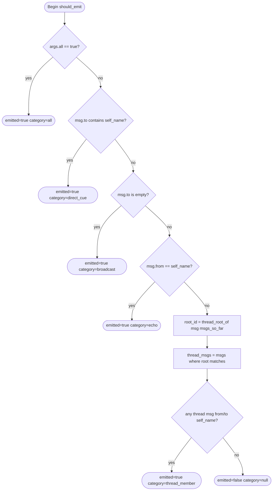

# Score Chat Listen Filter

## Schema
<!-- type: schema lang: yaml -->

```yaml
$id: score-chat-listen-filter-schema
description: |
  Data shapes for the 4-rule default filter in `aw chat listen`.
  FilterCategory identifies which rule caused emission.
  FilterDecision is the per-message decision returned by should_emit.
  ListenArgsExt extends ListenArgs (from score-chat-schema) with the --all flag.

definitions:
  FilterCategory:
    $id: "#/definitions/FilterCategory"
    type: string
    description: Which filter rule caused a message to be emitted.
    enum: [direct_cue, broadcast, echo, thread_member, all]

  FilterDecision:
    $id: "#/definitions/FilterDecision"
    type: object
    description: |
      Result of should_emit(msg, self_name, msgs_so_far, args).
      emitted=true means the message should be printed; category names the rule.
    required: [emitted]
    properties:
      emitted:
        type: boolean
        description: True if the message passes the active filter.
      category:
        $ref: "#/definitions/FilterCategory"
        nullable: true
        description: The rule that emitted the message. Null when emitted=false.

  ListenArgsExt:
    $id: "#/definitions/ListenArgsExt"
    type: object
    description: |
      Extension of ListenArgs (score-chat#/definitions/ListenArgs) adding the
      --all flag. --all and --mentions are mutually exclusive (parse-time error).
    properties:
      all:
        type: boolean
        default: false
        description: |
          Override the default 4-rule filter and emit every message since
          last_seen. Intended for debugging. Mutually exclusive with --mentions.
      mentions:
        type: string
        nullable: true
        description: |
          Override the identity used for filtering (default: detected self from
          [team] name in .aw/config.toml). @me resolves to caller team.
          Kept for back-compatibility. Mutually exclusive with --all.
```
## Logic: should_emit
<!-- type: logic lang: mermaid -->


## Changes
<!-- type: changes lang: yaml -->

```yaml
changes:
  - path: projects/agentic-workflow/src/cli/chat.rs
    action: modify
    section: logic
    impl_mode: hand-written
    description: |
      Replace pipe-format-only filter with the 4-rule default in run_listen_once.
      Depends on G1 structured ChannelMessage fields (re, to as typed collections).
      1. Add --all flag to ListenArgs (via ListenArgsExt). Enforce mutual exclusion
         of --all and --mentions at parse time (clap conflicts_with).
      2. Add helper fn thread_root_of(msg: &ChannelMessage, all_msgs: &[ChannelMessage]) -> i64
         that walks the re-chain until re == null and returns the root message id.
      3. Add helper fn should_emit(msg: &ChannelMessage, self_name: &str,
         msgs_so_far: &[ChannelMessage], args: &ListenArgs) -> FilterDecision
         implementing the 4-rule flowchart (direct_cue, broadcast, echo, thread_member).
      4. Update run_listen_once to call should_emit for each new message instead
         of the existing --mentions string comparison.
      5. Replace print!("{}", render(...)) with println!("{}", render_trimmed(...))
         followed by std::io::Write::flush(&mut std::io::stdout()).ok() so Monitor
         receives notifications within 200ms of channel update.
      Approximately 120 LOC change.

  - path: .claude/skills/score-chat-listen/SKILL.md
    action: modify
    section: logic
    impl_mode: hand-written
    description: |
      Document the 4 default filter categories (direct_cue, broadcast, echo,
      thread_member). Remove suggestion that --mentions @me is required for
      self-visibility (the default filter already includes echo of own posts and
      direct cues). Add note that --all emits every message for debugging.

  - path: projects/agentic-workflow/tech-design/surface/specs/score-chat-listen-filter.md
    action: create
    section: logic
    impl_mode: hand-written
    description: |
      New TD spec covering the 4-rule listen filter algorithm, FilterCategory and
      FilterDecision schema types, ListenArgsExt (--all flag), the should_emit
      flowchart with thread membership logic, and the stdout flush contract.
  - action: annotate
    section: schema
    impl_mode: hand-written
    description: "Traceability metadata edge for the schema section."

  - action: annotate
    section: unit-test
    impl_mode: hand-written
    description: "Traceability metadata edge for the unit-test section."

```
## Tests
<!-- type: tests lang: yaml -->

```yaml
tests:
  - id: T1
    name: test_filter_direct_cue
    kind: unit
    description: |
      A message where msg.to contains self_name is emitted with category direct_cue.
    setup:
      msgs: []
      self_name: "score"
      args: { all: false, mentions: null }
    assertions:
      - input: { id: 1, from: "mamba", to: ["score"], re: null, body: "hello" }
        expect: { emitted: true, category: "direct_cue" }

  - id: T2
    name: test_filter_broadcast
    kind: unit
    description: |
      A message where msg.to is empty (broadcast) is emitted with category broadcast.
    setup:
      msgs: []
      self_name: "score"
      args: { all: false, mentions: null }
    assertions:
      - input: { id: 2, from: "mamba", to: [], re: null, body: "broadcast msg" }
        expect: { emitted: true, category: "broadcast" }

  - id: T3
    name: test_filter_echo
    kind: unit
    description: |
      A message sent by self (msg.from == self_name) is emitted with category echo,
      even if to: does not include self_name.
    setup:
      msgs: []
      self_name: "score"
      args: { all: false, mentions: null }
    assertions:
      - input: { id: 3, from: "score", to: ["mamba"], re: null, body: "my post" }
        expect: { emitted: true, category: "echo" }

  - id: T4
    name: test_filter_dynamic_thread_membership_pulled_in
    kind: unit
    description: |
      Self is not in msg-3.to, but self was cued in msg-2 which is in the same thread.
      Dynamic membership pulls msg-3 in as thread_member.
      msg-1: from=A to=[B] re=null (root)
      msg-2: from=A to=[B,score] re=1 (self cued in thread)
      msg-3: from=B to=[A] re=1 (self NOT in to)
    setup:
      msgs:
        - { id: 1, from: "A", to: ["B"], re: null, body: "root" }
        - { id: 2, from: "A", to: ["B", "score"], re: 1, body: "cue self" }
      self_name: "score"
      args: { all: false, mentions: null }
    assertions:
      - input: { id: 3, from: "B", to: ["A"], re: 1, body: "reply without self" }
        expect: { emitted: true, category: "thread_member" }

  - id: T5
    name: test_filter_unrelated_thread
    kind: unit
    description: |
      A message in a thread that has no involvement from self is not emitted.
      msg-10: from=A to=[B] re=null, msg-11: from=B to=[A] re=10
      self=score has no appearance in either.
    setup:
      msgs:
        - { id: 10, from: "A", to: ["B"], re: null, body: "unrelated root" }
      self_name: "score"
      args: { all: false, mentions: null }
    assertions:
      - input: { id: 11, from: "B", to: ["A"], re: 10, body: "unrelated reply" }
        expect: { emitted: false, category: null }

  - id: T6
    name: test_filter_all_flag_overrides
    kind: unit
    description: |
      When args.all=true, every message is emitted with category all regardless of
      whether it matches the 4 rules.
    setup:
      msgs: []
      self_name: "score"
      args: { all: true, mentions: null }
    assertions:
      - input: { id: 20, from: "A", to: ["B"], re: null, body: "unrelated msg" }
        expect: { emitted: true, category: "all" }

  - id: T7
    name: test_flush_smoke
    kind: manual
    description: |
      Verify that a message posted to the channel is received by a Monitor listener
      within 1 second. Start aw chat listen in a background shell (Monitor context,
      non-tty pipe). Post a message with aw chat post from another shell. Confirm
      the listener prints the message within 1000ms of the post completing.
    steps:
      - run: "aw chat listen --once > /tmp/listen-out.txt &"
      - run: "sleep 0.1 && aw chat post --to score --body-file - <<< 'flush test'"
      - run: "sleep 0.5 && grep 'flush test' /tmp/listen-out.txt"
    expected: |
      /tmp/listen-out.txt contains the message body within 500ms. The test confirms
      that stdout flushing is not blocked by line-buffering in pipe mode.
```

# Reviews

## Review 1
<!-- type: review lang: markdown -->

**Verdict:** approved

- [logic] `thread_root_of` does not specify behavior for a circular `re:` chain (A re: B, B re: A). Implementation should bound the walk by `msgs_so_far.len()` iterations or short-circuit on revisit. Not blocking — implementer can choose the guard.
- [schema] `should_emit` signature in the `FilterDecision` description uses `(msg, self_name, msgs_so_far, args)` but issue R3 declares return type as `bool`. The spec's `FilterDecision` return type is correct and supersedes the requirement; no revision needed.
